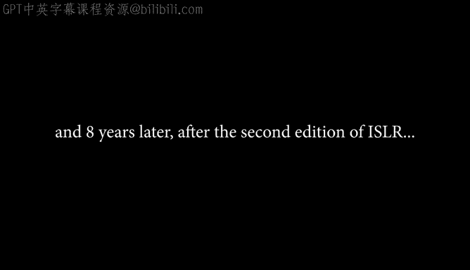
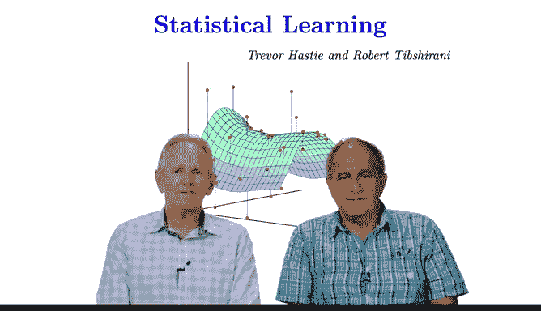

# Python 版 2：第二版课程介绍📊 

在本节课中，我们将介绍《统计学习导论》课程第二版的主要更新内容。课程由Trevor Hastie和Robert Tibshirani教授主讲，旨在为学习者提供统计学习领域的最新知识。

---

## 🎬 课程背景与更新概述

上一节我们介绍了课程的基本信息，本节中我们来看看第二版课程的具体更新内容。

课程第二版在原有基础上增加了多个新主题，并对部分章节进行了扩展。这些更新旨在反映统计学习领域近年来的重要发展。

以下是第二版课程的主要新增内容：

*   **深度学习**：新增关于深度学习的专题讲座。
*   **生存分析**：新增关于生存分析的专题讲座。
*   **多重检验**：新增关于多重检验与错误发现率的专题讲座。

此外，配套教材也进行了相应更新，新增了部分章节内容。

以下是教材中新增或扩展的章节内容：

*   在**第4章**中，新增了关于**广义线性模型**的章节。
*   在**无监督学习**章节中，新增了关于**矩阵补全**的章节。
*   在关于树的章节中，新增了关于**贝叶斯加性回归树模型**的章节。

课程其余部分与第一版保持一致，原有讲座和材料未作改动。所有新增主题均配有相应的实验练习。

---

## 🎤 新增专家访谈

除了课程内容的更新，第二版还新增了与领域内著名专家的访谈环节。

以下是新增的三位访谈嘉宾及其主题：

*   **David Cox**：关于生存分析。
*   **Geoffrey Hinton**：关于深度学习。
*   **Yoav Benjamini**：关于多重检验与错误发现率。

---

## 📚 总结

本节课中我们一起学习了《统计学习导论》课程第二版的更新概览。我们了解到新版课程新增了深度学习、生存分析和多重检验等核心主题，教材也相应扩展了广义线性模型、矩阵补全和贝叶斯加性回归树等内容。同时，课程加入了与三位顶尖专家的访谈，以提供更深入的行业见解。希望你能享受第二版课程的学习。