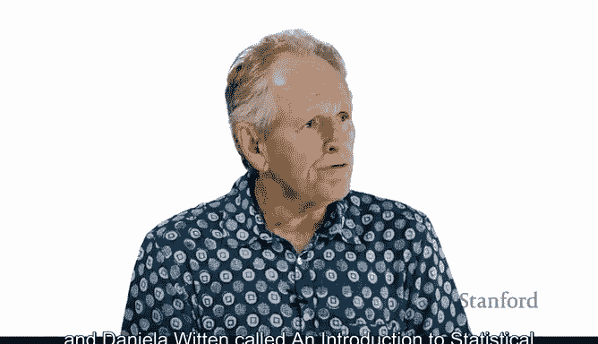
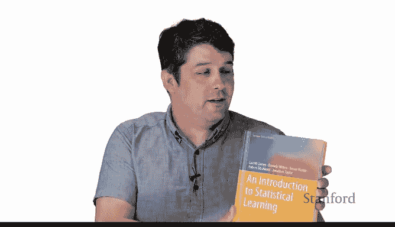
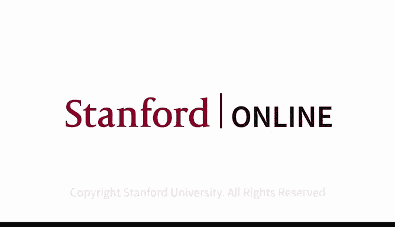

# Python 版 3：统计学习导论与Python应用 🎓

在本节课中，我们将介绍《统计学习导论》课程及其全新的Python版本。我们将了解课程背景、核心教材、新增内容以及为Python用户提供的学习资源。

---

## 背景与发展历程 📚

上一节我们介绍了课程的基本信息，本节中我们来看看其具体的发展历程。

《统计学习导论》edX课程由Rob Tibshirani和我本人在2014年开发，并于2021年发布了更新版本。

该课程旨在解释统计学习的概念，其内容基于我们与Gareth James和Daniela Witten合著的书籍《统计学习导论及其在R中的应用》。

第二版教材已于2021年出版。

## 全新Python版本课程与教材 🐍

上一节我们回顾了课程的历史，本节中我们来看看其最新的扩展。

现在我们推出一门新课程：《使用Python进行统计学习》。

这门课程由我们的新合著者、Python专家Jonathan Taylor共同参与。

课程基于我们的新书《统计学习导论及其在Python中的应用》。

在课程和书籍中，每章末尾的所有实验均使用Python实现。

## 提供的Python学习资源 💻

上一节我们介绍了新课程的核心，本节中我们来看看配套的具体学习工具。

我们提供Jupyter Python笔记本，以及一个名为**ISLP**的Python软件包。

该软件包包含了书中使用的所有数据集，以及许多用于统计建模的新工具和实用功能。

## 关于Jonathan Taylor 👨‍🏫

Jonathan是Python的早期采用者，并为Python社区做出了许多贡献。

与之前的书籍一样，本书的PDF版本可以从统计学习网站上免费获取，同时提供的还有Python相关资源。

---

## 总结 ✨

本节课中我们一起学习了《统计学习导论》课程从R到Python的扩展。我们了解了新课程和教材的发布，认识了新的合著者Jonathan Taylor，并介绍了为Python学习者准备的Jupyter笔记本和ISLP软件包等核心资源。我们希望你能享受这门课程。