# Python 版 4：统计学习示例与框架 📊

在本节课中，我们将学习统计学习的基本框架，重点介绍监督学习与无监督学习的核心概念、区别及其在实际问题中的应用。

---

## 监督学习问题与符号定义 📝

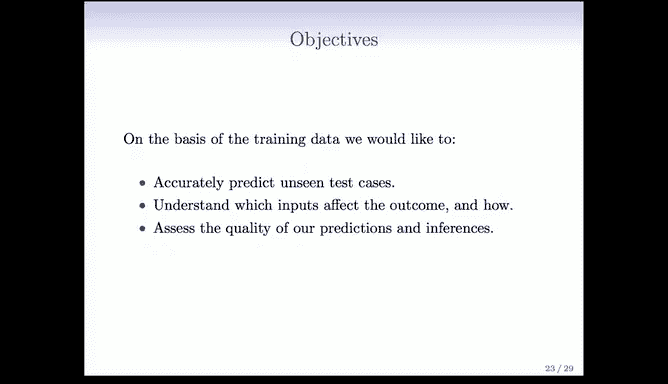

上一节我们介绍了统计学习的概览，本节中我们来看看监督学习问题的具体定义和符号表示。

我们有一个结果测量值 **Y**，它有不同的名称：因变量、响应变量或目标变量。同时，我们有一个包含 **P** 个预测变量的向量，通常记为 **x**，它们被称为输入、回归量、协变量、特征或自变量。

我们区分两种情况：
*   **回归问题**：**Y** 是定量变量，例如价格或血压。
*   **分类问题**：**Y** 在一个有限的无序集合中取值，例如“存活”或“死亡”、数字类别 0 到 9、组织样本的癌症类别。

我们拥有训练数据对：**(x1, Y1), (x2, Y2), ..., (xN, YN)**。其中，**x1** 是一个包含 **P** 个测量值的向量，**Y1** 通常是单个响应变量。这些数据对是这些测量的示例或实例。

监督学习的目标如下：
*   基于训练数据，准确预测未见过的测试案例。
*   理解哪些输入会影响结果以及如何影响。
*   评估我们预测和推断的质量。

---

## 学习理念与重要性 🧠

在深入具体方法之前，理解背后的理念至关重要。这不仅是为了掌握一系列技术，更是为了理解各种技术背后的思想，从而知道在何时何地使用它们。在实际工作中，你可能会遇到前所未见的问题，需要能够判断哪些方法可能有效，哪些可能无效。

以下是几个关键理念：
*   **从简单方法开始**：在掌握更复杂的方法之前，先尝试简单的方法非常重要。线性模型（线性回归和线性逻辑回归）虽然简单，但非常有效。
*   **评估方法性能**：应用算法很容易，但评估方法实际运行效果如何则非常困难且重要。你需要能够向合作者说明，应用该方法后，在未来的案例中预期表现如何。
*   **领域的活力**：统计学习是一个充满活力的研究领域。随着大数据和数据科学的兴起，统计学习作为数据科学的基础组成部分，其重要性日益凸显，并且仍有许多具有挑战性的问题有待解决。

---

## 监督学习与无监督学习的比喻 🧒

你可能会好奇“监督”和“无监督”学习这些术语的由来。这是一个非常巧妙的比喻。

**监督学习** 可以想象成幼儿园老师教孩子区分房子和自行车。老师会给孩子（比如约翰尼）展示一些房子的例子和一些自行车的例子，并告诉他每个例子属于哪个类别。孩子通过观察这些带有标签的训练样本（例如，房子有方形边缘，自行车有更多圆形边缘）来学习分类。这就是监督学习，因为孩子被提供了带有标签的训练观察样本。

**无监督学习** 则是另一种情况。假设孩子（比如特雷弗）没有被提供房子和自行车的例子，他只是在地上看到很多物体。这些数据是**没有标签**的，没有 **Y**。孩子需要自己尝试组织他所看到的常见模式。他可能会观察物体并说，这三个东西可能是一类（比如房子），因为它们有共同的特征；另一些物体可能是另一类（比如自行车）。这引出了根据特征相似性对观测进行分组的思想，这是无监督学习的一个主要课题。

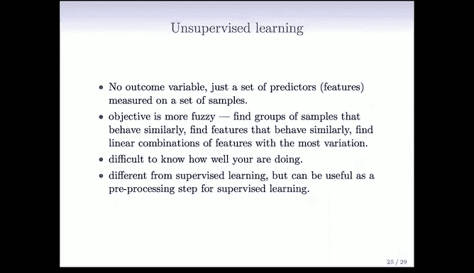

---

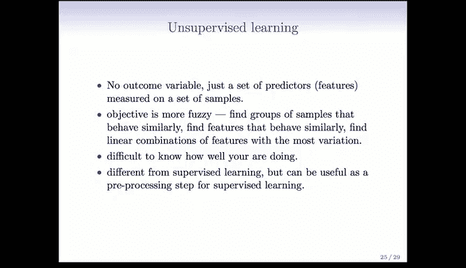

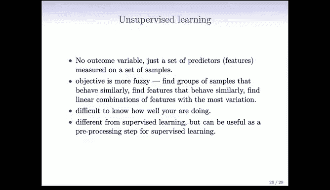

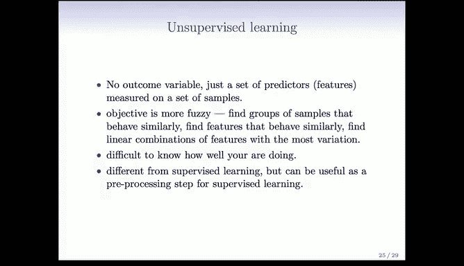

## 无监督学习的形式化定义与挑战 🔍

更正式地说，在无监督学习中，没有结果变量 **Y**，只有一组预测变量 **x**。其目标更加模糊：不是预测 **Y**（因为不存在 **Y**），而是了解数据是如何组织的，并找出哪些特征对数据的组织很重要。

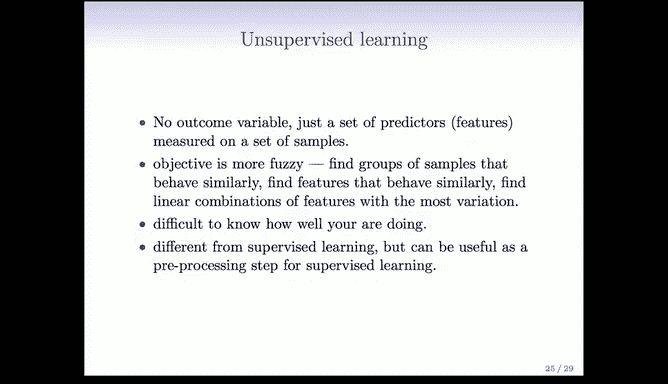

我们将讨论聚类分析和主成分分析，这些是无监督学习的重要技术。

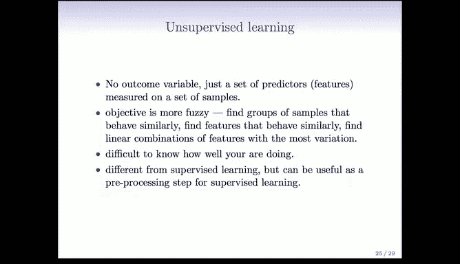

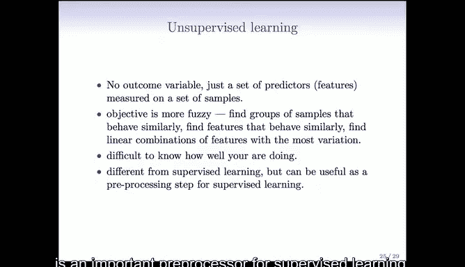

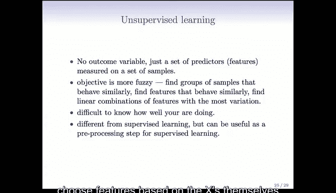

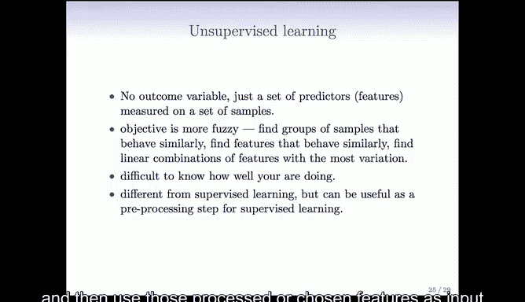

无监督学习的挑战之一是难以评估效果，因为没有黄金标准，没有 **Y**。当你完成聚类分析后，你并不真正知道做得有多好。尽管如此，它仍然是一个极其重要的领域。

无监督学习的重要性体现在：
*   它通常是监督学习的重要预处理步骤。基于 **x** 本身来组织或选择特征，然后将这些处理过或选择出的特征作为监督学习的输入，通常很有用。
*   收集未标记的数据要容易得多，也更为常见。例如，在网络上，计算机算法可以扫描并抓取电影评论，但判断评论是正面还是负面通常需要人工干预。因此，标记数据的成本更高、更困难。

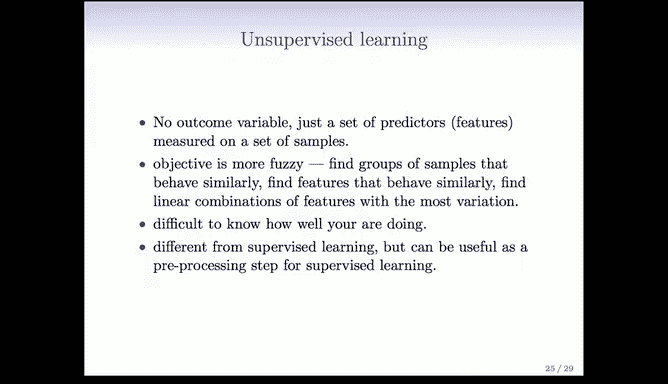

---

## 案例研究：Netflix 大奖赛 🏆

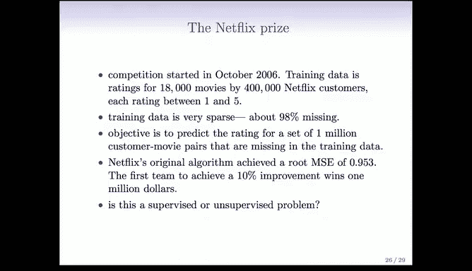

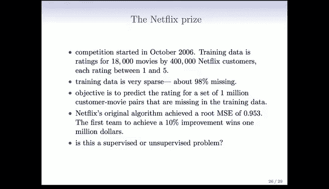

最后，我们将展示一个精彩的例子：Netflix 大奖赛。Netflix 是一家美国电影租赁公司。他们设立了一项竞赛，旨在改进其推荐系统。

他们创建了一个数据集，包含 40 万 Netflix 用户和 1.8 万部电影。平均每个用户大约评价了 200 部电影，这意味着每个用户只看过大约 1% 的电影。

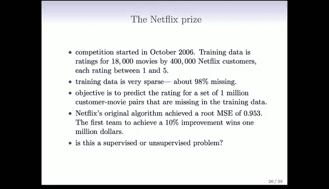

你可以将其想象成一个非常大的矩阵，其中稀疏地填充着 1 到 5 的评分。目标是根据用户已评价的电影，预测他们对其他电影的评价。

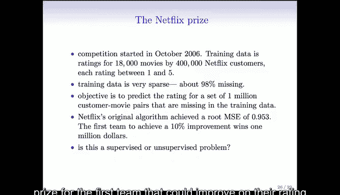

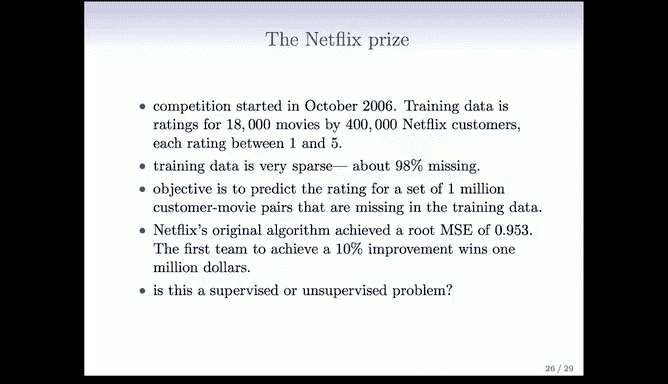

Netflix 设立了一项竞赛，为第一个能够将其评分系统改进 10%（按某种度量）的团队提供 100 万美元的奖金。竞赛设计非常巧妙。原始算法的均方根误差约为 0.953（评分范围为 1 到 5）。竞赛社区在大约一个月后就提出了改进算法，但又花了大约三年时间才最终有团队赢得比赛。

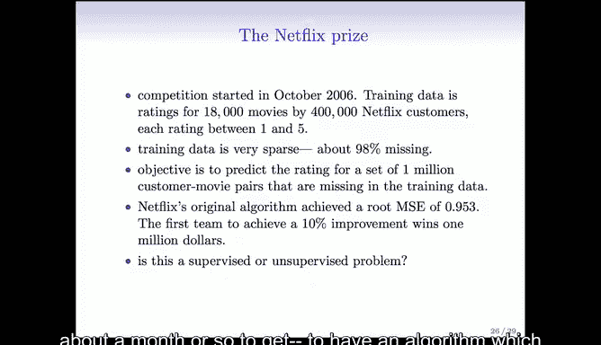

竞赛结束时，最终获胜的团队是“BellKor‘s Pragmatic Chaos”，而紧随其后的“Ensemble”团队得分与之非常接近。这场竞赛的伟大之处在于它催生了大量的研究，成千上万的团队参与其中，并在此过程中发明了许多新技术。许多获胜技术最终使用了缺失数据情况下的主成分分析形式。

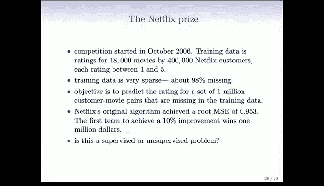

---

## 统计学习与机器学习的关系 🤝

机器学习领域本身是人工智能的一个子领域，特别是在 80 年代神经网络兴起之后。很自然地会问，统计学习与机器学习之间是什么关系？

首先，这个问题很难回答。两者有很多重叠之处：
*   **机器学习** 倾向于处理更大规模的问题，更关注纯预测及其准确性。
*   **统计学习** 也关注预测，但同时关注模型，致力于提出科学家和其他人可以解释的模型和方法，并且更关注预测的不确定性和精度。

然而，这些区别正变得越来越模糊，两种方法之间存在着大量的交叉融合。显然，机器学习在市场营销方面占据上风，他们倾向于获得更大的资助，会议地点也更豪华。但我们正试图通过这门课程来改变这一点。

---

## 教材与资源 📚

本课程的教材是《统计学习导论》。这本书由 Gareth James, Daniela Witten, Trevor Hastie 和 Robert Tibshirani 合著，于 2013 年 8 月出版。本课程将完整覆盖这本书的内容。

这本书的每一章末尾都有使用 R 计算语言运行的示例。通过本课程，你将同时学习使用 R 进行数据分析。R 是一个出色的免费环境，非常适合进行数据分析。

此外，还有一本更高级的参考书《统计学习基础》，可供希望更深入了解某些技术细节的人参考。

最棒的是，不仅这门课程是免费的，这些书籍也是免费的。《统计学习基础》的 PDF 版本一直可以在网站上免费获取，而这本新书也将在课程开始的一月初免费提供（已与出版商达成协议）。当然，如果你想购买纸质书也可以，拥有一本实体书很不错。

---

## 总结 ✨

本节课中，我们一起学习了统计学习的基本框架。我们明确了监督学习与无监督学习的定义、目标及区别，并通过生动的比喻（幼儿园教学）和实际案例（Netflix 大奖赛）加深了理解。我们还探讨了统计学习与机器学习的关系，并介绍了本课程的核心教材。理解这些基础概念和理念，对于后续深入学习各种具体方法至关重要。希望你能享受接下来的课程内容。