# Python 版 5：回归模型导论 📈

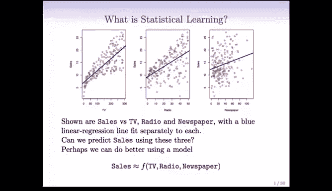

在本节课中，我们将要学习统计学习与模型的基本概念。我们将探讨模型的用途、使用方法以及其中涉及的一些关键问题。

## 模型的作用与表示

我们面前有三张图表，展示了一项营销活动的销售额数据。这些数据分别是电视广告、广播广告和报纸广告投入的函数。

至少在前两张图中，我们可以看到某种趋势。事实上，我们已经在每张图中用一条线性回归线来概括这种趋势。

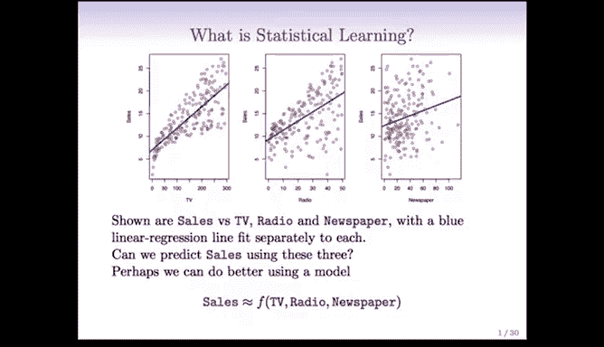

我们看到存在某种关系，前两个看起来比第三个关系更强。

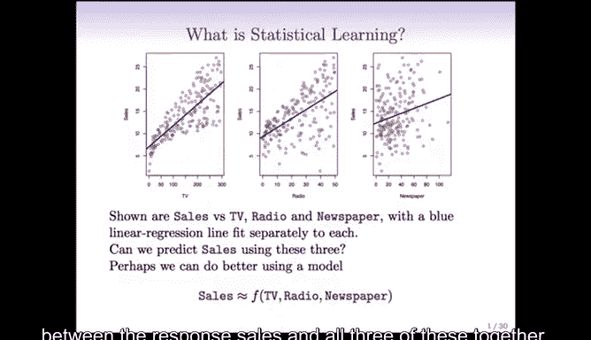

在这种情况下，我们通常希望了解响应变量“销售额”与所有这三个预测变量之间的联合关系。

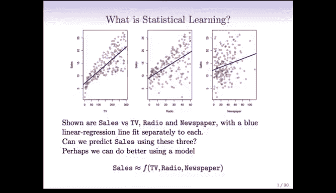

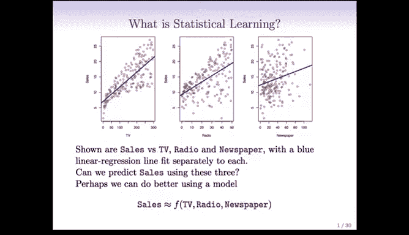

我们希望理解它们如何共同作用来影响销售额。

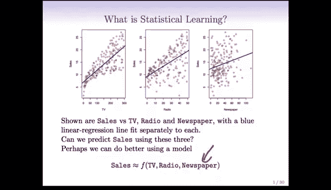

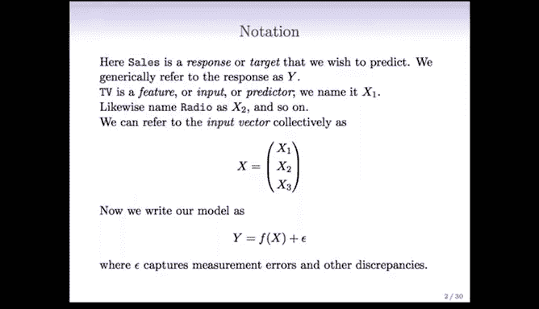

因此，你可以将其视为希望将销售额建模为一个函数。

这个函数是电视、广播和报纸广告投入的联合函数。那么我们该怎么做呢？

在深入细节之前，我们先建立一些符号表示。

销售额是我们希望预测或建模的响应变量或目标变量，我们通常用字母 **Y** 来表示它。电视广告是特征、输入或预测变量之一，我们称之为 **x1**。同样，广播广告是 **x2**，依此类推。

在这个例子中，我们有三个预测变量，我们可以用一个向量来统称它们：**x**，它包含三个分量 **x1**、**x2** 和 **x3**。向量通常被认为是列向量。

现在，使用这种更紧凑的符号，我们可以将模型写为：

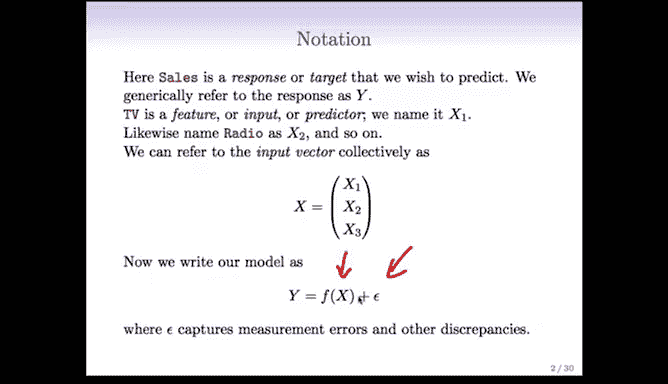

**Y = f(X) + ε**

这里的 **ε** 是误差项，它捕捉了 **Y** 的测量误差以及其他差异。我们的函数 **f(X)** 永远无法完美地建模 **Y**，总会有一些东西是函数无法捕捉的，这些都包含在误差项中。

这里的 **f(X)** 现在是这个向量 **X** 的函数，**X** 包含这三个分量。

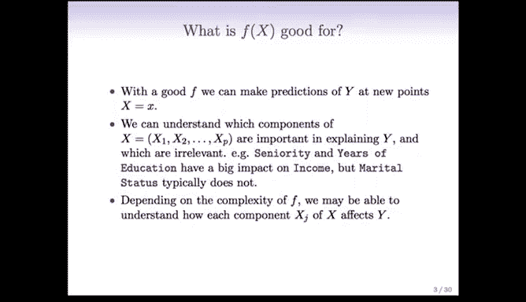

## 函数 f(X) 的用途

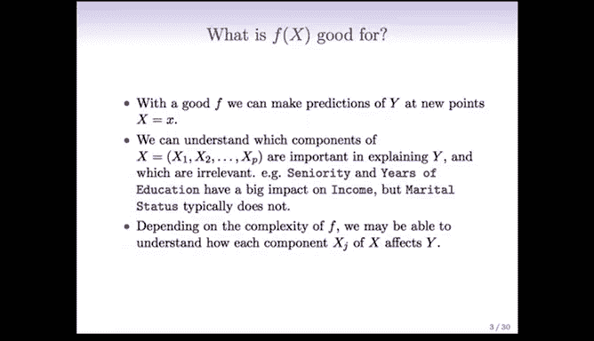

一个好的函数 **f** 有什么用呢？有了一个好的 **f**，我们可以在新的点 **X = x** 上对 **Y** 进行预测。这里的符号 **X = x** 表示：大写 **X** 是包含三个分量的变量，而小写 **x** 是一个具体的实例，也包含三个分量。

这些是报纸、广播和电视广告投入的具体数值。

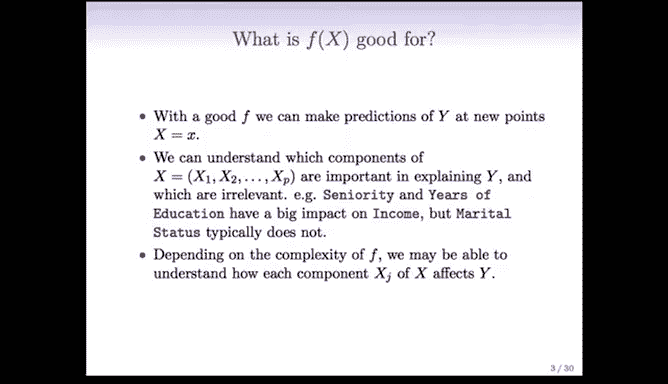

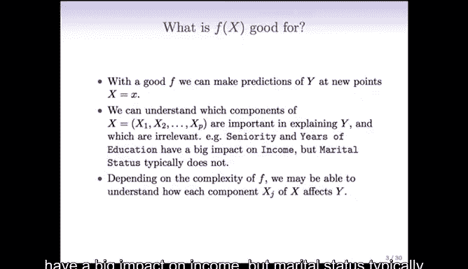

通过模型，我们可以理解 **X** 的哪些分量（通常如果有 **P** 个预测变量，就有 **P** 个分量）对于解释 **Y** 是重要的，哪些是无关的。

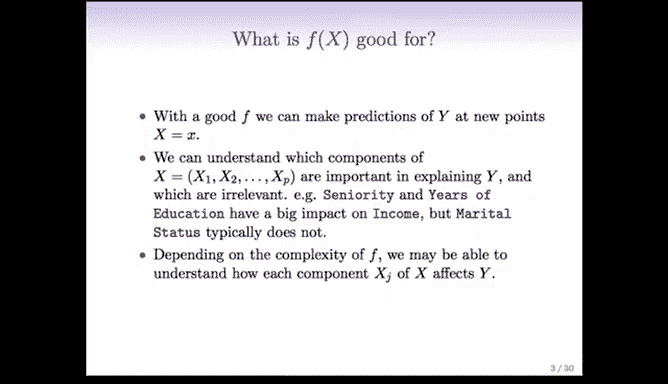

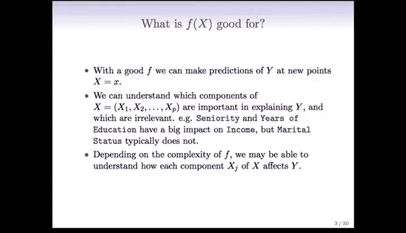

例如，如果我们将收入建模为人口统计变量的函数，资历和教育年限可能对收入有很大影响，但婚姻状况通常没有。我们希望我们的模型能够告诉我们这一点。

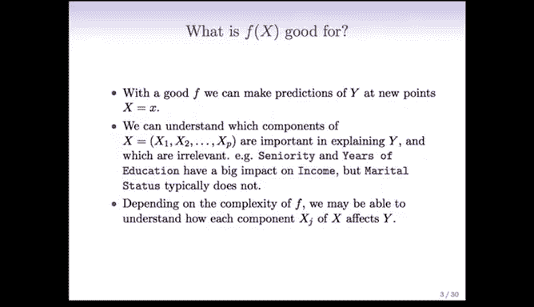

根据 **f** 的复杂程度，我们或许能够理解每个分量 **Xj** 如何影响 **Y**，以及以何种特定方式影响 **Y**。

因此，模型有许多用途，以上是其中一些。

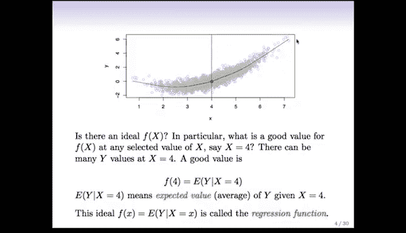

## 理想的函数 f 是什么？

那么，这个函数 **f** 是什么？是否存在一个理想的 **f**？

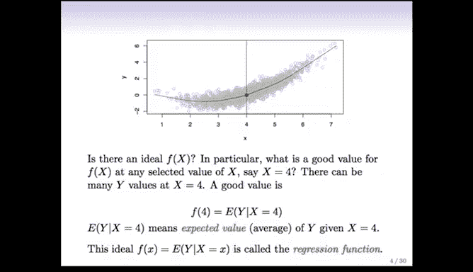

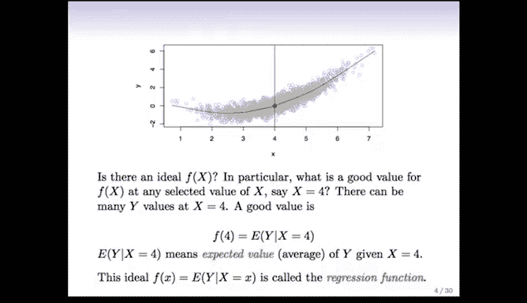

在图中，我们有一个来自总体的点的大样本。这里只有一个 **X** 和一个响应变量 **Y**。你可以看到这是一个散点图，有很多点，这里有 2000 个点。让我们把这看作是整个总体，或者看作是一个非常大总体的代表。

现在，让我们思考一下一个好的函数 **f** 可能是什么。我们不只是想整个函数，而是思考在 **x = 4** 这个点上，我们希望 **f** 取什么值。

在这个点上，我们想查询 **f** 在所有 **x** 值上的取值，但我们想知道在 **x = 4** 这个值上它应该是什么。

你会注意到，在 **x = 4** 处，有许多 **Y** 值。但一个函数只能取一个值。函数将返回一个值，那么什么是一个好值呢？

一个好的值是返回那些 **x** 等于 4 的 **Y** 值的平均值。我们用这种数学符号表示：函数在值 4 处的取值是 **Y** 在给定 **X = 4** 的条件下的期望值。期望值只是平均值的另一种说法，实际上是一个条件平均值，给定 **X = 4**。

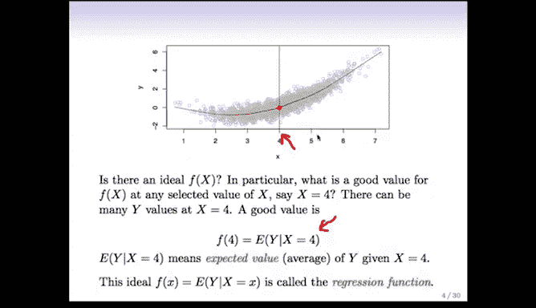

由于在 **x = 4** 处，函数只能返回一个值，平均值似乎是一个好选择。如果我们在每个 **x** 值处都这样做，即在每个 **x** 值处，我们都返回具有该 **x** 值的 **Y** 的平均值。

例如，在 **x = 5** 处。

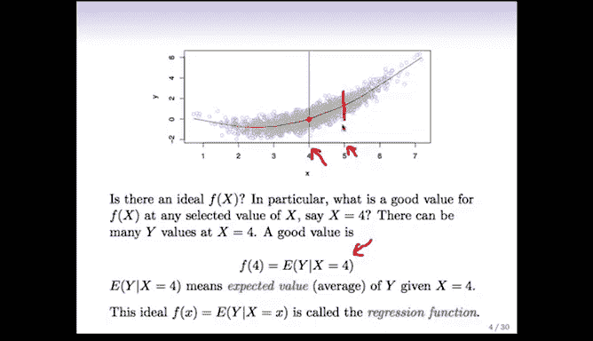

同样，我们希望得到这个小条件切片中的平均值。

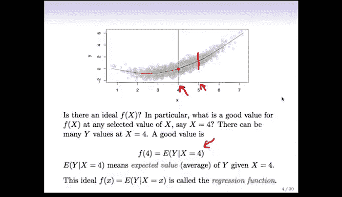

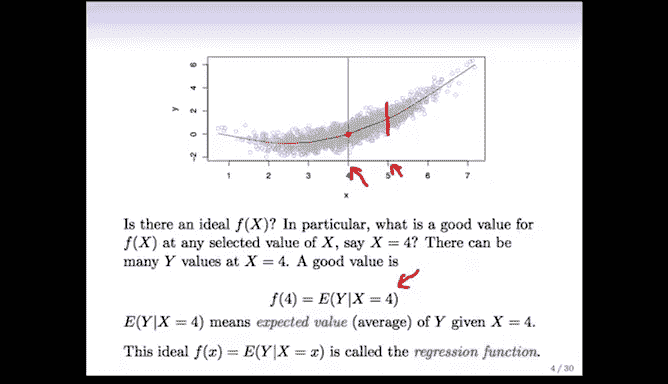

这将描绘出我们在这里看到的这条红色小曲线，这被称为回归函数。因此，回归函数在每一个 **x** 值处，给出了给定 **X** 时 **Y** 的条件期望。

所以，在某种意义上，这是一个理想的函数。

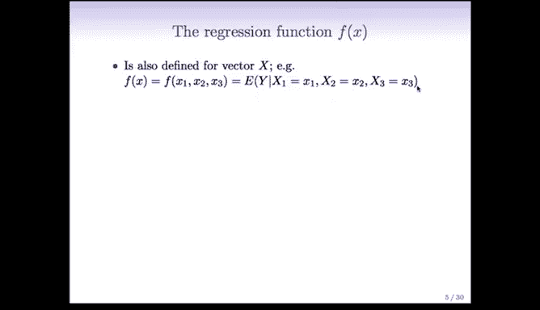

对于一个总体，在这个例子中是 **Y** 和单个 **X** 的总体。

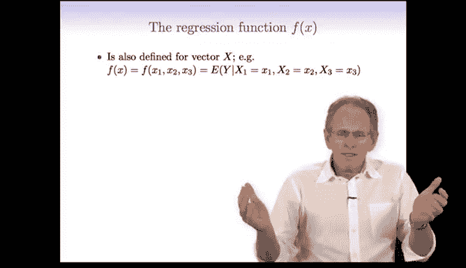

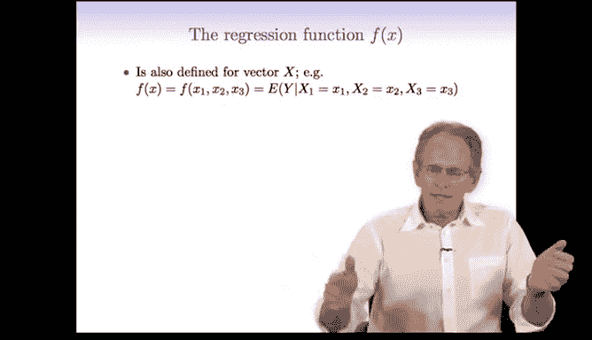

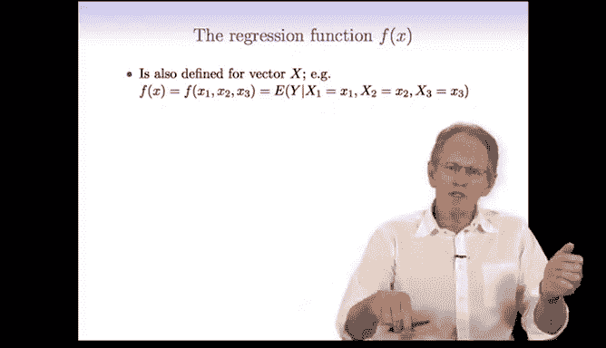

## 回归函数与最优预测

让我们进一步讨论这个回归函数。它也可以为向量 **X** 定义。例如，如果 **X** 有三个分量，它将是 **Y** 在给定 **X** 的三个分量的三个特定实例的条件期望。

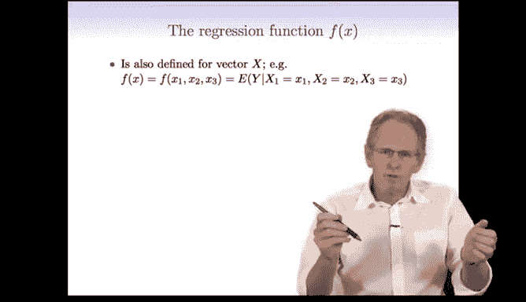

让我们来思考一下。假设 **X** 是二维的，因为我们可以想象三维空间。假设 **X** 位于平面上。

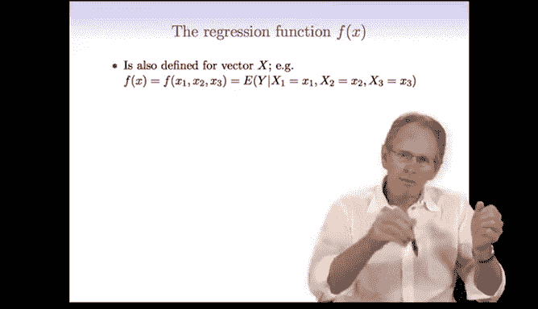

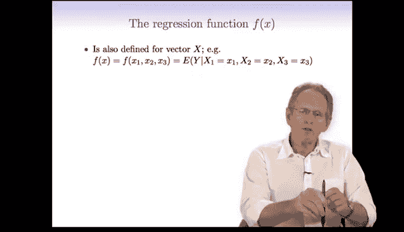

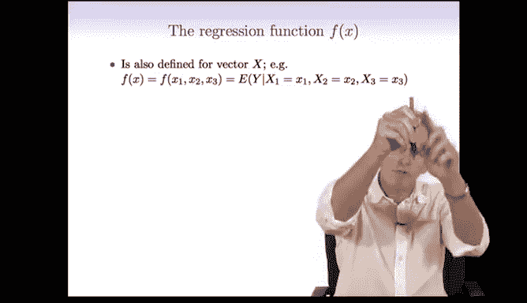

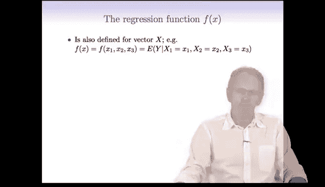

**Y** 垂直向上。

其思想是相同的。我们有一个连续的 **Y** 和 **X** 的云团。我们走到一个具有两个坐标 **x1** 和 **x2** 的特定点 **x**，然后问在该点函数取什么值好呢？我们只需向上看那个切片，并平均该点上方的 **Y** 值。我们将在平面上的所有点都这样做。

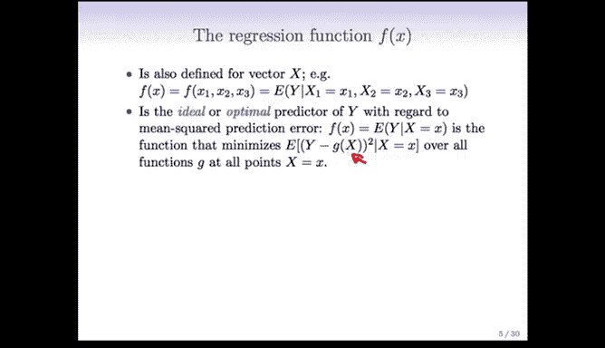

我们说它是关于函数 **f** 的 **Y** 的理想或最优预测器。这意味着，实际上，它是关于一个损失函数而言的。这意味着，函数 **f(X)** 的这个特定选择将最小化平方误差和，我们这样表示：在所有函数 **g** 中，对于每个点 **X**，最小化 **Y - g(X)** 的期望值的平方。

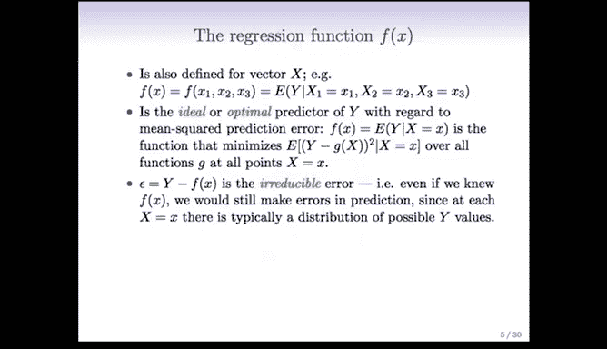

换句话说，它最小化了平均预测误差。

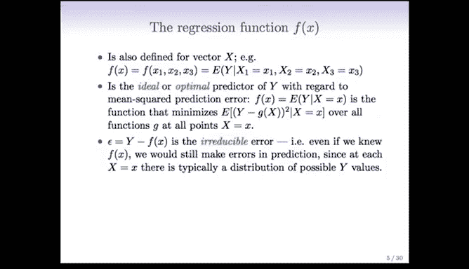

现在，在每个点 **X**，我们都会犯错误，因为如果我们用这个函数来预测 **Y**，在每个点 **X** 上都有很多 **Y** 值。因此，我们犯的错误，在这种情况下我们称之为 **ε**，这些是不可约误差。

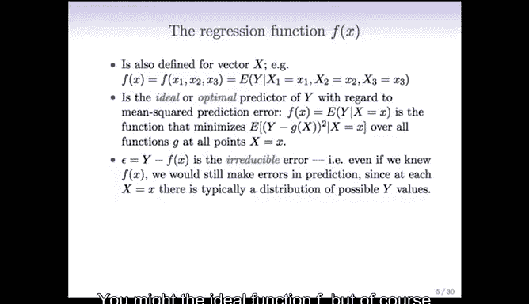

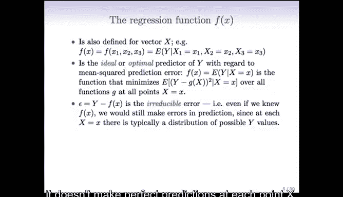

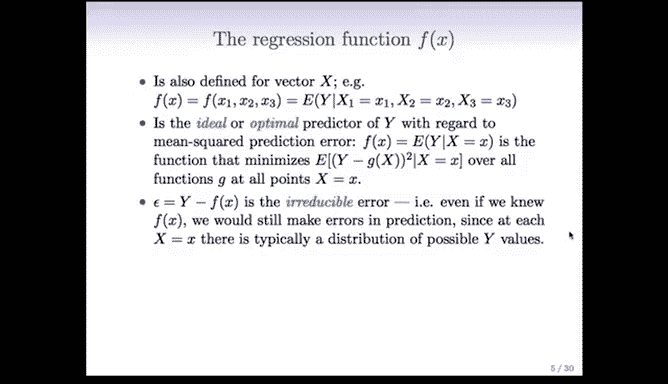

你可能知道理想函数 **f**，但当然，它在每个点 **X** 上并不能做出完美的预测，所以它必须犯一些错误，但平均而言，它做得很好。

对于任何估计值 **f̂(X)**（我们通常会在估计量上加上这些小帽子，以表示它们是从数据中估计出来的），我们可以将 **X** 处的平方预测误差分解为两部分。

一部分是不可约部分，即误差的方差。另一部分是可约部分，即我们的估计值 **f̂(X)** 与真实函数 **f(X)** 之间的差异。

因此，期望预测误差可以分解为这两部分。记住这一点很重要。如果我们想改进模型，我们可以通过改变估计 **f(X)** 的方式来改进可约部分。

到目前为止，这都是一种理论上的探讨。那么，我们如何估计函数 **f** 呢？

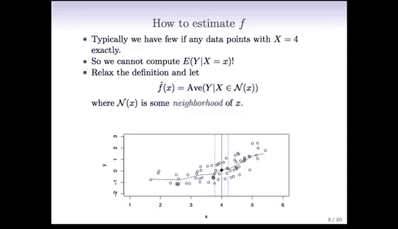
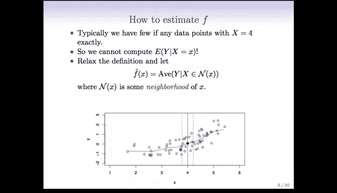

## 如何估计函数 f：最近邻方法

问题在于，我们无法精确地执行条件期望或条件平均的步骤。

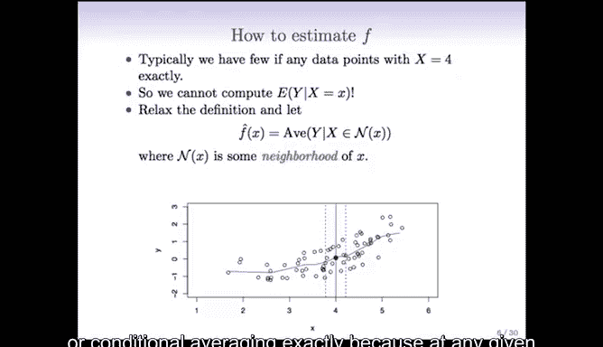

在我们的数据集中，对于任何给定的 **x**，我们可能没有很多点来进行平均，甚至可能没有任何点来进行平均。

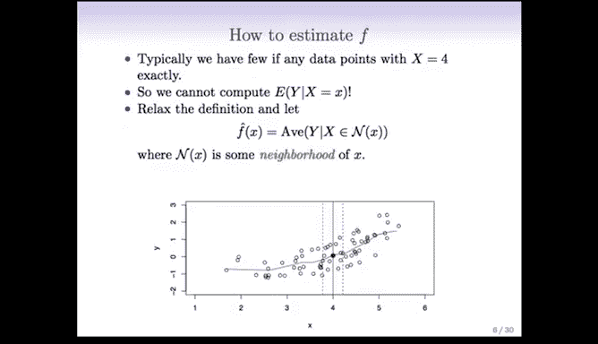

在图中，我们现在有一个小得多的数据集，我们仍然有点 **x = 4**。如果你仔细观察，你会发现那个实心点是我放在图上的一个点，那个绿色的实心点。

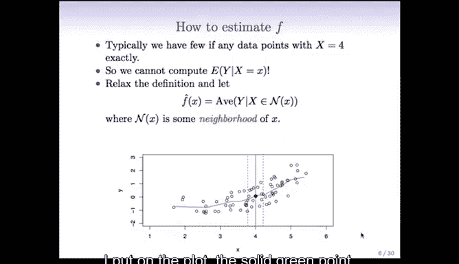

实际上，没有任何数据点的 **x** 值正好是 4。

那么，我们如何计算条件期望或平均值呢？我们可以做的是，放宽“在点 **x** 处”的想法，变为“在点 **x** 的邻域内”。这就是这里的符号所表示的意思。

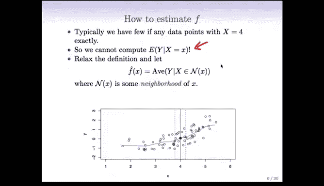

**N(x)** 或 **𝒩(x)** 是以某种方式围绕目标点（这里是 **x = 4**）定义的一个点的邻域。

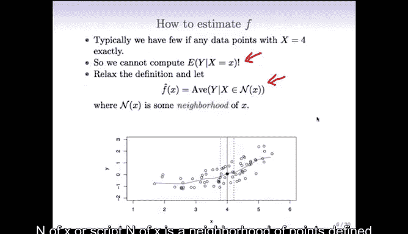

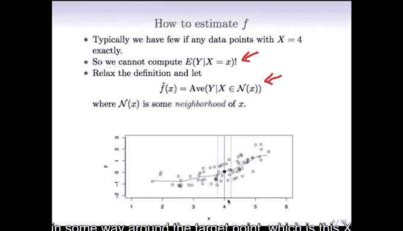

它保持了条件期望的精神，它接近目标点 **x**。如果我们把这个邻域设得足够宽，我们就会有足够多的点在这个邻域内进行平均，我们将用它们的平均值来估计条件期望。

这被称为最近邻或局部平均法。这是一个非常聪明的想法，不是我发明的，它很久以前就被发明了。当然，你会移动这个邻域，沿着 **X** 轴滑动这个邻域，并在滑动过程中计算平均值，这将描绘出一条曲线。

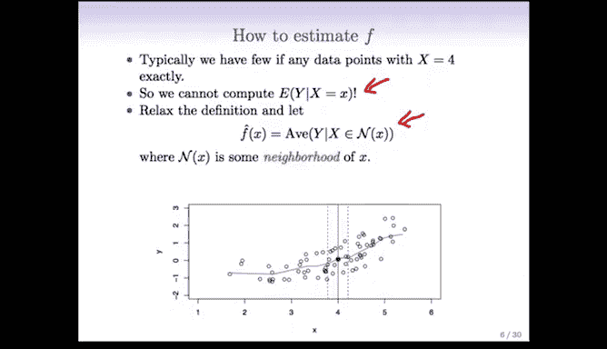

所以，这实际上是函数 **f** 的一个非常好的估计。它不会完美，因为小窗口有一定的宽度，所以我们可以看到，真实 **f** 的一些点可能更低，一些点更高，但平均而言，它做得相当好。

因此，我们有一个非常强大的工具来估计这个条件期望：只需放宽定义并计算最近邻平均值，它为我们提供了一种相当灵活的函数拟合方式。

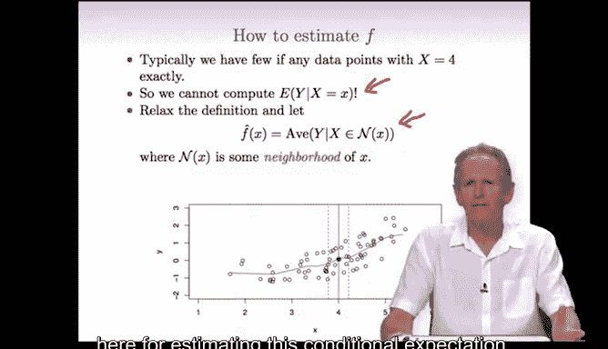

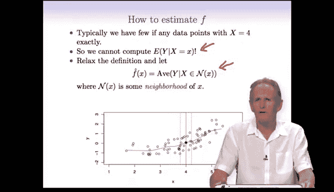

我们将在下一节看到，这种方法并不总是有效，特别是当维度变大时，我们将不得不寻找处理这个问题的方法。

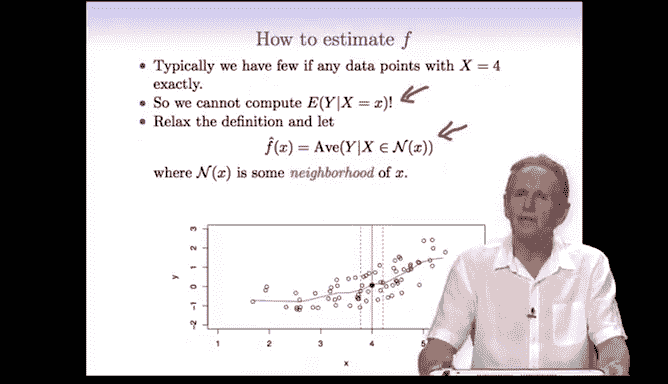

## 总结

在本节课中，我们一起学习了回归模型的基本概念。我们首先通过营销数据的例子引入了模型的概念，并建立了用 **Y = f(X) + ε** 表示模型的基本符号。我们探讨了模型的主要用途：进行预测、识别重要变量以及理解变量间的关系。

接着，我们定义了理想的预测函数——回归函数 **f(X) = E(Y | X)**，它是在给定预测变量 **X** 时响应变量 **Y** 的条件期望，并且是使均方预测误差最小的最优预测器。我们了解到总预测误差可以分解为不可约误差和可约误差两部分。

最后，我们介绍了如何从有限的数据中估计这个回归函数，重点讲解了最近邻平均法。该方法通过计算目标点 **X** 附近一个邻域内所有数据点 **Y** 的平均值来估计 **f(X)**，从而在无法精确计算条件期望时提供了一种灵活且强大的估计策略。

本节课为理解统计学习中的回归建模奠定了重要的理论基础。