# Python 版 7：模型选择与偏差-方差权衡 📊

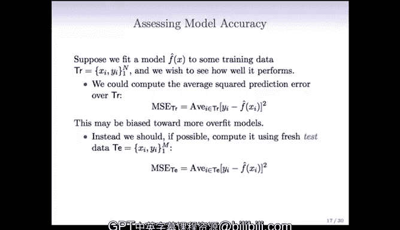

在本节课中，我们将要学习如何评估和选择统计学习模型。我们将探讨模型准确性的衡量标准，并深入理解一个核心概念：**偏差-方差权衡**。这是决定模型复杂度的关键。

---

## 概述

我们已经接触了从简单的线性模型到复杂的最近邻算法和薄板样条等多种模型。现在，我们需要知道如何在它们之间做出选择。这要求我们掌握评估模型准确性的方法，并判断一个模型何时是合适的，何时还有改进空间。

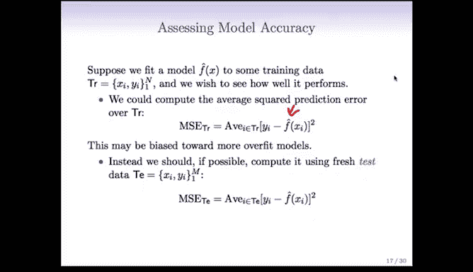

---

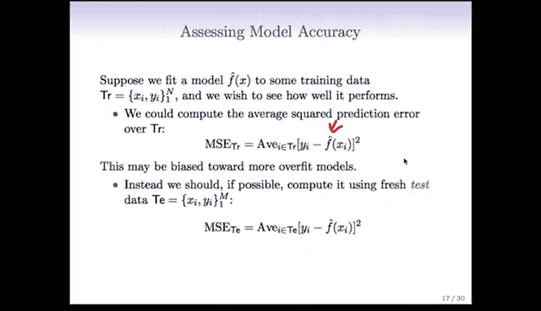

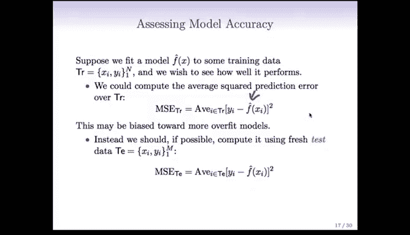

## 评估模型准确性

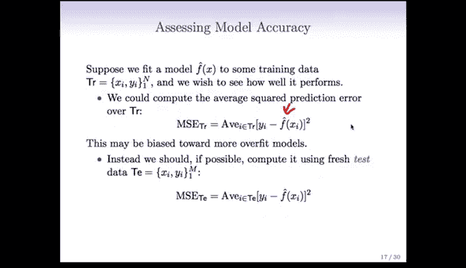

假设我们有一个模型 **F̂(x)**，它是基于训练数据 **TR** 拟合得到的。训练数据包含 **n** 对观测值 **(Xᵢ, Yᵢ)**，其中 **Xᵢ** 可能是一个向量，**Yᵢ** 通常是标量。

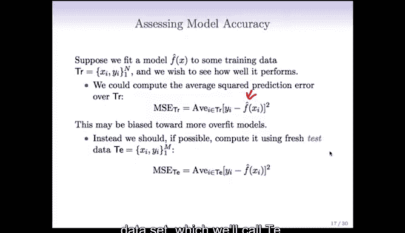

### 训练误差的局限性

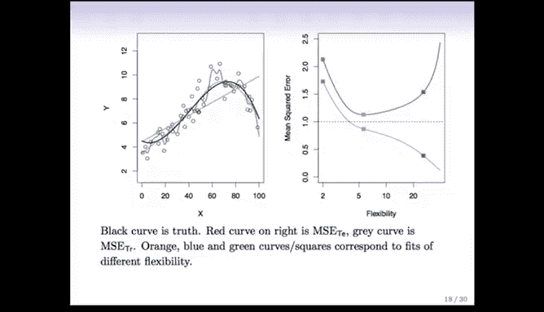

评估模型性能的一个直接想法是计算模型在训练数据上的平均预测误差。这被称为**训练均方误差**：

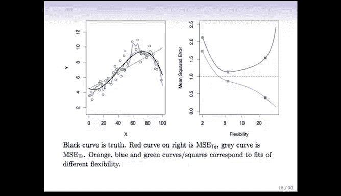

**MSEₜᵣ = (1/n) Σ (Yᵢ - F̂(Xᵢ))²**

然而，这个指标可能偏向于更复杂的、**过拟合**的模型。例如，薄板样条模型可以完美拟合训练数据，使训练均方误差降为0，但这并不意味着它在未见过的数据上表现良好。

### 测试误差的重要性

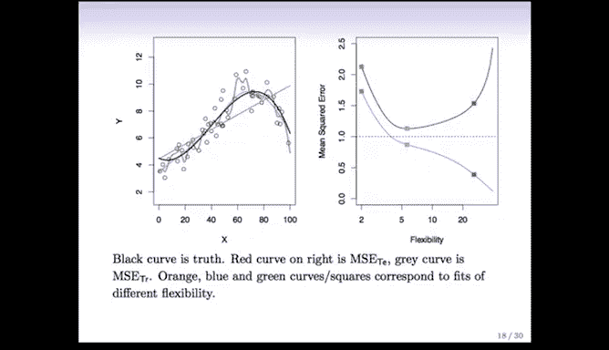

因此，更好的方法是使用一个独立的**测试数据集 TE**（包含 **m** 个与训练集不同的数据对）来评估模型。我们计算**测试均方误差**：

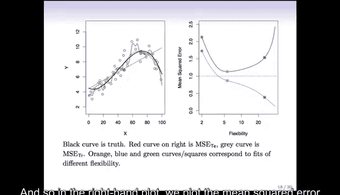

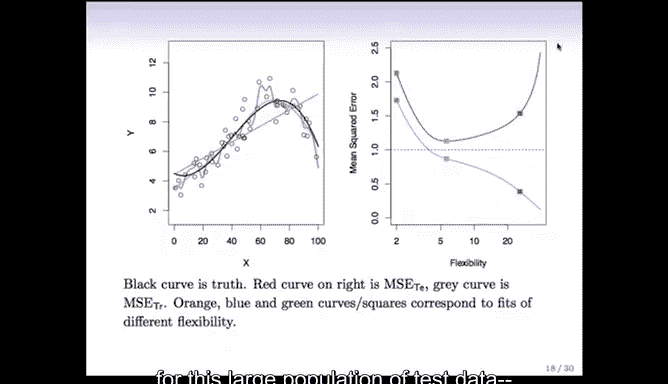

**MSEₜₑ = (1/m) Σ (Yᵢ - F̂(Xᵢ))²**

测试误差能更真实地反映模型的泛化性能。

---

## 模型复杂度与误差的直观演示

为了更直观地理解，让我们看几个一维函数拟合的例子。

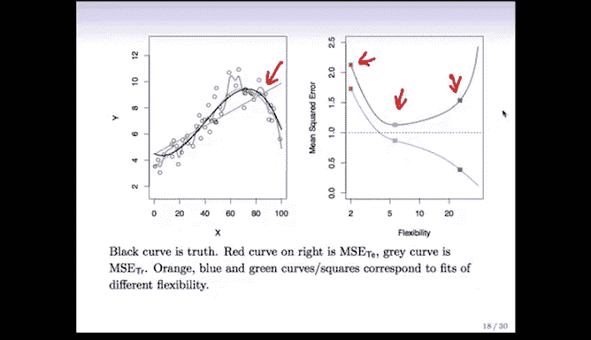

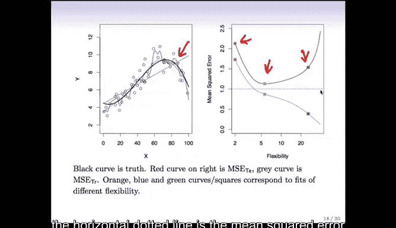

上一节我们介绍了评估模型的基本指标，本节中我们来看看模型复杂度如何影响这些误差。

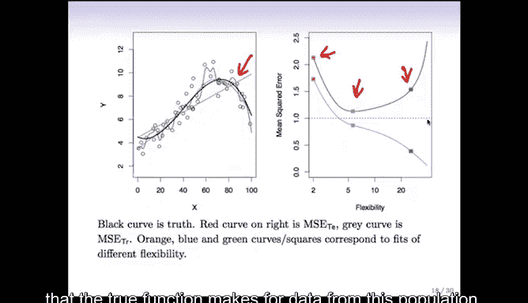

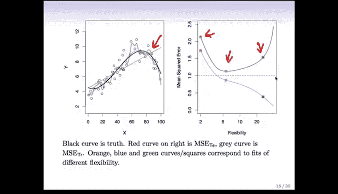

以下是三个不同复杂度模型拟合的示例：

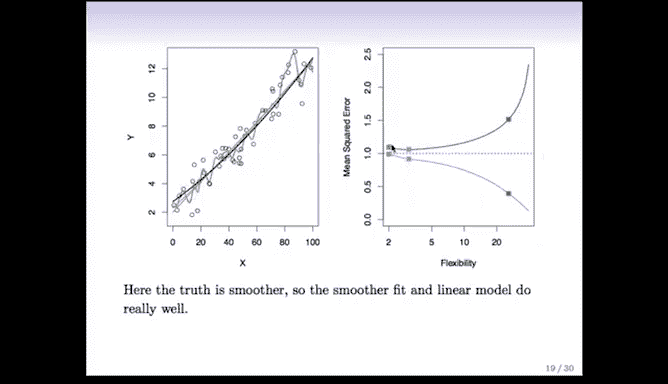

*   **左图**：展示了模拟生成的真实函数（黑色曲线）、带有噪声的数据点，以及三个拟合模型：
    *   **橙色**：简单的线性模型（低复杂度）。
    *   **蓝色**：中等复杂度的模型（如某种样条）。
    *   **绿色**：高复杂度的模型（非常灵活，更接近数据点）。
*   **右图**：绘制了在大量测试数据上计算出的均方误差。
    *   **红色曲线（测试误差）**：随着模型复杂度增加，先下降后上升，呈现“U”形，存在一个最优复杂度点。
    *   **灰色曲线（训练误差）**：随着模型复杂度增加持续下降，因为更复杂的模型能更好地拟合训练数据。
    *   **水平虚线**：代表真实函数的**不可约误差**，即数据本身的噪声方差 **Var(ε)**，这是任何模型都无法避免的误差下限。

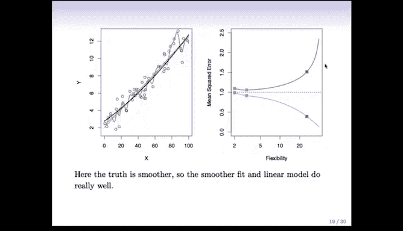

这个例子清晰地表明，追求最低的训练误差并不可取，我们的目标是在测试误差上找到那个最优的平衡点。

---

## 偏差-方差分解 🎯

测试误差的“U”形行为背后，是统计学中一个非常重要的概念：**偏差-方差权衡**。

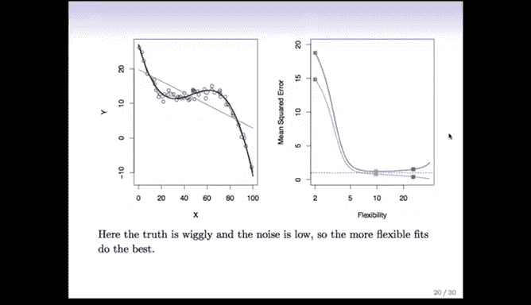

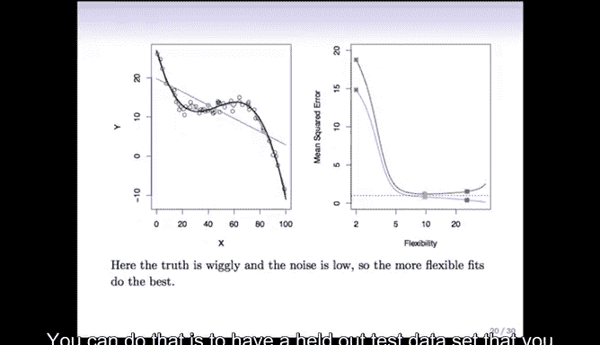

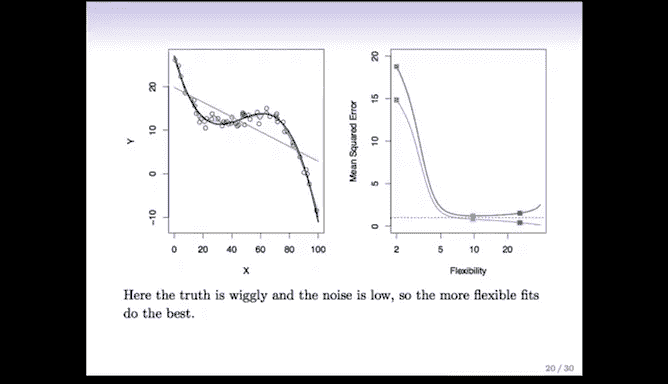

假设真实模型由函数 **F** 给出。对于一个新测试点 **(x₀, y₀)**，我们在 **x₀** 处的预测误差期望值（同时考虑训练数据和测试点的随机性）可以精确地分解为三部分：

**E[(y₀ - F̂(x₀))²] = Var(ε) + [Bias(F̂(x₀))]² + Var(F̂(x₀))**

以下是这三个部分的含义：

1.  **Var(ε)**：**不可约误差**。源于数据本身的随机噪声，与模型无关。
2.  **[Bias(F̂(x₀))]²**：**偏差的平方**。衡量了模型预测的平均值（在不同训练集上）与真实值之间的差距。简单模型通常偏差高。
3.  **Var(F̂(x₀))**：**方差**。衡量了对于不同的训练数据集，模型预测本身的波动程度。复杂模型通常方差高。

### 权衡关系

模型复杂度直接影响偏差和方差：
*   当模型**复杂度低**（如线性模型）时，**偏差高，方差低**。模型不够灵活，无法捕捉真实模式，但对数据变化不敏感。
*   当模型**复杂度高**时，**偏差低，方差高**。模型非常灵活，能逼近训练数据的细节，但因此也容易学习到数据中的随机噪声，导致在不同数据集上预测结果波动大。

**测试误差 = 偏差² + 方差 + 不可约误差**。最优的模型复杂度正是最小化“偏差² + 方差”之和的点，这就是**偏差-方差权衡**。

---

## 不同场景下的权衡

偏差-方差权衡的具体形态取决于待解决的实际问题。

以下是之前三个示例的偏差-方差分解图：

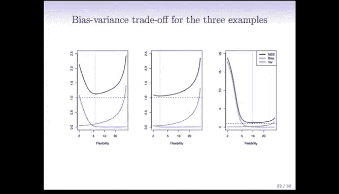

*   **第一个例子（中等复杂度最优）**：偏差迅速下降后趋于平缓，方差持续上升，两者之和（测试误差）呈现经典的U形。
*   **第二个例子（真实函数平滑）**：线性模型（低复杂度）的偏差已经很低，增加复杂度带来的方差上升代价超过了偏差下降的收益，因此最优模型复杂度较低。
*   **第三个例子（真实函数波动大）**：线性模型偏差极高，需要更复杂的模型来降低偏差，此时方差上升的代价是可接受的。

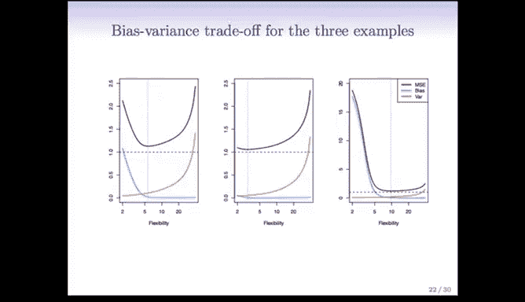

这些例子说明，没有“一刀切”的最佳复杂度。我们需要根据具体问题的特性，通过验证集或交叉验证等方法，来找到最佳的偏差-方差平衡点。

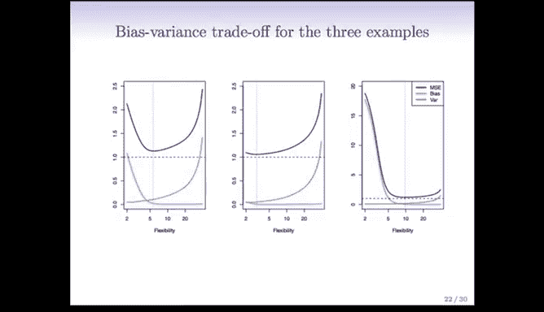

---

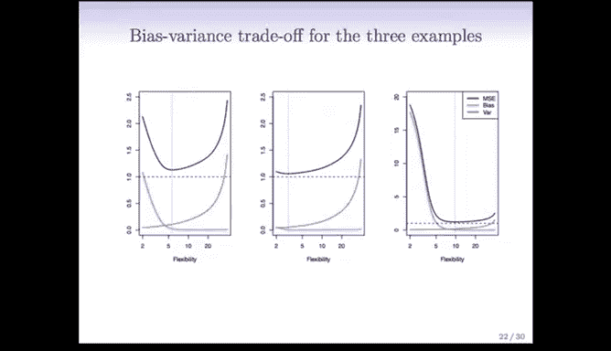

## 总结

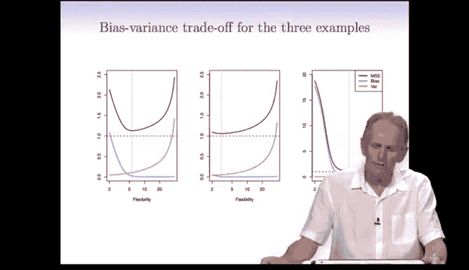

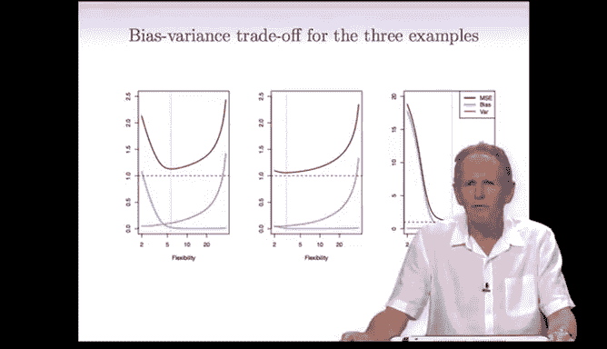

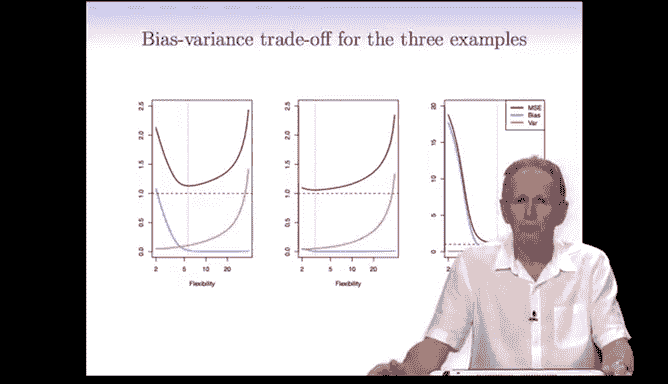

本节课中我们一起学习了模型评估与选择的核心思想。

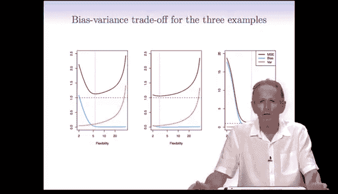

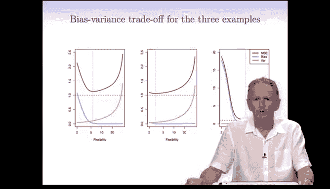

1.  **训练误差**不适合用于模型选择，因为它会乐观地估计复杂模型的性能。
2.  **测试误差**是衡量模型泛化能力的黄金标准，其随模型复杂度变化呈U形曲线。
3.  U形曲线背后的根本原因是**偏差-方差权衡**：简单模型偏差高、方差低；复杂模型偏差低、方差高。我们的目标是找到使两者之和最小的“甜蜜点”。
4.  最优的模型复杂度取决于具体问题，需要通过将数据划分为训练集和验证集（或使用交叉验证）来实际估计。

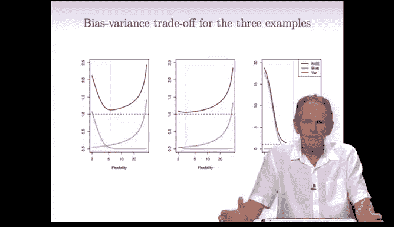

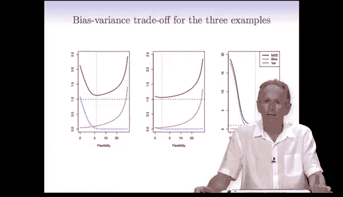

在下一节中，我们将探讨所有这些概念如何应用于分类问题。