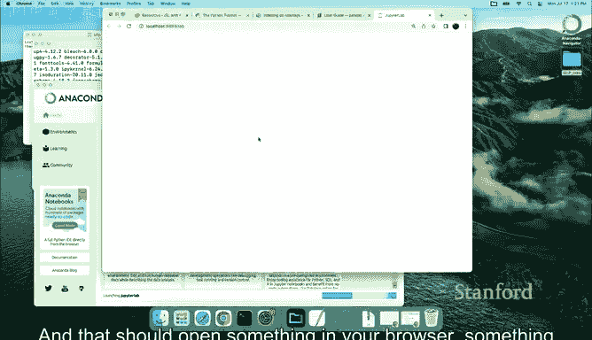

# Python 版 9：Python环境搭建与入门 🐍

在本课程中，我们将学习如何为《统计学习导论（Python版）》的课程设置Python编程环境。我们将从零开始，指导你安装必要的软件和包，并启动你的第一个编程会话。

---

## 概述

本节内容将引导你完成Python环境的准备工作。我们将使用Anaconda发行版来管理Python和相关的包，并创建一个独立的虚拟环境来运行课程代码。最后，我们将启动Jupyter Lab，这是我们将要使用的交互式编程环境。

## 安装Anaconda

首先，你需要下载并安装Anaconda。Anaconda是一个集成了Python和众多科学计算包的发行版，它简化了环境管理过程。

*   对于Mac用户，安装过程是标准的。
*   对于Windows用户，安装方式类似。

安装完成后，你可以在应用程序中找到并打开Anaconda Navigator。

## 创建虚拟环境

为了隔离课程所需的特定软件包版本，避免与其他项目冲突，我们需要创建一个专门的虚拟环境。

以下是创建新环境的步骤：

1.  在Anaconda Navigator中，切换到“Environments”（环境）标签页。
2.  点击下方的“Create”（创建）按钮。
3.  在弹出的对话框中，为环境命名（例如 `ISLP2`）。
4.  点击“Create”按钮完成创建。

虚拟环境是管理代码依赖的有效方式，它能确保你运行的代码拥有可控的包版本。

## 安装课程包

创建好环境后，下一步是安装本课程所需的特定Python包。

1.  在刚刚创建的环境（例如 `ISLP2`）右侧，点击“Open Terminal”（打开终端）。
2.  在终端中，输入以下命令并按回车执行：
    ```bash
    pip install ISLP
    ```
    这个命令会从Python包索引下载并安装名为 `ISLP` 的包，它包含了课程所需的核心代码和数据。

    请注意，关于深度学习的部分需要额外安装一些包，我们将在后续的相关课程中介绍。

## 启动Jupyter Lab

安装好课程包后，我们就可以启动编程环境了。本课程将使用Jupyter Lab。

1.  确保在Anaconda Navigator的“Home”（主页）标签页中，左上角的下拉菜单选中了你刚创建的环境（例如 `ISLP2`）。
2.  你会看到Jupyter Lab的应用图标。如果图标下方显示“Install”（安装），请先点击安装。安装完成后，按钮会变为“Launch”（启动）。
3.  点击“Launch”按钮。

这将在你的默认浏览器中打开一个新的Jupyter Lab会话窗口。

如果你更熟悉命令行，也可以直接在终端中激活环境并运行 `jupyter lab` 命令，但使用图形界面是更简单直观的方式。

## 运行第一个实验

Jupyter Lab启动后，界面会类似于下图：



它通常会打开到你启动时所在的目录。你需要导航到从课程网站下载并解压的实验文件所在目录。在该目录中，你可以找到名为 `Python1` 的实验文件，其中包含数据文件和我们将要运行的第一个实验（对应教材第2章）。

打开实验文件后，界面将类似于：


现在，你已经成功搭建好环境，可以开始进行课程的第一个Python实验了。

---


## 总结


在本节课中，我们一起学习了如何为《统计学习导论》课程搭建Python工作环境。我们完成了从安装Anaconda、创建独立的虚拟环境、安装必要的`ISLP`课程包，到最终启动Jupyter Lab并定位实验文件的完整流程。现在，你的编程环境已经准备就绪，可以开始后续的统计学习实践了。