# Python 版 10：Python 数据类型、数组与基础 I 🐍

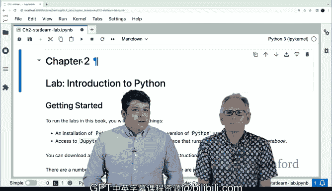

在本节课中，我们将学习 Python 编程语言的基础知识，特别是与数据分析和统计学习相关的核心概念。我们将从 Python 的基本数据类型开始，然后重点介绍用于数值计算的 NumPy 数组。


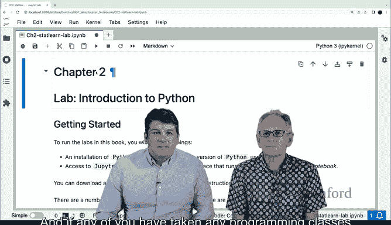

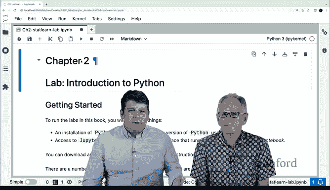

---


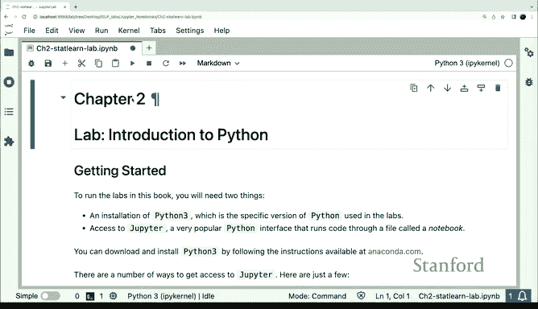

## 概述

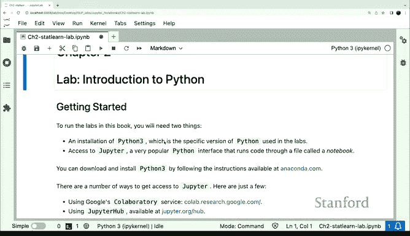

Python 是一种非常流行的编程语言。本实验将介绍 Python 中的一些基本概念。需要说明的是，这并非对 Python 语言的完整详尽介绍。网上有许多 Python 教程，我们也在下方提供了基础 Python 教程的链接。此外，我们还将使用几个常见的包，如 `pandas` 和 `NumPy`，你也可以在网上找到这些包的教程。

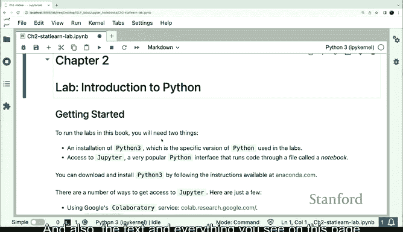

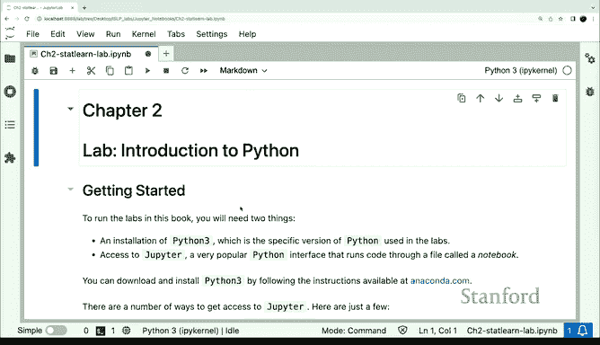

我们将通过运行实验中的代码来学习，这些代码可以在网站上获取，并且与教材中的代码一致。

---

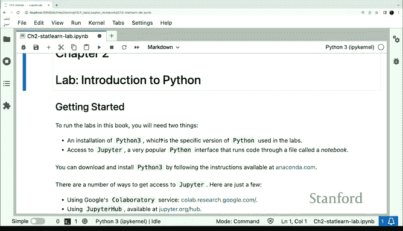

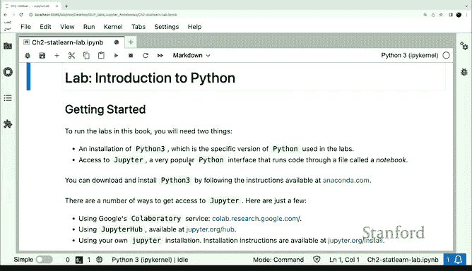

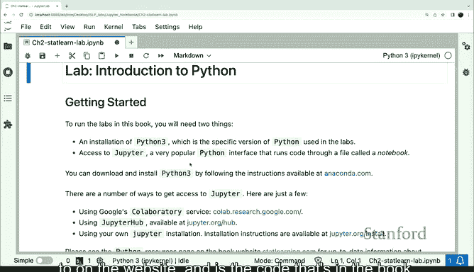

## ython 基本对象类型

与大多数编程语言一样，Python 也有不同的对象类型。我们将主要关注数值对象，但 Python 本身是一种通用语言，因此存在许多标准类型的对象。

### 字符串与函数调用

让我们从一个字符串开始。这是一个调用函数的例子。在计算中，我们几乎所做的每一件事都会调用某种函数。以下是一个调用 `print` 函数的例子。

```python
print("Hello World")
```

在 Jupyter 笔记本中，代码在文本框中执行，输出结果显示在下方。你可以通过按 Shift+Enter 来运行每个单元格的代码。

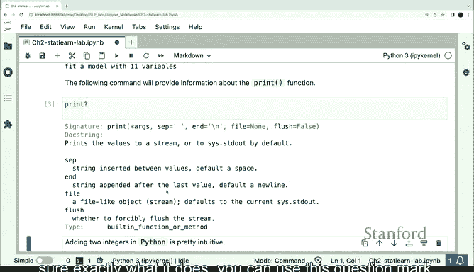

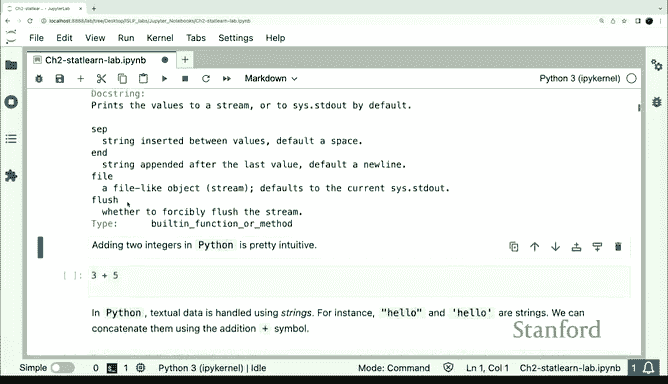

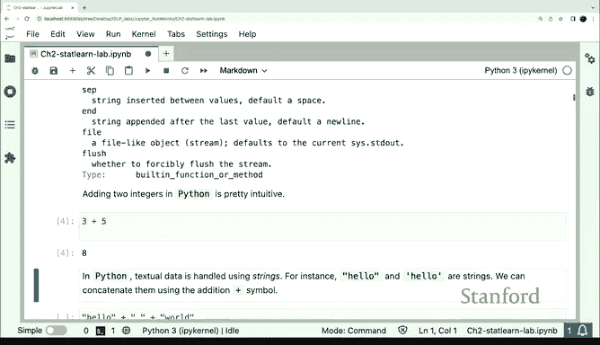

如果你对使用的函数有疑问，Jupyter 的帮助系统可以通过在函数名后加上问号来访问。它会给出函数的文档字符串（docstring），这对于理解函数功能非常有帮助。

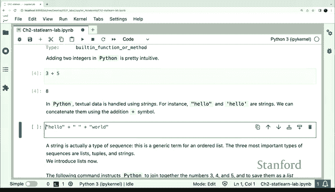

### 数字

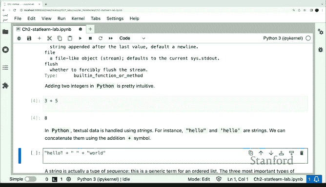

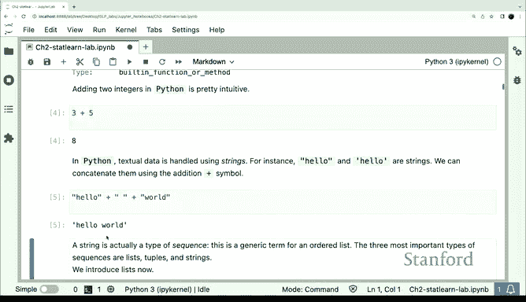

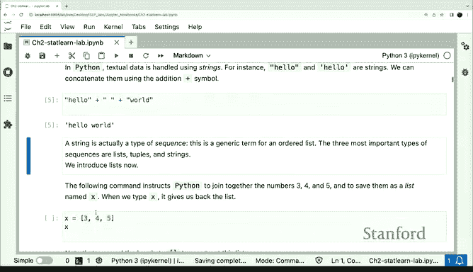

除了字符串，当然还有数字。

```python
3 + 5
```

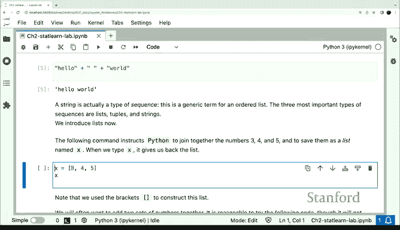

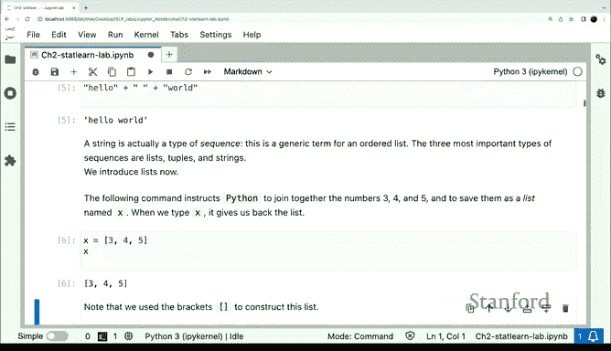

你还可以对其他类型的对象进行加法操作，例如字符串。字符串相加是连接操作。

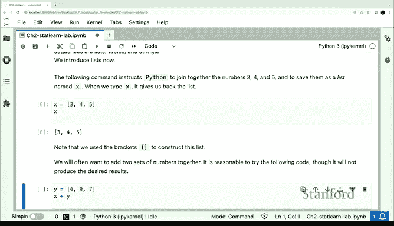

```python
"Hello" + "World"
```

---

## 列表与数组

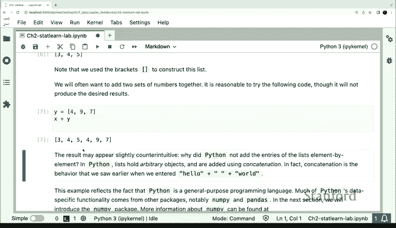

Python 中有一些对象看起来像我们在计算中可能使用的向量。例如，下面这个被称为“列表”的对象，用方括号表示，包含数字 3、4 和 5。

```python
x = [3, 4, 5]
```

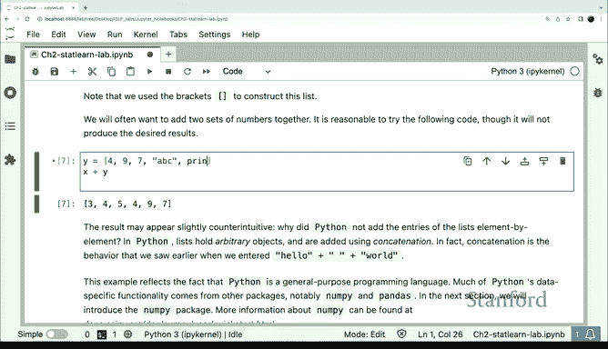

在进行计算时，你经常需要将两个列表相加。让我们创建另一个列表 `[4, 9, 7]`，并尝试相加。

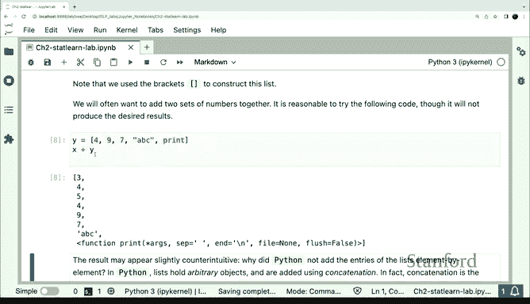

```python
y = [4, 9, 7]
x + y
```

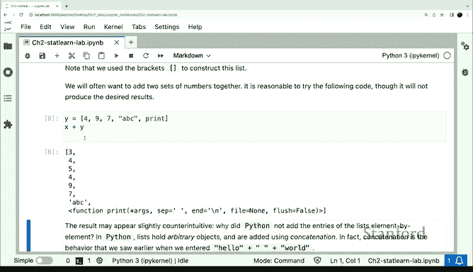

这里的结果可能有些反直觉，因为它展示了 Python 在处理两个数字列表时，并不一定会做你认为最自然的事情（即逐元素相加），而是将列表连接起来。这是因为 Python 中有许多不同类型的对象。

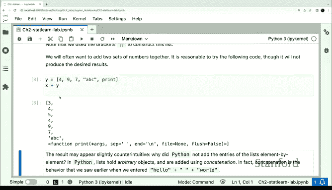

对于数据分析，我们真正想要使用的是**数组**，即计算机中数字的表示形式。当我们有两个向量时，我们希望相加的结果是向量的和。为此，我们将使用 `NumPy` 包，它是 Python 中标准的数值计算库。

我们将在本实验中看到 NumPy 的一些方面，这里也提供了更详尽教程的链接。

列表可以包含任意不同类型的项，这就是为什么不能直接进行数值加法。例如，列表中可以包含字符串，甚至函数。当我们添加这样的列表时，Python 会将它们连接起来。

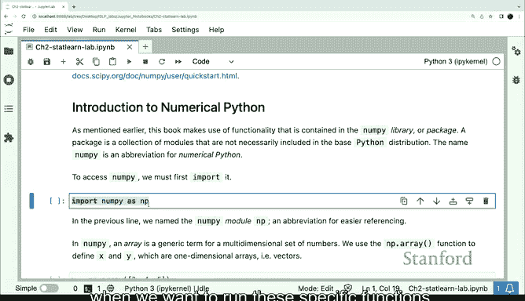

列表只是任意 Python 对象的序列。我们稍后会看到另一种称为“元组”的序列类型，它看起来很像列表，但略有不同。这说明了 Python 具有许多与数值计算无关的通用编程功能。

这就是为什么我们使用 `NumPy` 这样的库来进行数值计算，以及使用 `pandas` 来处理更结构化的数据（如数据框）。

---

## 使用 NumPy 库

我们将使用 `NumPy` 这个包（Numerical Python）。这是我们使用的第一个库示例。库只是一些被添加到语言中的其他代码，或者更准确地说，在程序启动时并未加载到程序中，我们必须通过 `import` 语句来访问它。

在后续的实验中，每个实验都会以许多类似的 `import` 语句开始。这实际上是告诉计算机在哪里可以找到我们稍后运行特定函数时要使用的代码。

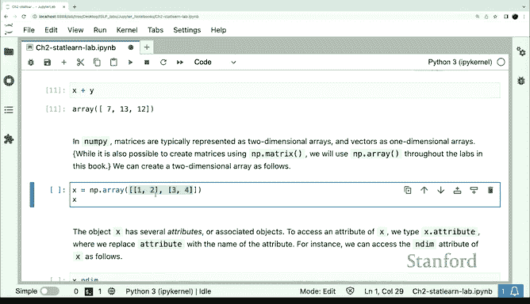

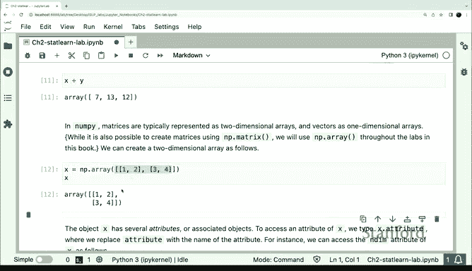

一旦我们加载了 NumPy，就可以开始创建数组。观察语法：我们调用的模块或包名为 `numpy`，我们决定将其命名为 `np`。这意味着当我们想在 NumPy 库中找到一个函数时，我们使用 `np.` 这种表示法，它指的是 NumPy 库中的某个东西。这里我们使用了 `array` 函数。

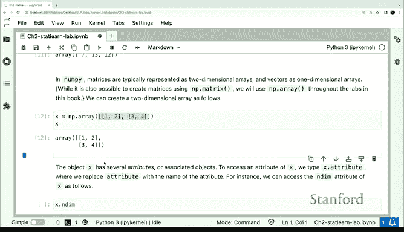

```python
import numpy as np
x = np.array([3, 4, 5])
y = np.array([4, 9, 7])
x + y
```

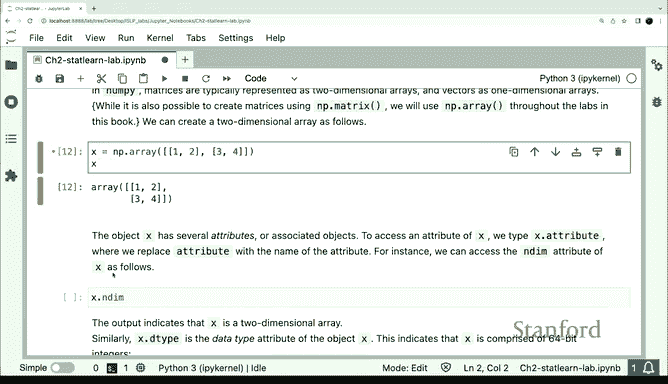

`np` 是 `numpy` 的缩写。我们也可以将其命名为其他任何名称，但 `np` 是文献中 NumPy 的标准缩写。

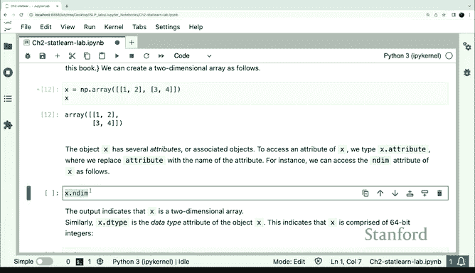

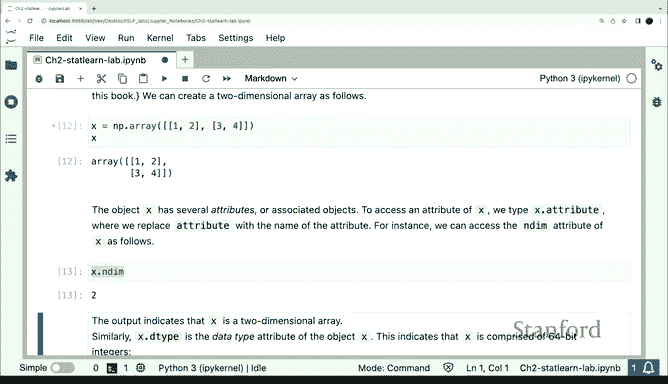

现在，当我们添加这两个数组时，我们得到了更符合预期的结果。数组是 Python 中操作数字的基本对象类型。这是一个一维数组，因为它是由一个列表（只是一维的数字组织）创建的。还有二维数组、三维数组、四维数组。矩阵就是简单的二维数组（其中包含数字）。你也可以拥有包含非数字内容的数组，但我们不必从那里开始。

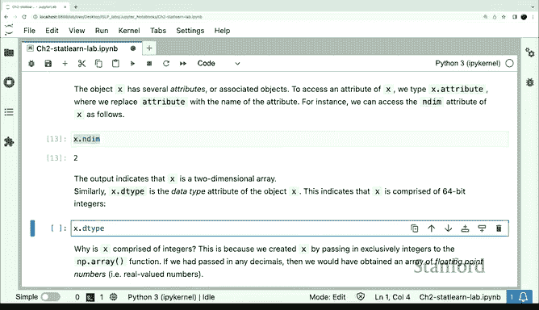

以下是一个二维数组的例子。我们给它一个列表的列表。第一个列表项是 `[1, 2]`，第二个是 `[3, 4]`，这将创建一个 2x2 的数组或矩阵，我们可以稍后用于乘法。

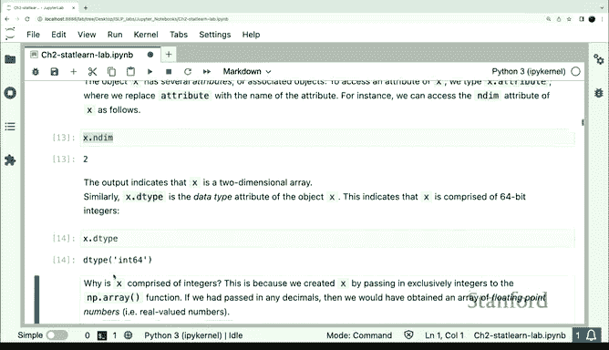

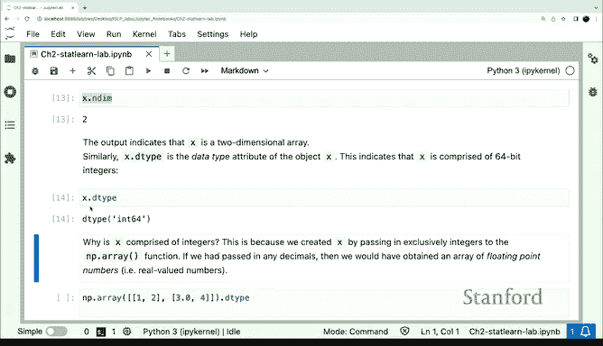

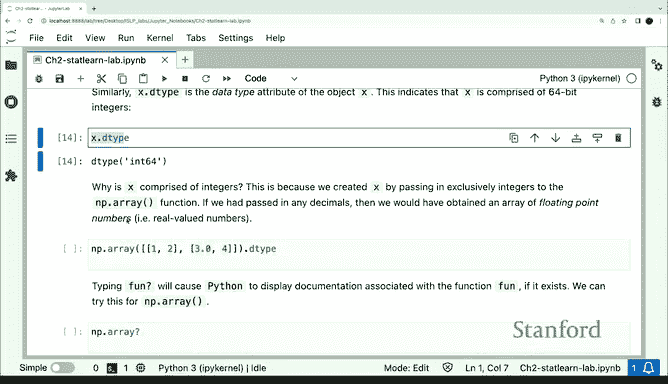

```python
np.array([[1, 2], [3, 4]])
```

---

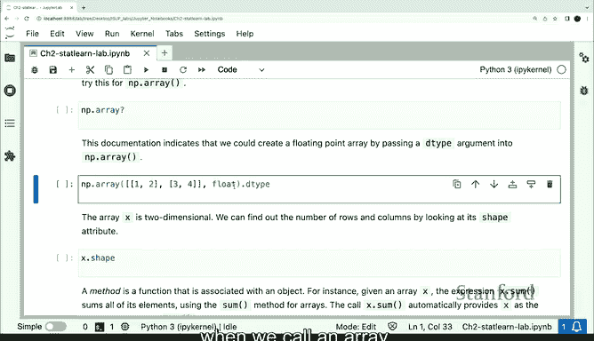

## 对象属性与方法

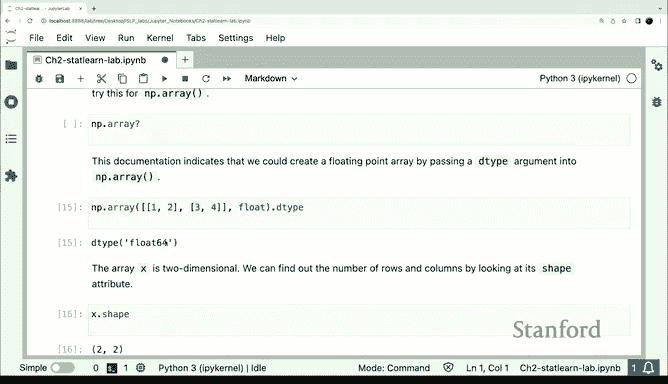

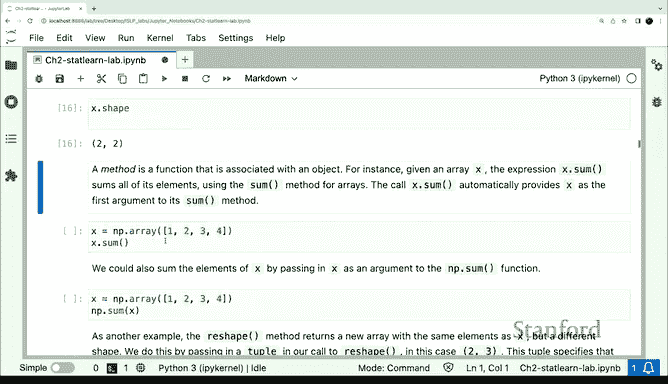

在 Python 中，给定一个对象，我们可能想知道关于它的一些信息。例如，我们可能想找到数组中的一些条目，我们可以使用方括号来做到这一点（稍后会看到更多关于索引的内容）。但对象也有称为“属性”的东西。

属性使用类似的点表示法来引用与对象关联的东西。例如，如果我们想知道数组的维度，可以使用 `.ndim` 属性。

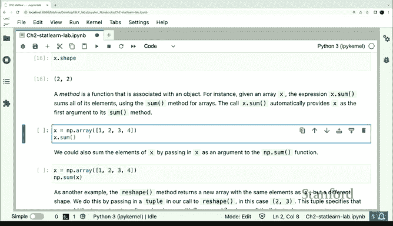

```python
x.ndim
```

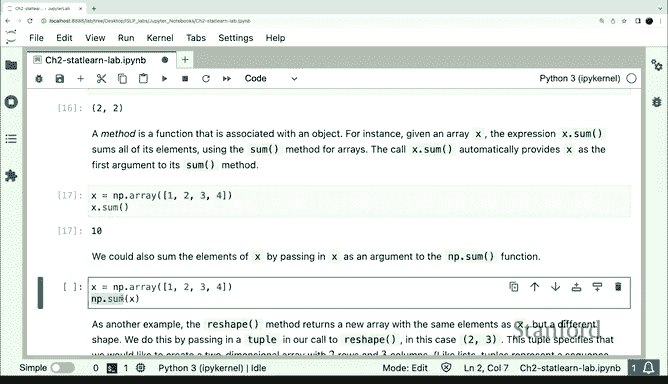

我们还可以询问数组中表示的数据类型。由于我们输入的是整数，所以数据类型是整数。任何 Python 对象都有许多属性，你可以通过这种引用方式来检查它们。

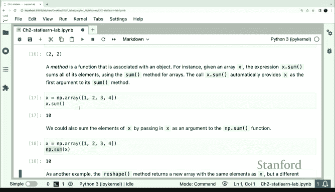

除了属性，Python 对象还有“方法”。方法也使用点表示法，但它是一个函数，因为它有圆括号。例如，在数组 `x` 上调用 `.sum()` 方法会返回 `x` 值的总和。

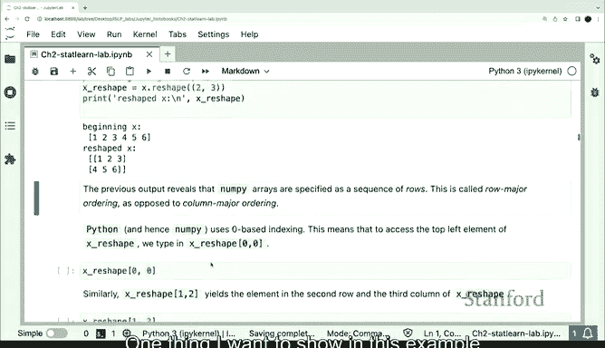

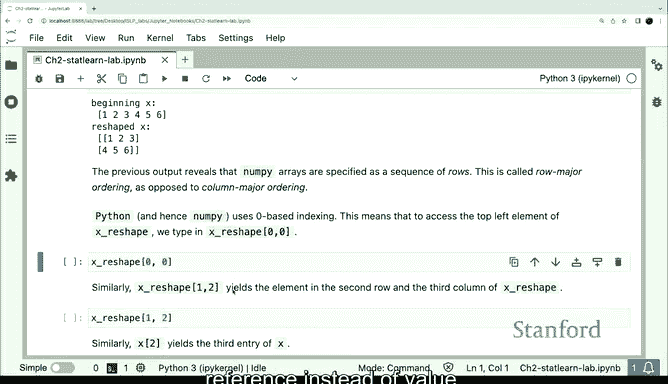

```python
x = np.array([1, 2, 3, 4])
x.sum()
```

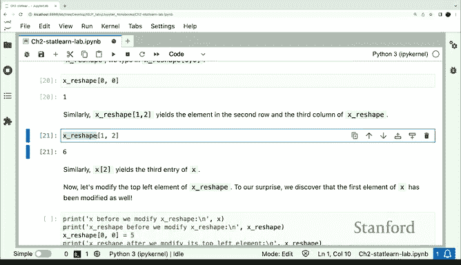

你也可以使用 NumPy 库中的函数来计算数组的总和。`np.sum(x)` 也能计算总和。

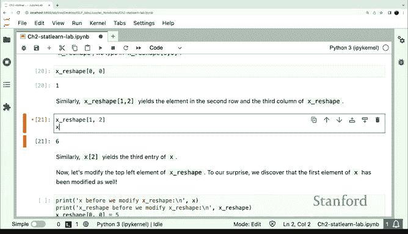

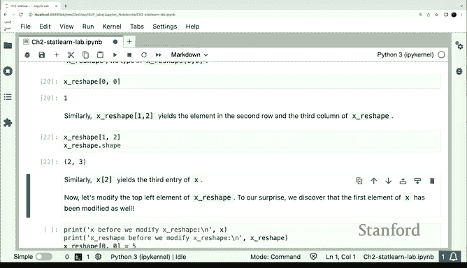

使用方法还是函数通常取决于上下文，但这只是为了让你知道 Python 对象具有这些基本特性：属性和方法，我们也可以在它们上面调用函数。

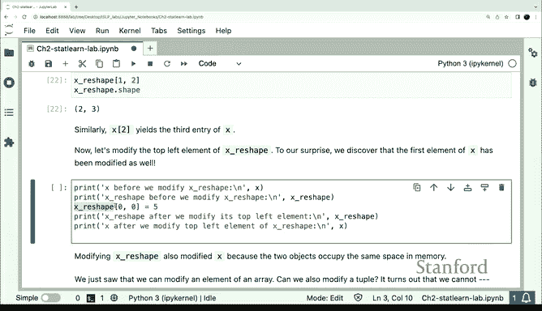

---

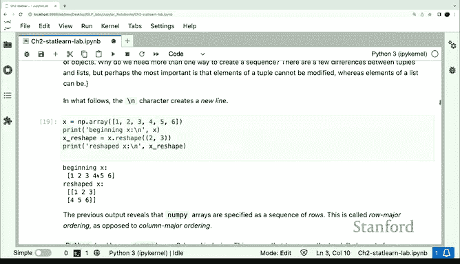

## 数组重塑与引用机制

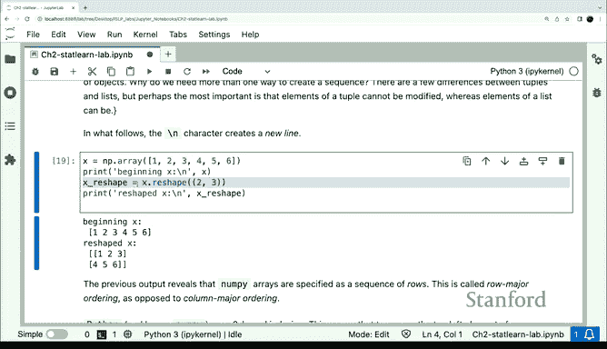

接下来的例子讨论了重塑数组。这里我想通过这个例子展示 Python 如何使用引用而不是值。

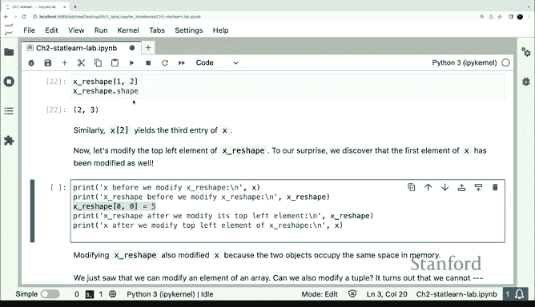

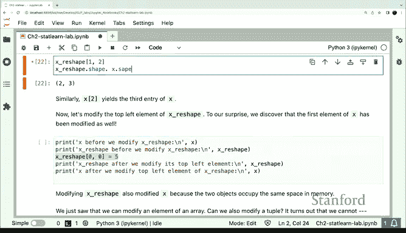

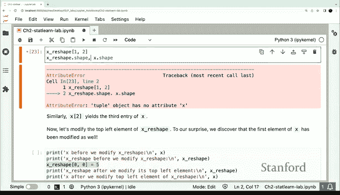

我们有一个原始数组 `x`，然后我们使用 `.reshape()` 方法创建了这个新数组 `x_reshape`。`x` 是一个长度为 6 的数组，我们将其重塑为一个 2x3 的矩阵。

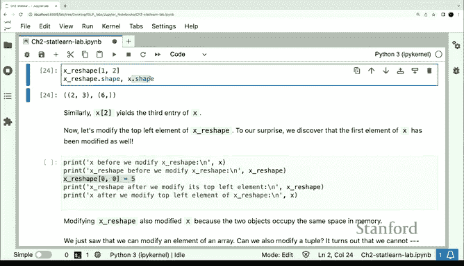

```python
x = np.array([1, 2, 3, 4, 5, 6])
x_reshape = x.reshape(2, 3)
```

我想在这个快速示例中展示的一个重要点是，Python 使用引用而不是值。`x_reshape` 实际上是从 `x` 派生出来的，它与 `x` 共享相同的数据。

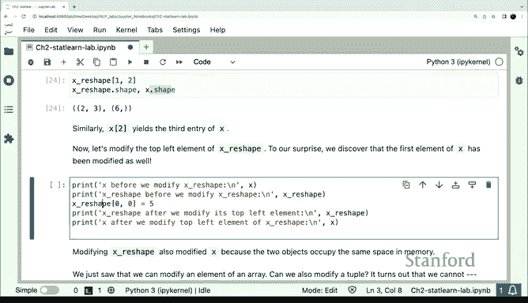

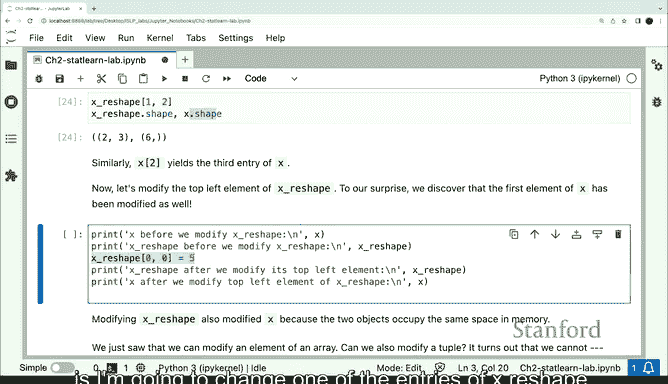

现在，我将更改 `x_reshape` 中的一个条目。方括号表示法用于访问数组中的元素。`[0, 0]` 表示第一行第一列的条目（Python 使用从 0 开始的索引）。

```python
x_reshape[0, 0] = 5
```

当我们再次查看 `x_reshape` 时，它已经变为 5。但 `x` 的第一个条目也变成了 5。这是因为 `x_reshape` 和 `x` 仍然引用计算机内存中的同一位置。当我们更改 `x_reshape` 在该内存位置中的数字时，我们也更改了 `x` 的值。

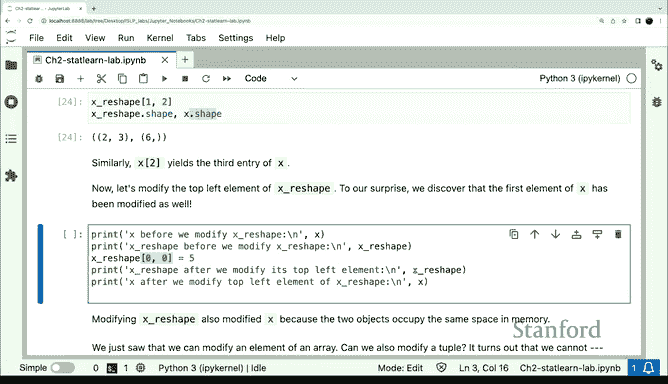

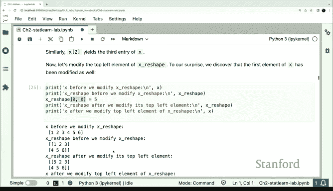

了解一门语言是使用这种引用系统还是复制系统，在开始学习时非常有用。使用这种引用系统有时是为了提高效率。这是一个在处理数组时需要注意的事项。只要可能，NumPy 不会复制数组，而是创建一个数组的“新视图”。

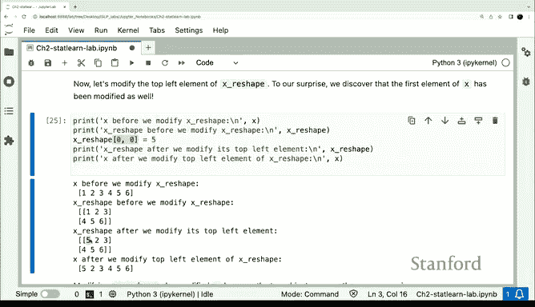

---

## 生成随机数

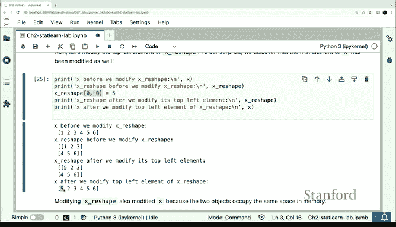

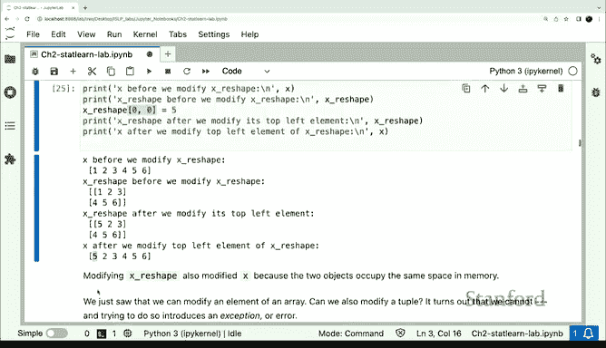

我们将在书中反复使用的另一个重要功能是生成随机数。NumPy 库有生成随机数的方法。这将生成一些随机的正态分布变量。

在编写像这样的实验时，一个重要方面是要有可重现的结果。当然，随机数生成器生成的数字每次都会变化。如果我们重新运行代码块，数字会改变，因为它们是随机的。因此，我们希望为随机数生成器设置一个种子。

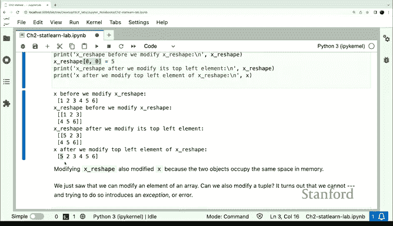

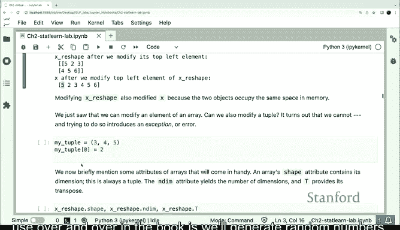

目前的最佳实践是按如下方式设置种子：我们使用 `np.random.default_rng()` 创建一个特定的随机数生成器。这允许我们获得可重现的结果。现在，我们不再使用 `np.random.normal` 函数，而是使用 `rng.normal` 方法。

```python
rng = np.random.default_rng(seed=1234)
data = rng.normal(size=10)
```

这样，我们就创建了两个具有相同种子的随机数生成器，它们将给我们提供完全相同的数据。这将是我们整个实验中获得可重现结果的方式。

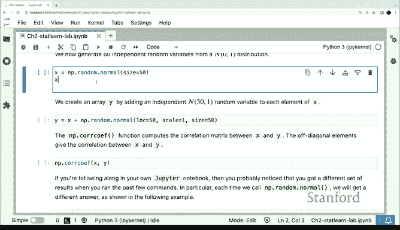

---

## 总结


在本节课中，我们一起学习了 Python 编程的基础知识，重点介绍了与统计学习相关的核心数据类型和工具。我们从字符串、数字和列表等基本对象开始，然后深入探讨了用于高效数值计算的 NumPy 数组。我们了解了如何创建数组、检查其属性和调用方法，并理解了 Python 中重要的引用机制。最后，我们还学习了如何使用种子来确保随机数生成的可重现性，这是进行科学计算和分析的关键一步。这些基础知识为我们后续学习更复杂的统计学习模型和数据分析技术奠定了坚实的基础。