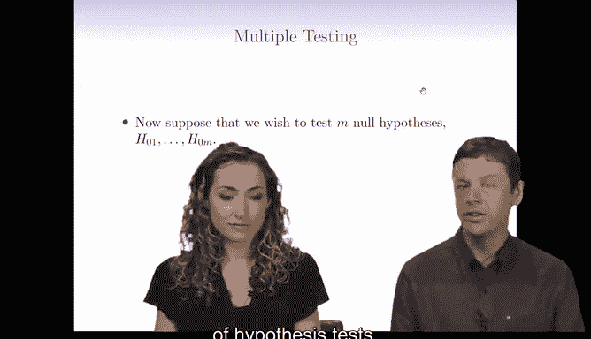
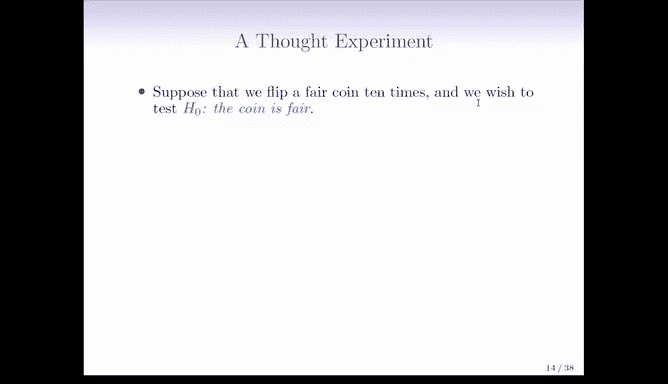
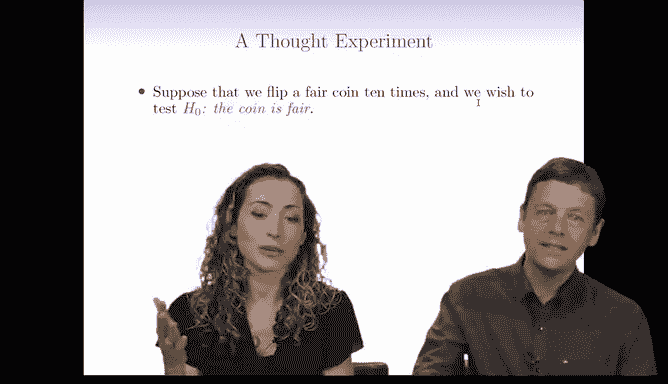
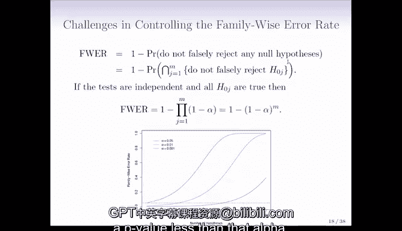

# Python 版 100：多重假设检验与族错误率导论 🧪

在本节课中，我们将学习如何处理多重假设检验问题。当我们需要同时检验多个假设时，传统的统计方法可能会失效，导致大量错误发现。我们将探讨这一问题的本质，并介绍**族错误率**这一核心概念。

---

## 多重假设检验的挑战

上一节我们介绍了单次假设检验的基本原理。本节中我们来看看当需要同时检验多个假设时会出现什么问题。

假设我们同时检验 **M** 个不同的假设。如果简单地拒绝所有 **P 值** 低于 1% 的零假设，那么当 **M** 很大时，我们可能会犯很多**第一类错误**。

为了说明这个问题，我们设计一个思想实验。假设我们找到 1024 枚公平的硬币，每枚硬币抛掷 10 次。

以下是实验的关键点：
*   每枚硬币抛掷 10 次。
*   一枚公平硬币连续 10 次出现正面的概率是 `1/1024`。
*   同样，连续 10 次出现反面的概率也是 `1/1024`。
*   因此，得到如此极端结果（全正面或全反面）的 **P 值** 是 `2/1024 ≈ 0.002`。

如果我们检验这么多硬币，即使所有硬币都是公平的（零假设为真），也几乎可以肯定至少会有一枚硬币因为运气而出现极端结果（例如连续10次正面），从而导致我们错误地拒绝其零假设。这就是一个**第一类错误**。

这个例子表明，只要进行足够多次的假设检验，即使设定非常严格的 **P 值** 阈值，也几乎必然会产生一些错误的阳性发现。

---

## 错误发现的问题

上一节的思想实验揭示了多重检验的核心问题。本节中我们通过一个漫画例子来进一步理解其现实影响。

漫画中，研究人员检验了果冻豆与痤疮的关系。最初检验所有果冻豆时，**P 值** 不显著。随后，他们检验了20种不同颜色的果冻豆。对于其中19种颜色，**P 值** 仍高于5%，但绿色果冻豆的 **P 值** 低于了5%。

于是，新闻头条宣称“绿色果冻豆导致痤疮”。然而，真相很可能只是我们进行了大量检验（20次），从而偶然得到了一个假阳性结果。这解释了为什么许多科学研究难以复现，也说明了在看到任何轰动性的科学头条时，怀疑“他们是否有多重检验问题”通常是合理的。

如果所有 **M** 个零假设都为真，并且我们拒绝所有 **P 值** 低于 `α` 的假设，那么我们预期会错误地拒绝大约 `α * M` 个零假设。

例如，如果 `M = 10,000`， `α = 0.01`，那么即使所有零假设都为真，我们也预期会错误地拒绝大约 `0.01 * 10000 = 100` 个假设。这会导致大量假阳性的“发现”。

---

## 族错误率

既然我们理解了问题所在，那么有什么方法可以应对这种情况呢？最经典的方法是控制**族错误率**。

**族错误率** 定义为在**一系列**假设检验中，**至少犯一次第一类错误的概率**。

用公式表示：
`FWER = P(V ≥ 1)`
其中 **V** 是犯第一类错误的总次数。

控制 FWER 意味着我们希望所有检验中，错误定罪任何“无辜者”（零假设为真但被拒绝）的概率非常低。这就像在法庭上，我们希望确保在一群被告中，即使所有人都无罪，也不会错误定罪其中任何一个人。

---

## 计算与控制族错误率

上一节我们定义了族错误率。本节中我们来看看如何计算它，以及为什么在大规模检验中控制它非常困难。

在理想化的独立检验情况下，如果所有 **M** 个零假设都为真，且我们以阈值 `α` 拒绝假设，则族错误率可以近似为：
`FWER ≈ 1 - (1 - α)^M`

这个公式揭示了问题的严重性。随着检验次数 **M** 的增加，即使 `α` 很小，族错误率也会迅速接近 100%。

例如：
*   当 `α = 0.05`， `M = 50` 时，`FWER ≈ 1 - (0.95)^50 ≈ 0.92`。这意味着你有92%的概率至少犯一个第一类错误。
*   若想将 FWER 控制在 5%，当 `M = 50` 时，需要将单次检验的 `α` 设定到极低的 `0.001` 左右。

因此，当进行成千上万次检验时（例如基因组学、经济学大数据分析），严格控制族错误率通常意味着需要设定极其严格的显著性阈值，这会导致**检验功效**（发现真实效应的能力）大大降低。这使得 FWER 在大数据时代的应用面临挑战。

---

## 总结

本节课中我们一起学习了多重假设检验带来的挑战。我们了解到，简单地重复使用单次检验的标准会不可避免地导致大量假阳性发现。为此，我们引入了**族错误率**的概念，它衡量了在一组检验中犯至少一次第一类错误的概率。虽然控制 FWER 在理论上是理想的，但其计算公式 `FWER ≈ 1 - (1 - α)^M` 表明，在大规模检验中对其进行严格控制非常困难，往往需要以牺牲发现真实效应的能力为代价。这为后续学习其他错误控制方法（如错误发现率 FDR）奠定了基础。