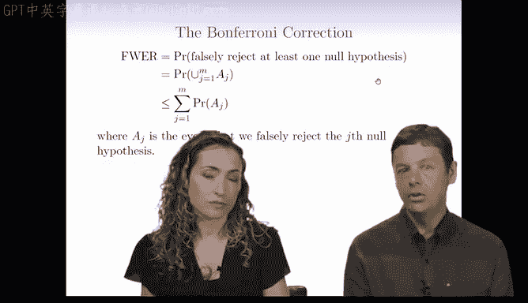
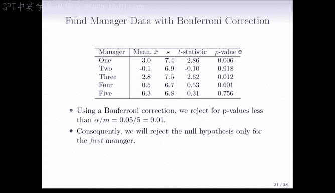

# Python 版 101：控制族错误率的邦费罗尼方法 🧮

在本节课中，我们将学习如何控制“族错误率”。当同时进行多个假设检验时，犯至少一次第一类错误的概率会大大增加。邦费罗尼方法是一种经典且简单的方法，可以确保这个整体错误率不超过我们设定的水平。

上一节我们介绍了多重检验带来的族错误率问题。本节中，我们来看看一种解决该问题的经典方法——邦费罗尼校正。

## 邦费罗尼校正的原理

邦费罗尼校正基于一个简单的概率计算。族错误率（FWER）是至少在一个检验中错误拒绝原假设的概率。根据概率论，多个事件并集的概率不大于各事件概率之和。

用公式表示，如果我们进行 **M** 次独立的假设检验，并希望将整体族错误率控制在 **α** 水平，那么只需在每次单独的检验中，使用更严格的显著性水平 **α/M**。

**核心公式：**
`调整后的显著性水平 = α / M`

这意味着，如果我们进行了100次检验（M=100），并希望整体错误率不超过5%（α=0.05），那么只有当某次检验的p值小于 `0.05 / 100 = 0.0005` 时，我们才能拒绝其原假设。

## 方法应用示例

为了更直观地理解，我们来看一个基金经理数据的例子。数据中评估了五位基金经理相对于股市的超额回报率，并计算了检验其“无超额回报”这一原假设的p值。

以下是原始p值数据：
*   基金经理 1: p值 = 0.001
*   基金经理 2: p值 = 0.12
*   基金经理 3: p值 = 0.006
*   基金经理 4: p值 = 0.6
*   基金经理 5: p值 = 0.9

如果单独看每次检验（使用α=0.05），经理1和经理3的p值小于0.05，我们会认为他们显著跑赢了市场。但这忽略了我们同时进行了5次检验的事实，此时的族错误率实际上高于5%。

应用邦费罗尼校正（M=5， α=0.05）：
**调整后的显著性阈值 = 0.05 / 5 = 0.01**

现在，只有经理1的p值（0.001）小于新的阈值0.01。因此，在控制了整体错误率后，我们只能有把握地认为经理1的表现显著优于市场。

## 方法的优缺点

邦费罗尼方法非常流行，主要有两个原因：它能**保证**将族错误率控制在预定水平，并且**实施起来非常简单**，只需对p值应用一个更严格的阈值。

然而，这种方法也有一个明显的缺点：它变得**非常保守**。随着检验次数M的增加，阈值 `α/M` 会变得极其小，使得拒绝原假设变得非常困难。这可能导致我们错过一些真正有意义的发现（统计功效降低）。

## 关于多重检验的思考

多重检验校正的核心关乎**分析的诚实性**。如果我们只报告看起来最显著的结果，而隐瞒进行了多次检验的事实，就无需任何校正。但作为严谨的研究者，我们必须正视并校正因多次检验而增加的假阳性风险。有时，人们可能并非故意欺骗，而是不了解或忽略了需要进行这种校正，这同样会导致错误的结论。

---

本节课中我们一起学习了邦费罗尼校正方法。它是一种通过调整单个检验的显著性水平（`α/M`）来控制整体族错误率的直接方法。虽然该方法简单有效，但其保守性在处理大量检验时是一个局限。在后续课程中，我们将探讨一些更适合大尺度多重检验问题的现代方法。