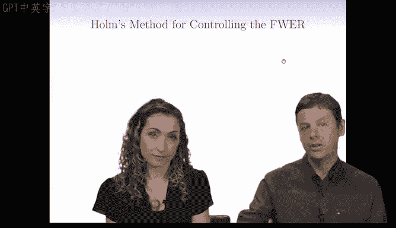
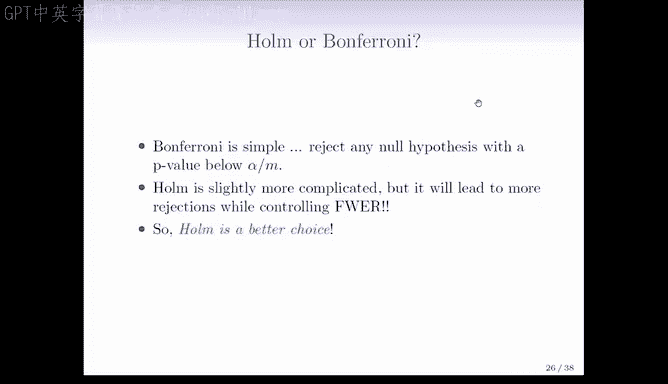

# Python 版 102：控制FWER的Holm方法 📊

在本节课中，我们将学习一种名为Holm方法的多重假设检验校正技术。该方法在某些方面优于Bonferroni校正，虽然计算稍复杂，但能更有效地发现真实效应。我们将通过一个基金经理数据的例子来理解其工作原理。

上一节我们介绍了Bonferroni校正，本节中我们来看看Holm方法。

## 方法概述

Holm方法始于与Bonferroni校正相同的步骤：对M个假设进行标准的假设检验，并计算标准的P值（P1到PM）。

随后，该方法将P值从小到大排序。我们用P(1)表示最小的P值，P(2)表示第二小的，依此类推。

## 核心计算步骤

以下是Holm方法的核心判定流程：

1.  从最小的P值（j=1）开始，将其与阈值 **α/(M+1-j)** 进行比较。
2.  如果P(j) ≤ α/(M+1-j)，则拒绝该假设，并继续检查下一个（j+1）P值。
3.  找到第一个使得P(j) > α/(M+1-j)的j值。
4.  拒绝所有P值小于此临界点P(j)的假设。

对于最小的P值（j=1），其阈值为α/M，这与Bonferroni校正的阈值完全相同。

## 方法对比与实例

让我们通过基金经理数据的例子来比较两种方法。

以下是排序后的P值列表：

*   最小的P值（经理1）：0.0001
*   第二小的P值（经理3）：0.0099
*   第三小的P值（经理2）：0.34
*   其余P值均较大

应用Holm方法：
*   第一步：比较P(1)=0.0001与α/M=0.05/10=0.005。0.0001 < 0.005，因此拒绝经理1的假设。
*   第二步：比较P(2)=0.0099与α/(M-1)=0.05/9≈0.00556。0.0099 > 0.00556，停止。

因此，Holm方法拒绝了经理1的假设。在这个特定例子中，Holm与Bonferroni的结论一致。

## 方法优势图示

下图通过一个包含10个假设检验的模拟场景，直观展示了Holm方法的优势：

*   黑色水平线代表Bonferroni校正的固定阈值α/M。
*   蓝色阶梯线代表Holm方法的动态阈值α/(M+1-j)。
*   红点表示被Holm方法拒绝但被Bonferroni方法接受的假设，代表了Holm方法额外的“发现”。

在更极端的情况下，Holm方法可能比Bonferroni方法发现多得多的显著结果，如下图所示：

## 方法选择

那么，哪种方法更可取呢？

*   **Bonferroni校正**更简单，是迄今为止最流行的方法，对大多数情况而言“足够好”。
*   **Holm方法**稍复杂，但在控制族错误率（FWER）的前提下，通常能拒绝（即发现）更多的假设，功效更高。

选择通常取决于研究者的偏好和对严格性的要求。两种方法都能保证将族错误率控制在α水平（如5%）以下。

---

本节课中我们一起学习了Holm多重检验校正方法。我们了解到，它通过动态调整阈值，在严格控制族错误率的同时，提供了比Bonferroni校正更高的统计功效。尽管应用稍复杂，但在希望最大化发现能力的研究中，它是一个更优的选择。