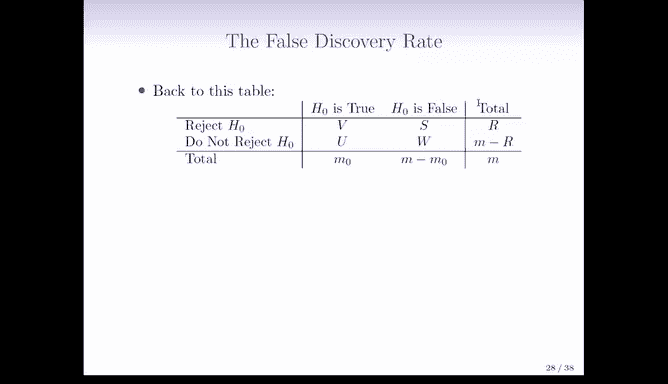
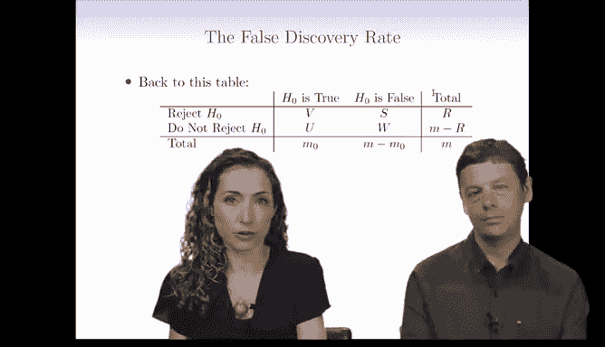
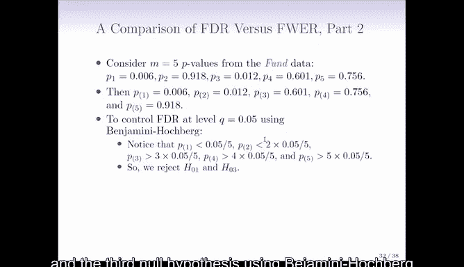

# Python 版 103：错误发现率与Benjamini-Hochberg方法 📊

在本节课中，我们将要学习多重假设检验中的另一个重要概念——**错误发现率**，以及用于控制它的**Benjamini-Hochberg方法**。我们将了解它与之前学习的**族错误率**有何不同，以及在何种应用场景下使用它更为合适。

## 从族错误率到错误发现率 🔄

上一节我们介绍了族错误率，本节中我们来看看一个更现代的多重检验方法——错误发现率。理解这个概念，需要回到我们熟悉的假设检验结果表格。

我们可以控制每次假设检验，知道我们拒绝和未拒绝的原假设数量，但我们永远无法知道表格中列的真实情况，因为列对应的是我们无法获得的真实情况。

族错误率关注的是控制 **V > 1** 的概率，即错误拒绝任何一个原假设的概率。在加勒特的刑事被告例子中，这相当于审判M名被告时，**V** 代表我们错误定罪无辜者的事件。这非常糟糕，因此我们希望族错误率尽可能小。

但问题在于，在许多实际场景中，我们并非在处理可能将无辜者送入监狱的情况。在这些场景中，我们或许可以偶尔接受第一类错误。

我们可能接受第一类错误的原因是，当 **M** 很大时，像族错误率那样试图避免任何第一类错误可能要求过高，甚至可能导致我们永远无法拒绝任何原假设。在刑事被告的案例中，这可能没问题，因为错误定罪一个人的代价是我们无法承受的。但在其他场景中，我们或许可以用偶尔犯一些第一类错误，来换取拒绝更多原假设的能力。

## 什么是错误发现率？ 🤔

这就引出了**错误发现率**的概念。错误发现率，简称 **FDR**，是 **V/R** 的期望值。

*   **R** 是我们拒绝的原假设总数。
*   **V** 是那些被拒绝的原假设中，实际上为真（即我们本不该拒绝）的子集，也就是错误。

因此，FDR 就是被拒绝的原假设中，实际为真的错误发现所占的平均比例。例如，一个良好的FDR可能是20%，这意味着在我们拒绝的所有原假设中，我们预期大约20%是错误发现，80%是正确的发现。

错误发现率在某些应用中有用，在其他应用中则不然。在刑事辩护场景中，如果我们定罪的人中有20%实际上是无辜的，我们会非常不满。但在某些其他场景中，控制错误发现率是合理的。

以下是FDR适用场景的一个例子：
假设你是一名科学家，正在测试 **M** 个（例如10,000个）药物靶点，看看它们是否可能对某种病毒有效。你不想有太多假阳性，但另一方面，你可能可以接受20%的错误发现率。因为任何看起来对COVID有希望的药物靶点，你当然都会在实验室进行广泛的后续研究。在这种情况下，你可以用更多的第一类错误来换取大量可以进行后续研究的药物靶点，但你又不希望第一类错误太多，你希望错误发现率被限制在20%或10%，具体取决于你的实验室有多少资源来跟进这些靶点。

所以，错误发现率是这个比率的期望值：错误拒绝数除以总拒绝数。我们有20,000个候选药物，我们希望识别出一组较小的有希望的候选药物进行进一步研究，但我们不希望这组“有希望的”候选药物中包含太多垃圾。我们希望确保这组所谓的“有希望的”药物靶点确实是有希望的。因此，我们希望FDR不要太大。在这种场景下，族错误率并不合适，因为族错误率会帮助科学家确保没有药物靶点是假阳性，但现实是，如果你试图控制族错误率，你可能最终什么也发现不了，因为20,000是一个非常大的数字。

## Benjamini-Hochberg 方法 📈

事实证明，有一种非常明确的方法可以控制FDR，这被称为 **Benjamini-Hochberg 方法**。

以下是Benjamini-Hochberg 方法背后的步骤：

1.  **指定 Q**：设定你想要控制的错误发现率水平。我们通常用 **Q** 表示这个水平（类似于族错误率中的 **α**）。
2.  **计算 P 值**：为你所有的 **M** 个假设计算 P 值。
3.  **排序 P 值**：将这些 P 值从小到大排序。记 **P(1)** 为最小的 P 值，**P(M)** 为最大的 P 值。
4.  **找到关键索引 L**：找到最大的索引 **J**，使得第 **J** 小的 P 值满足：**P(J) ≤ Q * (J / M)**。
5.  **拒绝假设**：拒绝所有 P 值小于或等于 **P(L)** 的原假设。

如果我们执行这个程序，那么通过统计理论，可以保证**错误发现率 ≤ Q**。

## FDR 与 FWER 的直观对比 📉

在这个幻灯片中，我们可以比较错误发现率和族错误率。这是一个例子，我们有2000个 P 值（M=2000），P 值已从小到大排序。

*   **X轴**：排序后的 P 值索引。
*   **Y轴**：P 值的对数尺度值。

假设我们想使用 **Bonferroni 校正** 在 **α=0.1** 的水平上控制族错误率。这对应于拒绝任何 P 值低于**绿线**的原假设。绿线是 **0.1 / 2000**。我们可以看到，这2000个 P 值中没有一个低于绿线。这很令人失望，意味着我们无法在族错误率水平0.1下拒绝任何原假设，尽管有些 P 值看起来相当小。

相反，如果我们考虑错误发现率，使用 **Benjamini-Hochberg 方法** 在 **Q=0.1** 的水平上控制FDR，那么这相当于拒绝所有用**蓝点**表示的 P 值对应的原假设。可以看到，这有一大堆蓝点。

这里发生了什么？**红线**对应斜率为 **Q/M** 的直线，因为根据步骤4，我们要找到最大的 **J**，使得 **P(J) ≤ Q * (J / M)**。我们需要找到最大的 P 值索引，使得该 P 值落在红线以下，最右边的蓝点就是那个位置。所有蓝点都是 P 值小于 **P(L)** 的点。

使用 Benjamini-Hochberg，我们能够拒绝许多原假设。这看起来很棒。但请记住，FDR 和 FWER 提供的保证是截然不同的。对于族错误率，我们说我们不愿意犯任何错误，或者说我们希望假阳性的概率不超过10%。而对于FDR，我们说假阳性是可以接受的，只要别给我太多，我不希望超过10%的发现是假的。

## 回到示例数据 🔍

我们可以回到之前有5个 P 值的趣味数据示例。我们再次将它们排序，最小的是0.006，最大的是0.918。

我们来应用 Benjamini-Hochberg 方法，设定 **Q=0.05**。

我们需要：
1.  将最小的 P 值与 **0.05 * (1/5)** 比较。
2.  将第二小的 P 值与 **0.05 * (2/5)** 比较。
3.  将第三小的 P 值与 **0.05 * (3/5)** 比较。
4.  将第四小的 P 值与 **0.05 * (4/5)** 比较。
5.  将第五小的 P 值与 **0.05** 比较。

然后，我们需要寻找最大的索引 **J**，使得 P 值小于我们比较的阈值。我们发现，对于 **P(1)** 和 **P(2)**，P 值小于阈值，但从第三小的 P 值开始，P 值超过了阈值。这意味着我们只能拒绝对应于两个最小 P 值的原假设，即第一个和第三个经理。

因此，在 **Q=0.05** 的水平上使用 Benjamini-Hochberg 方法，我们将拒绝第一个和第三个原假设。在这个趣味数据示例中，使用FDR与使用Holm程序相比，并没有导致更多的发现。但通常，当 **M** 非常大时，我们才会看到FDR和族错误率之间的显著差异，而这里 **M** 很小，所以差异不大。这更像是经典场景，族错误率可能更有意义。在这张幻灯片上，使用 Bonferroni 控制族错误率，我们只拒绝了第一个原假设，但如果你回忆之前使用 Holm 控制族错误率的幻灯片，我们实际上拒绝了第一个和第三个经理。

---

**本节课中我们一起学习了：**
1.  **错误发现率** 的概念，它是被拒绝假设中错误发现所占比例的期望值，适用于可以容忍一定比例假阳性的场景。
2.  **Benjamini-Hochberg 方法**，一种用于控制FDR的具体步骤：排序P值，找到满足 **P(J) ≤ Q * (J / M)** 的最大索引 **L**，然后拒绝所有 P 值 ≤ **P(L)** 的假设。
3.  FDR 与 **族错误率** 的核心区别：FWER 严格控制**任何**假阳性出现的概率，而 FDR 控制的是假阳性在**所有阳性发现中**的**比例**。当假设数量 **M** 很大时，控制FDR通常能让我们做出更多发现，同时将错误控制在可接受的比例内。