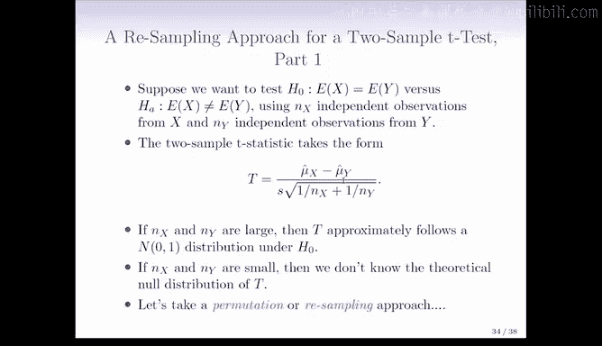

# Python 版 104：重采样方法 🎯

## 概述

在本节课中，我们将要学习一种强大的统计工具——重采样方法。这种方法为我们提供了一种相对无需过多假设的途径，来进行假设检验，无论是单个检验还是多个检验。

## 重采样方法的核心思想

上一节我们讨论了在已知检验统计量零分布的情况下如何计算P值。本节中我们来看看当这个理论上的零分布未知或我们对其假设存疑时，该怎么办。

重采样方法的核心思想是：我们不再依赖教科书中的理论分布，而是让计算机通过模拟来“生成”检验统计量在零假设下的分布。这是一个通用框架，但需要根据具体的假设检验类型和检验统计量来具体实现。

## 两样本T检验的重采样应用

现在，让我们具体看看如何将重采样方法应用于两样本T检验。

假设我们想检验零假设：**组X的均值等于组Y的均值**，备择假设为它们不相等。我们分别有 `n_x` 个来自X的独立观测值和 `n_y` 个来自Y的独立观测值。

两样本T统计量的公式如下：
`T = (mean(X) - mean(Y)) / SE(mean(X) - mean(Y))`

当样本量 `n_x` 和 `n_y` 很大时，T在零假设下近似服从标准正态分布。但如果样本量很小，我们通常无法得知T的理论零分布，除非对数据本身（X和Y的分布）做出更多假设。

这时，我们可以采用重采样方法。其思路是，我们不再去查找或推导T的理论零分布，而是让计算机模拟在零假设成立时，T的分布可能是什么样子。

## 重采样步骤简介

以下是实施重采样检验的一般性步骤概述：

1.  **计算观测检验统计量**：首先，基于我们手头真实的X和Y数据，计算出实际的T统计量值，记作 `T_obs`。
2.  **模拟零假设下的数据**：在零假设（即两组均值无差异）成立的条件下，通过某种方式“重新洗牌”或“重采样”我们的原始数据，生成许多组模拟数据。
3.  **计算模拟统计量**：对每一组模拟数据，用与步骤1完全相同的公式计算T统计量。这样我们就得到了一个在零假设下T统计量的模拟值集合。
4.  **构建经验零分布**：用步骤3中得到的所有模拟T值，构建一个经验分布。这个分布就近似代表了T在零假设下的分布。
5.  **计算经验P值**：最后，将观测到的 `T_obs` 与这个经验分布进行比较。经验P值等于模拟数据中，T统计量的绝对值大于或等于 `|T_obs|` 的比例。公式可以表示为：
    `P_value ≈ (# of |T_sim| >= |T_obs|) / (# of simulations)`

通过这个过程，我们无需对原始数据的分布形态做出严格假设（如正态性），就能对假设进行检验。

## 总结

本节课中我们一起学习了重采样方法。这是一种通过计算机模拟来构建检验统计量零分布的强大技术，特别适用于理论分布未知或假设条件可能不满足的情况。我们以两样本T检验为例，概述了其核心思想与实施步骤。需要注意的是，重采样是一个通用框架，针对不同的检验问题需要设计具体的重采样方案，它并非一个简单的“即插即用”工具，而是需要根据具体情境进行深入思考和应用。