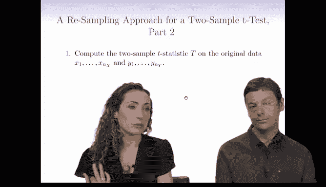
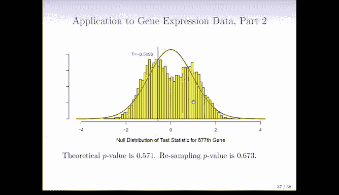
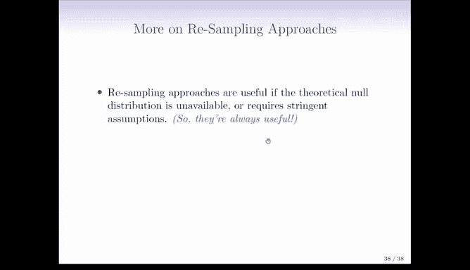
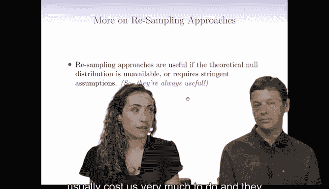
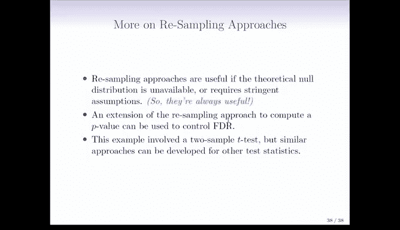

# Python 版 105：重采样方法 II 🔄

在本节课中，我们将学习如何使用重采样（或置换）方法来模拟零分布，并计算假设检验的P值。我们将通过一个两样本T检验的例子，详细讲解置换检验的步骤和原理。


---



## 概述

上一节我们介绍了重采样方法的基本概念。本节中，我们将具体探讨如何通过**置换检验**来模拟零分布，并计算P值。这种方法的核心思想是：在原假设成立的前提下，数据可以任意打乱，通过多次打乱数据并计算检验统计量，我们可以构建出零分布的近似。

---

## 置换检验的原理

在原假设下，X组和Y组的数据没有差异，它们具有相同的均值。因此，我们可以将所有数据混合在一起，然后随机打乱顺序。

具体步骤如下：
1.  计算原始数据的检验统计量（例如两样本T统计量）。
2.  将X组和Y组的所有观测值合并。
3.  随机打乱（置换）这个合并后的数据集。
4.  将打乱后的前 `n_X` 个观测值视为新的“X*”组，剩余的 `n_Y` 个观测值视为新的“Y*”组。
5.  基于这个打乱后的数据，计算一个新的检验统计量 `T*`。
6.  重复步骤3-5 `B` 次（例如 `B=10000`），得到 `B` 个 `T*` 值，它们共同模拟了零分布。
7.  计算P值：P值等于模拟的 `T*` 统计量的绝对值，超过原始 `T` 统计量绝对值的比例。

以下是该过程的伪代码描述：
```python
# 计算原始数据的T统计量
T_obs = compute_t_statistic(X, Y)

# 初始化计数器
count = 0
B = 10000

for i in range(B):
    # 1. 合并并打乱数据
    combined = concatenate(X, Y)
    shuffled = permute(combined)
    
    # 2. 创建新的X*和Y*组
    X_star = shuffled[:len(X)]
    Y_star = shuffled[len(X):]
    
    # 3. 计算打乱后的T统计量
    T_star = compute_t_statistic(X_star, Y_star)
    
    # 4. 比较
    if abs(T_star) >= abs(T_obs):
        count += 1

# Python 版 5. 计算P值
p_value = count / B
```

---

## 一个基因表达数据的例子

我们来看一个基因表达数据的实际应用。在这个例子中，我们有一个对照组和一个处理组，我们关注某个特定基因的表达水平。

以下是分析结果：
*   **基因A**：原始数据的T统计量为 -2.09。通过置换得到的零分布（黄色直方图）与理论上的零分布（橙色曲线）非常接近。理论P值为0.041，置换P值为0.042，结果几乎一致。
*   **基因B**：原始数据的T统计量为 -0.5696。此时，置换得到的零分布（黄色直方图）与理论零分布（橙色曲线）出现了可见的差异。理论P值为0.571，而置换P值为0.673。

虽然在这个例子中，两个P值都很大，不会导致相反的结论，但它说明了置换方法有时会给出不同的结果。置换检验用计算时间换取了更弱的假设前提。

---



## 置换检验的适用场景


那么，何时使用重采样方法更有用呢？以下是几个关键场景：

*   **理论零分布未知时**：当检验统计量的理论分布难以推导，或者需要非常强的假设才能成立时，置换检验非常有用。
*   **样本量较小时**：对于像两样本T检验这样的方法，在小样本情况下，理论分布依赖于正态性假设。置换检验不依赖于此，可以提供更可靠的推断。
*   **降低假设依赖**：即使理论分布可用，置换检验也提供了一种几乎不依赖模型假设的替代方法，增加了结果的稳健性。计算机不介意做这些额外的工作。

---



## 方法的延伸



我们讨论了两样本T检验的置换方法，但此方法可以推广到其他检验统计量和假设。

*   **控制错误发现率**：在多重检验中，置换方法也可用于控制错误发现率。教科书中对此有详细阐述。
*   **设计自定义检验**：对于其他复杂的零假设和检验统计量，你需要根据具体情况设计置换方案。这通常需要更多的思考，并非总是有现成的软件命令。

---

## 总结



本节课中，我们一起学习了**置换检验**的具体实施步骤。我们了解到，通过随机打乱数据并重复计算统计量，可以模拟出零假设下的数据分布，进而计算P值。这种方法在理论分布未知、样本量小或希望减少模型假设时特别有用。它用计算成本换取了推断的稳健性，是现代统计学习中一项重要的非参数工具。