# Python 版 106：多重检验 I 🔬

在本节课中，我们将学习第13章关于多重检验的实验内容。我们将聚焦于多重检验的两个主要评判标准：**族错误率**和**错误发现率**，并探讨如何估计这些指标。

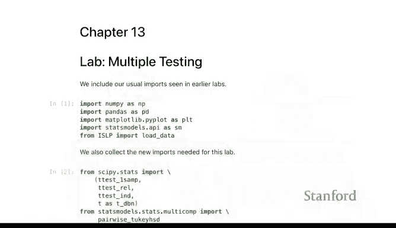

---

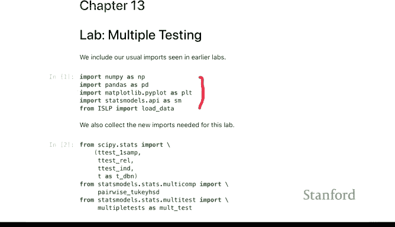

## 导入必要的库 📦

首先，我们导入实验所需的Python库。大部分库我们已经很熟悉了，新引入的主要是`scipy.stats`包中的T检验函数，用于进行大量的均值比较。

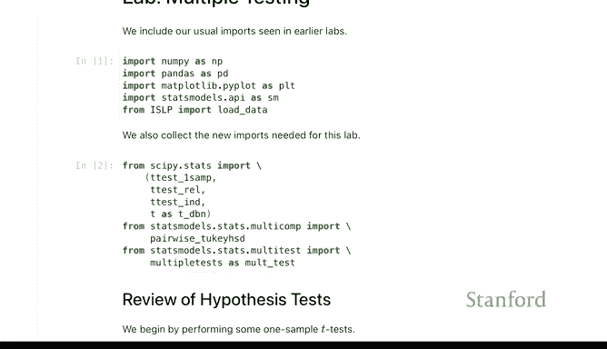

```python
import numpy as np
import pandas as pd
import matplotlib.pyplot as plt
import seaborn as sns
from scipy import stats
from statsmodels.stats.multitest import multipletests
```

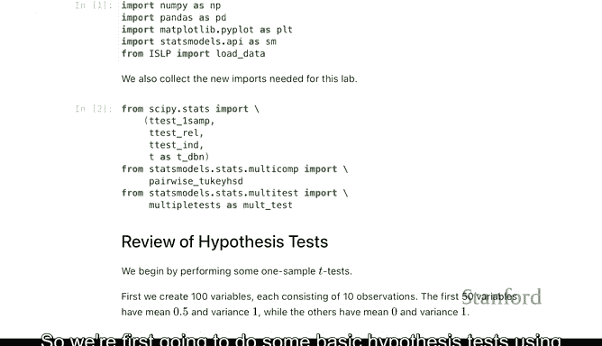

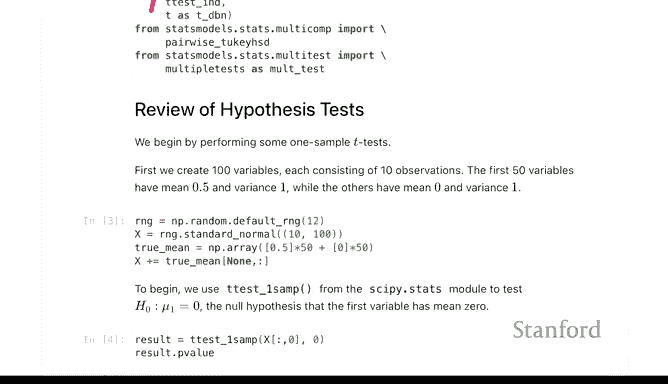

---

## 基础假设检验 📊

上一节我们导入了工具，本节中我们来看看如何使用T检验函数进行基础的假设检验。

我们将从生成一些模拟数据开始，并进行单样本T检验。

### 生成模拟数据

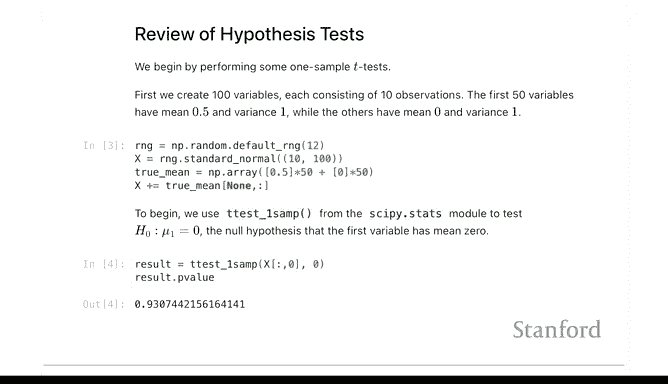

我们生成一个数据集，包含100列数据，每列有10个观测值。前50列的均值为0.5，后50列的均值为0。这意味着我们有一半的列存在真实信号（非零均值），另一半是零假设成立的情况。

```python
np.random.seed(1)
X = np.random.randn(10, 100)  # 10行，100列
X[:, :50] += 0.5  # 前50列均值增加0.5
```

### 执行单样本T检验

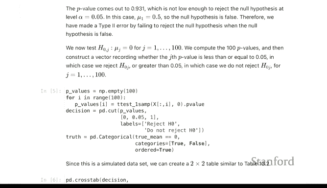

我们对第一列数据执行单样本T检验，检验其均值是否为零。

```python
result = stats.ttest_1samp(X[:, 0], 0)
print(f"T统计量: {result.statistic:.3f}")
print(f"P值: {result.pvalue:.3f}")
```
输出结果中的P值可能很高（例如0.93），远高于通常的5%阈值，表明我们没有足够证据拒绝该列均值为零的假设。这可能有些意外，因为我们设置了0.5的均值，但这说明信号强度可能不足。

---

## 多重检验问题 🤔

上一节我们只检验了一个假设，但在实际数据集中，我们有100列数据，因此需要进行100次检验。这就是多重检验问题的核心。

### 计算所有P值

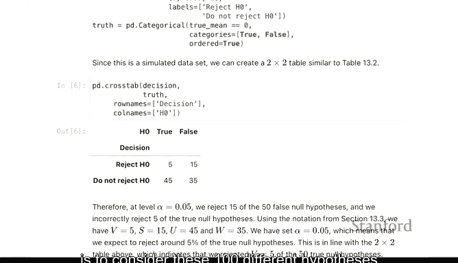

我们通过循环计算所有100列的P值，并以0.05为阈值进行分类。

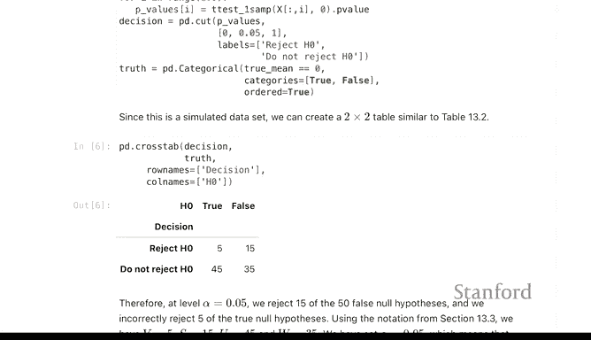

```python
p_values = []
for i in range(100):
    result = stats.ttest_1samp(X[:, i], 0)
    p_values.append(result.pvalue)

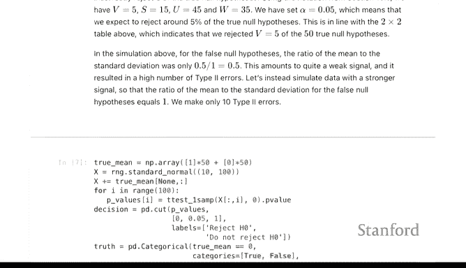

# 将P值与阈值比较
decisions = np.array(p_values) < 0.05
```

### 构建结果汇总表

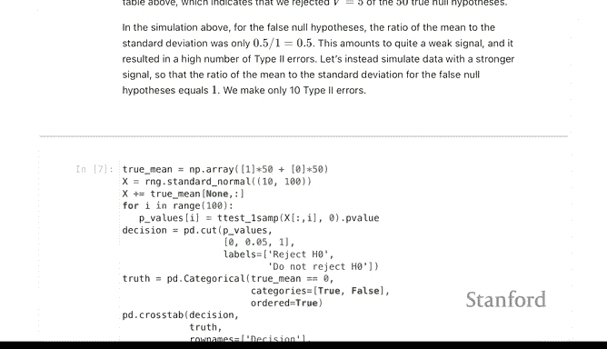

为了理解检验结果，我们构建一个类似教科书中的2x2汇总表。列代表真实的假设情况（零假设为真或为假），行代表我们的决策（拒绝或不拒绝零假设）。

以下是汇总表中各单元格的典型标签和含义：
*   **V**: 错误拒绝的零假设数量（假阳性）。
*   **S**: 正确拒绝的零假设数量（真阳性）。
*   **U**: 正确接受的零假设数量（真阴性）。
*   **T**: 错误接受的零假设数量（假阴性）。
*   **R**: 总拒绝数 (R = V + S)。
*   **FDP**: 错误发现比例，计算公式为 **FDP = V / R**。

在我们的模拟中，假设我们知道前50列是信号（零假设为假），后50列是噪声（零假设为真）。我们可以计算如下：

```python
# 已知真实情况：前50列为假，后50列为真
truth = np.array([False]*50 + [True]*50)

# 构建汇总表
V = np.sum(decisions & truth)  # 假阳性
S = np.sum(decisions & ~truth) # 真阳性
U = np.sum(~decisions & truth) # 真阴性
T = np.sum(~decisions & ~truth)# 假阴性

print(f"假阳性 (V): {V}")
print(f"真阳性 (S): {S}")
print(f"总拒绝数 (R): {V + S}")
print(f"错误发现比例 (FDP): {V / (V + S):.2f}")
```
在这个例子中，我们可能发现大约有5个假阳性。在总共20个拒绝中，有5个是错误的，因此错误发现比例约为25%。

多重检验的目标就是设计决策规则，在同时检验多个假设时，控制诸如假阳性数量或错误发现比例这类指标。

---

## 增强信号强度 📈

上一节我们看到了较弱的信号导致的问题，本节我们通过增强信号强度来观察结果如何变化。

我们将前50列的均值从0.5增加到1，然后重复上述分析。

```python
# 生成新数据，信号更强
X_strong = np.random.randn(10, 100)
X_strong[:, :50] += 1.0

# 重新计算P值和决策
p_values_strong = [stats.ttest_1samp(X_strong[:, i], 0).pvalue for i in range(100)]
decisions_strong = np.array(p_values_strong) < 0.05

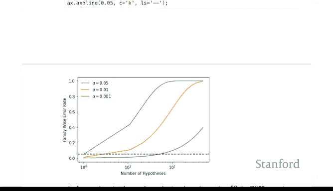

# 重新计算汇总表（使用相同的真实情况`truth`）
V_s = np.sum(decisions_strong & truth)
S_s = np.sum(decisions_strong & ~truth)

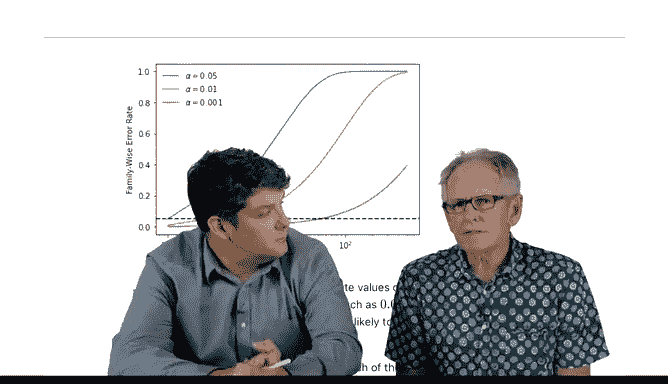

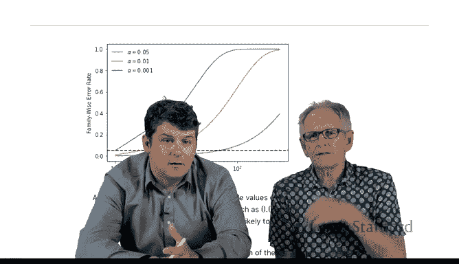

print(f"强信号下假阳性 (V): {V_s}")
print(f"强信号下真阳性 (S): {S_s}")
print(f"强信号下错误发现比例 (FDP): {V_s / (V_s + S_s):.2f}")
```
随着信号增强，我们可能发现真阳性（S）大幅增加，而假阳性（V）保持较低水平，从而错误发现比例（FDP）降低。但同时，我们可能仍有未能检测出的信号，即假阴性。

---

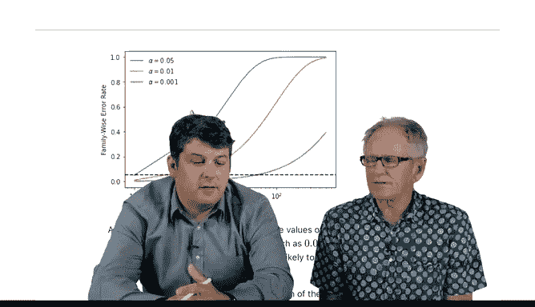

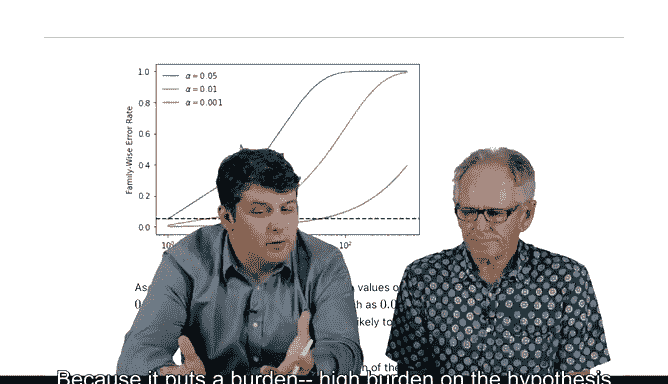

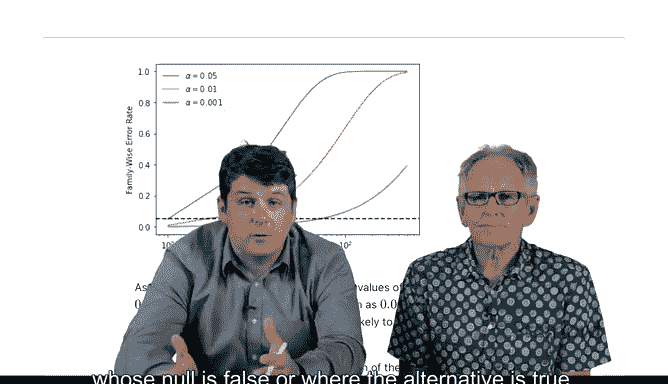


## 控制族错误率 🛡️

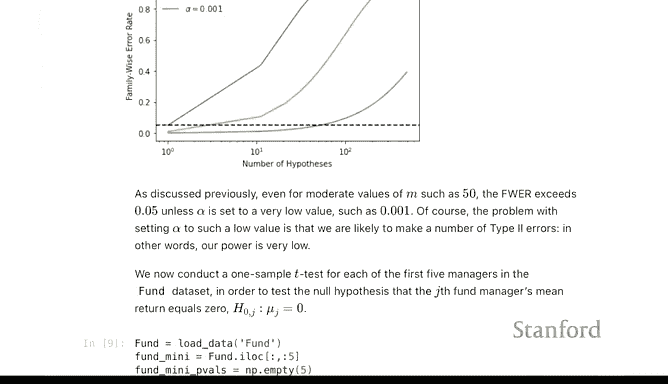

上面我们看到，即使每个检验都使用5%的阈值，在100次检验中也很可能产生假阳性。族错误率（FWER）定义为**至少犯一次假阳性错误的概率**。

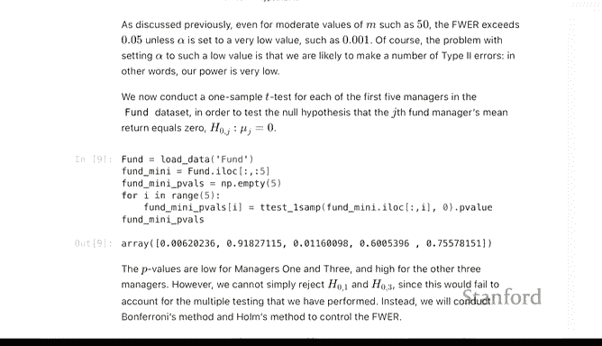

如果我们希望FWER控制在5%以下，那么对每个独立检验使用的阈值必须比5%严格得多。对于M次独立检验，邦弗朗尼校正建议使用 **α/M** 作为阈值。

以下代码展示了FWER随阈值变化的关系：

```python
M = 100
alpha = 0.05
thresholds = np.linspace(0, 0.05, 200)
fwer = 1 - (1 - thresholds)**M  # 对于独立检验的FWER近似公式

plt.figure(figsize=(8,5))
plt.plot(thresholds, fwer)
plt.axhline(y=alpha, color='r', linestyle='--', label='目标FWER (0.05)')
plt.axvline(x=alpha/M, color='g', linestyle='--', label=f'邦弗朗尼阈值 ({alpha/M:.5f})')
plt.xlabel('每个检验的阈值 (α)')
plt.ylabel('族错误率 (FWER)')
plt.title(f'FWER vs. 单次检验阈值 (M={M}次检验)')
plt.legend()
plt.grid(True)
plt.show()
```
从图中可以看出，当使用邦弗朗尼阈值 **α/M**（例如100次检验时为0.0005）时，才能确保FWER不超过5%。这种方法非常严格，可能会降低检测真实信号的效力。

---

## 实例：基金数据 🏦

理论部分之后，我们来看一个实际案例。我们将使用`ISLR2`包中的基金数据集，检验多位基金经理的回报率是否显著优于市场（即均值是否大于零）。

### 数据准备与初步检验

首先加载数据，并随机选取5位经理进行初步分析。

```python
# 假设 fund_data 是一个DataFrame，行是观测期，列是不同的基金经理
# 这里用随机数据模拟
np.random.seed(42)
fund_data = pd.DataFrame(np.random.randn(100, 200) * 0.1, # 200位经理，100个季度
                         columns=[f'Manager_{i}' for i in range(200)])
# 假设前20位经理有微弱正阿尔法
fund_data.iloc[:, :20] += 0.03

# 选取5位经理计算P值
sample_managers = fund_data.columns[:5]
pvals_sample = []
for manager in sample_managers:
    result = stats.ttest_1samp(fund_data[manager], 0)
    pvals_sample.append(result.pvalue)

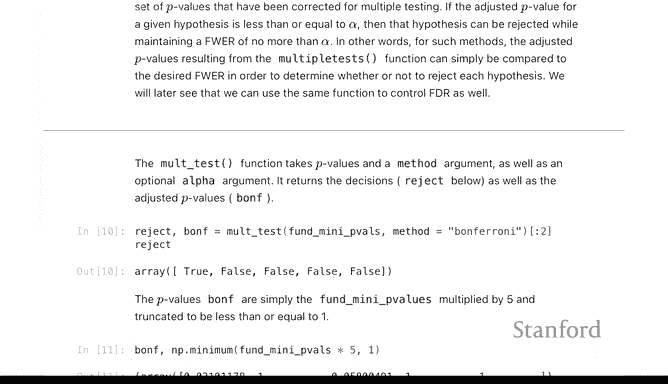

print("5位样本经理的原始P值：")
for i, (mgr, pv) in enumerate(zip(sample_managers, pvals_sample)):
    print(f"  {mgr}: {pv:.4f}")
```

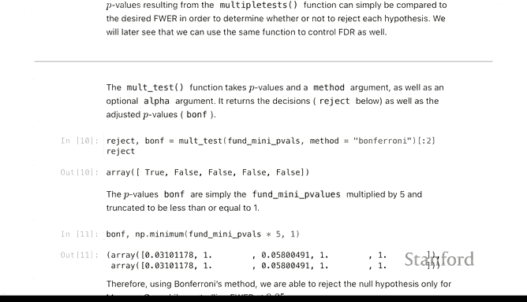

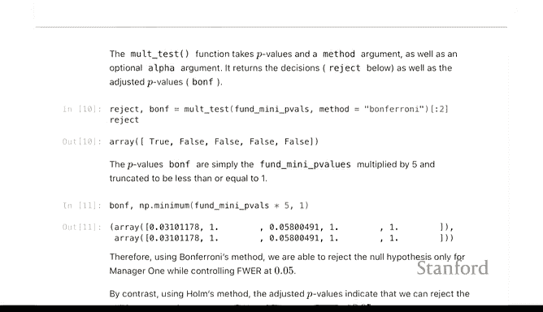

### 应用邦弗朗尼和霍尔姆校正

为了控制FWER，我们使用`statsmodels`中的`multipletests`函数来调整P值。

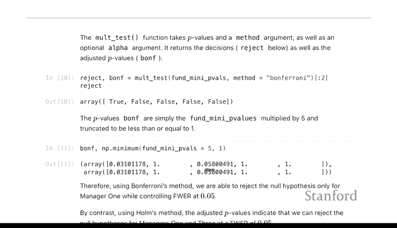

以下是两种常用方法：
1.  **邦弗朗尼校正**：将每个原始P值乘以检验次数M。公式为 **P_adj = min(P * M, 1)**。
2.  **霍尔姆校正**：一种逐步法，比邦弗朗尼更有效力（即更可能发现真实信号）。

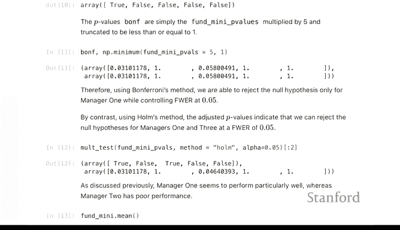

```python
# 应用多重检验校正
reject_bonf, pvals_corrected_bonf, _, _ = multipletests(pvals_sample, alpha=0.05, method='bonferroni')
reject_holm, pvals_corrected_holm, _, _ = multipletests(pvals_sample, alpha=0.05, method='holm')

print("\n邦弗朗尼校正后P值及决策 (α=0.05):")
for i, (mgr, pv_orig, pv_adj, rej) in enumerate(zip(sample_managers, pvals_sample, pvals_corrected_bonf, reject_bonf)):
    print(f"  {mgr}: 原始P值={pv_orig:.4f}, 调整后P值={pv_adj:.4f}, 拒绝？{rej}")

print("\n霍尔姆校正后P值及决策 (α=0.05):")
for i, (mgr, pv_orig, pv_adj, rej) in enumerate(zip(sample_managers, pvals_sample, pvals_corrected_holm, reject_holm)):
    print(f"  {mgr}: 原始P值={pv_orig:.4f}, 调整后P值={pv_adj:.4f}, 拒绝？{rej}")
```
可以看到，邦弗朗尼校正非常严格，可能将原本显著的P值变得不显著。霍尔姆校正则相对宽松一些，在控制FWER的同时保留了更多效力。

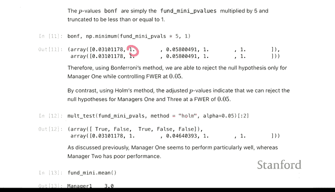

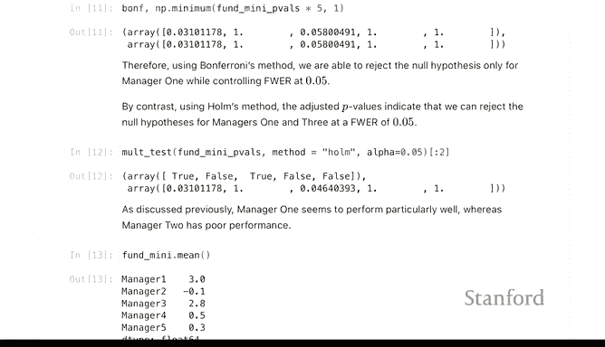

---

## 成对比较与事后检验 🔄

有时我们不仅关心单个经理是否战胜市场，还想比较不同经理之间的表现。例如，我们发现经理1表现最好，经理2表现最差，想检验他们之间的差异是否显著。

### 执行配对T检验

我们使用配对T检验（`ttest_rel`）来比较两位经理的回报序列。

```python
# 比较经理1和经理2
manager1_returns = fund_data['Manager_0']
manager2_returns = fund_data['Manager_1']

result_pair = stats.ttest_rel(manager1_returns, manager2_returns)
print(f"经理1 vs 经理2 配对T检验:")
print(f"  T统计量: {result_pair.statistic:.3f}")
print(f"  P值: {result_pair.pvalue:.4f}")
```
我们可能得到一个小于0.05的P值，但这存在“数据窥探”问题：因为我们是在查看了所有经理结果后，才选择了表现最好和最差的进行比较。这会使P值被低估。

### 处理多重比较：图基HSD法

当我们计划进行所有可能的成对比较时（对于5位经理，有10对比较），需要校正多重性。图基的“ Honestly Significant Difference”方法可以用于此场景。

```python
# 使用5位经理的全部数据进行ANOVA和事后检验（示例）
from statsmodels.stats.multicomp import pairwise_tukeyhsd

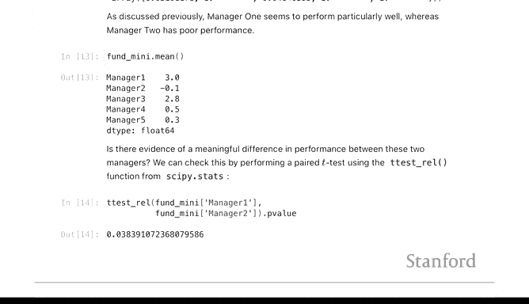

# 将数据重塑为长格式
long_data = pd.melt(fund_data[sample_managers].reset_index(), id_vars=['index'],
                    value_vars=sample_managers, var_name='Manager', value_name='Return')
long_data = long_data.drop(columns='index')

# 执行图基HSD检验
tukey = pairwise_tukeyhsd(endog=long_data['Return'], groups=long_data['Manager'], alpha=0.05)

print(tukey.summary())

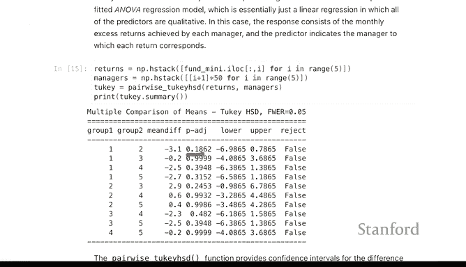

# 可视化结果：置信区间图
fig = tukey.plot_simultaneous()
plt.title('图基HSD检验：经理间成对比较的置信区间')
plt.show()
```
图基HSD法会输出一个包含所有成对比较调整后P值的表格。其生成的图形可以直观展示：如果两位经理的置信区间不重叠，则他们之间的差异在统计上是显著的。这种方法比单独进行10次邦弗朗尼校正更有效力。

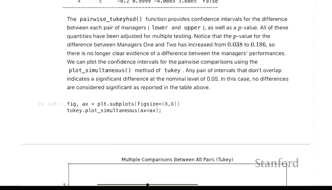

---

## 总结 📝

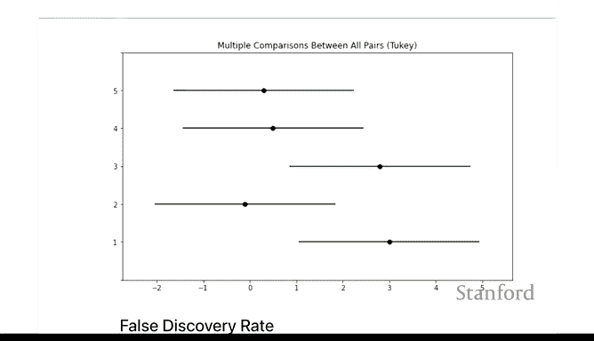

本节课中我们一起学习了多重检验的基础概念和实践方法：
1.  **问题引入**：当同时进行多次统计检验时，犯假阳性错误的机会大大增加。
2.  **核心指标**：我们介绍了**族错误率**（至少犯一次假阳性错误的概率）和**错误发现比例**（所有拒绝中假阳性的比例）。
3.  **控制FWER的方法**：我们实践了**邦弗朗尼校正**和**霍尔姆校正**，它们通过调整P值的阈值来严格控制FWER。
4.  **实例分析**：使用模拟数据和基金数据，演示了如何从单次检验扩展到多重检验，并应用校正方法。
5.  **成对比较**：我们探讨了在比较多组均值时面临的多重性问题，并介绍了**图基HSD法**进行事后检验。


理解并正确应用多重检验校正，是确保数据分析结论可靠性的关键步骤。