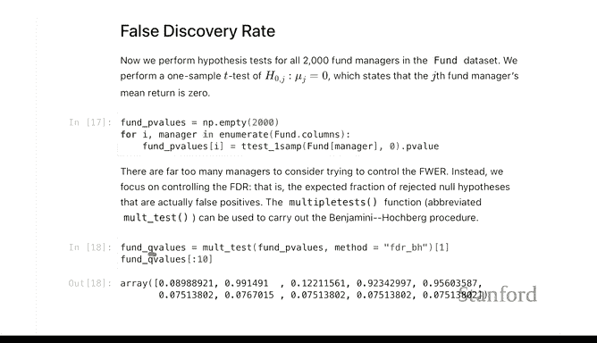
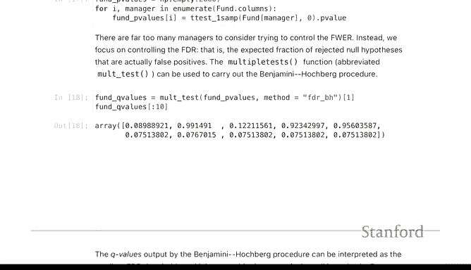
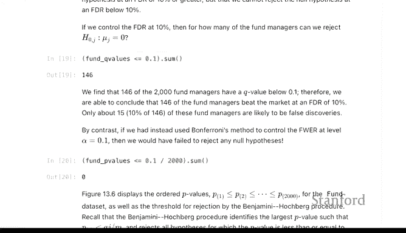
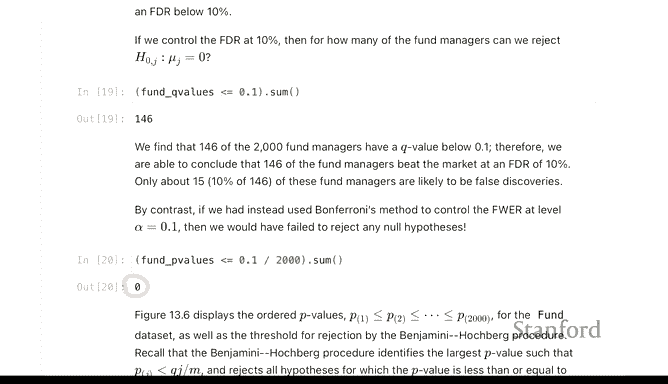
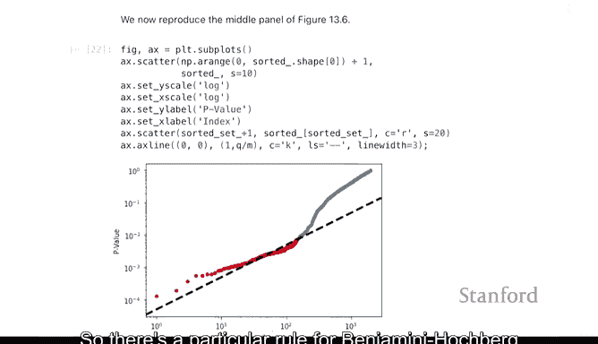
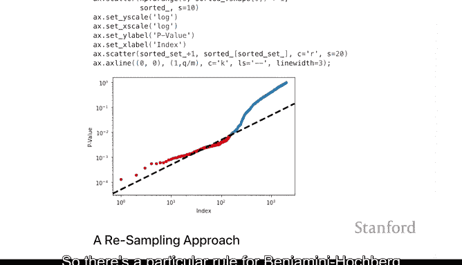
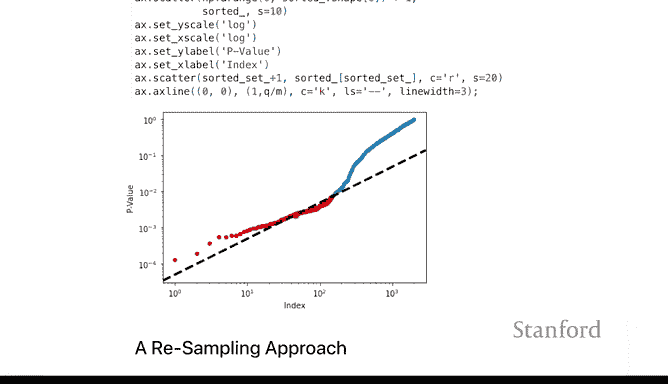
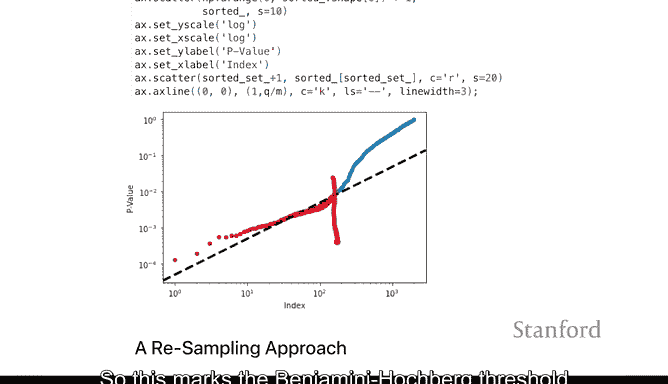
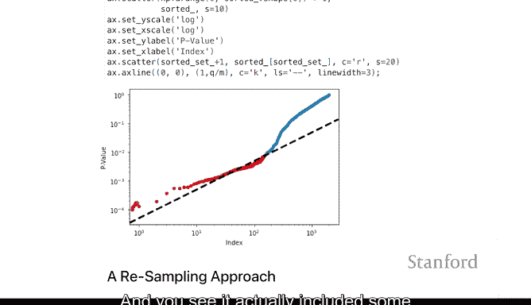
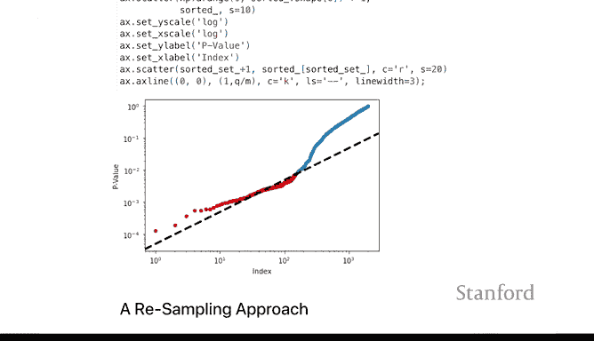

# Python 版 107：错误发现率（FDR）I 📊

在本节课中，我们将要学习多重假设检验中的另一个重要概念——错误发现率。我们将了解它与之前学过的族错误率有何不同，并通过基金经理的实例，学习如何使用Python实现控制错误发现率的Benjamini-Hochberg方法。

## 概述

上一节我们介绍了族错误率，它是一种较为严格的多重检验控制方法。本节中我们来看看**错误发现率**，这是一种在生物信息学、金融分析等领域更常用、更灵活的错误控制标准。

## 什么是错误发现率？

错误发现率与族错误率类似，是统计学家设计出的一种可被控制在合理水平的指标。

两者的主要区别在于，错误发现率不像族错误率那么严格。族错误率试图控制的是**犯任何错误**的概率，而错误发现率粗略地说，试图控制的是**在被拒绝的假设中，错误所占的比例**。

例如，如果我们拒绝了100个假设，并将错误发现率控制在20%左右，那么我们可以预期，在这100个被拒绝的假设中，大约有20个实际上是真实的零假设（即我们并未做出真正的发现）。但另一方面，我们可能做出了100个中的80个真实发现。

在许多情况下，这种方法更有用。设想一位生物学家正在寻找导致某种癌症的基因。如果你基于检验宣布有25个基因是相关的，并且错误发现率是5%，那么你对这25个已发现的基因中可能有多少是错误发现就有了一个大致的概念，而其中大部分将是好的发现。在进行多重检验时，这是一种更有意义的错误率控制方式。

当然，两种方法各有适用场景。例如在临床试验中，为了避免任何严重的不良反应，使用更严格的族错误率可能更合适。但错误发现率在许多情境下确实非常流行且有意义。

## 应用于基金经理分析

我们将把错误发现率应用到之前提到的2000名基金经理的例子中，而不是基因数据。

以下是实现的核心步骤，我们将使用与计算校正p值相同的函数，但参数从控制族错误率的`holm`或`bonferroni`改为`fdr_bh`。

```python
# 使用Benjamini-Hochberg方法计算校正后的p值（即q值）
from statsmodels.stats.multitest import multipletests
q_values = multipletests(p_values, alpha=0.05, method='fdr_bh')[1]
```

这里，`FDR`代表错误发现率，`BH`代表**Benjamini-Hochberg**，即用于控制错误发现率的程序。这些校正后的值通常被称为**q值**，而不再是p值。

当我们查看前10个q值时，会发现一个有趣的现象：之前那个表现非常强劲的经理的q值不再低于5%。但这并不一定意味着5%是FDR的正确阈值。对于FDR，人们通常选择像20%这样的阈值，而不是5%。



## 与Bonferroni方法对比



让我们比较一下这两种方法。假设我们将错误发现率控制在10%。



以下是查看有多少经理在10%的FDR水平下似乎跑赢了市场：

```python
# 找出在10% FDR水平下显著的经理
significant_fdr = q_values <= 0.10
num_significant_fdr = sum(significant_fdr)  # 例如：146
```

根据10%的阈值，似乎有146名经理跑赢了市场。我们可以预期，在这大约150人中，粗略估计有15人左右可能是无法真正跑赢市场的，或者只是随机猜测的结果。

现在，让我们将其与Bonferroni方法对比。Bonferroni程序的简单实现是取原始p值，乘以检验次数（或等价地将显著性水平α除以检验次数m），然后进行比较。

```python
# Bonferroni校正
alpha = 0.10
m = len(p_values)  # 检验次数，例如2000
bonferroni_threshold = alpha / m
significant_bonferroni = p_values <= bonferroni_threshold
num_significant_bonferroni = sum(significant_bonferroni)  # 例如：0
```



使用Bonferroni方法，在同样10%的族错误率水平下，似乎没有人能跑赢市场。如果这些是基因数据，并且确实存在一些重要基因，那么与控制族错误率相比，控制错误发现率能让我们为未来的研究做出更多潜在的发现。



## Benjamini-Hochberg程序图示



Benjamini-Hochberg程序有一个非常流行的图示方法，下面我们来解读一下。

该程序遵循一个特定规则：它将第J小的p值（记为 **P_(J)** ）与一个阈值进行比较。这个阈值是 **α * (J / M)**，其中α是目标错误发现率（如10%），M是总检验次数。

程序会判断p值 **P_(J)** 是否小于该阈值。图示中的虚线就代表了这个阈值线 **α * (J / M)**。

该程序的执行方式是：找到满足 **P_(J) ≤ α * (J / M)** 的**最大J值**，即最宽松的阈值点。在图中，这个点就是曲线最后一次位于虚线下方的时候。这个点标志着Benjamini-Hochberg的阈值，程序会拒绝所有序号小于等于此J值的假设（即图中左侧的所有点）。

可以看到，它实际上包含了一些最初看起来并未低于虚线的p值。如果我们第一次遇到p值不低于阈值时就停止，那么我们会在更早的位置停止，那样可能一个发现也没有。这个图示直观地描述了Benjamini-Hochberg程序的工作原理。







## 总结




本节课中我们一起学习了错误发现率。我们了解到FDR控制的是**所有被拒绝的假设中错误发现所占的比例**，这比控制族错误率更为宽松和实用。我们通过基金经理的案例，实践了如何使用`statsmodels`库中的`multipletests`函数并设置`method='fdr_bh'`来计算q值，从而控制FDR。最后，我们对比了FDR与Bonferroni方法的结果，并通过图示理解了Benjamini-Hochberg方法的决策过程。在需要进行大量多重检验且允许一定比例假阳性的探索性研究中，FDR是一个非常有价值的工具。