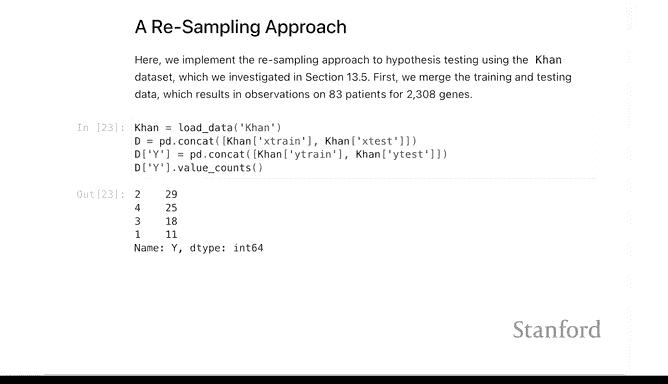
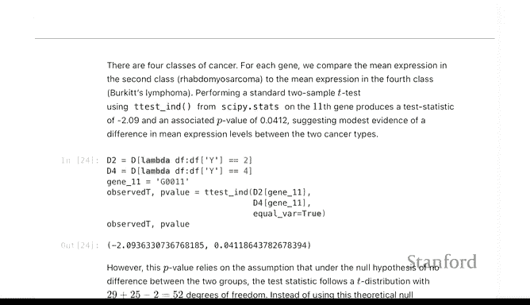
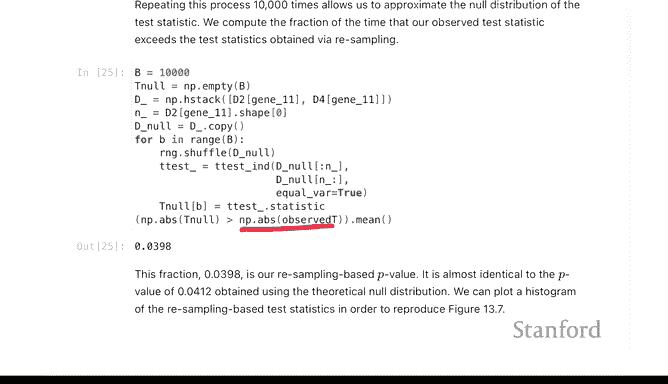
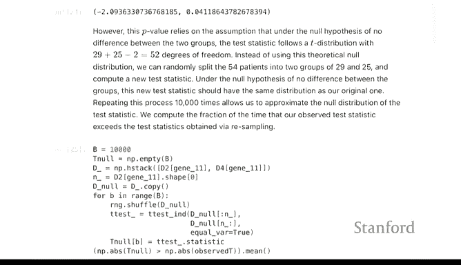
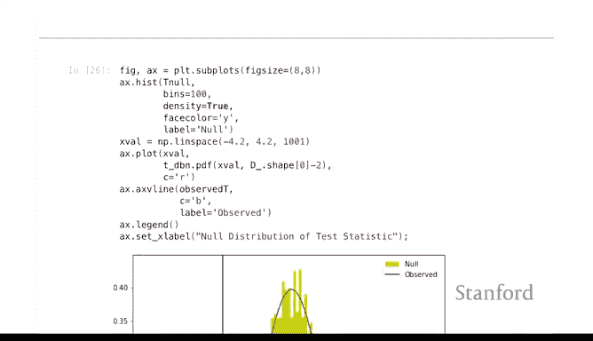
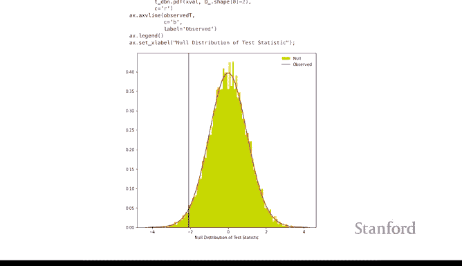
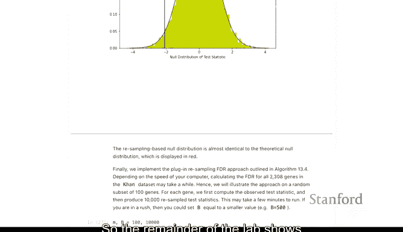
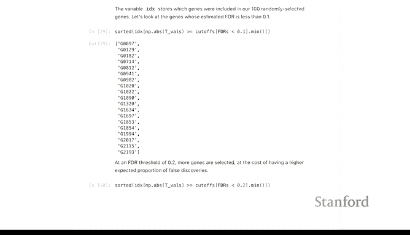
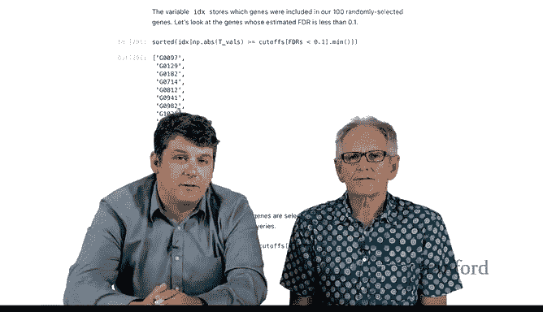

# Python 版 108：多重检验与重采样 I 🔬

在本节课中，我们将学习一种非参数检验方法——置换检验。我们将了解其基本原理，并通过一个基因表达数据的实例，演示如何通过重采样构建零分布来计算P值，以替代传统的t检验。

---

## 概述

上一节我们介绍了使用`scipy.stats`包中的函数（如`ttest_ind`）进行假设检验。这些检验基于特定的统计理论（如t分布），并依赖于数据满足某些假设（如正态性、方差齐性）。当这些假设可能不成立时，置换检验提供了一种不依赖特定分布假设的替代方案。

本节中，我们将通过一个具体的例子来学习置换检验。我们将使用之前无监督学习章节中见过的`NCI60`基因表达数据，比较不同癌症类别之间单个基因的表达差异。

---

## 置换检验原理

置换检验的核心思想是：**在原假设为真的前提下，数据的标签（分组）是可以任意交换的**。

具体步骤如下：
1.  假设原假设（H₀）成立，即两组数据来自相同的分布。
2.  将两组数据合并，然后随机地重新分配（置换）到两个组中，保持各组的样本量不变。
3.  基于这个重排后的“新数据”，计算我们关心的检验统计量（例如t统计量）。
4.  重复步骤2和3很多次（例如10,000次），得到在原假设下检验统计量的一个经验分布，即“置换分布”。
5.  将实际观测到的检验统计量与这个置换分布进行比较。计算观测值在置换分布中出现的极端程度，以此作为P值。





**公式化描述**：
- 原假设 H₀: 组A与组B的分布相同。
- 检验统计量 T（例如，两组均值之差或t值）。
- 通过置换标签B次，得到在原假设下的统计量分布：`T₁*, T₂*, ..., T_B*`。
- P值 ≈ `(#{ |T_i*| >= |T_obs| } + 1) / (B + 1)`。

---

## 实战演练：比较基因表达

我们将使用`NCI60`数据集，其中包含约2000个基因在83名患有四种不同类别儿童癌症的患者中的表达数据。

以下是操作步骤：

首先，我们使用传统的独立样本t检验来比较第2类与第4类癌症患者在`Gene 11`上的表达差异。我们假设方差齐性。

```python
# 示例代码：传统t检验
from scipy import stats
# 假设 data_2 和 data_4 分别代表第2类和第4类患者在 Gene 11 上的表达数据
t_stat, p_val_t = stats.ttest_ind(data_2, data_4, equal_var=True)
print(f"传统t检验的P值: {p_val_t:.4f}")
```

接下来，我们实施置换检验来获得一个不依赖于t分布假设的P值。

以下是置换检验的关键步骤代码：

```python
import numpy as np

def permutation_test(data_a, data_b, n_permutations=10000):
    """
    执行置换检验
    """
    # 合并数据
    combined_data = np.concatenate([data_a, data_b])
    # 观测到的统计量（这里使用t统计量，也可用均值差）
    t_obs, _ = stats.ttest_ind(data_a, data_b, equal_var=True)
    
    # 初始化存储置换统计量的数组
    t_perm = np.zeros(n_permutations)
    
    # 开始置换
    n_a = len(data_a)
    for i in range(n_permutations):
        # 随机打乱合并后的数据索引（相当于随机分配标签）
        permuted_data = np.random.permutation(combined_data)
        # 将打乱后的数据分成两组，保持原样本量
        perm_a = permuted_data[:n_a]
        perm_b = permuted_data[n_a:]
        # 计算本次置换的统计量
        t_perm[i], _ = stats.ttest_ind(perm_a, perm_b, equal_var=True)
    
    # 计算置换P值：观测值比置换分布更极端的比例
    # 使用绝对值进行双侧检验
    p_val_perm = (np.sum(np.abs(t_perm) >= np.abs(t_obs)) + 1) / (n_permutations + 1)
    
    return t_obs, p_val_perm, t_perm

# 执行置换检验
t_observed, p_value_perm, t_distribution = permutation_test(data_2, data_4)
print(f"观测到的t统计量: {t_observed:.4f}")
print(f"置换检验的P值: {p_value_perm:.4f}")
```

运行后，你会发现置换检验得到的P值与传统的t检验P值非常接近。这表明对于这个特定的基因，数据可能较好地满足了t检验的假设。



---



## 结果可视化



我们可以绘制置换得到的t统计量分布（直方图），并与理论t分布曲线进行比较。

```python
import matplotlib.pyplot as plt
from scipy.stats import t

# 绘制置换分布直方图
plt.hist(t_distribution, bins=50, density=True, alpha=0.7, edgecolor='black', label='Permutation Distribution')
# 绘制理论t分布曲线
df = len(data_2) + len(data_4) - 2  # 计算自由度
x = np.linspace(min(t_distribution), max(t_distribution), 1000)
plt.plot(x, t.pdf(x, df), 'r-', lw=2, label='Theoretical t-distribution')
# 标记观测到的t值
plt.axvline(x=t_observed, color='k', linestyle='--', label=f'Observed t ({t_observed:.2f})')
plt.xlabel('t-statistic')
plt.ylabel('Density')
plt.title('Permutation Distribution vs. Theoretical t-Distribution')
plt.legend()
plt.show()
```

从图中可以看到，对于这个基因，置换分布与理论t分布形状非常相似，这解释了为何两种方法的P值结果一致。

---

## 扩展到多重检验场景




以上我们只针对一个基因进行了检验。在实际的基因组学研究中，我们需要对成千上万个基因同时进行检验，这就引出了**多重检验问题**。


置换检验在这里的角色是：**为每个基因生成一个更稳健的P值**。一旦我们通过置换检验为每个基因计算了P值，我们就可以像处理普通P值一样，应用各种多重检验校正方法，例如：
- **Bonferroni校正**：控制族错误率。
- **Holm校正**：逐步法控制族错误率。
- **Benjamini-Hochberg (BH) 程序**：控制错误发现率。



后续的实验室内容将展示如何将这些通过置换检验得到的P值输入到FDR分析或BH程序中。核心流程是：
1.  对每个基因执行置换检验，得到一组P值。
2.  将这组P值作为输入，应用Benjamini-Hochberg等程序。
3.  在给定的FDR阈值下，得到一系列被显著选出的基因列表。

这与之前使用t检验P值进行FDR分析的主要区别仅在于**P值的来源不同**（非参数置换检验 vs. 参数t检验）。

---



## 总结


本节课我们一起学习了置换检验这一非参数统计方法。
- 我们了解了其核心思想：在原假设下通过重排数据标签来构建统计量的经验分布。
- 我们通过`NCI60`数据集中单个基因的例子，一步步实现了置换检验，并将其结果与传统t检验进行了对比和可视化。
- 最后，我们讨论了如何将置换检验应用于多重检验框架中，即先为每个特征（基因）计算稳健的P值，再使用标准的多重比较校正程序来控制整体错误率。




置换检验的优势在于它对数据分布的假设要求更宽松，当传统参数检验的假设可能被违反时，它能提供一个可靠的替代方案。课程的剩余部分将留给你离线完成，即利用置换检验得到的P值进行完整的错误发现率分析。