# Python 版 11：Python 图形绘制基础教程 📊 

在本节课中，我们将学习如何使用 Python 进行数据可视化。除了进行数组计算，我们经常需要绘制结果，这引出了图形绘制的主题。Python 的主要绘图库是 Matplotlib。我们将讨论 Matplotlib 的基本模型，以及如何在 Python 中创建图形。

## 导入库与创建图形

首先，我们需要导入 Matplotlib 库。我们将反复使用 `subplots` 函数，它可以创建一个指定大小的图形。稍后我们会看到如何创建图形网格，但基本格式是：它返回一个图形对象和一个坐标轴对象。坐标轴对象是我们实际调用绘图方法的地方。

以下是创建图形和坐标轴的基本步骤：

```python
import matplotlib.pyplot as plt

fig, ax = plt.subplots()
```

## 生成数据并绘制图形

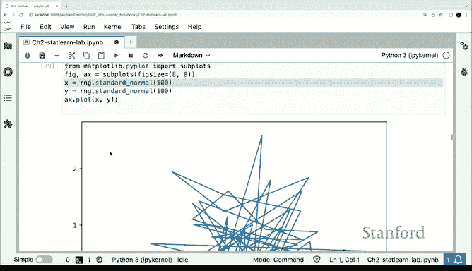

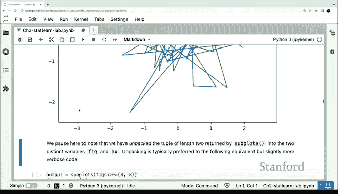

接下来，我们生成一些随机数据并绘制图形。例如，我们创建两个随机正态分布的数组 X 和 Y：

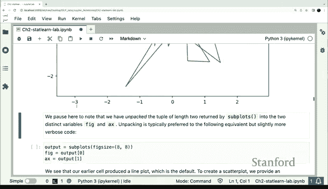

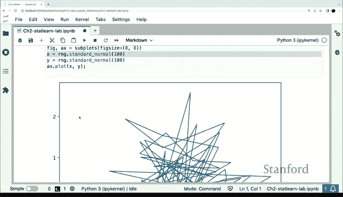

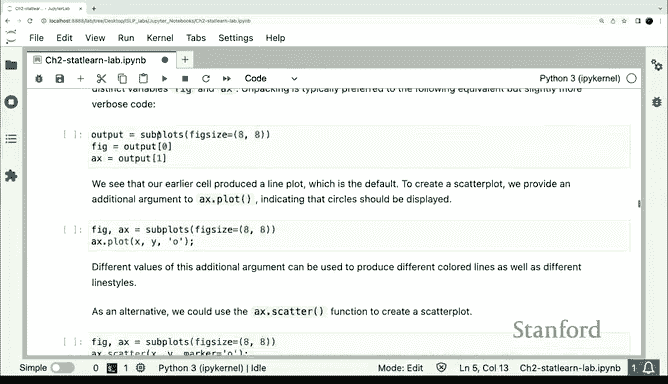

```python
import numpy as np

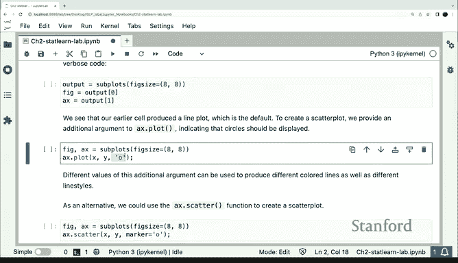

X = np.random.randn(100)
Y = np.random.randn(100)
ax.plot(X, Y)
```

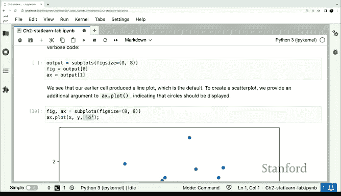

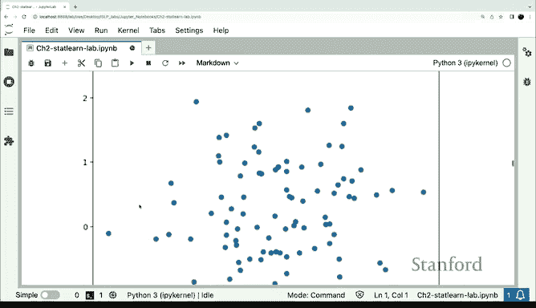

当我们绘制这些数据时，可能会得到一个看起来奇怪的图形，因为默认情况下 `plot` 方法会连接所有点形成线图。在这个例子中，我们可能更想要散点图。

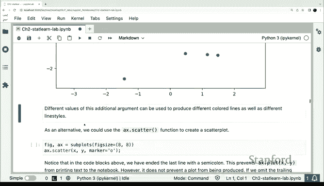

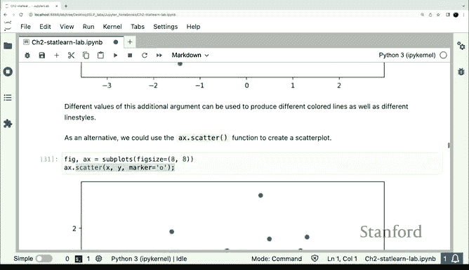

## 创建散点图

为了创建散点图，我们可以修改 `plot` 方法的参数。通过添加参数 `'o'`，我们告诉 `plot` 方法绘制散点图而不是线图：

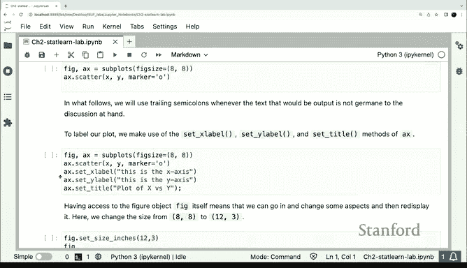

```python
ax.plot(X, Y, 'o')
```

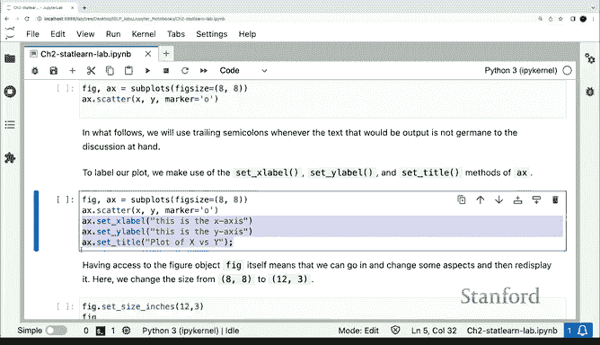

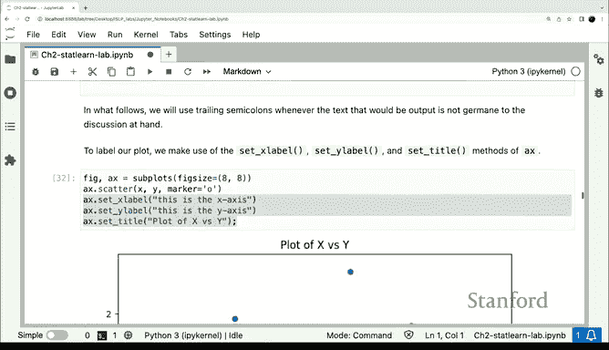

此外，Matplotlib 还提供了专门的 `scatter` 方法用于绘制散点图：

```python
ax.scatter(X, Y)
```

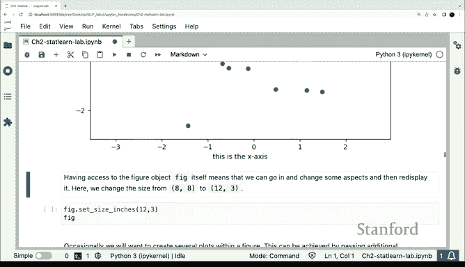

## 添加标签和注释

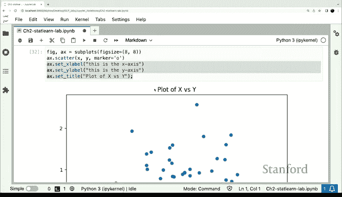

为了使图形更加清晰，我们经常需要添加标签和注释。Matplotlib 提供了相应的方法来设置坐标轴标签和标题：

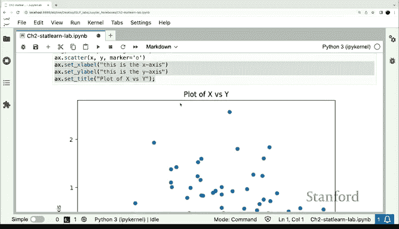

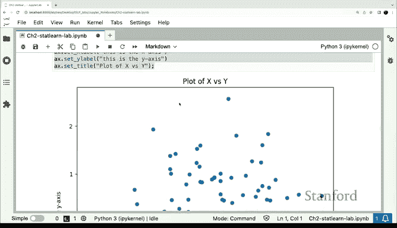

```python
ax.set_xlabel('X轴标签')
ax.set_ylabel('Y轴标签')
ax.set_title('图形标题')
```

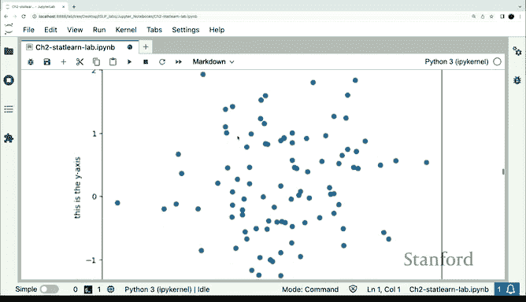

Matplotlib 的一个优势是坐标轴对象是一个 Python 对象，我们可以随时修改它，然后重新显示图形以查看更改。这意味着我们可以逐步构建图形，直到满意为止。

## 调整图形大小

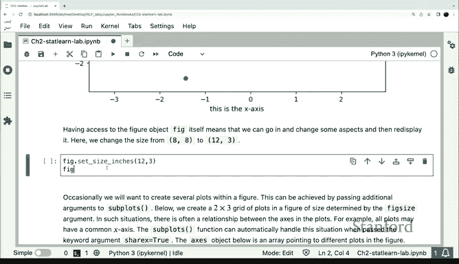

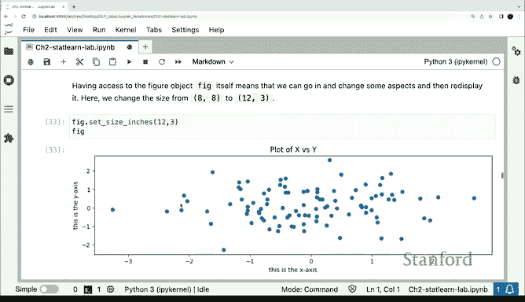

我们还可以调整图形的大小。例如，将图形大小从 8x8 更改为 12x3：

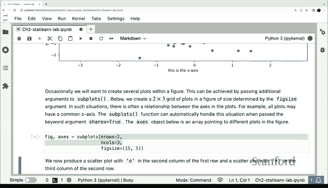

```python
fig.set_size_inches(12, 3)
```

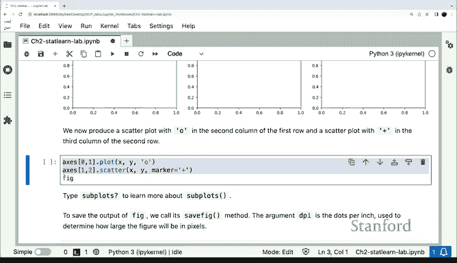

## 创建图形网格

有时，我们可能需要在一个图形中创建多个子图。`subplots` 函数支持 `rows` 和 `cols` 参数来创建图形网格：

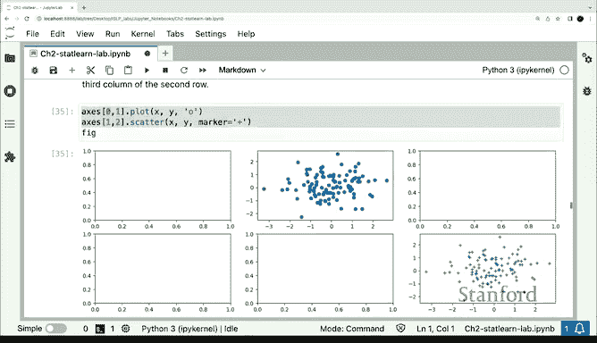

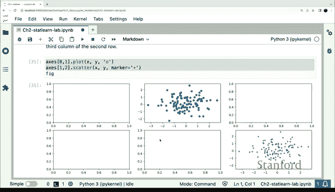

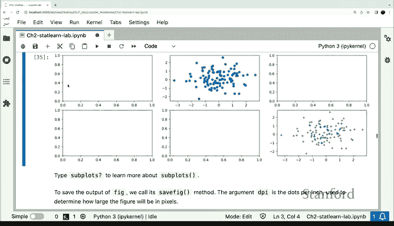

```python
fig, axes = plt.subplots(rows=2, cols=2)
```

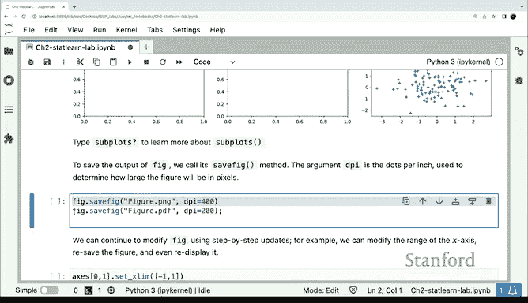

然后，我们可以在每个子图中绘制不同的图形：

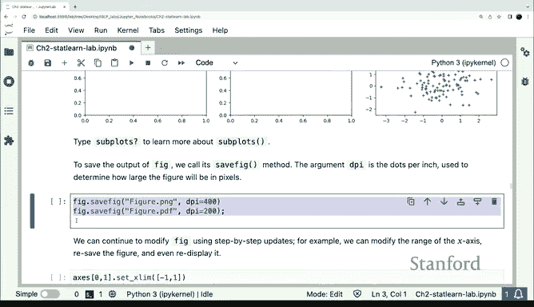

```python
axes[0, 0].plot(X, Y, 'o')
axes[0, 1].scatter(X, Y)
```

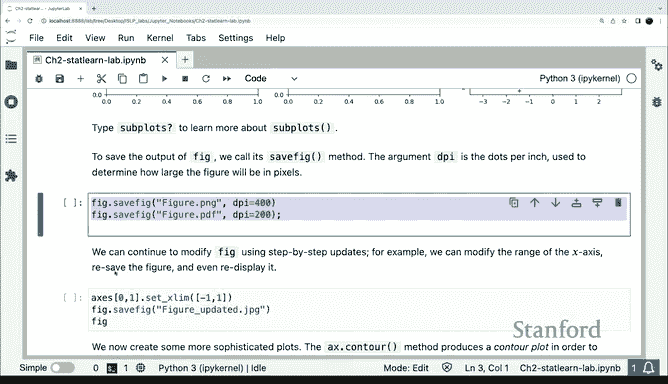

完成所有绘制后，我们可以通过调用 `fig` 重新显示整个图形。

## 保存图形

对于作业、论文或其他用途，我们通常需要将图形保存为文件。Matplotlib 提供了 `savefig` 方法：

```python
fig.savefig('my_plot.png')
```

## 等高线图和热图

除了基本的散点图和线图，Matplotlib 还支持更复杂的图形，如等高线图和热图。例如，如果我们有一个网格的 X 值和 Y 值，并评估一个关于 X 和 Y 的函数，我们可以创建等高线图：

```python
Z = np.outer(X, Y)  # 使用 outer 方法计算外积
ax.contour(X, Y, Z)
```

我们还可以调整等高线的数量：

```python
ax.contour(X, Y, Z, levels=20)
```

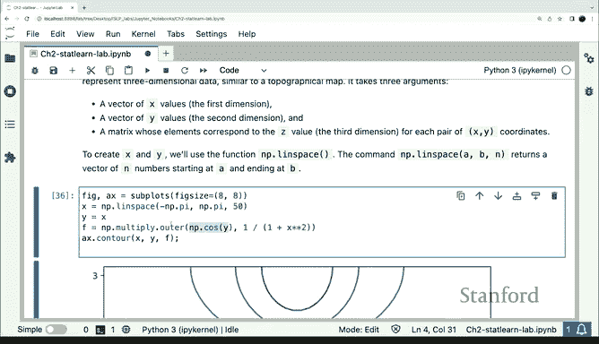

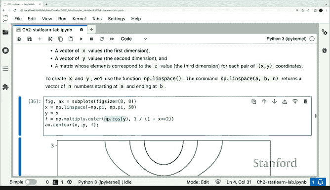

如果我们想要热图，可以使用 `imshow` 方法：

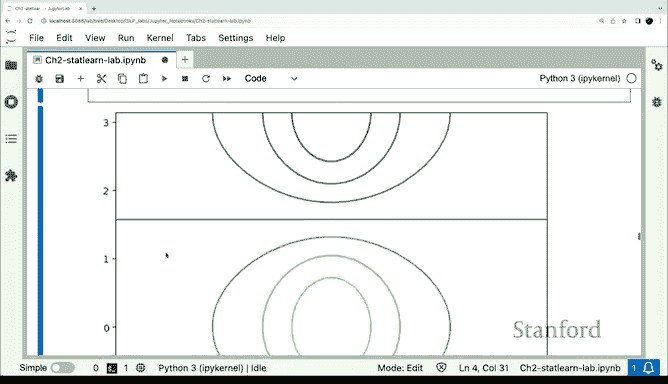

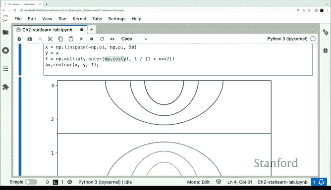

```python
ax.imshow(Z)
```

## 总结

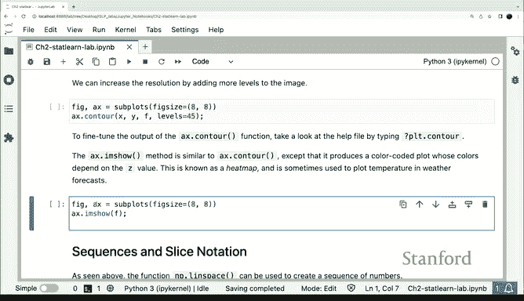


在本节课中，我们一起学习了如何使用 Matplotlib 进行基本的数据可视化。我们介绍了如何创建图形和坐标轴，生成数据并绘制散点图和线图，添加标签和注释，调整图形大小，创建图形网格，以及保存图形。此外，我们还简要介绍了等高线图和热图的绘制方法。通过掌握这些基本技能，你将能够在统计学习和数据分析中有效地展示结果。