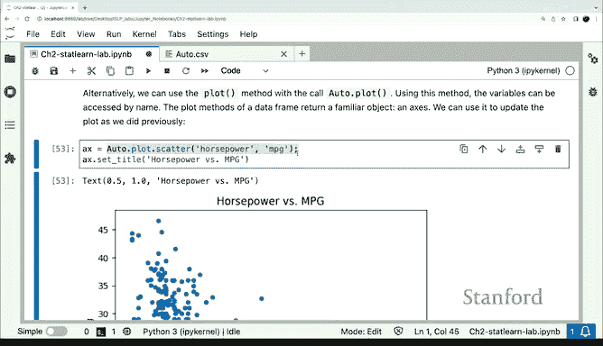

# Python 版 12：数据索引与数据框基础 📊

在本节课中，我们将学习Python中处理数据的两个核心概念：数组索引和数据框。我们将了解如何从数组中提取数据，并重点介绍用于处理表格数据的`pandas`数据框对象。

---

## 概述

上一节我们介绍了如何创建和绘制数组。本节中，我们来看看如何从数据结构中提取特定数据，并学习`pandas`库中的数据框，这是一种可以存储不同类型数据的表格结构。

---

## 数组索引与切片

在Python中，序列（如列表、数组）可以使用索引和切片来访问其中的元素。这对于提取数据的子集非常重要。

以下是索引和切片的基本操作示例：

```python
# 假设有一个数组 arr
arr = [10, 20, 30, 40, 50]

# 索引：访问单个元素
first_element = arr[0]  # 结果为 10

# 切片：访问一个范围内的元素
subset = arr[1:4]  # 结果为 [20, 30, 40]
```

---

## 引入数据框

并非所有数据都是数值型的。我们需要一种像数组或矩阵，但能容纳不同数据类型（如数字和文本）的对象。在Python中，`pandas`库提供的**数据框**就是用于此目的的标准工具。

数据框与数组的关键区别在于：
*   **数组**：所有元素必须是**相同类型**。
*   **数据框**：不同列可以是**不同类型**（例如，一列是浮点数，另一列是字符串）。

---

## 读取数据文件

一个常见的数据格式是CSV文件。我们可以使用`pandas`轻松读取这类文件。

假设我们有一个名为`auto.csv`的文件，其第一行是列名，后续行是数据。以下代码演示了如何读取它：

```python
import pandas as pd

# 读取CSV文件
auto = pd.read_csv(‘auto.csv’)

# 查看数据框的前几行
print(auto.head())
```

---

## 处理缺失值

真实数据中经常存在缺失值。在示例数据中，缺失值用问号`?`表示。如果直接读取，`pandas`会将整列视为字符串。我们需要指定缺失值的标识符。

以下是正确处理缺失值的方法：

```python
# 指定缺失值标识符并重新读取
auto = pd.read_csv(‘auto.csv’, na_values=[‘?’])

# 现在数值列（如‘horsepower’）会被正确识别为浮点数
print(auto[‘horsepower’].sum())  # 求和时会自动跳过缺失值
```

若要删除包含缺失值的所有行，可以使用`dropna`方法：

```python
auto_clean = auto.dropna()
print(f“原始行数: {len(auto)}, 清理后行数: {len(auto_clean)}“)
```

---

## 数据框的索引与选择

数据框的强大功能在于能够灵活地选择行和列。

以下是几种常见的选择操作：

1.  **选择列**：通过列名访问。
    ```python
    horsepower_column = auto[‘horsepower’]
    ```

2.  **选择行**：使用切片或布尔条件。
    ```python
    # 选择前3行
    first_three_rows = auto[:3]

    # 选择年份在1980年之后的车辆
    cars_after_1980 = auto[auto[‘year’] > 1980]
    ```

3.  **同时选择行和列**：使用列名列表进行选择。
    ```python
    # 选择‘horsepower’和‘mpg’两列
    two_columns = auto[[‘horsepower’, ‘mpg’]]
    ```

---

## 从数据框绘图

数据框内置了绘图方法，可以简化可视化过程。与之前从两个独立数组绘图不同，我们可以直接调用数据框的方法。

例如，绘制马力和每加仑英里数的散点图：

```python
# 方法1：提取列后绘图（基础方法）
plt.scatter(auto[‘horsepower’], auto[‘mpg’])

# 方法2：使用数据框的.plot方法（更简洁）
ax = auto.plot.scatter(x=‘horsepower’, y=‘mpg’)
ax.set_title(“马力 vs. 每加仑英里数”)
ax.set_xlabel(“马力”)
ax.set_ylabel(“每加仑英里数”)
plt.show()
```

第二种方法直接利用数据框的结构，代码更加清晰易读。

---

## 总结

本节课中我们一起学习了：
1.  Python中数组的**索引和切片**操作。
2.  **数据框**的概念及其与数组的区别：数据框可以存储不同类型的数据。
3.  如何使用`pandas`**读取CSV文件**并**处理缺失值**。
4.  数据框的多种**索引和选择数据**的方法。
5.  如何利用数据框的内置方法进行**绘图**。




数据框是数据分析的基石，掌握其基本操作对于后续的统计学习至关重要。本实验课包含更多详细示例，建议在完成作业时仔细练习。