# Python 版 14：假设检验与置信区间 📊

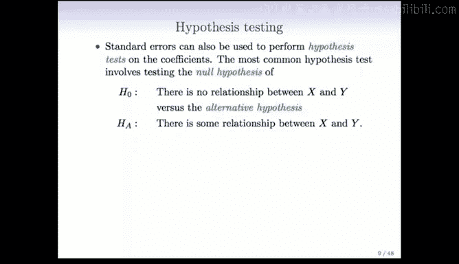

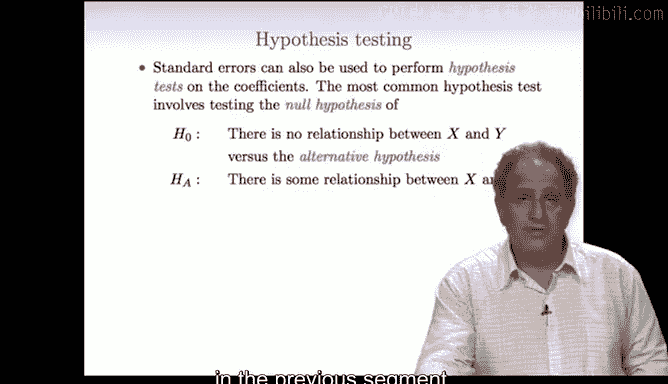

在本节课中，我们将学习如何评估线性回归模型中单个预测变量的重要性。我们将重点介绍两种核心的统计推断方法：**假设检验**和**置信区间**。这两种方法紧密相关，能帮助我们判断预测变量与响应变量之间是否存在显著关系，并量化这种关系的可能范围。

---

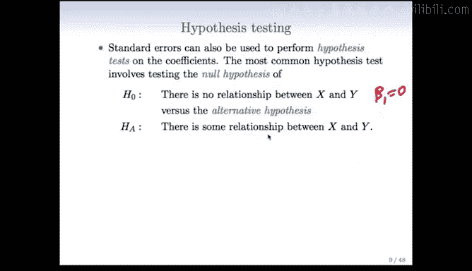

上一节我们讨论了置信区间，本节中我们来看看与之密切相关的**假设检验**。

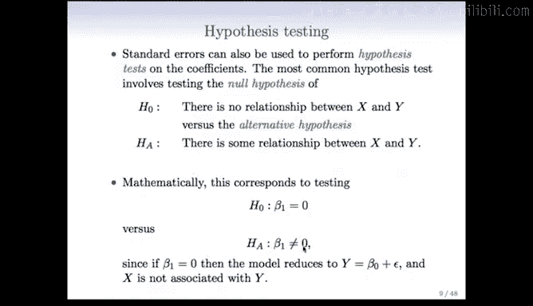

我们经常需要询问关于模型参数的特定值的问题，例如，某个系数是否为零？用于回答这类问题的统计学方法就是假设检验。

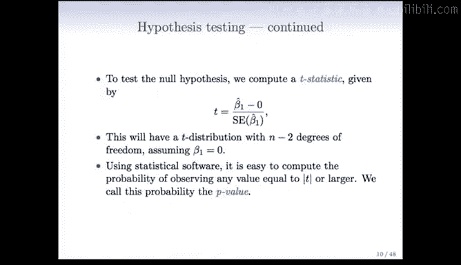

假设检验的核心是检验参数（例如斜率）的某个特定值。在简单线性回归中，我们最常检验的假设是：预测变量与响应变量之间**没有关系**。这被称为**零假设**。

*   **零假设**：预测变量 `X` 与响应变量 `Y` 之间没有关系。用公式表示为：**β₁ = 0**。
*   **备择假设**：预测变量 `X` 与响应变量 `Y` 之间存在某种关系。用公式表示为：**β₁ ≠ 0**。

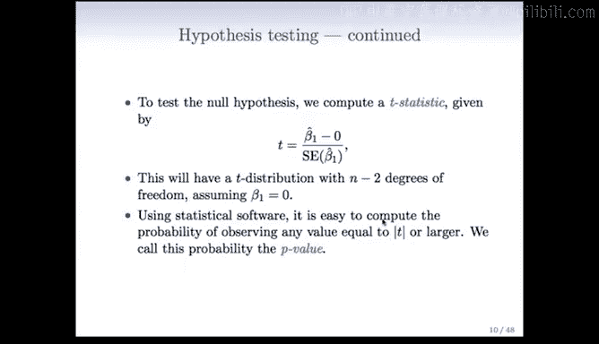

这通常是我们在分析预测变量时提出的第一个问题。

为了检验这个假设，我们计算一个称为 **T 统计量** 的值。

以下是计算和解释 T 统计量的步骤：
1.  **计算公式**：**T = (估计的斜率 β̂₁) / (斜率的标准误 SE(β̂₁))**。
2.  **分布**：在零假设成立的前提下，这个 T 统计量近似服从自由度为 `n-2` 的 **T 分布**。
3.  **P 值**：基于计算出的 T 统计量，我们可以得到 **P 值**。P 值表示在零假设成立的情况下，观察到当前数据（或更极端数据）的概率。P 值越小，反对零假设的证据就越强。

对于广告数据（仅使用电视广告预算作为预测变量），结果如下：

| 项 | 系数估计 | 标准误 | T 统计量 |
| :--- | :--- | :--- | :--- |
| 截距 (β₀) | 7.0325 | 0.4578 | 15.36 |
| 电视广告 (β₁) | 0.0475 | 0.0027 | 17.67 |

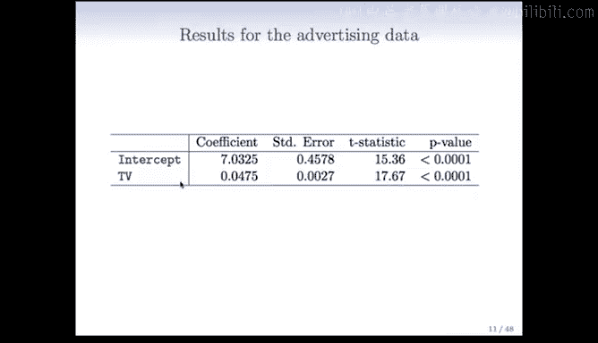

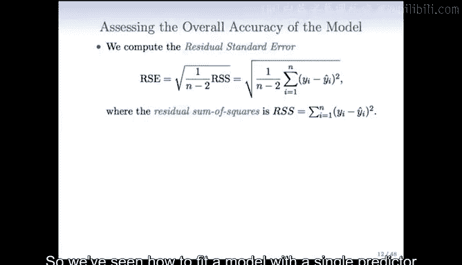

我们最关心的是电视广告的斜率。其 T 统计量高达 17.67。通常，T 统计量的绝对值大于 2 时，P 值就会小于 0.05（一个常用的显著性水平）。这里的 T 统计量远大于 2，因此 P 值非常小（远小于 0.0001）。

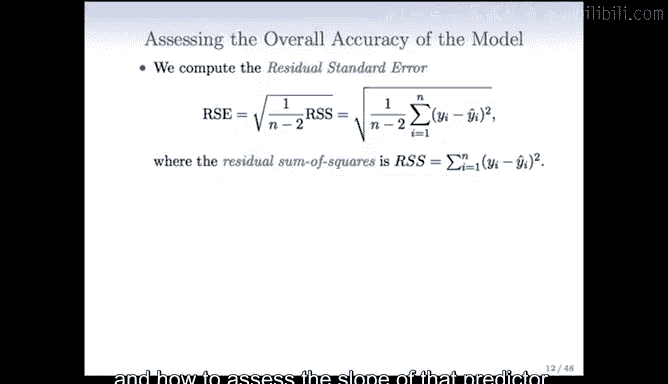

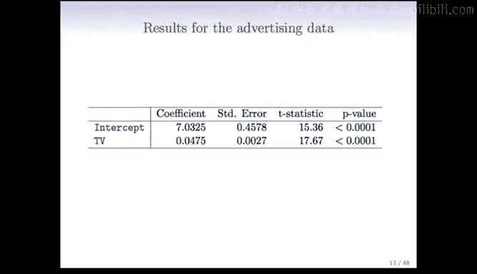

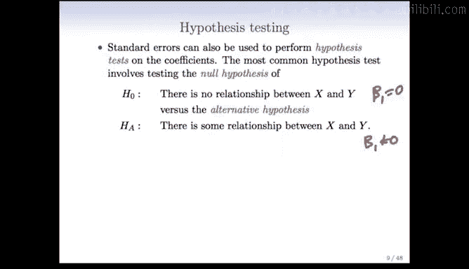

**如何解释**：这意味着，在“电视广告对销量没有影响”的零假设下，观察到当前数据的概率极低。因此，我们的结论是：**电视广告对销量有显著影响**。

---

我们已经了解了如何用单个预测变量拟合模型，以及如何评估该预测变量的斜率（通过置信区间和假设检验）。这里需要补充一个重要观点：

**假设检验与置信区间存在一一对应的关系**。它们本质上是等价的。

具体来说：
*   如果假设检验**拒绝**了零假设（例如，认为 β₁ ≠ 0），那么为该参数构建的置信区间**将不包含 0**。
*   反之，如果假设检验**未能拒绝**零假设（例如，无法断定 β₁ ≠ 0），那么相应的置信区间**将包含 0**。

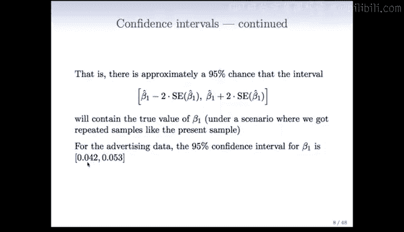

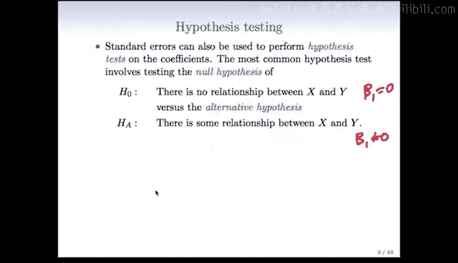

因此，置信区间本身也在进行假设检验。此外，它还能告诉我们效应大小的可能范围，这比单纯的“是或否”更有信息量。所以，**同时计算置信区间和进行假设检验总是有益的**。

以电视广告数据为例，其斜率的 95% 置信区间为 **[0.042, 0.053]**。这个区间不包含 0，这与假设检验的结果一致。同时，我们可以解读为：我们有 95% 的把握认为，电视广告预算每增加 1000 美元，销量平均会增加 42 到 53 个单位。

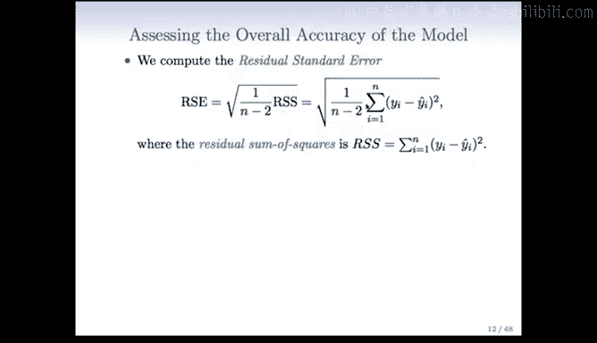

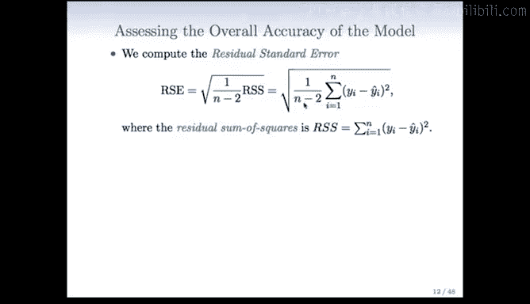

---

接下来，我们讨论如何评估模型的**整体拟合优度**或准确性。

除了检验单个预测变量，我们还需要衡量模型解释数据变异的程度。以下是两个关键指标：

1.  **残差标准误**：这是模型预测误差的平均大小。计算公式为：**RSE = √(RSS / (n-2))**，其中 **RSS** 是**残差平方和**，即我们最小化以获得参数估计的那个量。
2.  **R² 统计量**：它表示模型解释的响应变量方差的比例，也称为**可决系数**。

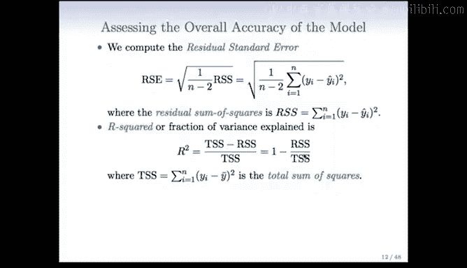

R² 的计算公式为：**R² = (TSS - RSS) / TSS = 1 - (RSS / TSS)**。
*   **TSS** 是**总平方和**，代表仅用响应变量均值作为预测时的总误差（即“无模型”误差）。
*   **RSS** 是拟合模型后的残差平方和。
*   **R²** 衡量的是相对于“无模型”基线，模型减少了多少比例的误差。其值在 0 到 1 之间，越接近 1 说明模型拟合越好。

一个重要的代数关系是：在简单线性回归中，**R² 等于预测变量 X 与响应变量 Y 之间相关系数的平方**。这很直观：相关性越高，模型能解释的方差就越多。

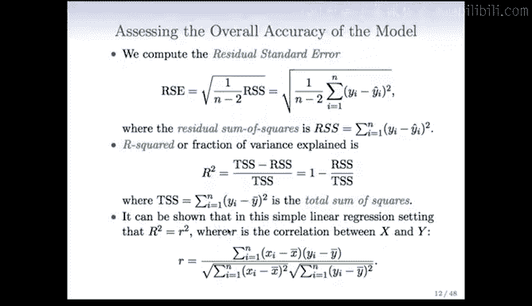

对于我们的广告数据，R² 值为 **0.61**。这意味着，仅使用电视广告预算这一项，就解释了销量中 **61%** 的方差。这是一个非常强的预测能力。不过，R² 的“好坏”取决于具体领域。在商业或金融应用中，0.6 的 R² 可能令人印象深刻；而在医学等领域，0.05 的 R² 可能就值得关注了。

---

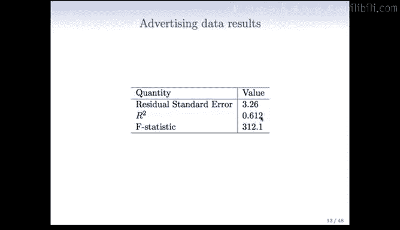

本节课中我们一起学习了：
1.  **假设检验**：通过计算 T 统计量和 P 值，检验单个预测变量（如斜率 β₁）是否显著不为零。
2.  **置信区间**：为参数估计提供一个可能的值范围，它与假设检验等价且能提供更多信息。
3.  **模型评估**：使用**残差标准误**和 **R² 统计量**来量化模型的整体拟合优度和解释力。

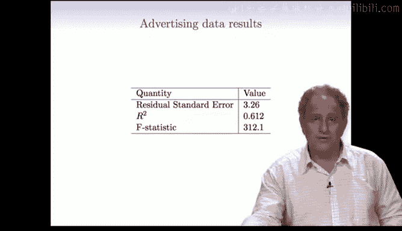

这些工具为我们评估简单线性回归模型提供了坚实的基础。在下一节中，我们将把问题扩展到更复杂的情形：当有**多个预测变量**时，如何进行**多元线性回归**分析。