# Python 版 15：多元线性回归 📈

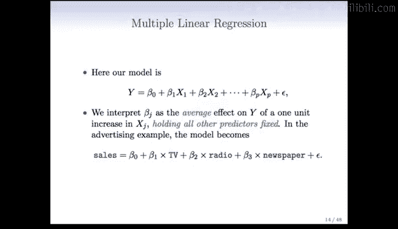

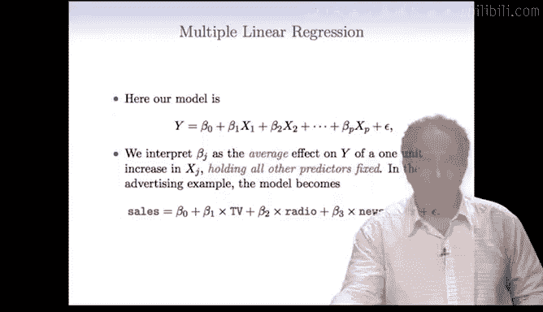

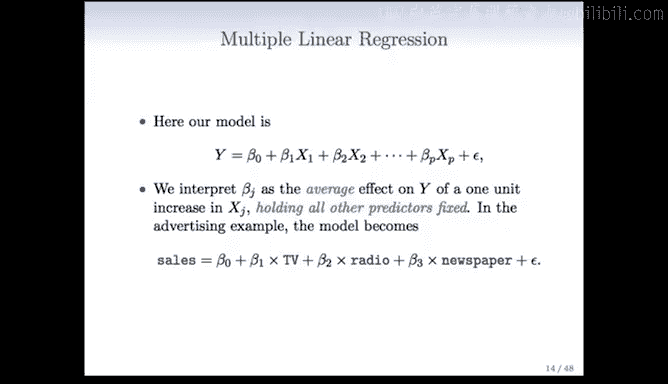

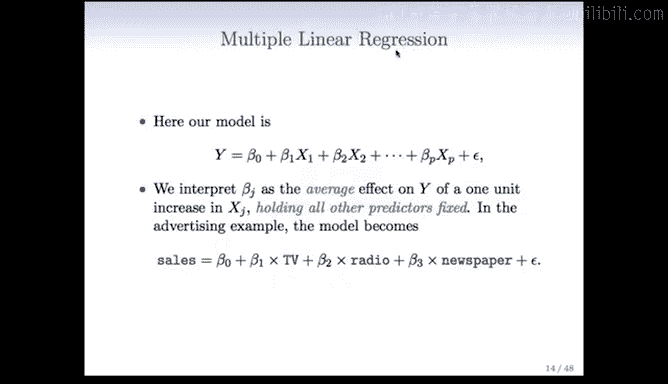

在本节课中，我们将要学习**多元线性回归**。这是对简单线性回归的扩展，允许我们使用多个预测变量来预测一个响应变量。我们将探讨其模型形式、系数的解释、最小二乘估计，并通过广告数据集的实际例子来理解其应用。

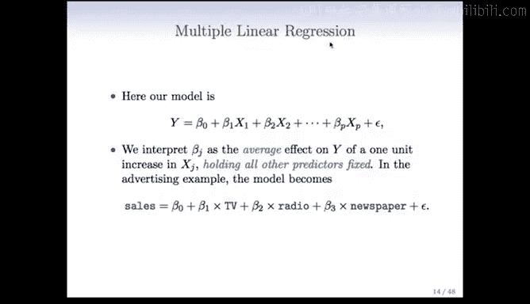

---

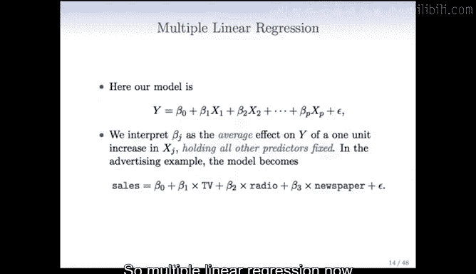

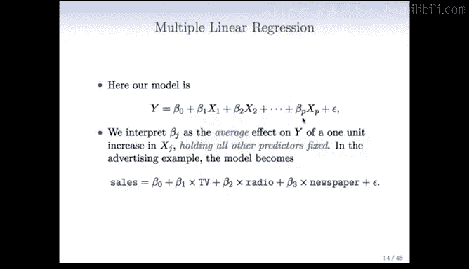

## 多元线性回归模型

上一节我们介绍了简单线性回归，它只使用一个预测变量。本节中我们来看看当预测变量多于一个时，模型如何扩展。

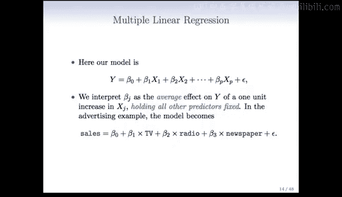

多元线性回归的模型公式如下：

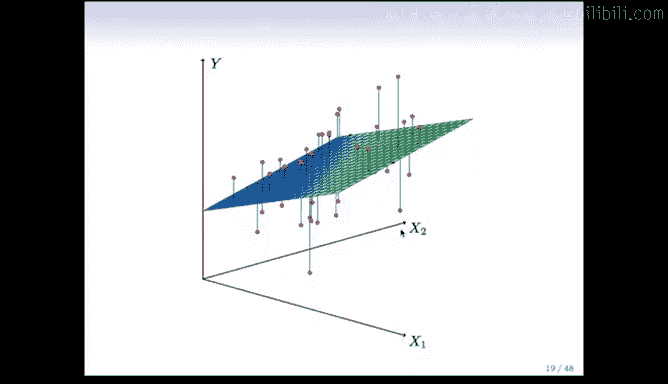

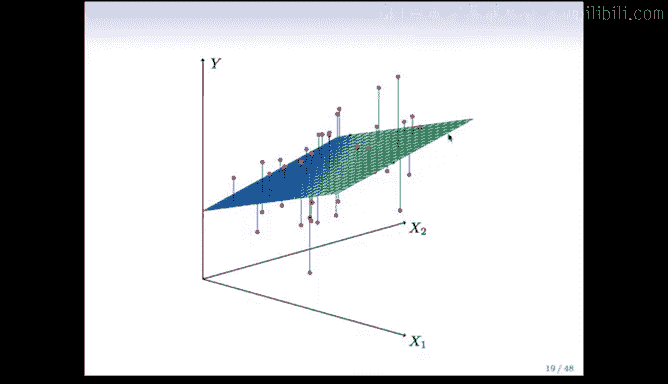

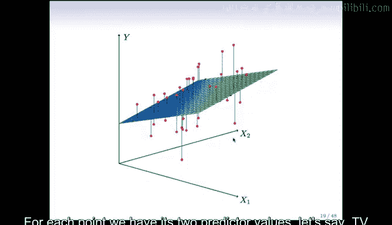

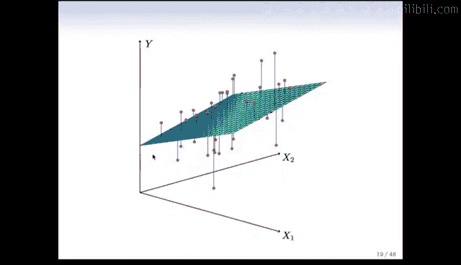

**Y = β₀ + β₁X₁ + β₂X₂ + ... + βₚXₚ + ε**

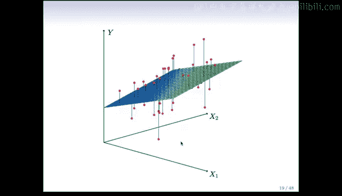

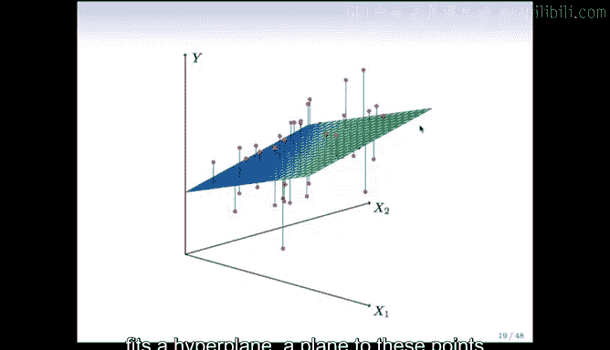

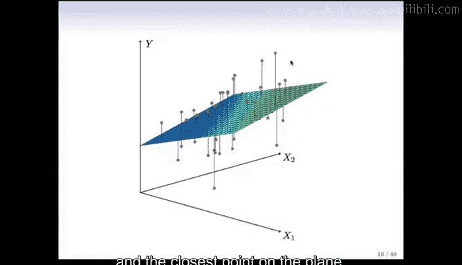

其中：
*   **Y** 是响应变量。
*   **X₁, X₂, ..., Xₚ** 是 **p** 个不同的预测变量。
*   **β₀** 是模型的**截距**。
*   **β₁, β₂, ..., βₚ** 是每个预测变量对应的**斜率系数**（即模型参数）。
*   **ε** 是**误差项**，代表模型无法解释的随机变异。

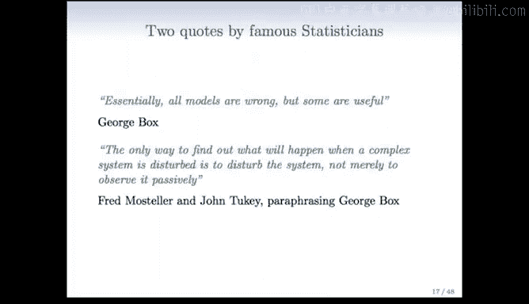

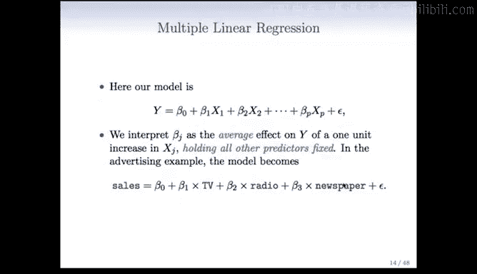

在广告数据的例子中，我们有三个预测变量：电视广告预算（TV）、广播广告预算（Radio）和报纸广告预算（Newspaper），我们试图用它们来预测销售额（Sales）。

---

## 从直线到超平面

在简单线性回归中，我们拟合的是一条直线。当预测变量变为两个时，我们拟合的是一个平面。对于两个以上的预测变量，我们拟合的是一个**超平面**。

以下是理解这一点的关键：
*   简单线性回归（一个预测变量）：拟合一条**直线**。
*   多元线性回归（两个预测变量）：拟合一个**平面**。
*   多元线性回归（三个及以上预测变量）：拟合一个**超平面**。

最小二乘法的目标与简单回归相同：找到一组系数（β₀, β₁, ..., βₚ），使得所有观测数据点（红点）到该超平面的垂直距离（残差）的平方和最小。

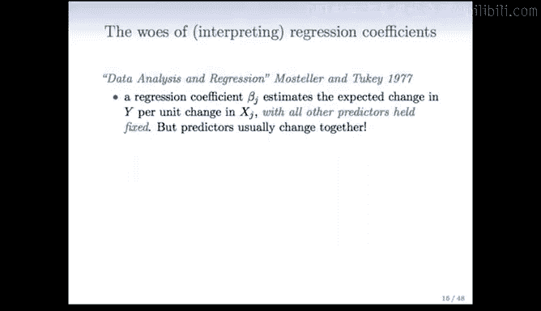

---

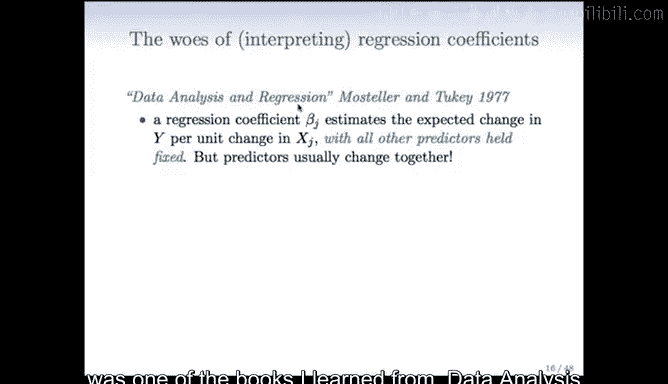

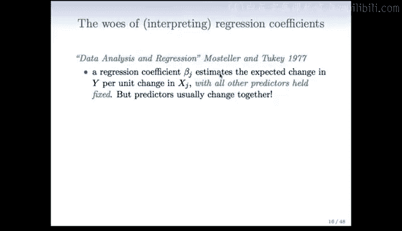

## 回归系数的解释挑战

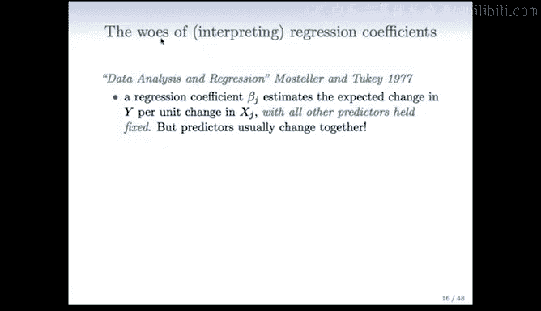

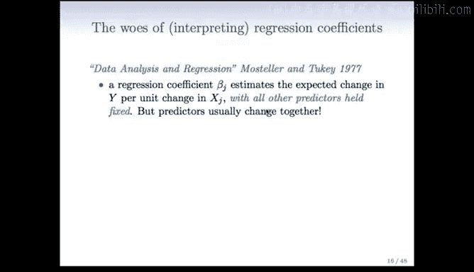

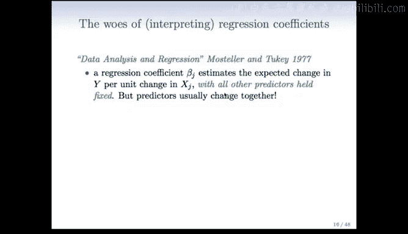

现在我们有多个系数需要解释，这带来了新的复杂性。在理想情况下，如果所有预测变量之间互不相关，我们可以单独解释每个系数。

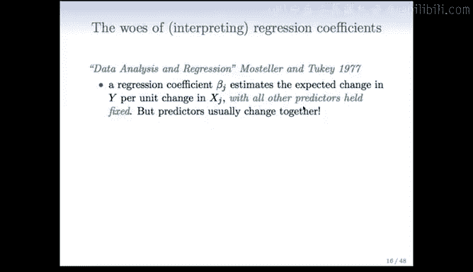

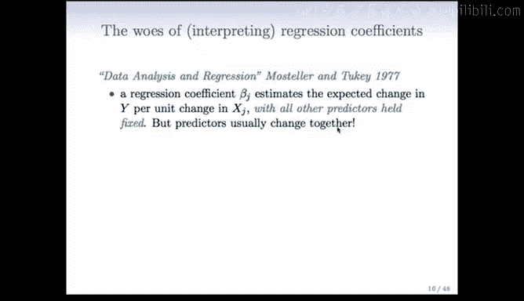

对于系数 βⱼ 的标准解释是：**在保持所有其他预测变量不变的情况下，Xⱼ 每增加一个单位，Y 平均变化 βⱼ 个单位**。

然而，在现实数据中，预测变量之间通常是相关的。例如，一家公司的不同广告渠道预算可能存在相关性。这种相关性会带来两个主要问题：

1.  **系数方差增大**：高度相关的预测变量会使各自系数的估计变得不稳定，方差增大。极端情况下，如果两个变量几乎完全相同，模型将无法区分它们各自的影响。
2.  **解释与因果推断困难**：“保持其他变量不变”的假设在现实中往往不成立。改变一个变量（如增加电视广告预算）时，其他变量（如广播或报纸预算）很可能也会随之变化。

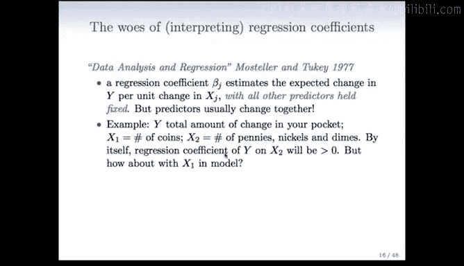

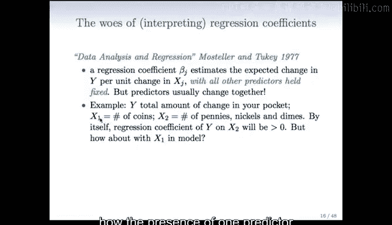

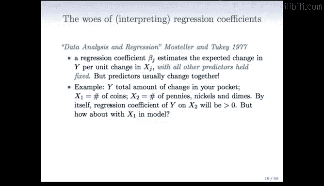

因此，基于观测数据的回归分析中，**应避免做出因果关系的断言**。要推断因果关系，需要对系统进行主动干预（实验），而不仅仅是被动观察。

> **乔治·博克斯的名言**：“所有模型都是错的，但有些是有用的。” 以及，“要了解扰动一个复杂系统会产生什么结果，唯一的方法就是去扰动它，而不能仅仅是被动观察。”

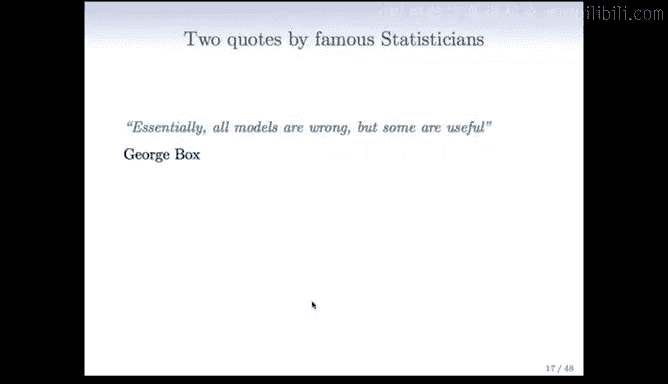

---

## 最小二乘估计

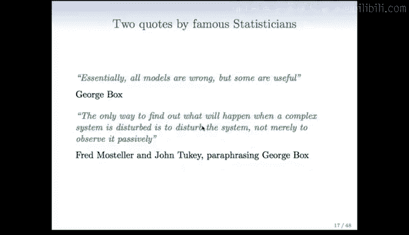

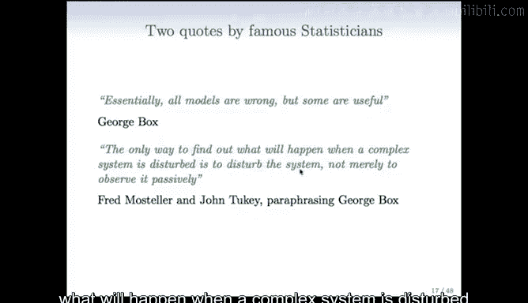

我们如何找到最优的系数估计值呢？方法与简单线性回归一致：采用**最小二乘法**。

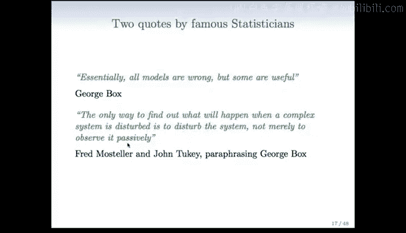

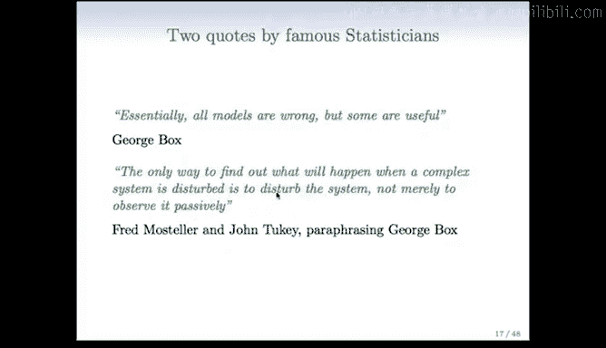

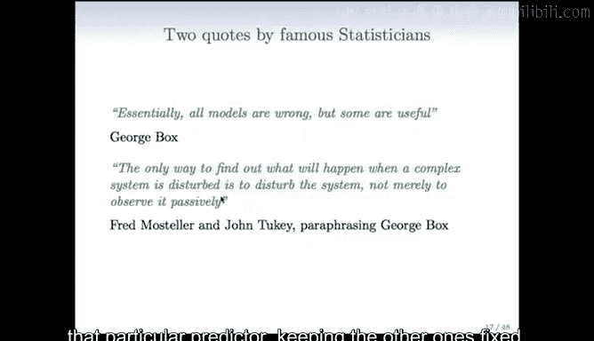

我们寻找的估计值 \(\hat{\beta}_0, \hat{\beta}_1, ..., \hat{\beta}_p\)，是能使**残差平方和（RSS）** 最小化的那一组数值。

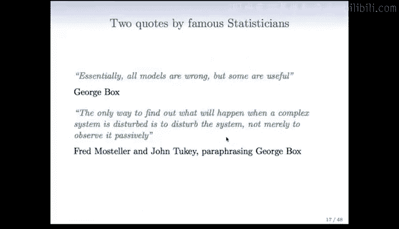

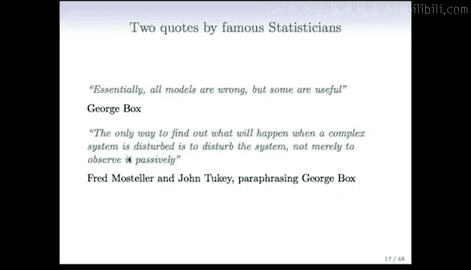

**RSS = Σ(yᵢ - ŷᵢ)² = Σ[yᵢ - (\(\hat{\beta}_0 + \hat{\beta}_1x_{i1} + ... + \hat{\beta}_px_{ip}\))]²**

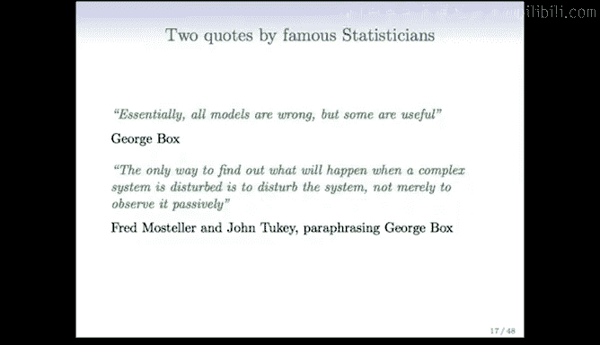

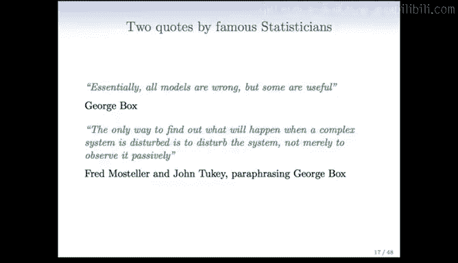

对于多元回归，求解最小二乘估计的公式涉及矩阵运算，较为复杂。但在实践中，我们无需手动计算，可以借助R、Python等统计软件快速得到结果。

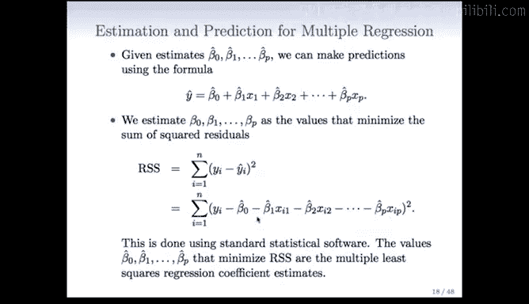

---

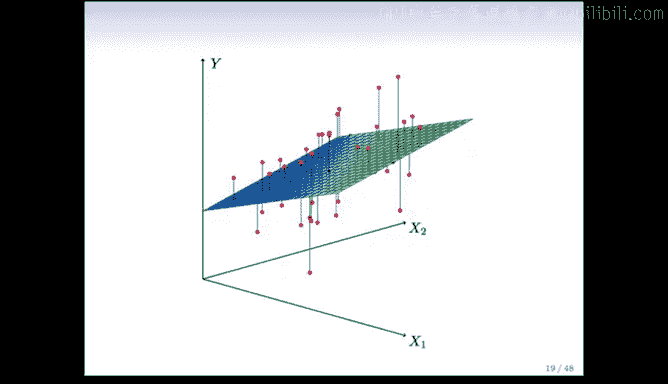

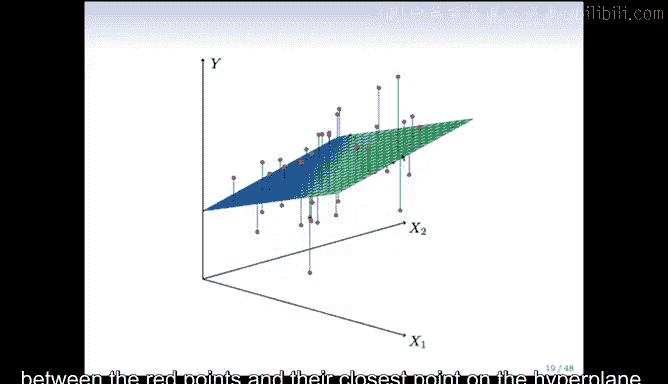

## 广告数据示例分析

让我们应用多元线性回归来分析广告数据集，其中销售额（Sales）是响应变量，三个预测变量是电视（TV）、广播（Radio）和报纸（Newspaper）的广告投入。

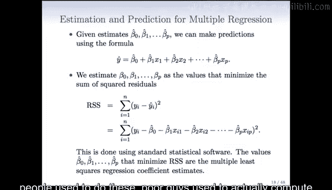

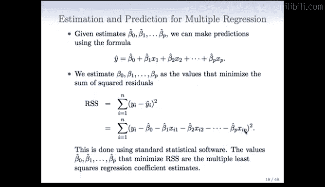

以下是回归模型的主要输出结果（系数估计部分）：

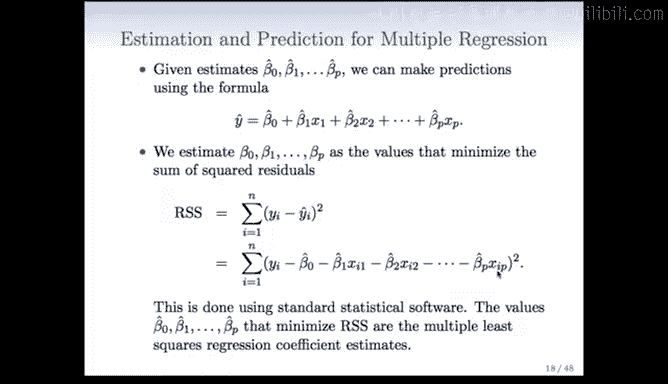

| 预测变量 | 系数估计 | 标准误 | t 统计量 | p值 |
| :--- | :--- | :--- | :--- | :--- |
| (截距) | 2.939 | 0.3119 | 9.42 | < 0.0001 |
| TV | 0.046 | 0.0014 | 32.81 | < 0.0001 |
| Radio | 0.189 | 0.0086 | 21.89 | < 0.0001 |
| Newspaper | -0.001 | 0.0059 | -0.18 | 0.8599 |

**结果解读：**

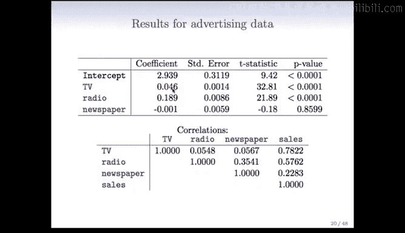

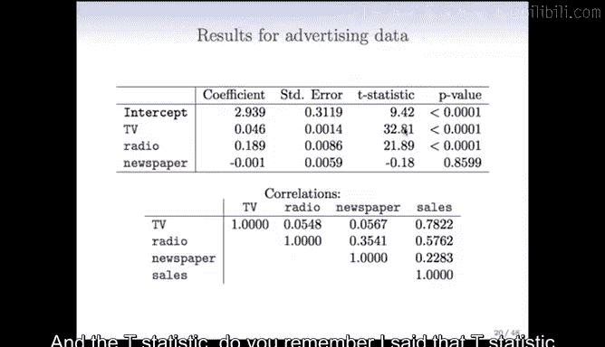

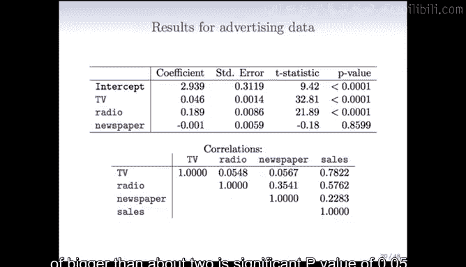

*   **TV 和 Radio**：它们的系数为正，且t统计量的绝对值远大于2，p值极小（<0.0001）。这表明，**在控制了其他两种广告投入的前提下**，增加电视或广播广告预算对销售额有显著的正向影响。
*   **Newspaper**：其系数接近0，t统计量很小（-0.18），p值很大（0.86）。这意味着，**在模型已经包含TV和Radio的情况下**，报纸广告投入对销售额没有显著的额外解释力。

**为什么报纸广告在简单回归中可能显著，在多元回归中却不显著？**
查看预测变量间的相关系数可以发现，Radio和Newspaper之间存在中等程度的相关性（约0.35）。当Radio已经在模型中时，它所包含的信息已经“吸收”或“代表”了Newspaper与Sales之间的部分关系。因此，Newspaper的额外贡献就变得不显著了。这体现了多元回归中“控制其他变量”的效果。

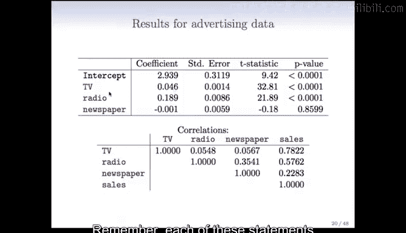

---

## 总结

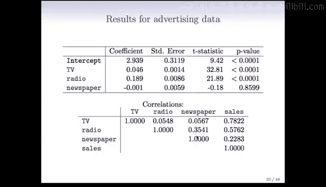

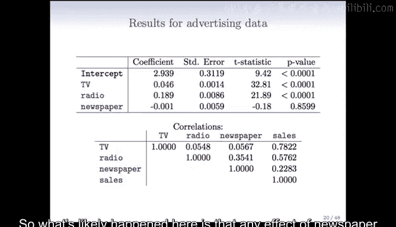

本节课中我们一起学习了多元线性回归的核心内容。

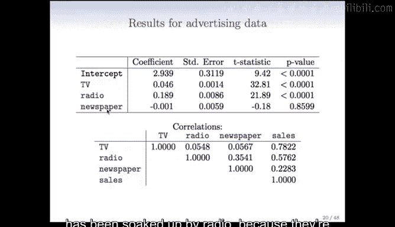

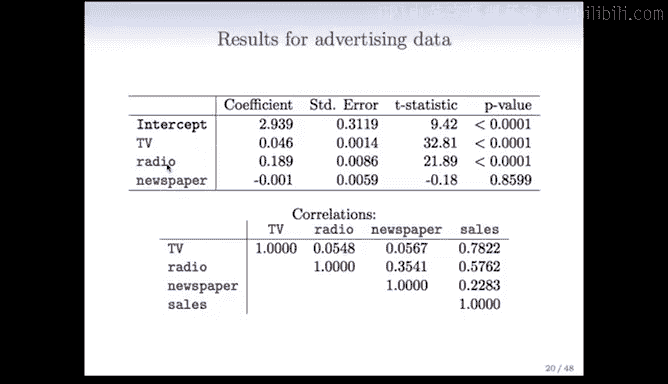

我们首先将简单线性回归模型扩展到了多个预测变量的情况，其模型是一个超平面。我们重点讨论了在预测变量相关时，解释回归系数的复杂性，并强调从观测数据中推断因果关系是困难的。随后，我们介绍了通过最小二乘法来估计模型参数。最后，通过广告数据的实例，我们演示了如何拟合和解释一个多元线性回归模型，并看到了变量间的相关性如何影响系数的显著性和解释。

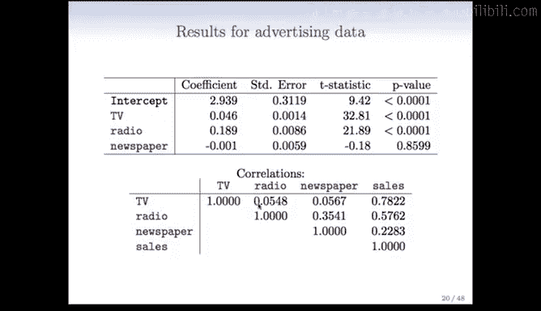

在下一节中，我们将探讨在实际应用回归分析时会产生的一些重要问题。