# Python 版 16：线性回归中的重要问题与变量选择 📊

在本节课中，我们将探讨在实际应用线性回归模型时，需要回答的几个核心问题。我们将学习如何判断预测变量是否有用、如何选择重要变量、如何评估模型拟合效果，以及如何处理定性预测变量。

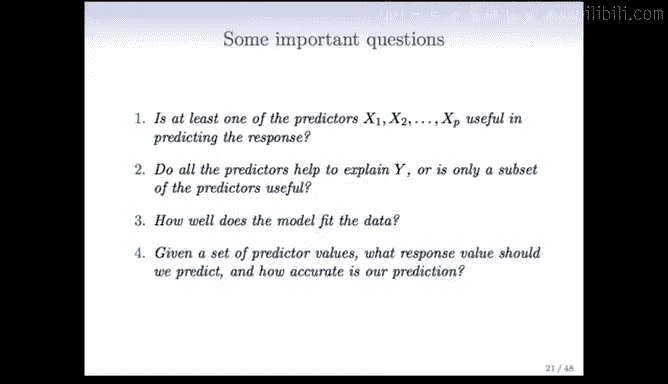

---

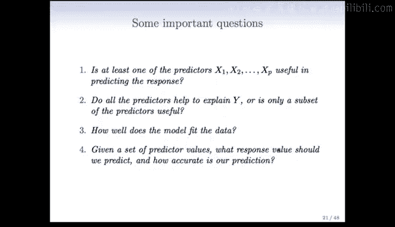

## 模型整体预测价值评估 🔍

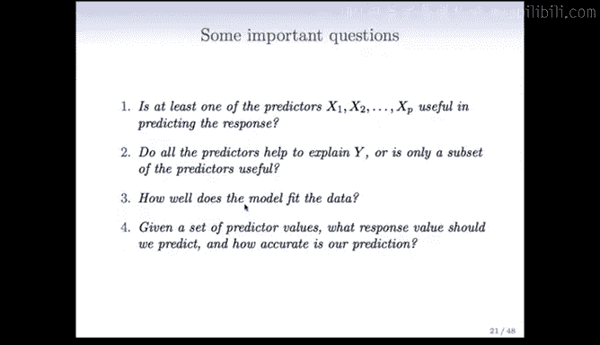

上一节我们介绍了多元线性回归模型。本节中我们首先需要回答一个基本问题：**至少有一个预测变量对响应变量有预测作用吗？** 换句话说，模型整体是否具有预测价值？

为了回答这个问题，我们比较两个模型：
1.  **无预测变量模型**：仅使用响应变量的均值进行预测。
2.  **全模型**：使用所有预测变量进行预测。

我们通过计算**可解释方差比例**（R²）来量化预测变量的贡献。其公式为：
\[
R^2 = \frac{\text{TSS} - \text{RSS}}{\text{TSS}} = 1 - \frac{\text{RSS}}{\text{TSS}}
\]
其中，TSS 是总平方和，RSS 是残差平方和。

在广告数据示例中，使用三个广告预算预测变量后，R² 达到了 0.897。这意味着使用这三个预测变量，可以将销售额围绕其均值的方差减少近 90%。

为了进行更严格的统计检验，我们可以计算 **F 统计量**：
\[
F = \frac{(\text{TSS} - \text{RSS}) / p}{\text{RSS} / (n - p - 1)}
\]
其中，`p` 是预测变量个数，`n` 是样本量。

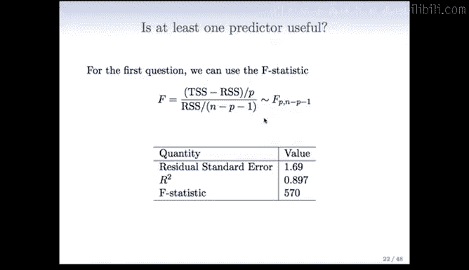

在原假设（所有预测变量系数均为零）下，该统计量服从自由度为 `(p, n-p-1)` 的 F 分布。计算出的 F 统计量通常很大，其对应的 p 值极小（例如小于 0.0001），这为我们提供了强有力的证据，表明预测变量整体对响应变量有显著影响。

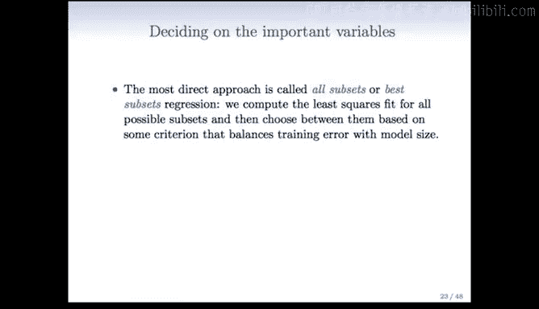

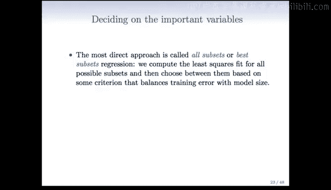

---

## 重要变量选择方法 🎯

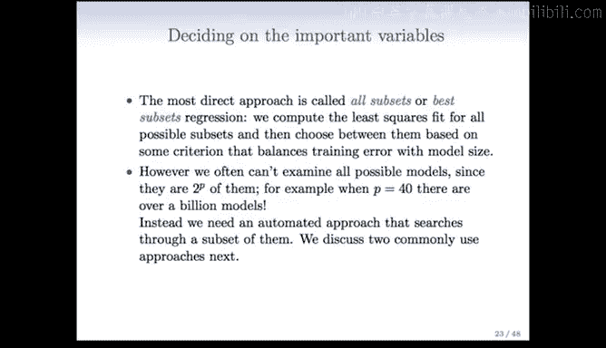

在确认模型整体有效后，下一个关键问题是：**哪些预测变量是重要的？** 我们是否需要包含所有变量，还是仅需要一个子集？

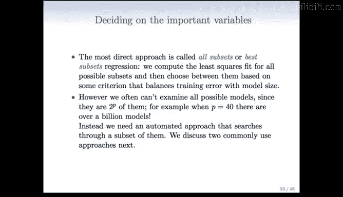

以下是选择重要变量的几种常用方法。

### 最优子集回归

最直接的方法是**最优子集回归**。其思路是拟合所有可能的预测变量子集组合的模型，然后根据某个平衡了训练误差和模型复杂度的准则，从中选择最佳模型。

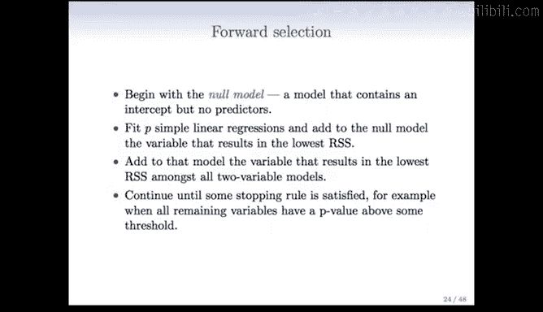

然而，当预测变量数量 `p` 较大时，这种方法计算量巨大。因为可能的子集数量是 `2^p` 个。例如，当 `p=40` 时，需要评估超过 10 亿个模型，这显然不切实际。

### 前向选择

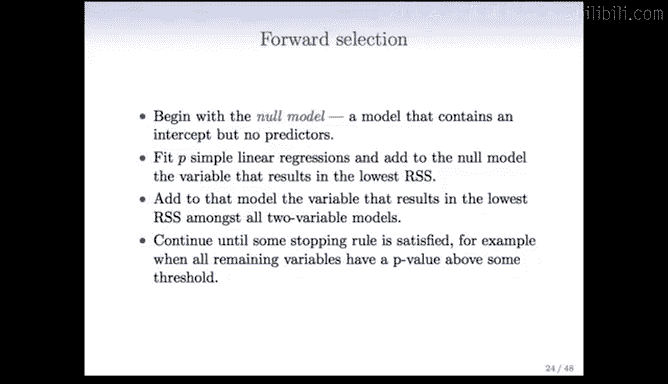

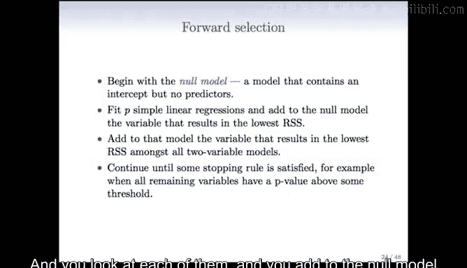

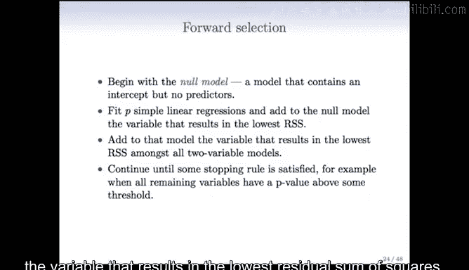

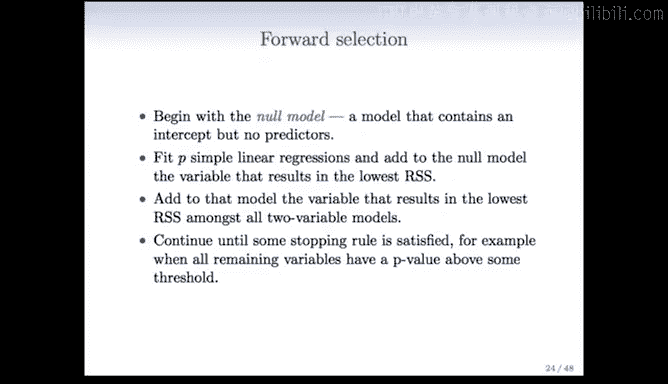

因此，我们需要一种自动化的、高效的搜索方法。**前向选择**是一种常用且高效的方法。

以下是前向选择的具体步骤：

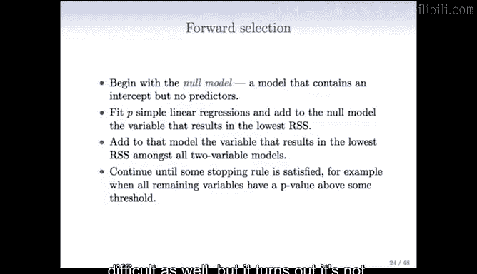

1.  **初始化**：从一个只包含截距项的**零模型**开始。
2.  **逐步添加**：
    *   拟合 `p` 个简单线性回归模型，每个模型在零模型基础上添加一个不同的预测变量。
    *   选择能最大程度降低残差平方和（RSS）的那个变量，将其加入模型。
3.  **迭代**：固定已选入的变量，在剩余变量中重复步骤 2，寻找能最大程度改善 RSS 的下一个变量。
4.  **停止**：持续此过程，直到满足某个停止规则（例如，所有剩余变量的 p 值都高于某个阈值）。

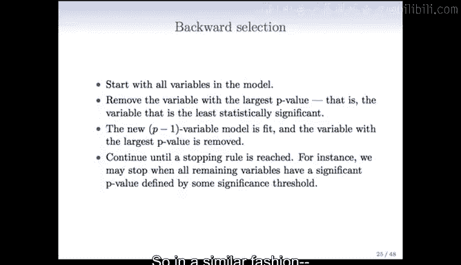

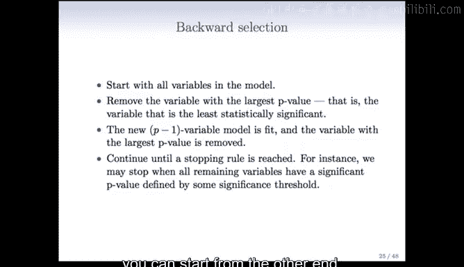

尽管听起来需要大量计算，但存在一些巧妙技巧可以高效地完成所有评估。

### 后向选择

与前向选择方向相反，**后向选择**从包含所有预测变量的**全模型**开始。

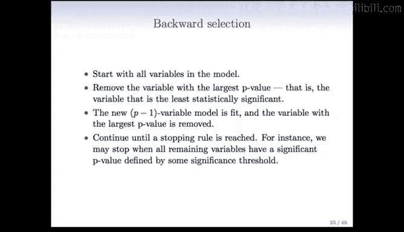

以下是后向选择的具体步骤：

1.  **初始化**：从包含所有 `p` 个预测变量的模型开始。
2.  **逐步剔除**：
    *   查看当前模型中所有变量的 t 统计量（或 p 值）。
    *   剔除最不显著（即 t 统计量绝对值最小或 p 值最大）的那个变量。
3.  **迭代**：在剔除变量后的新模型上重复步骤 2。
4.  **停止**：持续此过程，直到所有保留在模型中的变量都达到某个显著性水平。

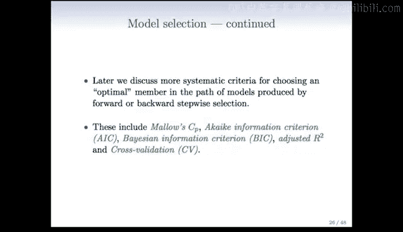

这两种方法（前向和后向选择）在实践中非常有效。在后续课程中，我们将讨论更系统的准则（如 Mallows‘ Cp、AIC、BIC、调整R² 和交叉验证）来从这些方法产生的模型路径中选择最优模型。

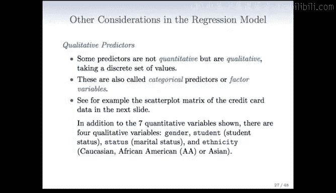

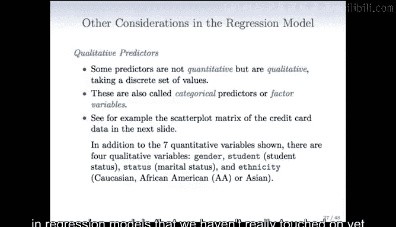

---

## 处理定性预测变量 👥

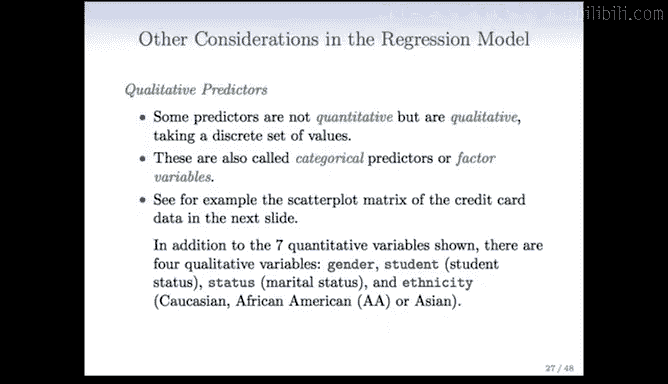

到目前为止，我们讨论的预测变量都是定量的。但在实际数据中，我们经常会遇到**定性预测变量**（也称为分类变量或因子变量）。例如，在信用卡数据中，变量可能包括：
*   **性别**：男性 / 女性
*   **学生状态**：是 / 否
*   **婚姻状况**：已婚 / 单身 / 离异
*   **种族**：白人 / 非裔 / 亚裔

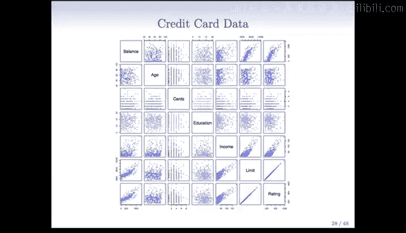

这些变量的取值是离散的类别，而非连续数值。那么，如何在线性回归模型中处理它们呢？

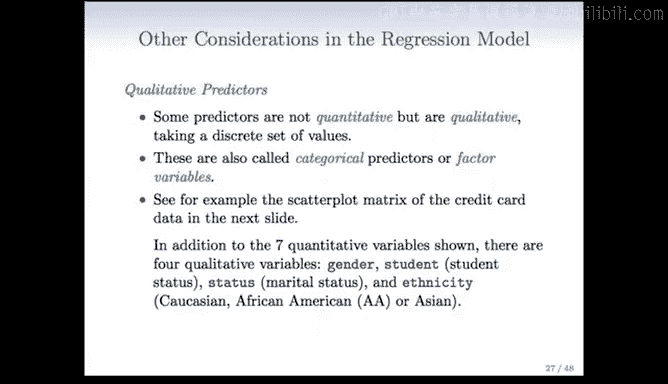

### 二分类变量：虚拟变量

对于只有两个类别的变量（如性别），我们通过创建**虚拟变量**（或哑变量）来处理。

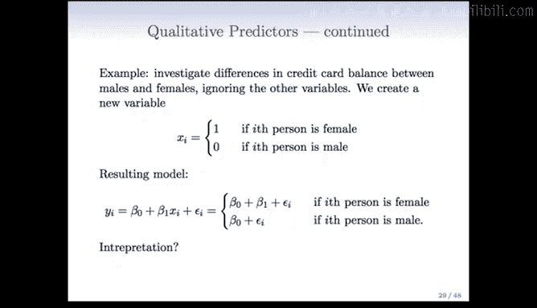

例如，为“性别”创建一个变量 `Xi`：
*   如果第 `i` 个人是女性，则 `Xi = 1`
*   如果第 `i` 个人是男性，则 `Xi = 0`

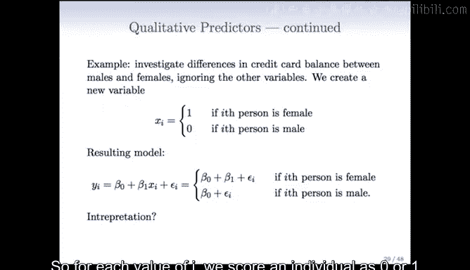

将 `Xi` 纳入回归模型：
\[
Y_i = \beta_0 + \beta_1 X_i + \epsilon_i
\]
*   当 `Xi = 0`（男性）：`Y_i = \beta_0 + \epsilon_i`。`β0` 代表男性的平均响应。
*   当 `Xi = 1`（女性）：`Y_i = \beta_0 + \beta_1 + \epsilon_i`。`β1` 代表女性与男性（基线）的平均差异。

在信用卡数据中，仅用性别预测余额的模型显示，`β1` 的估计值为 19.73（女性略高），但 p 值为 0.66，不显著。这表明在该数据集中，性别对信用卡余额没有显著影响。

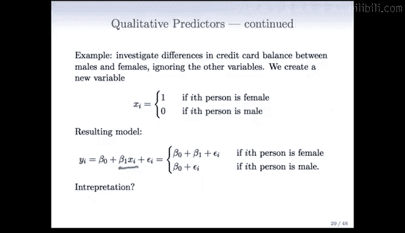

### 多分类变量：多个虚拟变量

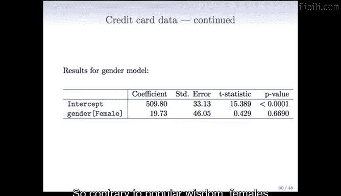

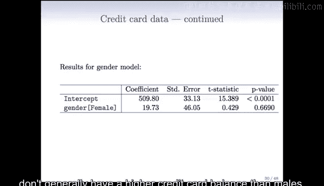

对于具有 `k` 个水平的分类变量（如种族：亚裔、白人、非裔），我们需要创建 `k-1` 个虚拟变量。

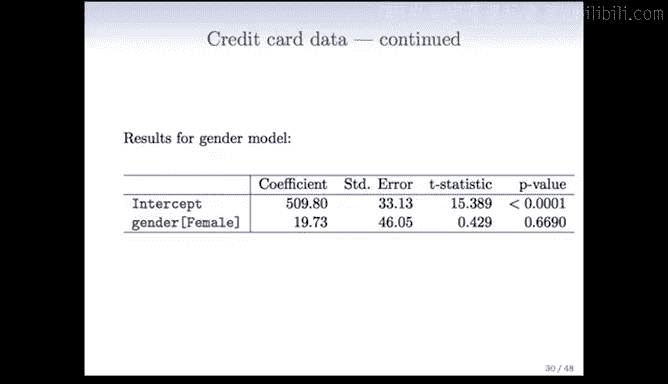

以种族为例（k=3），我们创建两个虚拟变量：
*   `Xi1`：如果第 `i` 个人是亚裔则为 1，否则为 0。
*   `Xi2`：如果第 `i` 个人是白人为 1，否则为 0。

如果 `Xi1` 和 `Xi2` 都为 0，则代表第 `i` 个人是非裔（被选为**基线水平**）。

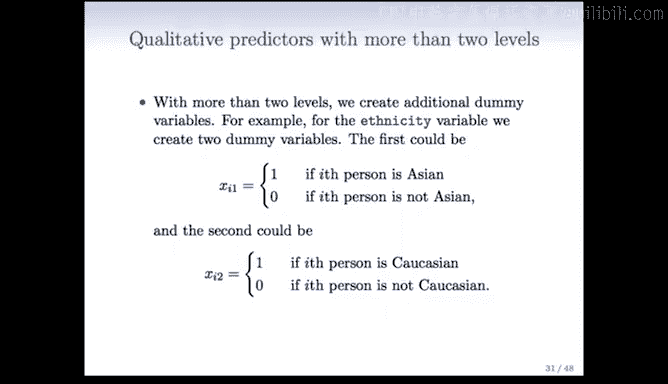

模型形式为：
\[
Y_i = \beta_0 + \beta_1 X_{i1} + \beta_2 X_{i2} + \epsilon_i
\]
*   **非裔**（基线）：`Y_i = β0 + εi`
*   **亚裔**：`Y_i = β0 + β1 + εi`。`β1` 代表亚裔与非裔的差异。
*   **白人**：`Y_i = β0 + β2 + εi`。`β2` 代表白人与非裔的差异。

**关键点**：
*   基线水平的选择不影响模型的拟合优度（RSS 相同），但会影响系数的解释和对比。
*   系数 `β1` 和 `β2` 及其 p 值，分别检验的是亚裔 vs. 非裔、白人 vs. 非裔的差异是否显著。

---

## 总结 📝

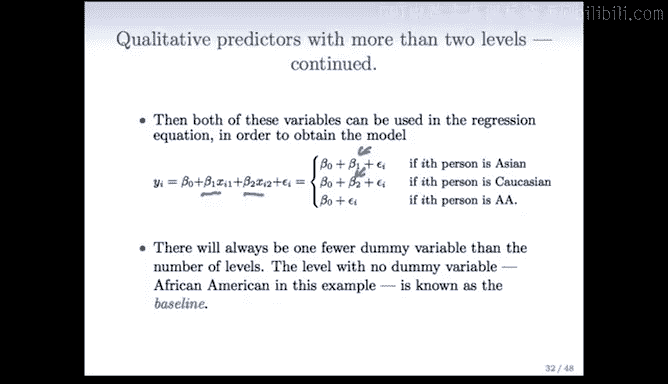

本节课我们一起学习了应用线性回归模型时需要解决的几个核心问题：

1.  **评估整体显著性**：通过 F 检验判断预测变量整体是否对响应变量有解释力。
2.  **选择重要变量**：介绍了最优子集、前向选择和后向选择等方法，用于从大量预测变量中筛选出重要的子集。
3.  **处理定性变量**：学习了如何使用虚拟变量将分类预测变量纳入线性回归模型。对于二分类变量，使用一个虚拟变量；对于 k 水平分类变量，使用 k-1 个虚拟变量，并理解基线水平的概念。

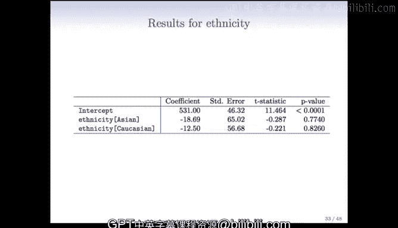

掌握这些内容，是构建有效、简洁且易于解释的回归模型的基础。在接下来的课程中，我们将深入探讨模型评估和选择的更多准则。