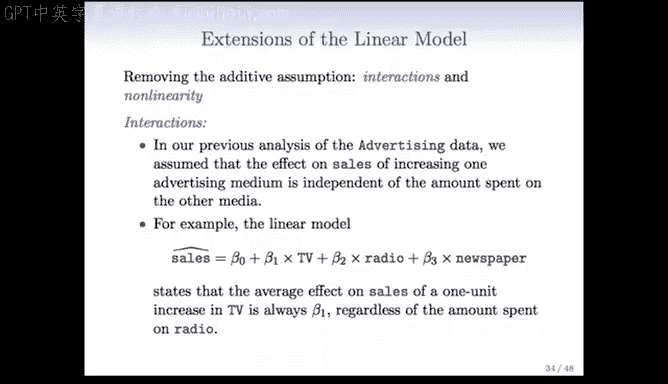
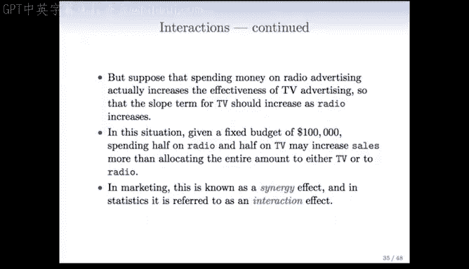
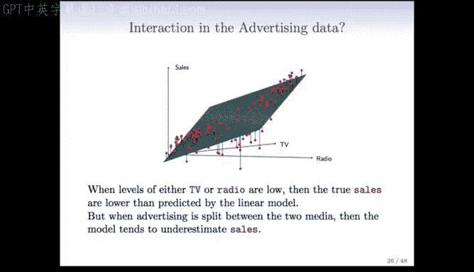
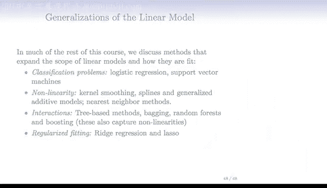

# Python 版 17：线性模型的扩展 📈

在本节课中，我们将学习线性回归模型的几种重要扩展。我们将探讨如何通过引入交互项来捕捉变量间的协同效应，以及如何通过多项式项来拟合非线性关系。这些扩展极大地增强了线性模型的表现力和适用范围。

---

## 交互作用

上一节我们介绍了基础的线性模型。本节中，我们来看看如何通过引入交互作用来扩展模型。

在之前对广告数据的分析中，我们假设增加一种广告媒介（如电视）对销售额的影响，独立于在其他媒介（如广播）上的花费。例如，在线性模型 `sales = β₀ + β₁×TV + β₂×radio + β₃×newspaper` 中，电视广告的系数 β₁ 是固定的，不随广播广告投入的变化而变化。

但实际情况可能是，在广播广告上投入资金会提高电视广告的效果。这意味着电视广告的斜率（即系数 β₁）应随着广播广告投入的增加而增加。在市场营销中，这被称为协同效应；在统计学中，我们称之为交互效应。

为了在模型中包含交互作用，我们引入一个乘积项。模型变为：
`sales = β₀ + β₁×TV + β₂×radio + β₃×(TV×radio)`

这个模型可以重新整理为：
`sales = β₀ + (β₁ + β₃×radio)×TV + β₂×radio`
这种写法清晰地表明，电视广告的系数现在变成了 `(β₁ + β₃×radio)`，它会随着广播广告投入 `radio` 的变化而变化。

以下是包含交互作用的模型结果要点：
*   **显著性**：交互项 `TV×radio` 的P值极低，表明交互作用非常重要。
*   **模型改进**：引入交互项后，模型的 R² 从 89.7% 提升至 96.8%。这意味着交互项解释了加法模型中约69%的未被解释的方差。
*   **系数解释**：
    *   电视广告增加 $1000 对销售额的影响是 `(19 + 1.1×radio)` 个单位。
    *   广播广告增加 $1000 对销售额的影响是 `(29 + 1.1×TV)` 个单位。
*   **层级原则**：当模型中包含交互项时，即使其对应的主效应（如单独的 `TV` 和 `radio` 项）不显著，通常也应将其保留在模型中。这是因为没有主效应时，交互效应的解释会变得困难且不直观。

---

## 定性变量与定量变量的交互

现在，我们来看看如何处理一个定性变量（如学生身份）和一个定量变量（如收入）之间的交互作用。

我们使用信用卡数据，用收入和学生身份来预测信用卡余额。首先，建立一个不包含交互项的模型：
`balance = β₀ + β₁×income + β₂×student`

其中，`student` 是一个虚拟变量（学生为1，非学生为0）。这个模型意味着学生和非学生群体有相同的收入斜率 `β₁`，但有不同的截距（学生为 `β₀+β₂`，非学生为 `β₀`）。

当我们引入交互项时，模型变为：
`balance = β₀ + β₁×income + β₂×student + β₃×(income×student)`

这个模型可以重新表述，以更清晰地展示其含义：
*   对于非学生 (`student=0`)：`balance = β₀ + β₁×income`
*   对于学生 (`student=1`)：`balance = (β₀ + β₂) + (β₁ + β₃)×income`

因此，包含交互项的模型允许学生和非学生群体不仅拥有不同的截距，还拥有不同的收入斜率。这使得模型的解释在包含分类变量时变得非常直观。

---

## 非线性关系

最后，我们探讨如何让线性模型捕捉变量间的非线性关系。

以汽车数据集为例，我们研究马力 (`horsepower`) 与每加仑英里数 (`mpg`) 的关系。如果使用简单的线性回归，拟合的直线可能无法捕捉数据中的曲线趋势。

为了改进拟合，我们可以使用多项式回归。例如，我们可以拟合一个二次模型：
`mpg = β₀ + β₁×horsepower + β₂×horsepower²`

我们只需在数据集中创建一个新变量 `horsepower²`，然后将其与 `horsepower` 一起放入线性模型进行拟合。虽然这个模型在变量上是非线性的（因为包含了平方项），但在参数（系数 β）上仍然是线性的，因此我们仍然可以使用线性回归的技术来求解。

在实践中，我们可以根据需要添加更高次的多项式项（如三次项、五次项），以拟合更复杂的曲线。这极大地扩展了线性回归的适用范围，使其能够灵活地处理非线性模式。

---

## 总结与展望

本节课中我们一起学习了线性模型的三个关键扩展：
1.  **交互作用**：通过引入变量间的乘积项，来捕捉一个变量对另一个变量效应的影响。
2.  **定性-定量变量交互**：允许分类变量不仅影响截距，还影响连续变量的斜率。
3.  **非线性拟合**：通过添加多项式项（如平方项、立方项），使模型能够拟合曲线关系。

这些扩展表明，线性模型框架远比其名称所暗示的更加强大和灵活。

在后续课程中，我们将看到这个框架的更多推广：
*   **分类问题**：逻辑回归和支持向量机等模型，其核心也是线性模型。
*   **更复杂的非线性**：我们将学习核平滑、样条和广义加性模型等技术。
*   **系统化的交互与非线性**：基于树的方法（如随机森林、提升法）能以更系统的方式捕捉复杂的交互和非线性。
*   **正则化拟合**：当变量数量很多时，岭回归和Lasso等方法可以通过约束系数来控制模型复杂度。

线性模型为我们理解更高级的统计学习方法奠定了坚实的基础。