# Python 版 18：线性回归与 statsmodels 包 I 📊 

在本节课中，我们将学习如何使用 Python 进行线性回归分析。线性回归是统计学中的核心方法，我们将重点介绍用于拟合线性模型的工具，特别是为本书和 ISLP 包开发的新工具，这些工具能更便捷地指定线性模型。

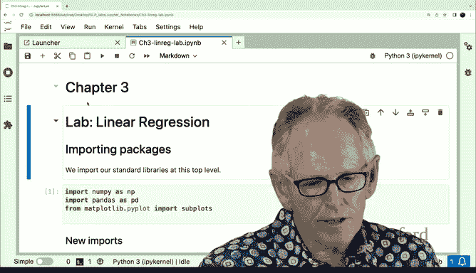

---

## 导入必要的库

在 Python 中使用任何代码前，都需要通过 `import` 语句导入相应的库。良好的实践是将所有导入语句放在代码开头。

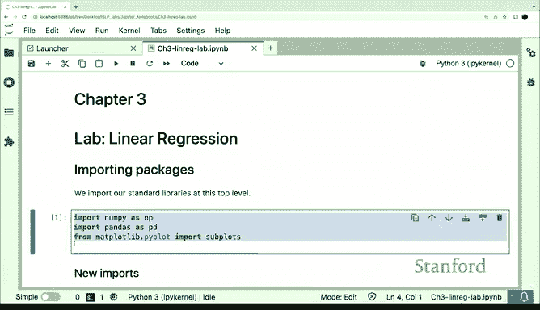

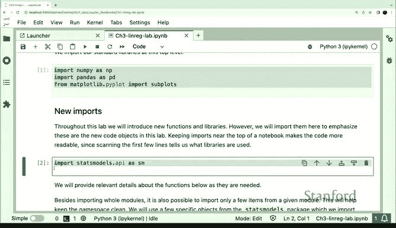

以下是本实验需要导入的库。我们将导入一些在上次实验中见过的库，同时引入一个新库 `statsmodels`，它是用于拟合回归模型（包括线性回归和第四章将见的逻辑回归）的主要包。

```python
import statsmodels.api as sm
from ISLP import load_data
from ISLP.models import ModelSpec
```

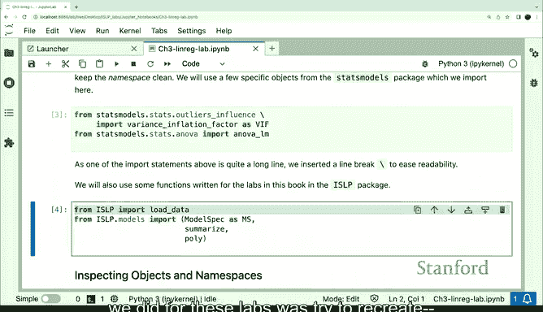

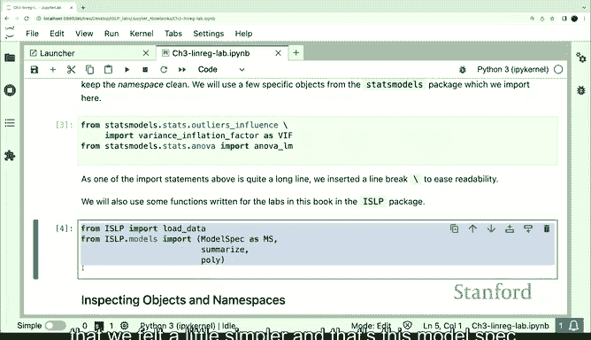

---

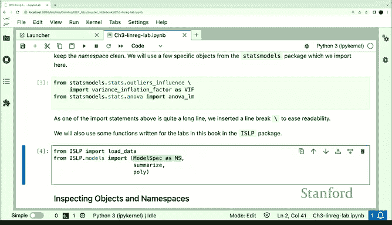

## 🛠️ 使用 ModelSpec 简化模型设定

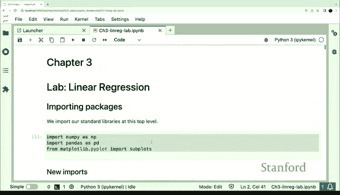

在构建回归模型时，除了拟合模型本身，指定设计矩阵（即决定使用哪些列、效应和交互作用）是至关重要的一步。在 Python 中有多种指定模型的方式，但我们选择了一种更简单的方法：`ModelSpec`。

`ModelSpec` 可以看作是一个“特征工程工具包”。在本书中，“模型矩阵”和“设计矩阵”这两个术语可以互换使用。这些工具（称为“转换器”）通常包含 `fit` 和 `transform` 两个方法，用于处理特征。我们将在后续进行主成分分析时看到另一个转换器的例子。

手动构建复杂的模型矩阵（尤其是涉及变量转换和交互作用时）通常非常繁琐。Jonathan 开发的这些工具极大地简化了这一过程，特别是在处理复杂示例时。此外，手动构建设计矩阵时，跟踪各列及其相互关系也很重要，`ModelSpec` 也提供了相应的操作能力。

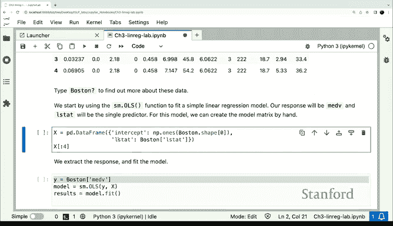

---

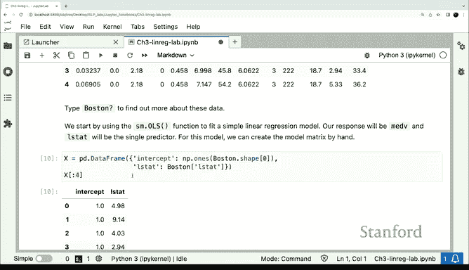

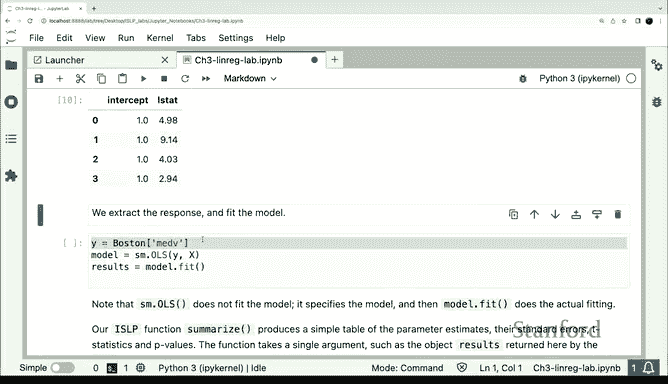

## 🏠 简单线性回归示例：波士顿房价数据

让我们从一个经典的回归示例——波士顿房价数据开始。我们将使用 ISLP 包中的 `load_data` 函数加载数据。除了深度学习，我们将使用的大部分数据集都可以通过此函数访问。

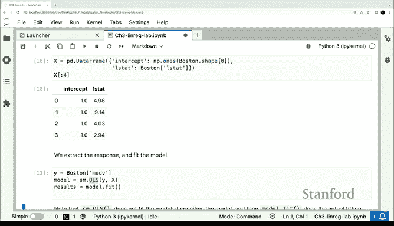

```python
Boston = load_data('Boston')
```

数据框包含多个列，其中响应变量是 `medv`（房屋中位数价值），特征变量之一是 `lstat`（低社会经济地位人口百分比）。我们的目标是拟合一个以 `lstat` 预测 `medv` 的简单线性回归模型。

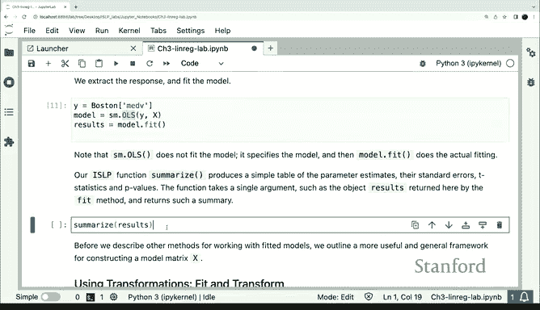

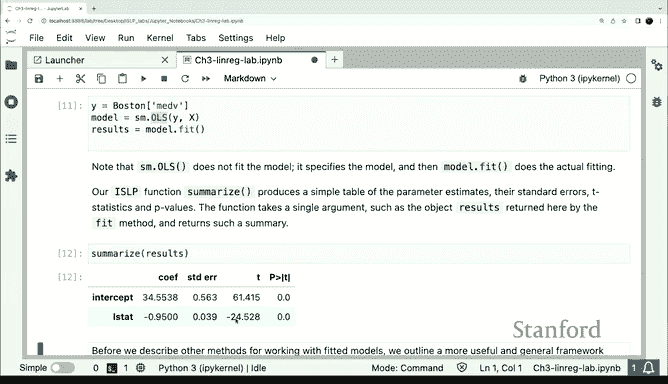

首先，我们手动构建一个包含截距项和 `lstat` 列的设计矩阵，并使用 `statsmodels` 包中的普通最小二乘法进行拟合。

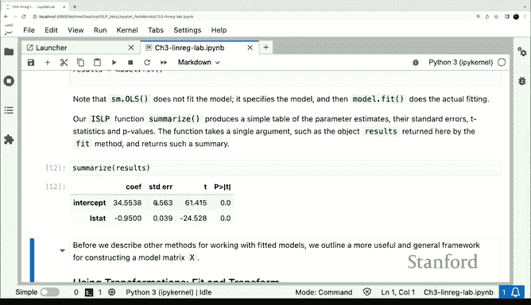

```python
import numpy as np
# 手动构建设计矩阵
X = np.column_stack([np.ones(Boston.shape[0]), Boston['lstat']])
y = Boston['medv']

# 使用 statsmodels 的 OLS 进行拟合
model = sm.OLS(y, X).fit()
```

拟合后，我们可以查看模型摘要，其中包含系数估计值、标准误差、t 统计量和 p 值等。`ISLP` 包中的 `summary` 函数提供了一个比默认输出更简洁美观的摘要。

```python
print(model.summary())
```

结果显示，`lstat` 与 `medv` 之间存在显著的统计关联。

---

## 🔄 使用 ModelSpec 构建设计矩阵

现在，我们使用 `ModelSpec` 来更高效地构建设计矩阵。在简单情况下，我们通过一个列名列表来指定特征。

```python
# 创建模型规范，指定使用 lstat 特征
design = ModelSpec(['lstat'])
# 在数据上“拟合”规范（检查列是否存在及类型）
design = design.fit(Boston)
# 转换数据以生成设计矩阵
X_design = design.transform(Boston)
```

默认情况下，`transform` 方法会自动添加截距列，这通常是需要的。你也可以通过参数设置不包含截距项。

需要注意的是，`ModelSpec` 对象在创建时并不了解数据，只有在对其调用 `fit` 方法并传入数据（如 `Boston`）时，它才会检查数据中是否存在指定的列（如 `lstat`），并在后续调用 `transform` 时知道如何处理。

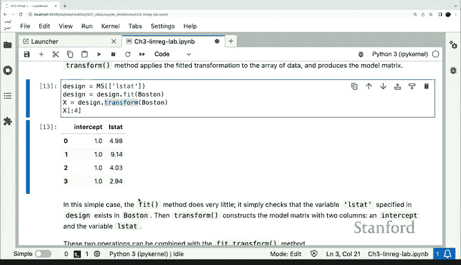

---

## 📈 置信区间与新点预测

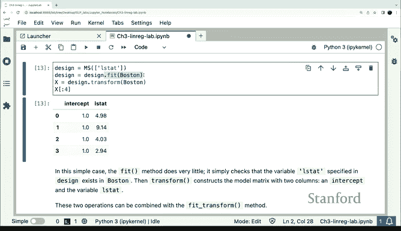

在回归分析中，我们经常需要为新的数据点生成预测值并计算置信区间。例如，我们可能想将模型应用于波士顿以外的地区（如费城）进行预测。

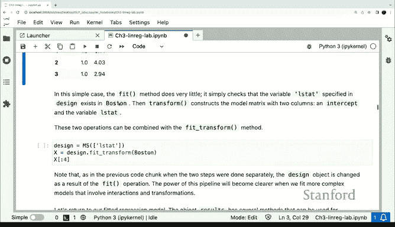

为此，我们需要向 `transform` 方法提供一个包含所有必要变量（本例中仅为 `lstat`）的新数据框。`design` 对象将使用之前设定的“配方”为这些新值生成设计矩阵。这对于更复杂的设计（如多项式回归）尤为重要。

```python
# 创建包含新 lstat 值的数据框
new_data = pd.DataFrame({'lstat': [5, 10, 15]})
# 为新数据生成设计矩阵
X_new = design.transform(new_data)
```

然后，我们可以使用 `statsmodels` 的 `get_prediction` 方法获取新点的拟合值（即置信区间的中心），并使用 `conf_int` 方法获取置信区间。

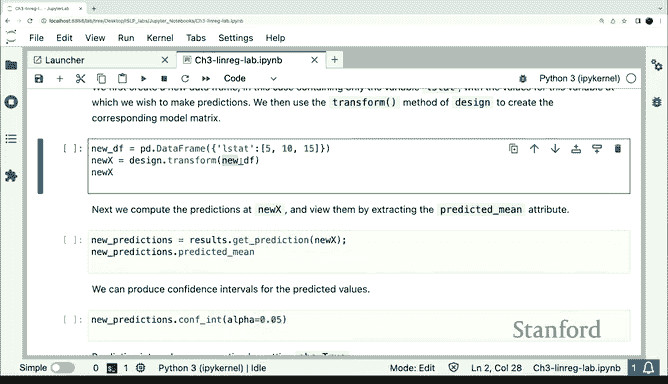

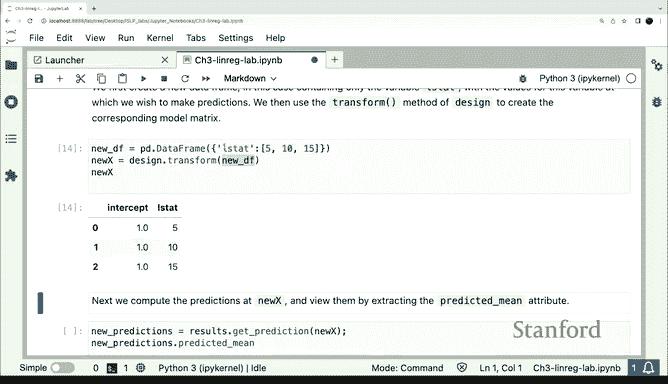

```python
# 获取新点的预测结果对象
predictions = model.get_prediction(X_new)
# 获取预测均值
predicted_means = predictions.predicted_mean
# 获取置信区间
confidence_intervals = predictions.conf_int()
```

---

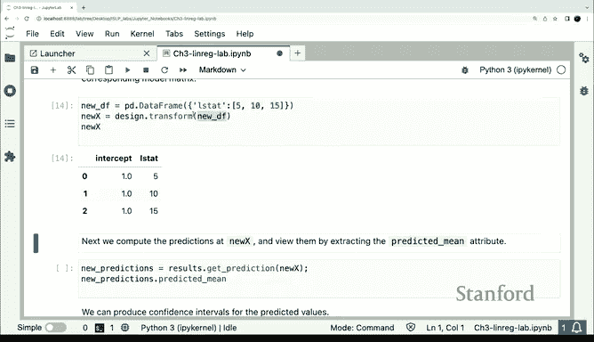

## 🎯 总结

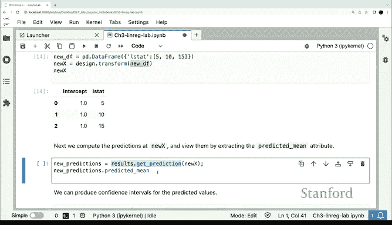

本节课我们一起学习了线性回归的基础操作。

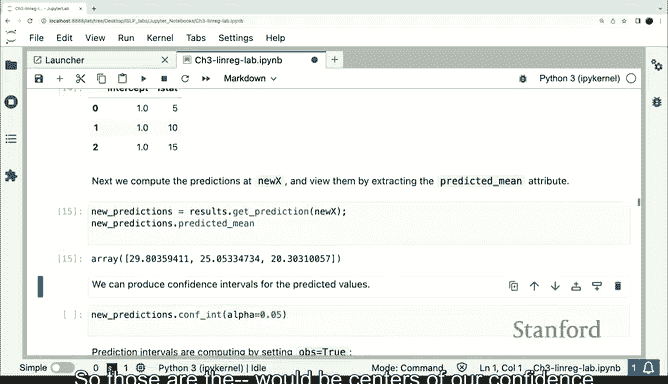

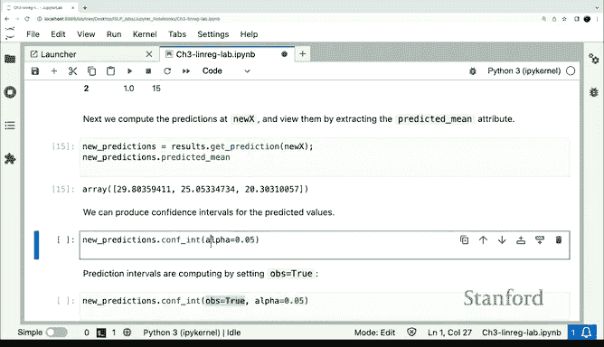

1.  我们介绍了如何使用 `statsmodels` 包进行线性回归拟合。
2.  我们重点学习了 `ISLP` 包中的 `ModelSpec` 工具，它极大地简化了设计矩阵的构建过程，特别是在处理多个特征和复杂模型设定时。
3.  我们通过波士顿房价数据的例子，实践了简单线性回归模型的拟合、摘要查看以及使用 `ModelSpec` 构建设计矩阵。
4.  最后，我们学习了如何为新的数据点生成预测值并计算置信区间。

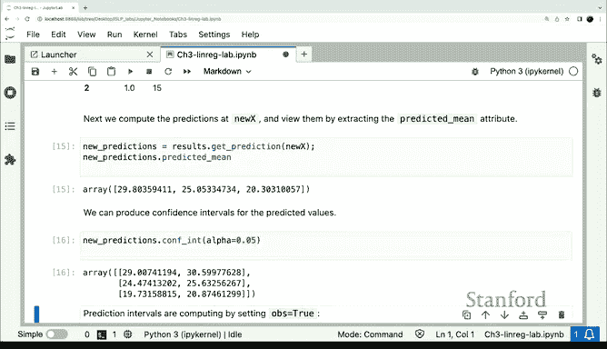


在下一节中，我们将探讨包含多个预测变量的多元线性回归。