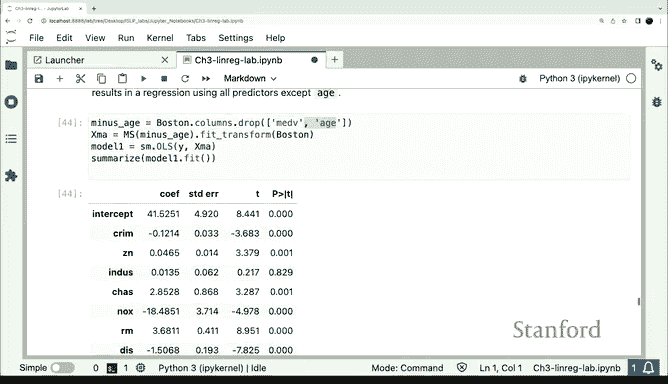

# Python 版 19：多元线性回归包使用 I 📊

在本节课中，我们将要学习如何使用Python的`statsmodels`库进行多元线性回归分析。我们将从简单的双变量模型开始，逐步扩展到包含多个预测变量的模型，并学习如何高效地构建和操作设计矩阵。

---

## 多元线性回归简介

上一节我们介绍了简单线性回归。本节中我们来看看多元线性回归，即设计矩阵中包含不止一列预测变量的情况。

我们将使用波士顿房价数据集中的`age`（房屋年龄）变量和`LSTAT`（低收入人口比例）变量，来预测`medv`（房屋中位数价值）。

---

## 构建设计矩阵

与之前类似，如果我们想直接获得设计矩阵，可以使用`fit_transform`方法。这个方法作为快捷方式，依次调用了`fit`和`transform`。

实际上，其内部过程是：首先调用`fit`，然后对`Boston`数据集调用`transform`。我们通过`model_spec`对象来执行这一系列操作。

`fit_transform`方法一步到位地创建了矩阵`X`，而之前我们是分几个步骤完成的。

以下是构建模型的基本步骤：

1.  创建设计矩阵。
2.  创建`statsmodels`回归对象。
3.  汇总结果以获取我们之前见过的回归结果表。

现在，结果表中会显示`LSTAT`和`age`的效应值。这些系数的解读方式与之前相同，包括系数估计值、标准误等。

---

## 扩展至多个预测变量

刚才的例子中我们只有两个预测变量，可以轻松地列出一个包含两个列名的列表。但在波士顿数据集中，大约有13个特征。如果我们想使用除响应变量外的所有特征，手动列出所有12个列名会非常繁琐。

Python语言的优势在于，我们可以轻松地找出所有不是`medv`的列名。

以下是操作方法：

*   我们可以查看`Boston`数据框的列，然后剔除`medv`列。这将给出所有12个预测变量的列名。
*   然后，我们可以直接将这个列名列表作为参数传递给`ModelSpec`。

这样，我们就能得到一个包含了除响应变量外所有特征的回归模型，非常方便。

---

## 剔除特定变量

假设我们想使用所有特征，但排除`age`变量。

操作方法类似，我们只需在列名列表中剔除`age`即可。生成的模型将少一个预测变量（即`age`），其拟合结果等同于我们从模型中手动移除了`age`变量。

---

## 总结

本节课中我们一起学习了：
1.  使用`statsmodels`进行多元线性回归的基本流程。
2.  利用`fit_transform`方法高效构建设计矩阵。
3.  如何通过操作列名列表，灵活地包含或排除数据集中的多个预测变量，从而构建不同的回归模型。这为处理包含大量特征的数据集提供了极大的便利。