# Python 版 20：交互项、定性预测变量与其他建模工具 🧩

在本节课中，我们将学习如何使用 `model_spec` 构建更复杂的线性模型。我们将重点介绍交互项、多项式项以及如何处理定性（分类）预测变量。这些工具能帮助我们捕捉数据中更复杂的关系，提升模型的表达能力。

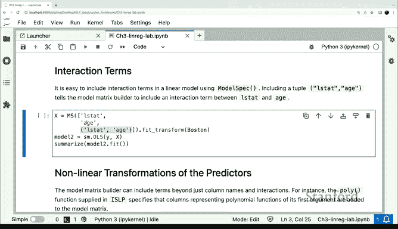

---

上一节我们介绍了如何使用简单的列名列表来构建设计矩阵。本节中我们来看看如何指定变量之间的交互作用。

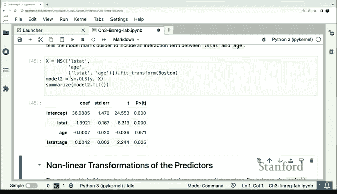

在 `model_spec` 中指定交互项的方法是使用一个包含两个列名的元组。这告诉模型需要创建这两个变量的交互项。模型在知道如何创建 `Lstat` 和 `Age` 变量后，就能生成它们之间的交互项。

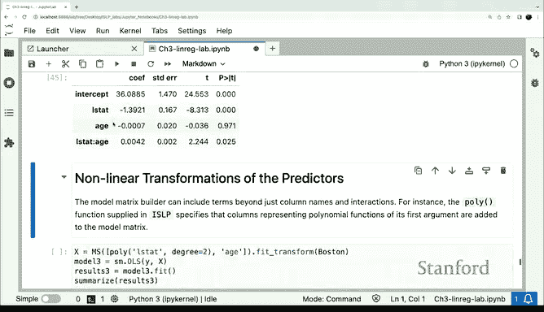

```python
# 示例：创建 Lstat 和 Age 的交互项
spec = MS([('Lstat', 'Age')])
```

拟合这个模型后，我们会得到交互项的系数。由于 `Lstat` 和 `Age` 都是定量变量，交互项就是这两个变量的逐元素乘积。

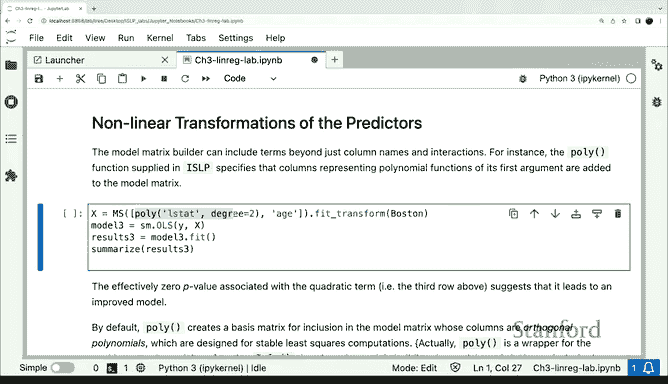

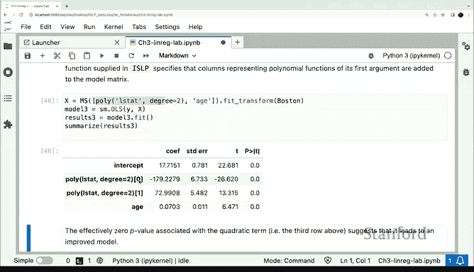

---

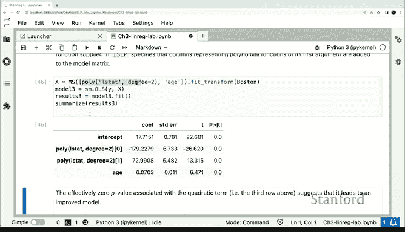

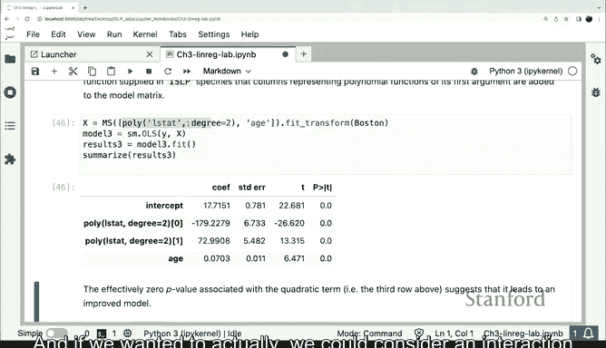

除了交互项，另一个常用的建模工具是多项式项。我们可以使用 `poly` 函数为某个特征指定多项式效应。

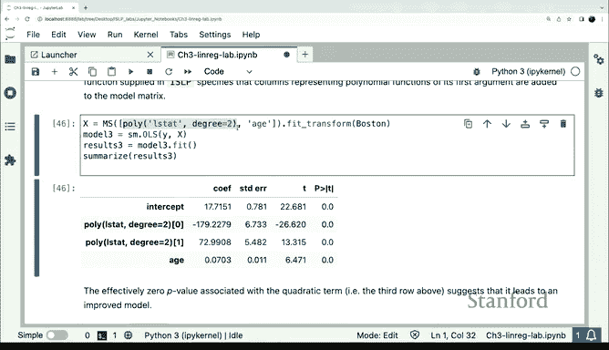

以下示例为 `Lstat` 指定了一个二次项（多项式），同时为 `Age` 保留线性项。

```python
# 示例：为 Lstat 添加二次项，为 Age 添加线性项
spec = MS(['poly(Lstat, 2)', 'Age'])
```

拟合并总结模型后，我们可以看到 `poly(Lstat, 2)` 生成了两列，分别对应线性项和二次项，每个都有自己的系数估计。

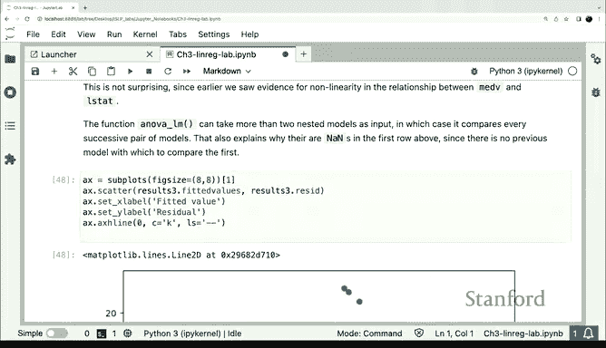

---

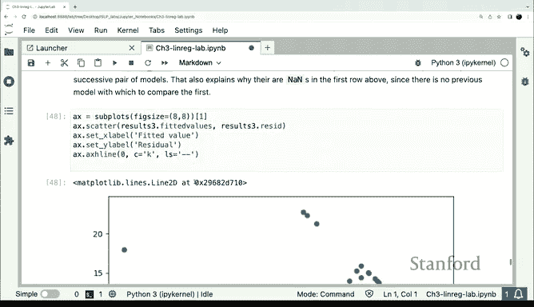

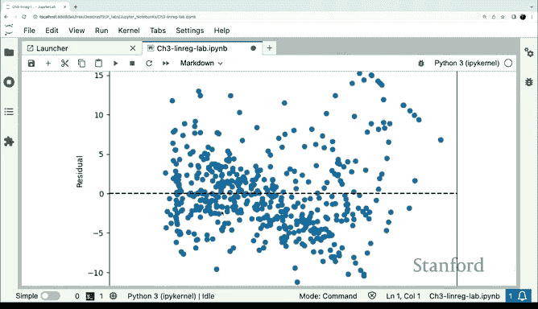

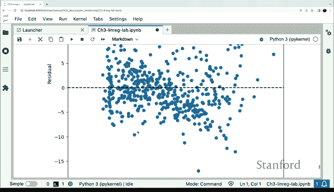

当我们从线性模型升级到包含二次项的模型时，可能想知道拟合效果是否有显著提升。除了查看P值，另一种常用方法是使用方差分析（ANOVA）来比较两个嵌套模型。

`statsmodels` 库中的 `anova_lm` 函数可以执行F检验，比较两个模型，帮助我们判断一个模型是否显著优于另一个。得到的F统计量很大，通常表明更复杂的模型提供了显著更好的拟合。

---

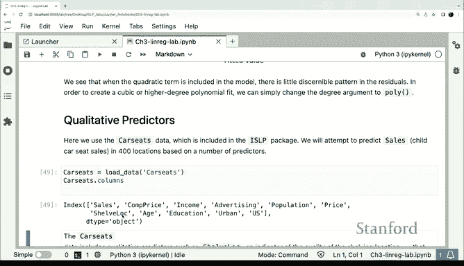

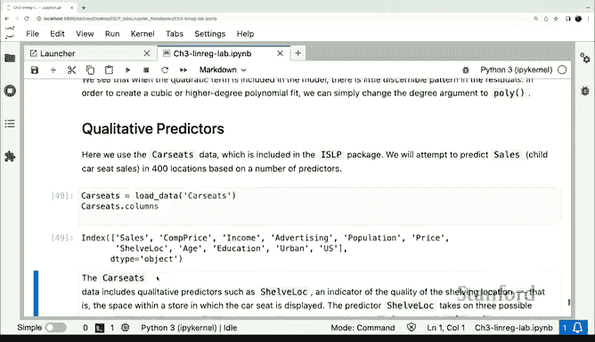

最后，我们来看 `model_spec` 如何处理定性预测变量或分类变量。

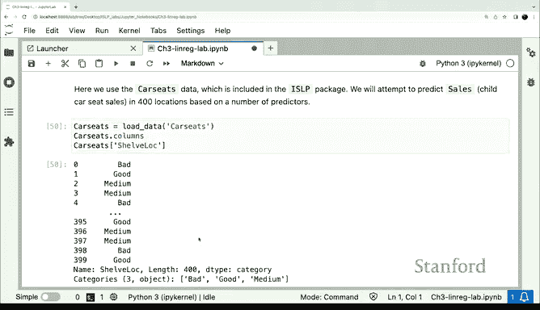

在 `ISLP` 包的汽车座椅数据集中，有一个变量是货架位置（`ShelveLoc`），其水平为低、中、高。这是一个分类变量。

如果我们直接使用 `ShelveLoc` 作为预测变量，`model_spec` 会将其识别为分类变量并自动处理。以下是构建一个包含所有特征和一些交互项的复杂模型的示例：

```python
# 示例：包含分类变量和交互项的模型
all_features = [col for col in df.columns if col != 'Sales']
spec = MS(all_features + [('Income', 'Advertising'), ('Price', 'Age')])
```

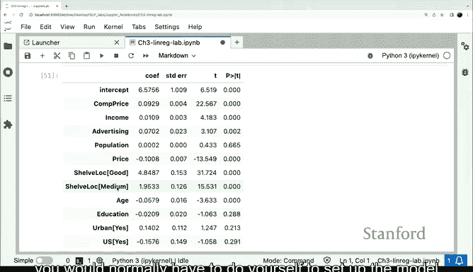

对于分类变量 `ShelveLoc`，模型会自动为其创建虚拟变量（哑变量）。由于三个类别（低、中、高）会与截距项产生共线性，模型会自动省略一个类别作为参照基准。这一切都由 `model_spec` 自动完成，无需手动创建虚拟变量，大大简化了建模流程。

---

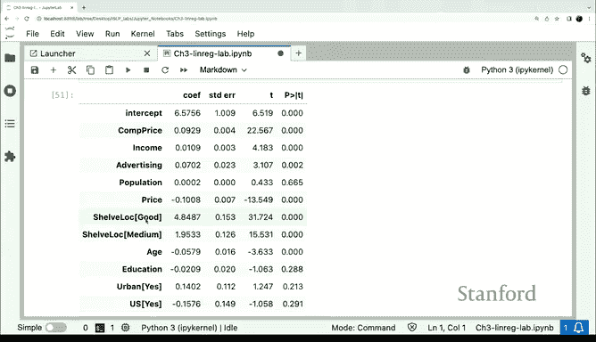

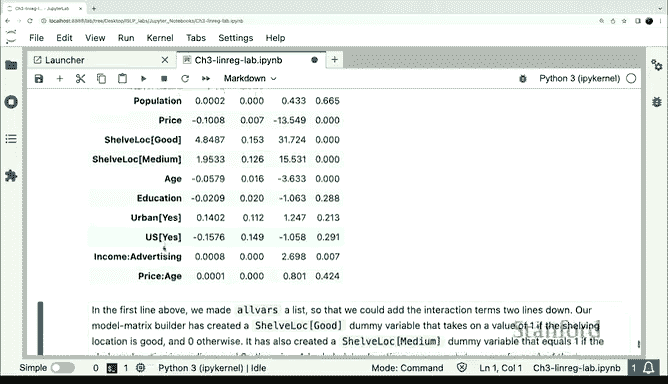


本节课中我们一起学习了如何在线性模型中引入交互项、多项式项以及处理分类预测变量。这些高级工具使我们能够构建更灵活、更强大的模型来捕捉数据中的复杂模式。下一节实验课，我们将进入分类问题的学习。