# Python 版 22：逻辑回归 📊

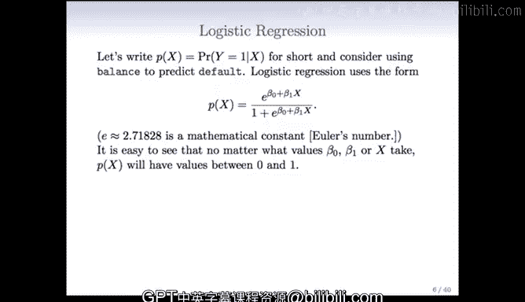

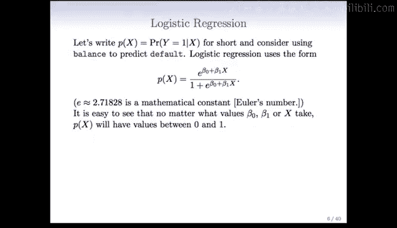

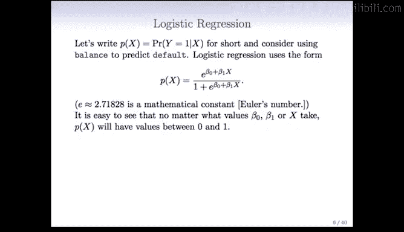

在本节课中，我们将要学习逻辑回归模型。这是一种用于处理二分类问题的统计方法，例如预测某人是否会违约。我们将了解其基本形式、如何估计模型参数，以及如何利用模型进行预测。

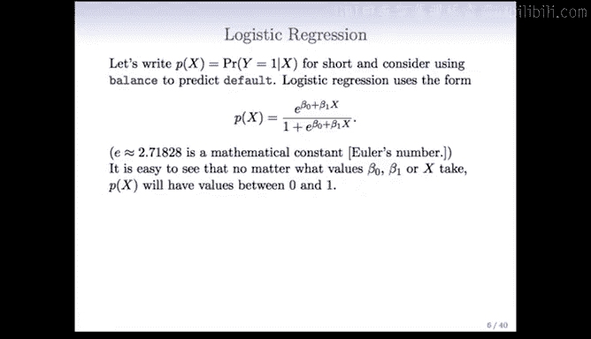

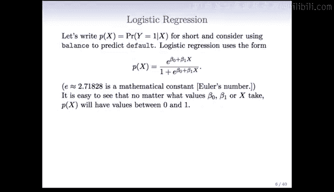

---

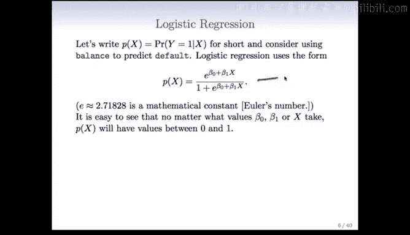

## 逻辑回归模型形式

上一节我们介绍了线性模型，本节中我们来看看逻辑回归模型。逻辑回归模型的核心思想是，我们希望预测一个事件发生的概率，而概率值必须介于0和1之间。

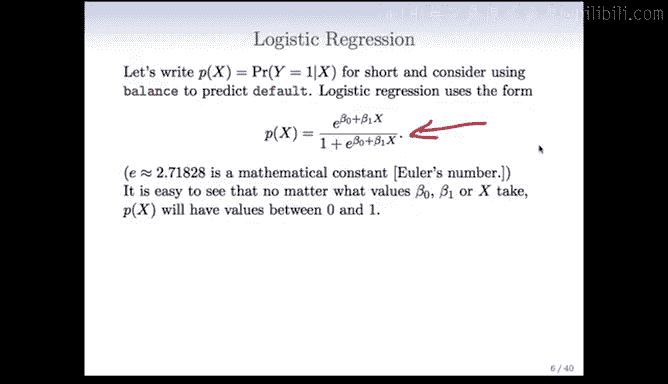

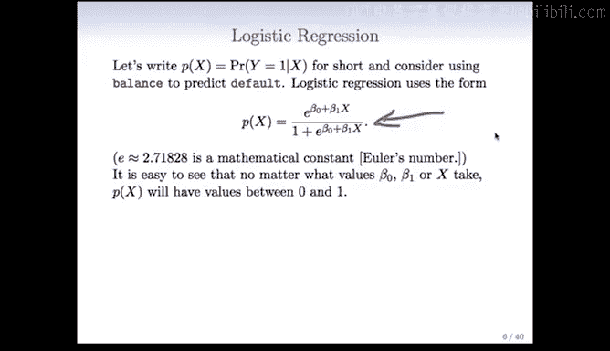

逻辑回归模型通过一个特定的数学变换来实现这一点。模型形式如下：

**P(x) = e^(β₀ + β₁x) / (1 + e^(β₀ + β₁x))**

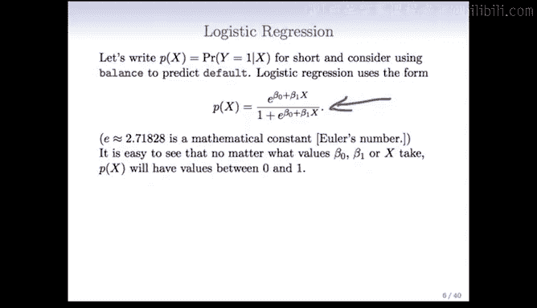

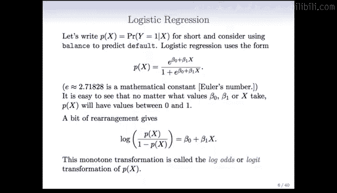

其中：
*   **P(x)** 表示在给定预测变量 `x` 的条件下，结果 `y=1` 的概率。
*   **e** 是自然常数（约等于2.718）。
*   **β₀** 是模型的截距项。
*   **β₁** 是预测变量 `x` 的系数。

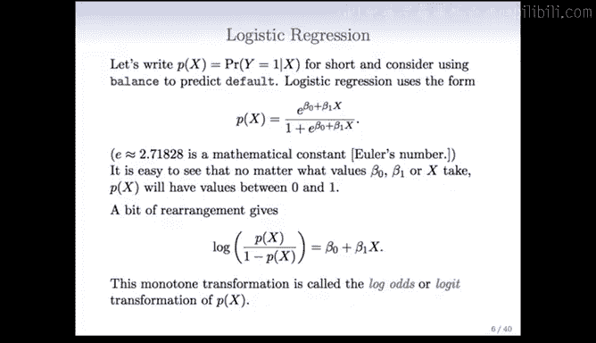

这个公式确保了无论 `β₀ + β₁x` 的值是多少，计算出的 `P(x)` 始终在0到1之间。当 `β₀ + β₁x` 非常大时，`P(x)` 趋近于1；当它非常小时，`P(x)` 趋近于0。

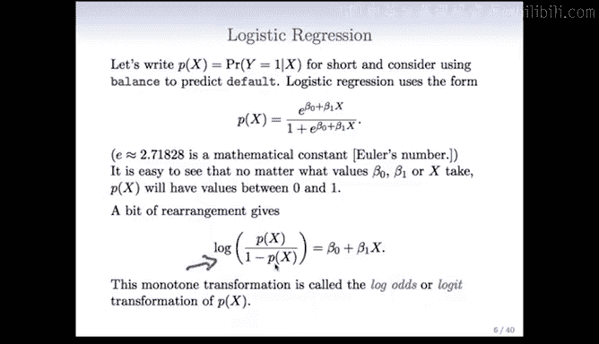

---

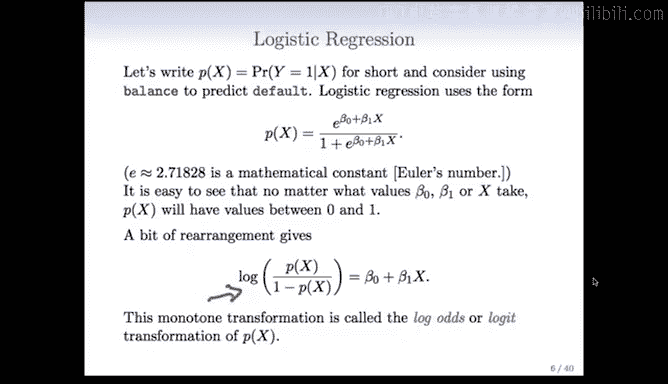

## 逻辑变换（Logit）

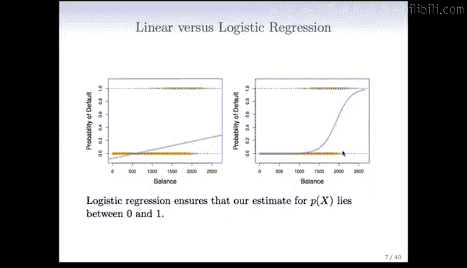

逻辑回归模型之所以得名，源于一个关键的变换。我们可以对概率 `P(x)` 进行一个单调变换，得到线性形式。

这个变换称为**逻辑变换**或**对数几率**变换：

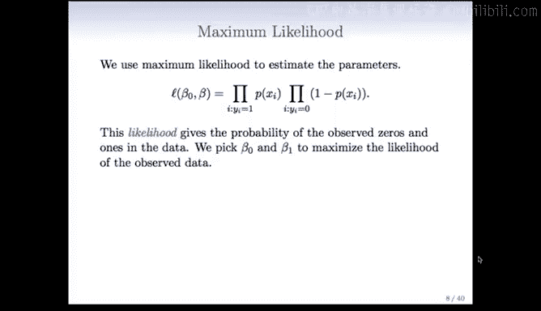

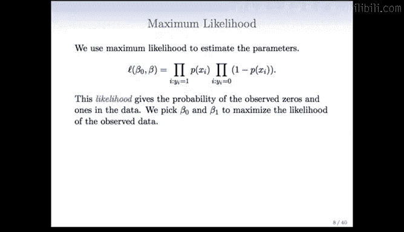

**log( P(x) / (1 - P(x)) ) = β₀ + β₁x**

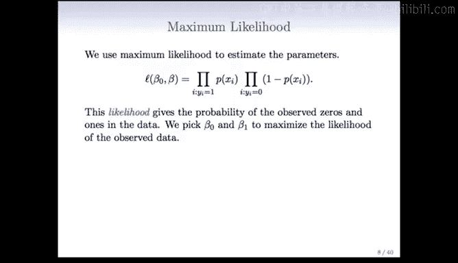

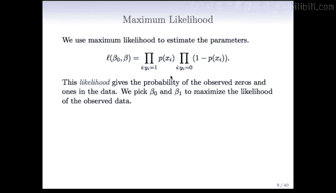

等式的左边 `log( P(x) / (1 - P(x)) )` 被称为**对数几率**。通过这个变换，我们将原本在0到1之间变化的概率，映射到了一个可以取任意实数值的线性模型上。这使得我们可以使用类似于线性回归的框架来处理分类问题。

---

## 模型参数估计：最大似然法

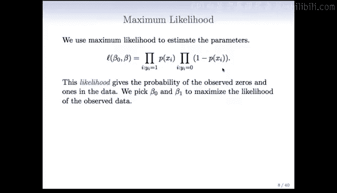

我们已经定义了模型，那么如何从数据中估计模型的参数 `β₀` 和 `β₁` 呢？最常用的方法是**最大似然估计**。

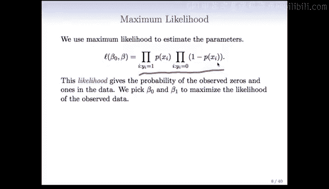

最大似然法的思想很直观：我们希望找到一组参数值，使得在这组参数下，我们**实际观测到的数据**出现的可能性（即“似然”）最大。

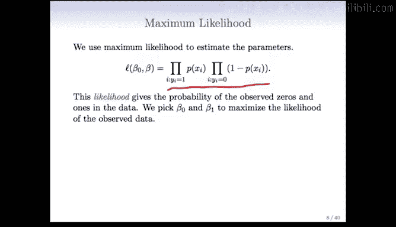

以下是最大似然估计的步骤：

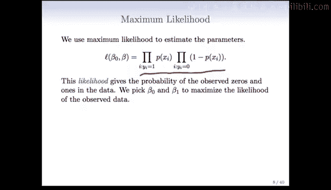

1.  我们有一系列观测数据，每个观测包括一个预测变量 `x_i` 和一个二分类结果 `y_i`（0或1）。
2.  对于给定的参数 `β₀` 和 `β₁`，我们可以根据逻辑回归公式计算出每个观测 `i` 结果为1的概率 `P(x_i)`。
3.  假设各个观测之间相互独立，那么观测到整个数据序列的联合概率（似然函数）是所有单个观测概率的乘积。对于结果为1的观测，其贡献为 `P(x_i)`；对于结果为0的观测，其贡献为 `1 - P(x_i)`。
4.  最大似然估计就是寻找能使这个联合概率值最大的 `β₀` 和 `β₁`。

在实际操作中，我们通常使用统计软件（如R语言中的 `glm` 函数或Python中的 `statsmodels`、`sklearn` 库）来高效地完成这个优化计算。

---

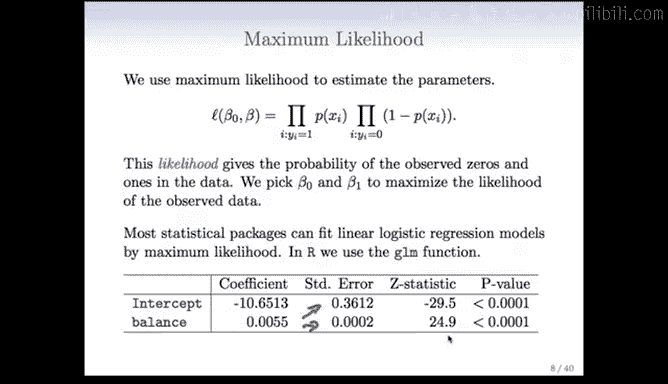

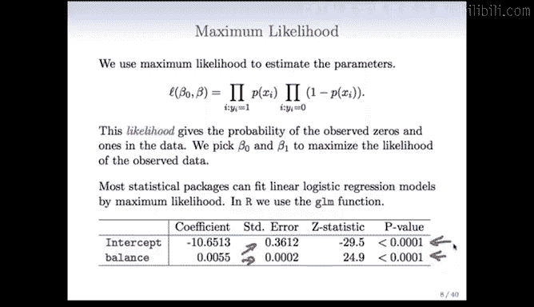

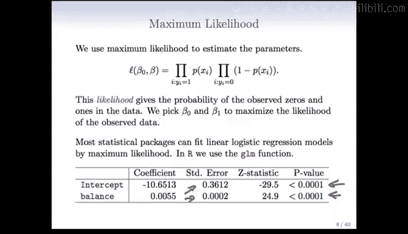

## 模型结果解读

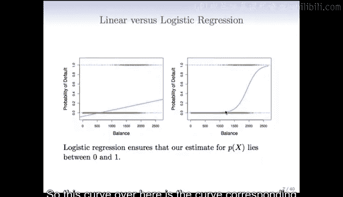

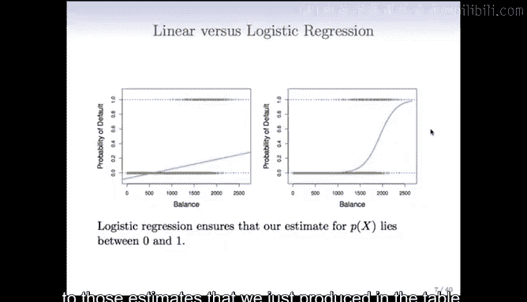

当我们用软件拟合一个逻辑回归模型后，会得到类似下表的输出结果：

| 系数 | 估计值 | 标准误 | Z统计量 | P值 |
| :--- | :--- | :--- | :--- | :--- |
| 截距 (β₀) | -10.6513 | 0.3612 | -29.5 | <0.001 |
| 余额 (β₁) | 0.0055 | 0.0002 | 24.9 | <0.001 |

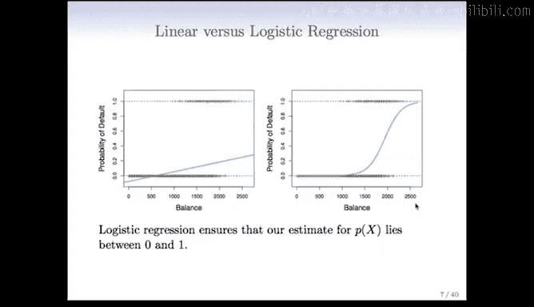

以下是解读方法：
*   **系数估计**：`β₀ = -10.65`, `β₁ = 0.0055`。这些值定义了之前提到的S形曲线。
*   **标准误**：衡量了系数估计的准确性。
*   **Z统计量**：系数估计值除以其标准误得到，可以理解为一种标准化的斜率。它用于检验系数是否显著不为零。
*   **P值**：与Z统计量相关联。例如，余额（Balance）的P值远小于0.001，提供了非常强的证据表明余额与违约概率之间存在关联（即 `β₁ ≠ 0`）。

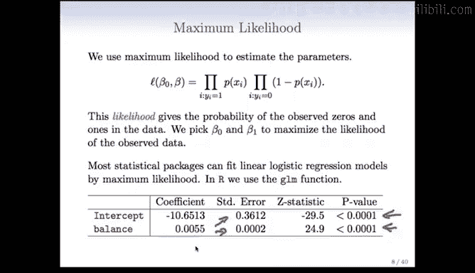

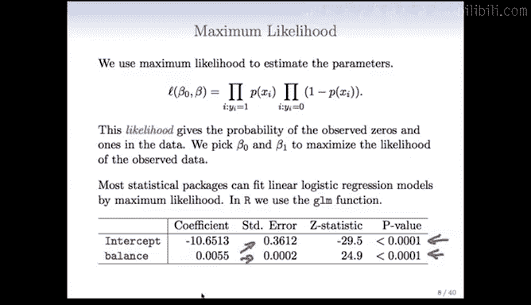

**注意**：在解释系数 `β₁ = 0.0055` 时，必须考虑预测变量的单位。这里的单位是“美元”，因此系数意味着“每增加1美元余额，对数几率增加0.0055”。如果余额增加1000美元，其对对数几率的影响则是 `0.0055 * 1000 = 5.5`，这是一个相当大的变化，这也解释了为什么概率曲线看起来变化很陡峭。

---

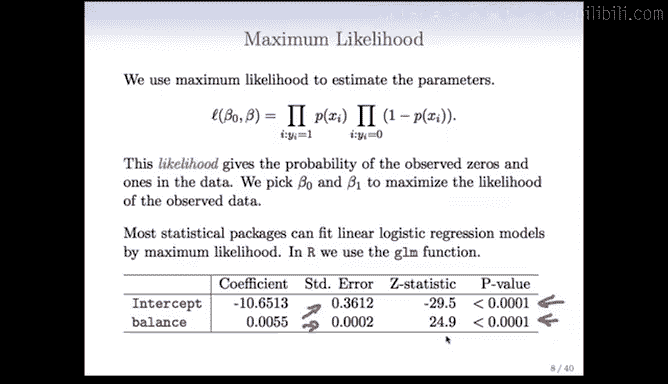

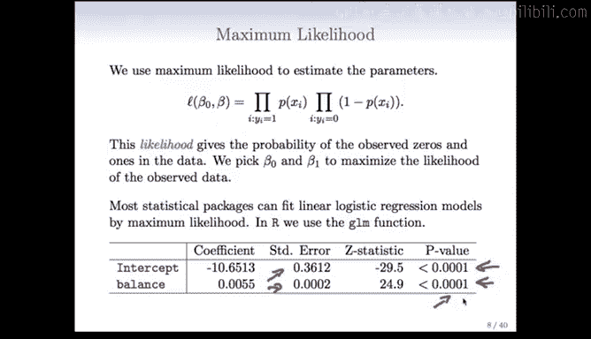

## 进行预测

拟合模型后，我们可以用它来对新观测进行预测。预测的是事件发生的概率。

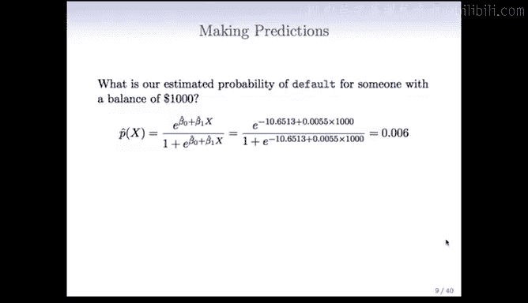

例如，使用上面估计的模型：
*   对于一个余额为 **$1000** 的客户，其违约概率的预测计算如下：
    `P(1000) = e^(-10.65 + 0.0055*1000) / (1 + e^(-10.65 + 0.0055*1000)) ≈ 0.0058`
    这个概率非常低。
*   对于一个余额为 **$2000** 的客户：
    `P(2000) = e^(-10.65 + 0.0055*2000) / (1 + e^(-10.65 + 0.0055*2000)) ≈ 0.586`
    违约概率显著升高。

---

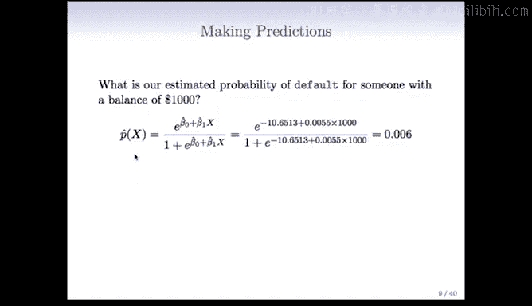

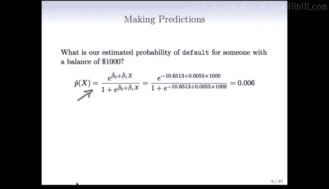

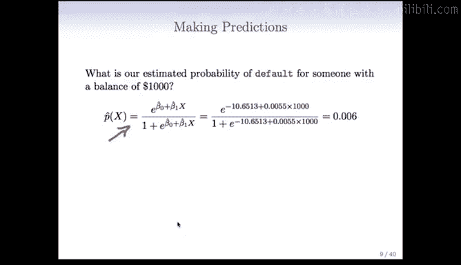

## 处理分类预测变量

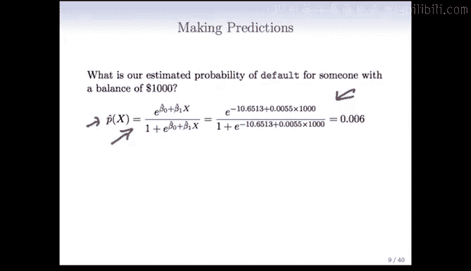

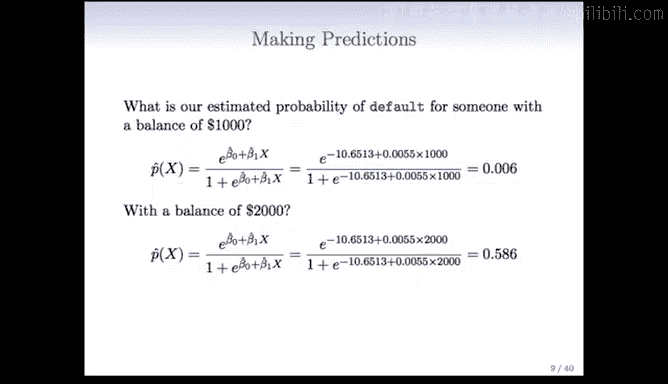

逻辑回归同样可以处理分类预测变量。例如，我们有一个变量“学生身份”（Student），它是一个二分类变量（是学生=1，不是学生=0）。

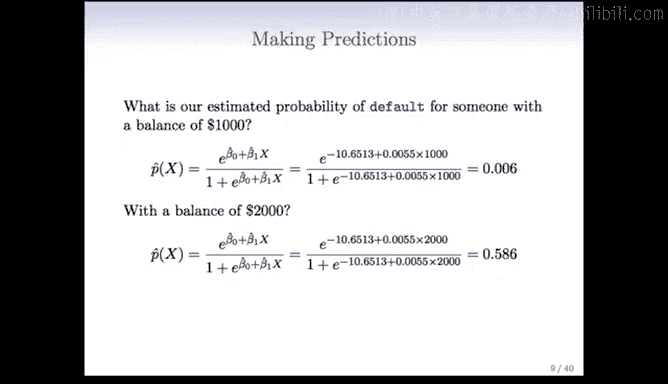

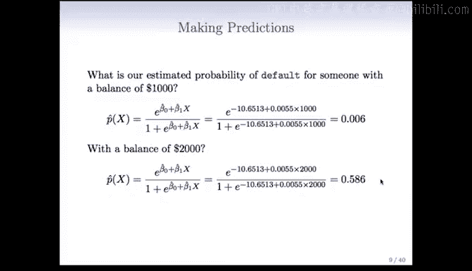

拟合一个仅包含“学生身份”作为预测变量的逻辑回归模型，可能得到如下系数：
*   截距 (β₀): -3.5041
*   学生身份 (β₁): 0.4049

我们可以进行预测：
*   对于一个**是学生**的客户：`P = e^(-3.5041 + 0.4049*1) / (1 + e^(-3.5041 + 0.4049*1)) ≈ 0.0431`
*   对于一个**不是学生**的客户：`P = e^(-3.5041 + 0.4049*0) / (1 + e^(-3.5041 + 0.4049*0)) ≈ 0.0292`

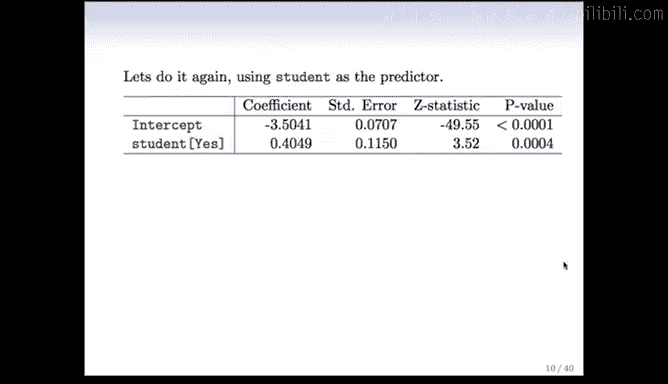

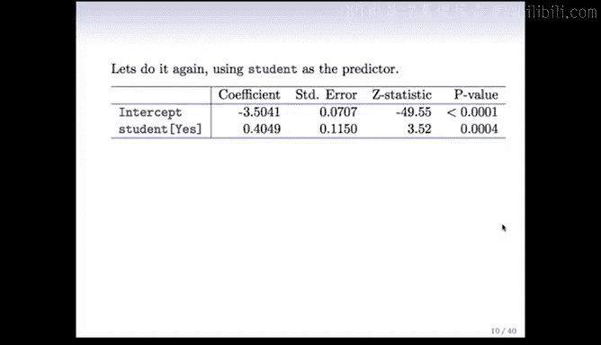

结果显示，在该简单模型中，学生的违约预测概率略高于非学生。在后续课程中，我们会学习如何将多个变量（如学生身份和余额）同时纳入一个模型，并考虑它们之间可能的交互作用。

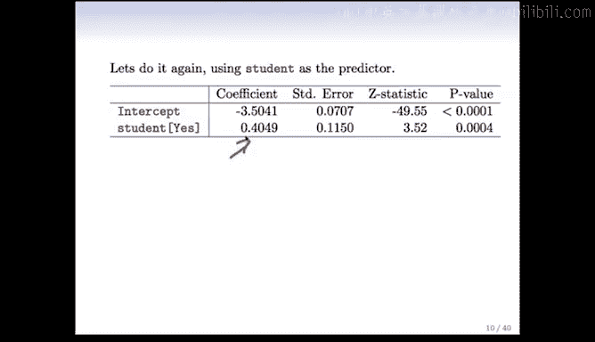

---

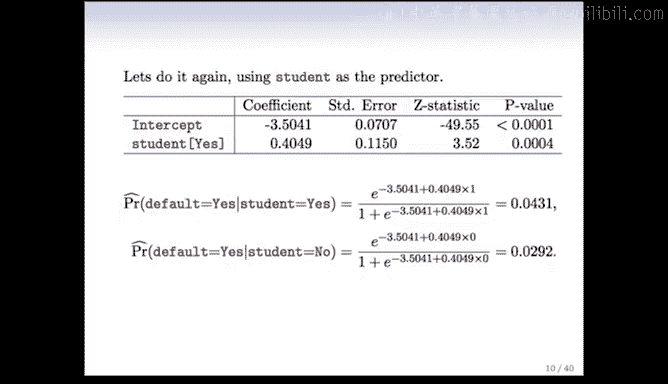

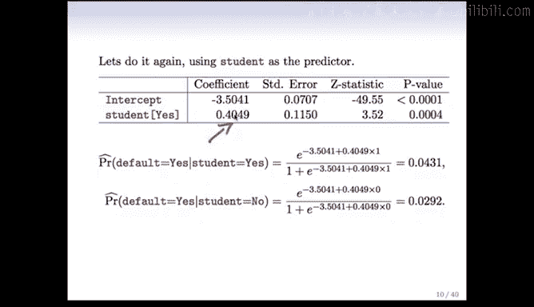

## 总结

本节课中我们一起学习了逻辑回归的核心内容：
1.  **模型目标**：预测二分类结果的概率。
2.  **模型形式**：通过逻辑函数 `P(x) = e^(β₀+β₁x) / (1 + e^(β₀+β₁x))` 将线性组合映射到(0,1)区间。
3.  **逻辑变换**：`log(P/(1-P)) = β₀ + β₁x`，将对数几率与预测变量线性关联。
4.  **参数估计**：使用**最大似然估计**法从数据中寻找最优参数。
5.  **结果解读**：关注系数的符号、大小、Z统计量和P值，并注意预测变量的单位。
6.  **模型预测**：将新的预测变量值代入模型，计算得到事件发生的概率。
7.  **变量类型**：逻辑回归可以同时处理连续型和分类型预测变量。

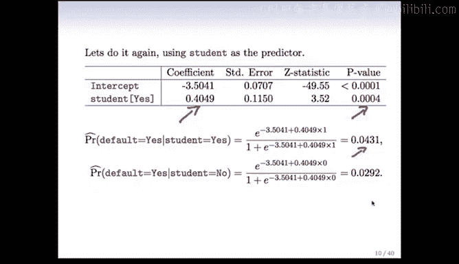

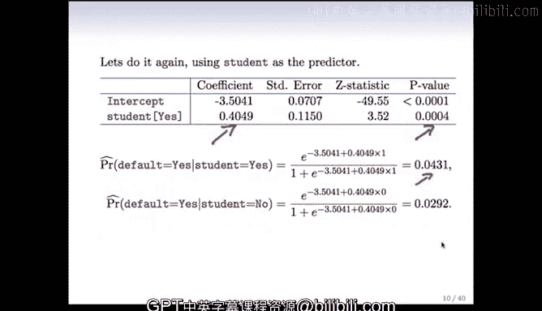

逻辑回归是分类问题中最基础且强大的工具之一，为理解更复杂的分类模型奠定了重要基础。