# Python 版 23：多元逻辑回归 📊

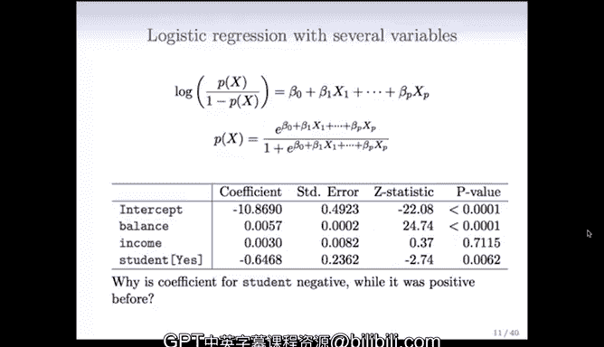

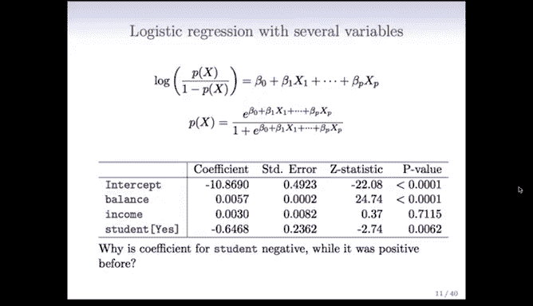

在本节课中，我们将要学习如何将逻辑回归模型从单一预测变量扩展到多个预测变量，即构建**多元逻辑回归模型**。我们将通过信用卡违约和南非心脏病研究两个案例，深入理解模型系数的解释以及变量间相关性带来的影响。

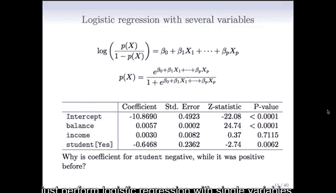

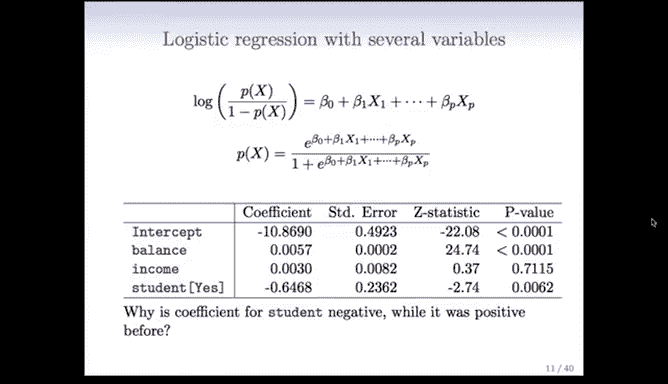

---

## 从单变量到多变量模型 🔄

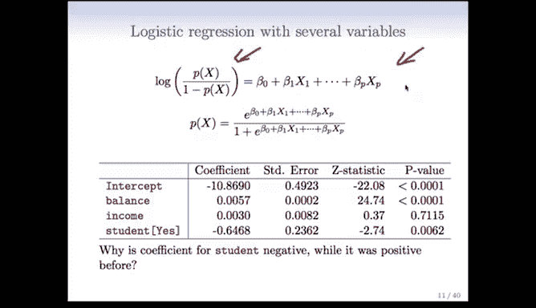

上一节我们介绍了仅使用单一变量（如信用卡余额）的逻辑回归模型。本节中我们来看看，当我们拥有一个变量集合并希望同时考虑所有变量时，应该怎么做。

在这种情况下，我们将构建一个**多元逻辑回归模型**。

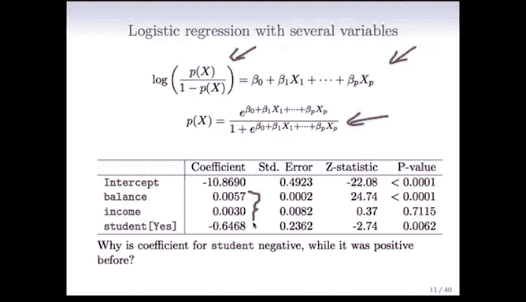

概率的变换形式与之前相同，只是现在我们有了一个包含截距项和每个变量系数的通用线性模型：

$$
\log\left(\frac{p(X)}{1-p(X)}\right) = \beta_0 + \beta_1 X_1 + \beta_2 X_2 + ... + \beta_p X_p
$$

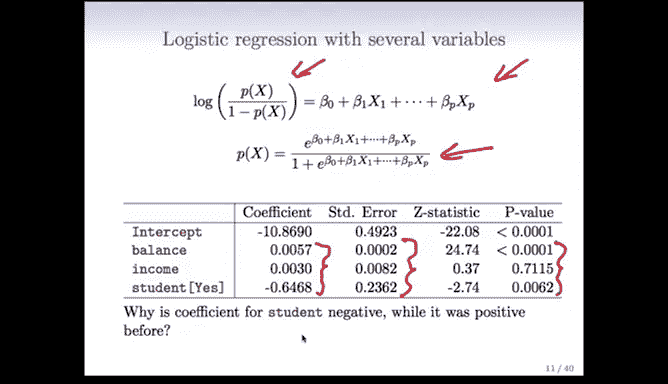

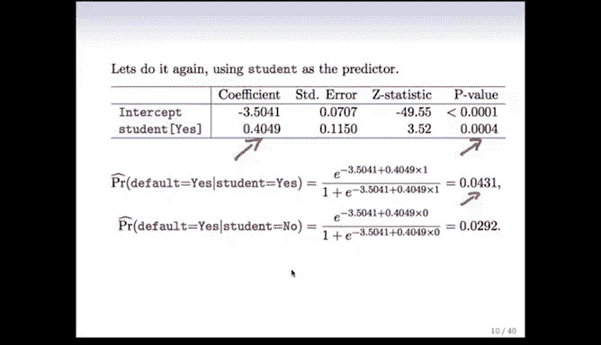

如果对这个变换进行逆运算，同样可以得到一个保证概率值在0和1之间的形式：

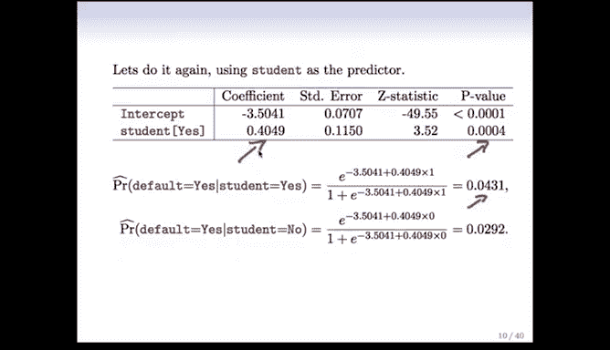

$$
p(X) = \frac{e^{\beta_0 + \beta_1 X_1 + ... + \beta_p X_p}}{1 + e^{\beta_0 + \beta_1 X_1 + ... + \beta_p X_p}}
$$

我们可以像之前一样，使用R语言中的GLM（广义线性模型）来拟合这个模型。


---

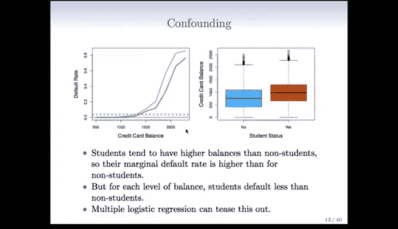

## 案例一：信用卡违约数据分析 💳

我们将变量`balance`（余额）、`income`（收入）和`student`（学生身份）一起放入模型。

以下是模型拟合后得到的结果摘要：
*   我们得到了三个系数、三个标准误、三个Z统计量和三个P值。
*   首先观察到，与单变量情况一致，`balance`和`student`是显著的，而`income`不显著。因此，似乎有两个变量是重要的。
*   但有一个相当引人注目的发现：`student`变量的系数现在是**负的**。而在之前单独测量`student`的模型中，它的系数是**正的**。

这可能是错误吗？很可能不是。我们之前在讨论线性回归模型时提到过，由于变量之间的**相关性**会影响系数的符号，因此解释多元模型中的系数是困难的。

现在我们将看到变量相关性所扮演的角色。

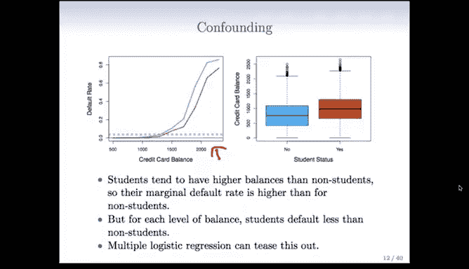

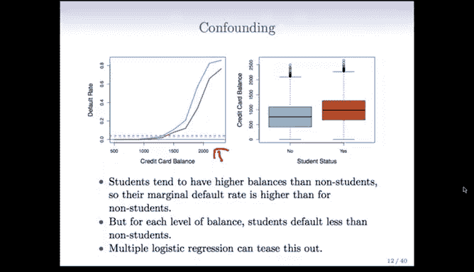

---

### 理解系数符号反转 🤔

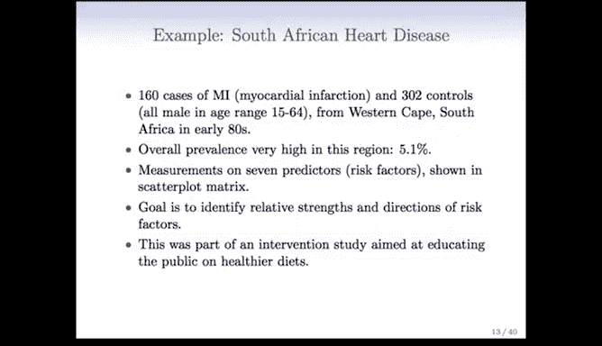

下图展示了信用卡余额与违约率的关系，并根据学生身份（棕色代表“是”，蓝色代表“否”）进行了着色。


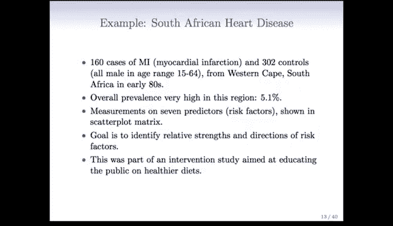

*   学生往往比非学生拥有更高的信用卡余额。由于余额本身对违约率有很强的影响，这使得单独看`student`变量时，学生的边际违约率看起来更高。
*   然而，从左图的散点分布可以看出，**在每一个固定的信用卡余额水平上**，学生的违约率实际上低于非学生。

因此，当单独考察`student`变量时，它与`balance`变量**混杂**在一起。`balance`的强烈效应使得学生看起来违约更严重。而多元逻辑回归能够考虑这些相关性，从而揭示出在控制余额水平后，学生身份实际上与**更低**的违约风险相关。

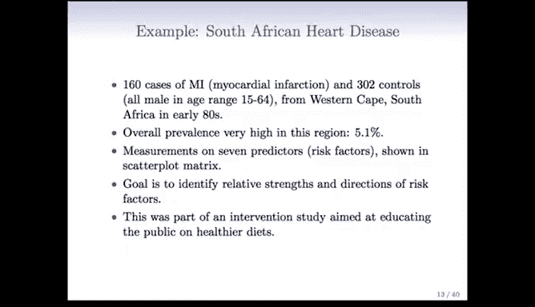

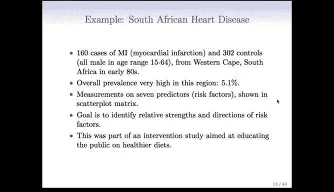

---

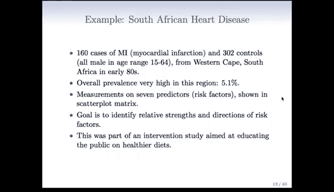

## 案例二：南非心脏病研究 ❤️

让我们继续看一个包含更多变量的例子。这是在课程引言中讨论过的**南非心脏病数据集**。

这项研究是一项回顾性病例对照研究：
*   研究人员找到了160名曾患心肌梗塞（即心脏病发作）的白人男性病例。
*   在众多未患心脏病的人群中，他们抽取了302名对照个体。
*   所有参与者均为15-64岁、来自南非西开普地区的白人男性。这项研究在20世纪80年代初进行，该地区的心脏病总体患病率高达5.1%，属于高风险区域。

研究测量了7个预测变量（在此背景下也称为风险因素）。

以下是这些变量的散点图矩阵，它是一种将每个变量与其他所有变量进行配对绘制的有效方式。图中根据心脏病状态进行了着色（红棕色点代表病例，蓝色点代表对照）。


例如，看最上方的图，如果烟草使用量高且收缩压高，则倾向于出现红棕色点，即这些人更可能患过心脏病。

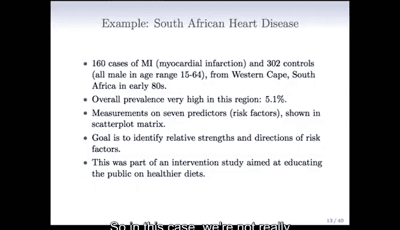

每个子图都展示了两个风险因素的配对关系，并编码了心脏病状态。其中一个有趣的变量是`famhist`（家族史），它是一个分类变量（0/1），并且是一个重要的风险因素。从图中可能看出，右侧类别（有家族史）中的红棕色点比左侧类别更多。

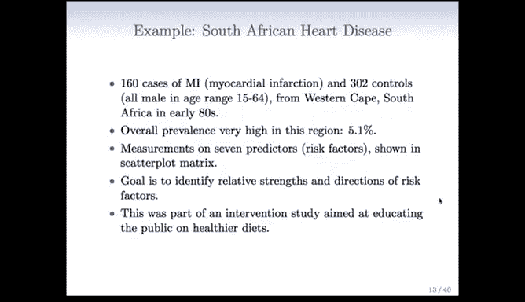

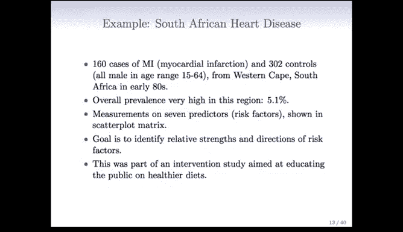

在这个案例中，我们的主要目的并非预测患心脏病的概率，而是**理解各个风险因素在心脏病风险中的作用**。这项研究本身是一项旨在教育公众采用更健康饮食的干预性研究。

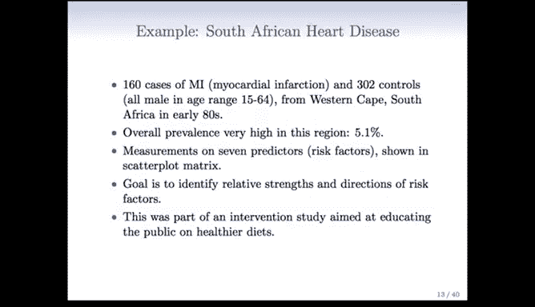

---

### 模型结果与解读 📈

以下是使用GLM对心脏病数据拟合逻辑回归模型的结果。用于拟合的R代码非常简单：

```r
heartfit <- glm(chd ~ ., data = heart, family = binomial)
summary(heartfit)
```

我们得到了每个变量的系数、标准误、Z值和P值。

结果有些复杂：
*   我们对截距项不太感兴趣。
*   `tobacco`（烟草使用）是显著的。
*   `ldl`（低密度脂蛋白，一种“坏”胆固醇指标）是显著的。
*   `famhist`（家族史）非常显著。
*   `age`（年龄）是显著的，我们知道心脏病风险随年龄增长而增加。
*   有趣的是，`obesity`（肥胖）和`alcohol`（酒精使用）在这里并不显著。这似乎有点令人惊讶。

这再次是一个**变量相关**的案例。回顾之前的散点图矩阵，可以看到变量之间存在大量相关性（例如年龄与烟草使用相关，酒精使用与LDL似乎呈负相关等）。这些相关性会产生影响。

例如，`ldl`在模型中显著，一旦`ldl`被纳入模型，`alcohol`可能就不再被需要了，因为这些变量彼此之间可以**互为替代**。

---

## 总结 📝

本节课中我们一起学习了：
1.  **构建多元逻辑回归模型**，其核心形式为线性预测器的逻辑变换。
2.  认识到在多元模型中，**变量间的相关性**会极大地影响系数的符号和解释，这与单变量模型不同。
3.  通过**信用卡违约案例**，我们看到了`student`变量系数从正变负的现象，并理解了这是由于在控制`balance`变量后，揭示了学生身份的真实效应。
4.  通过**南非心脏病研究案例**，我们实践了用多个风险因素拟合模型，并观察到某些变量（如酒精使用）因与其他显著变量（如LDL）相关而在多元模型中变得不显著。

关键启示是：在解释多元逻辑回归的系数时，必须谨慎，并始终考虑预测变量之间可能存在的复杂相互关系。