# Python 版 24：病例对照抽样与多项逻辑回归 📊

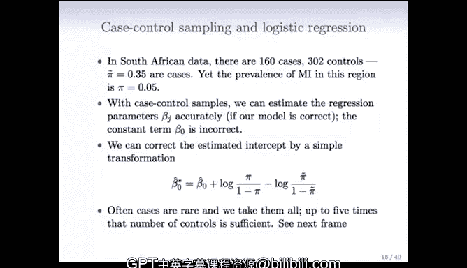


在本节课中，我们将学习逻辑回归中的两个重要概念：病例对照抽样和多项逻辑回归。我们将了解当数据类别不平衡时，如何通过抽样来高效地构建模型，以及如何将二分类逻辑回归推广到多分类问题。

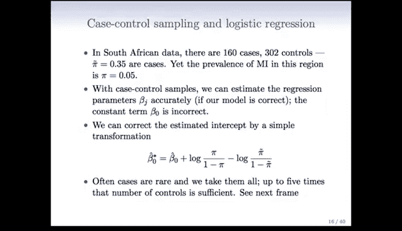


---

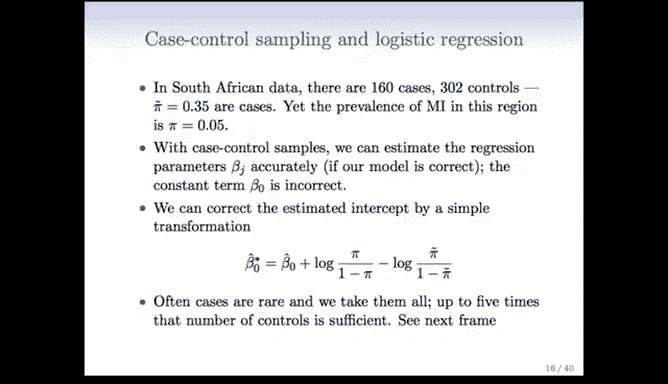

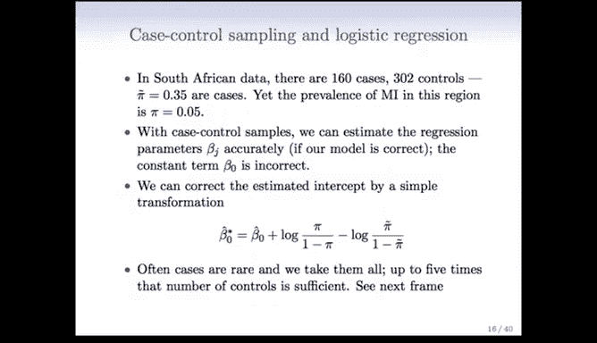

## 病例对照抽样 🧪

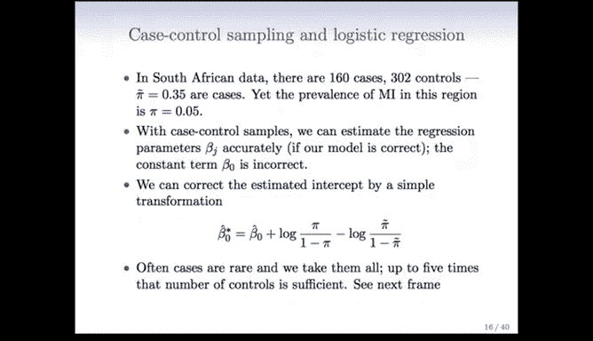

上一节我们介绍了逻辑回归的基本原理，本节中我们来看看一种在流行病学研究中常用的数据收集方法——病例对照抽样。


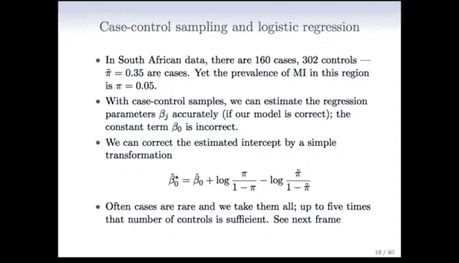


在之前讨论的南非心脏病研究中，目标人群的心脏病患病风险约为5%。然而，研究样本包含了160个病例（患病）和302个对照（未患病），这使得样本中的患病风险约为35%。


```
样本患病风险 = 病例数 / 总样本数 = 160 / (160 + 302) ≈ 0.35
```

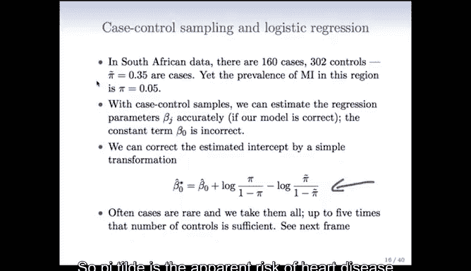

这似乎意味着模型会高估患病概率。

病例对照抽样是流行病学中，尤其是在研究罕见疾病时，最常用的工具之一。其操作方法是：尽可能找到所有病例，然后从对照（未患病）群体中抽取一个样本。

以下是进行病例对照抽样的原因：
*   当疾病罕见时，前瞻性研究（跟踪大量人群多年）成本高昂且耗时。
*   病例对照抽样是回顾性的，它从已知结果的个体（病例和对照）开始，然后追溯记录其风险因素。
*   这种方法可以快速获得大量病例数据，而无需等待多年。

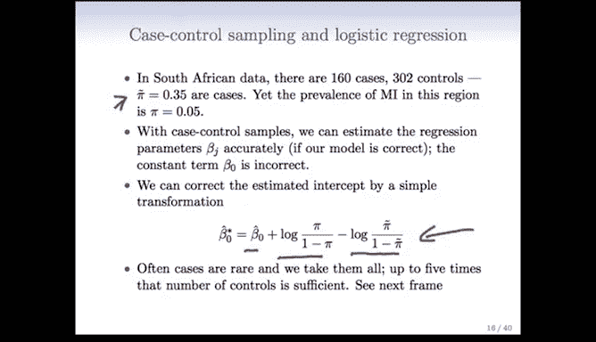

对于逻辑回归模型，一个重要的性质是：即使使用了病例对照抽样数据，只要模型设定正确，我们仍然可以无偏地估计出与预测变量（X）相关的回归系数。然而，模型的截距项（常数项）估计将是错误的。

截距项可以通过一个简单的转换进行校正。以下是校正公式：

设：
*   `π_sample` 为样本中的“表观”患病风险（本例中为0.35）。
*   `π_true` 为目标人群中的真实患病风险（本例中为0.05）。
*   `β0_estimated` 为从样本中直接估计出的原始截距。

则校正后的截距 `β0_corrected` 为：
```
β0_corrected = β0_estimated + log( π_true / (1 - π_true) ) - log( π_sample / (1 - π_sample) )
```
其中，`log( p / (1-p) )` 称为事件发生比的对数（Log-Odds）。

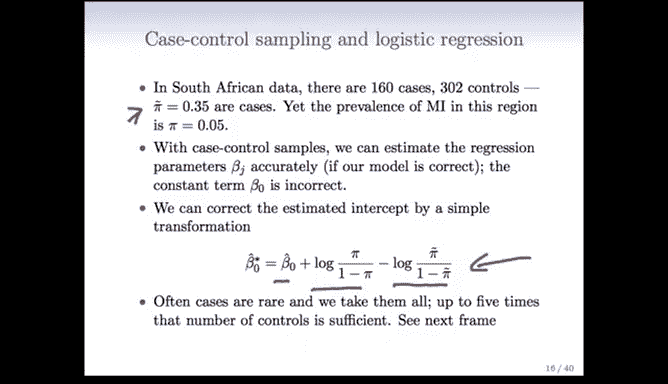

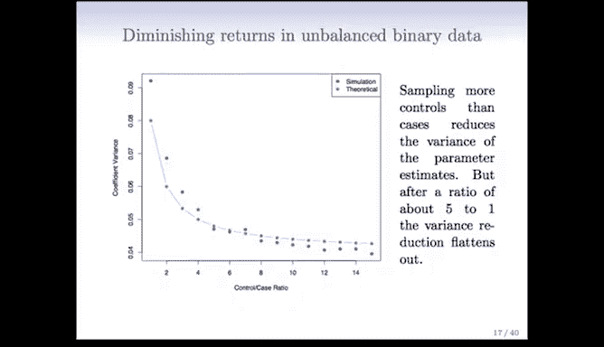

## 类别不平衡与抽样策略 ⚖️

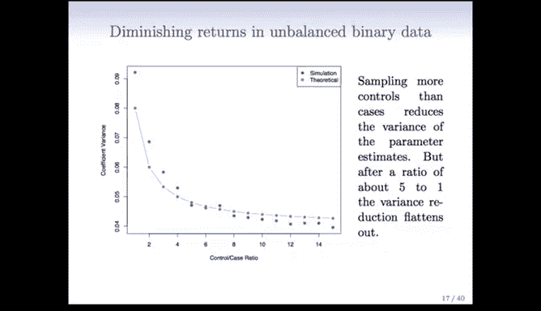

病例对照抽样的思想在现代大数据集中处理类别不平衡问题时非常有用。

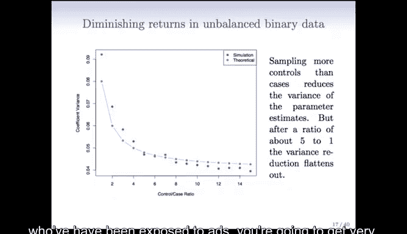

例如，在网页广告点击率预测中，用户点击广告的概率可能低于0.1%。这意味着如果随机抽取曝光记录，数据集中将包含极少的正例（点击）和大量的负例（未点击）。

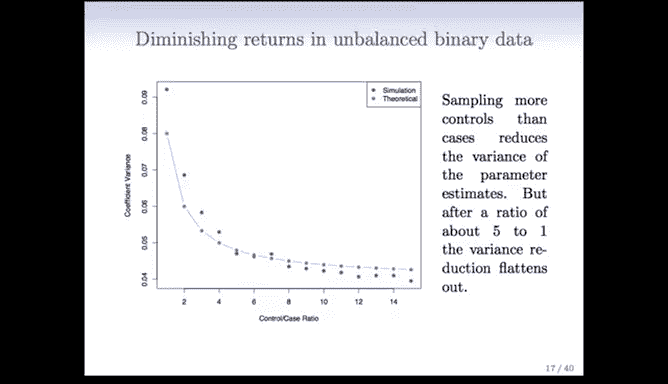

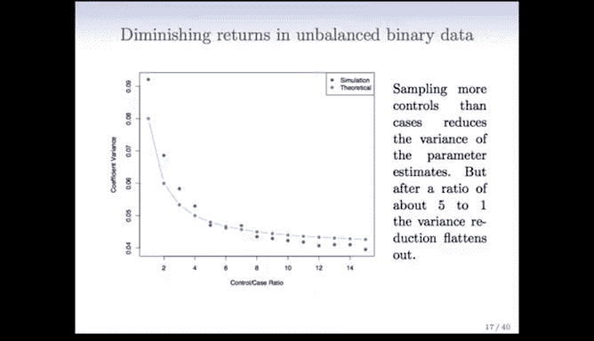

一个重要的问题是：我们是否需要使用所有的负例数据来拟合模型？根据病例对照抽样的原理，答案是否定的。我们可以对负例（对照）进行抽样。

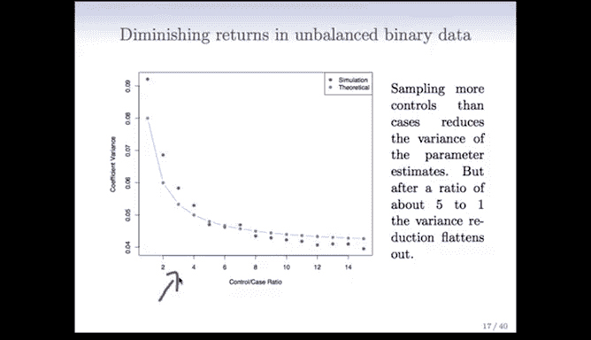

下图展示了参数估计的方差如何随对照与病例的比例变化：

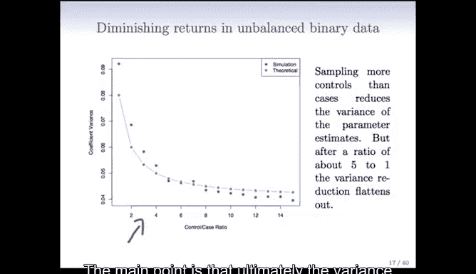

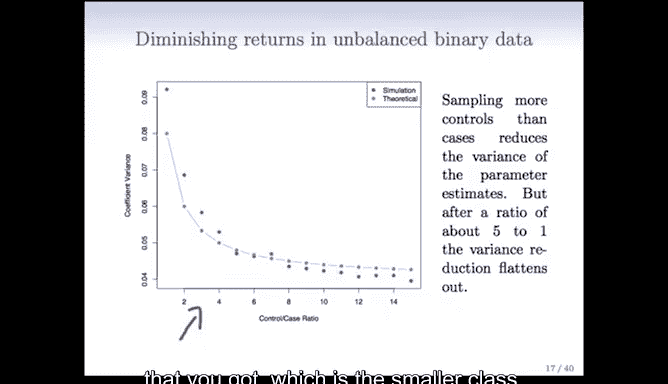

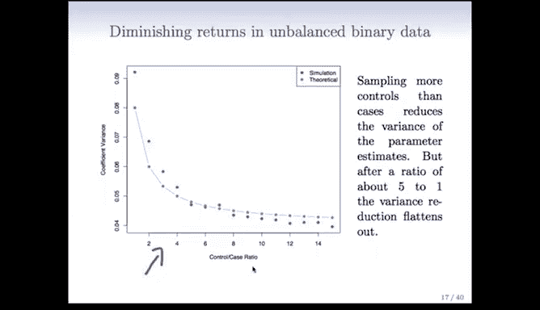


核心结论是：参数估计的方差主要取决于病例（数量较少的类别）的数量。当对照与病例的比例达到约5:1或6:1时，方差的下降趋于平缓。这意味着获取更多的对照数据带来的收益是递减的。

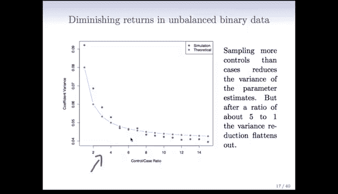

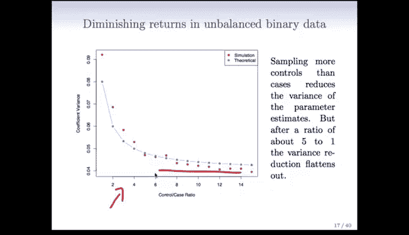

因此，在数据极度稀疏的情况下，为每个病例样本抽取大约5到6个对照样本，就可以在一个更易管理的数据集上得到稳定的模型估计。这对于处理现代超大规模数据集非常实用。

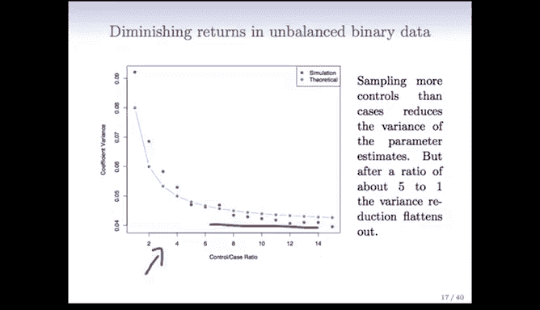

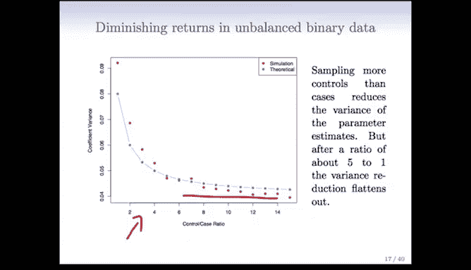

## 多项逻辑回归（多分类）🔢

前面我们讨论了二分类逻辑回归及其抽样问题，现在我们来探讨当类别超过两个时，逻辑回归如何推广。

逻辑回归可以很容易地推广到两个以上的类别，有多种方法可以实现。其中一种版本（也是R语言`glmnet`包中使用的方法）如下：

假设我们有K个类别（K > 2）。多项逻辑回归模型使用以下形式：

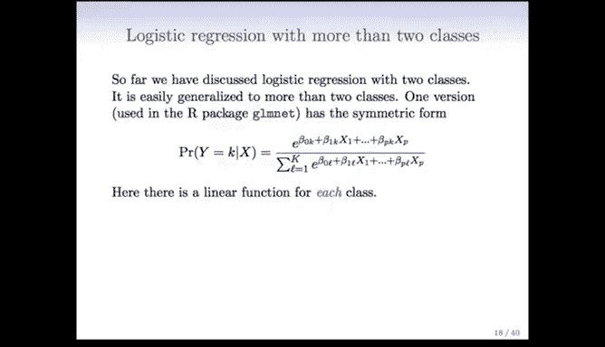

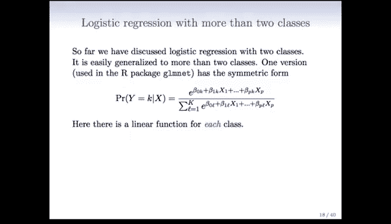

```
P(Y = k | X = x) = exp(β_{k0} + β_{k1}x1 + ... + β_{kp}xp) / Σ_{l=1}^{K} [ exp(β_{l0} + β_{l1}x1 + ... + β_{lp}xp) ]
```

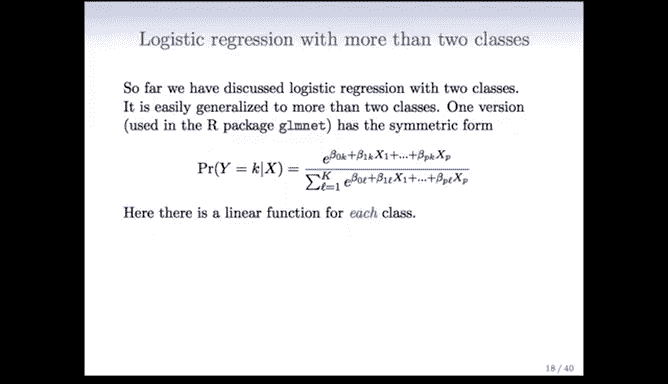

其中：
*   `P(Y = k | X = x)` 表示在给定预测变量`x`的情况下，样本属于第`k`类的概率。
*   分子是第`k`类对应的线性模型的指数函数。
*   分母是所有K个类别的线性模型指数函数之和。

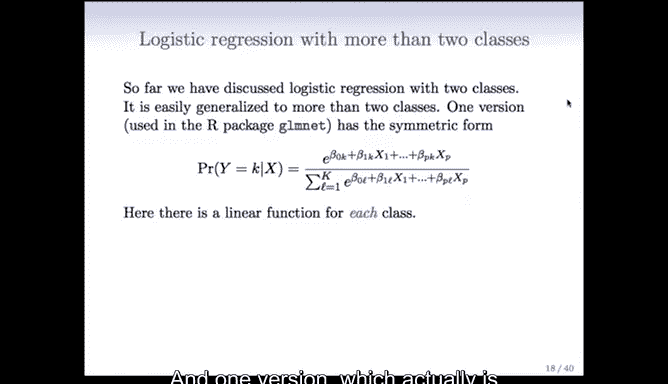

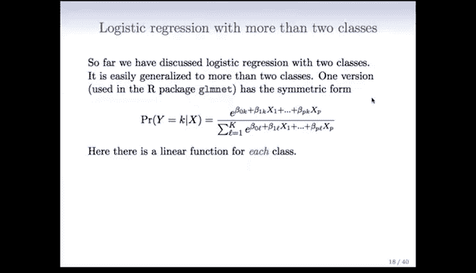

在这个模型中，每个类别都有自己的线性模型（一组系数），然后通过这个指数函数（有时称为Softmax函数）相互比较，计算出属于各个类别的概率。

对于数学基础较好的同学，可能会注意到在这个比率中可以进行一些消去，这意味着实际上只需要K-1个线性函数就足够了（就像二分类逻辑回归只需要一个函数一样）。不过，对于实际应用而言，上面这种对称的表示形式通常更有用。

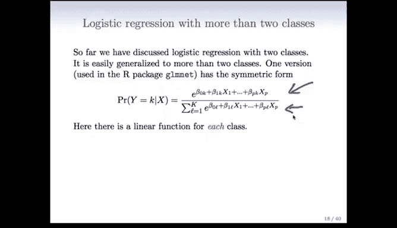

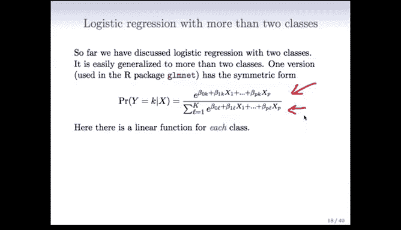

这种多分类逻辑回归也被称为多项回归。

---

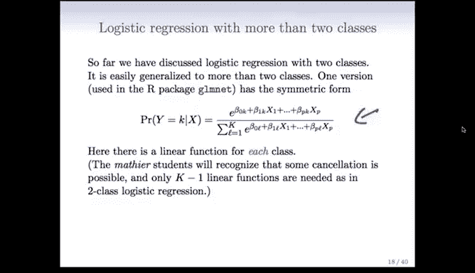

本节课中我们一起学习了：
1.  **病例对照抽样**：一种在罕见病研究中高效收集数据的方法，它允许我们校正逻辑回归模型的截距以获得无偏的系数估计。
2.  **处理类别不平衡**：通过有选择地对多数类进行抽样（如保持5:1的对照-病例比），可以在大数据集上高效构建模型。
3.  **多项逻辑回归**：将二分类逻辑回归推广到多分类问题的模型框架，使用Softmax函数为每个类别分配概率。