# Python 版 25：判别分析 📊

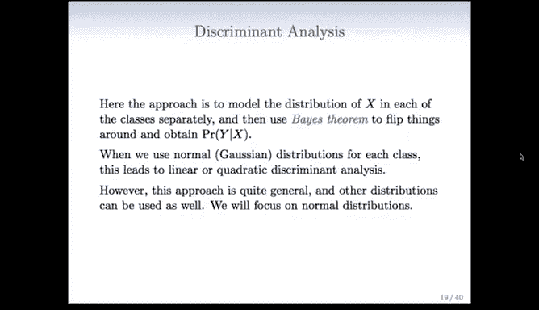

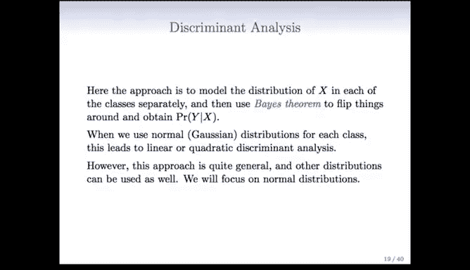

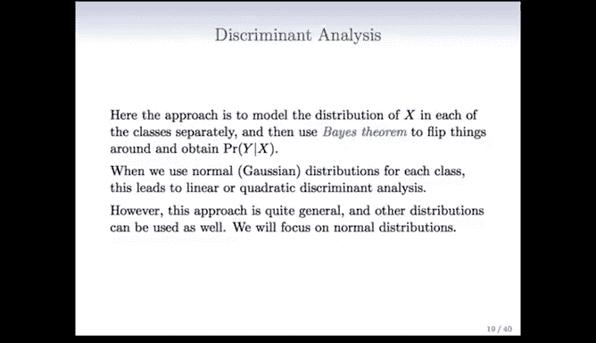

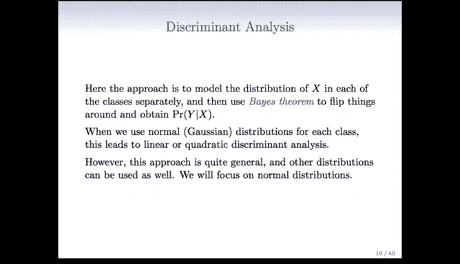

在本节课中，我们将学习一种名为判别分析的分类方法。判别分析与逻辑回归不同，它从另一个角度处理分类问题，通过分别对每个类别中预测变量X的分布进行建模，然后利用贝叶斯定理来推导给定X时Y的条件概率。

---

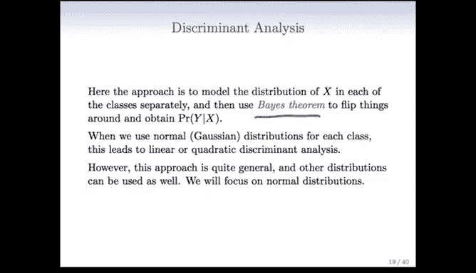

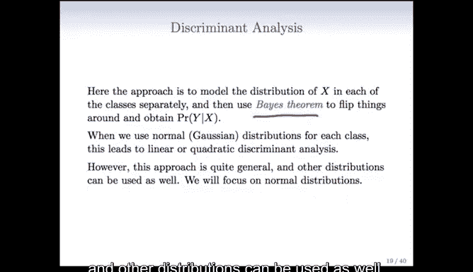

上一节我们介绍了逻辑回归，本节中我们来看看判别分析。判别分析的核心思想是：首先为每个类别单独建模预测变量X的分布，然后利用贝叶斯定理“翻转”条件，从而得到给定X时Y属于某个类别的概率。

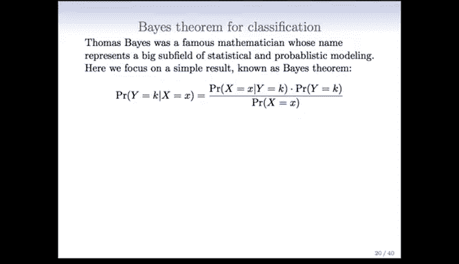

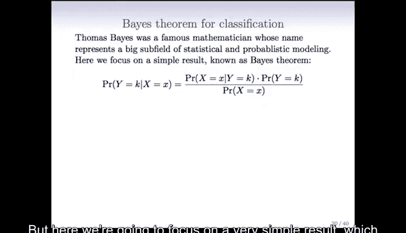

在判别分析中，我们通常假设每个类别内的X服从高斯（正态）分布。根据协方差矩阵的假设不同，这会导出线性判别分析或二次判别分析。这两种是判别分析中最常用的形式。

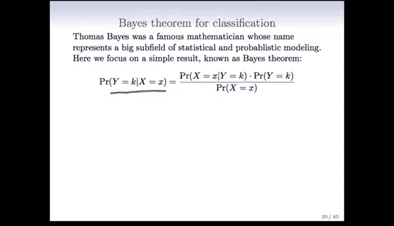

## 贝叶斯定理用于分类 🔄

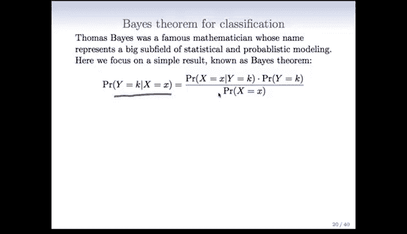

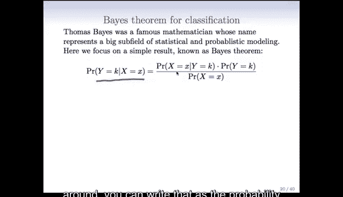

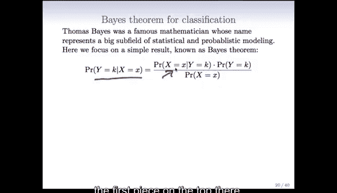

听起来可能有些复杂，但其实并不难。贝叶斯定理是概率论中的一个基本公式，它为判别分析提供了理论基础。

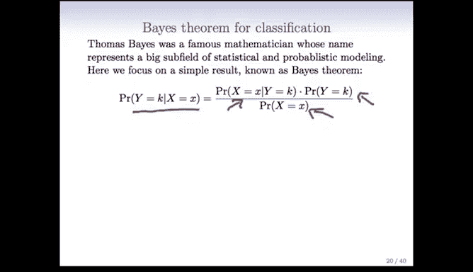

贝叶斯定理的表述如下：给定X时Y等于类别k的概率，可以表示为Y等于k时X的概率密度，乘以Y等于k的先验概率，再除以X的边际概率。

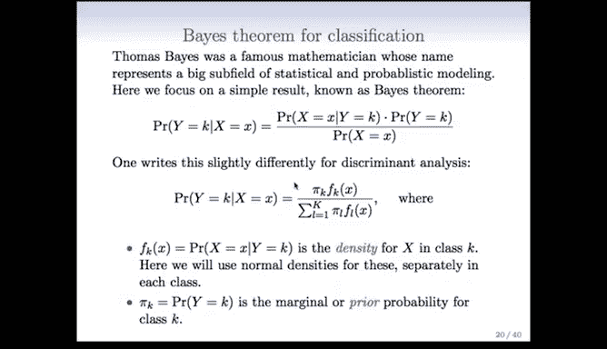

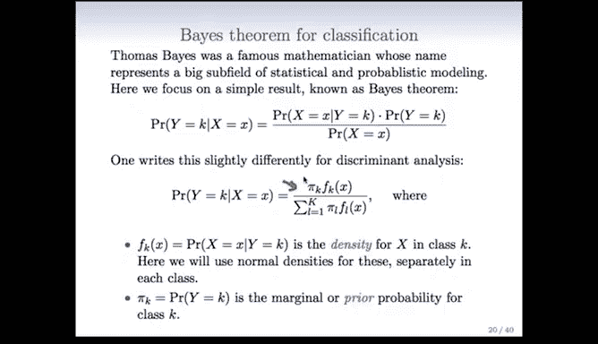

用公式表示如下：

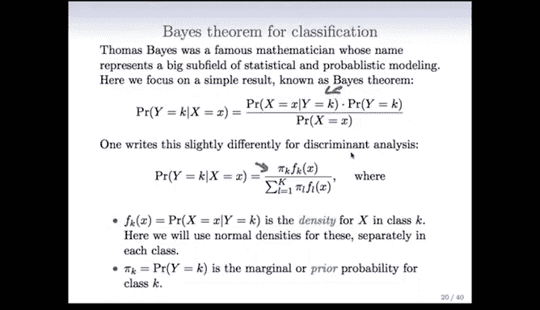

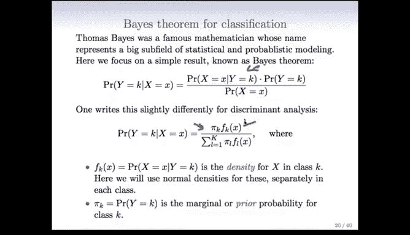

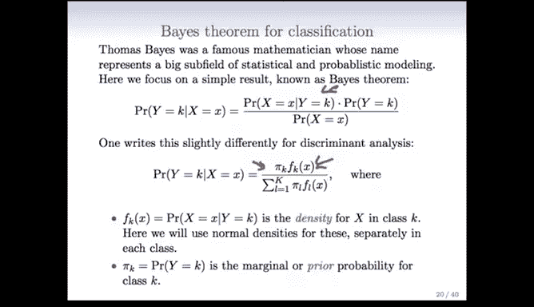

**P(Y = k | X = x) = [ f_k(x) * π_k ] / [ Σ (f_l(x) * π_l) ]**

其中：
*   **π_k** 是Y等于类别k的先验概率。
*   **f_k(x)** 是在Y等于类别k的条件下，X的概率密度函数。
*   分母是对所有类别求和，确保总概率为1。

这个公式将我们关心的后验概率 **P(Y|X)**，与我们可以建模的类别条件密度 **f_k(x)** 和先验概率 **π_k** 联系了起来。

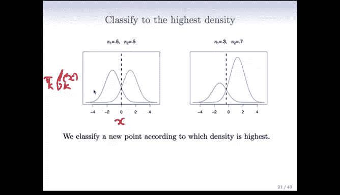

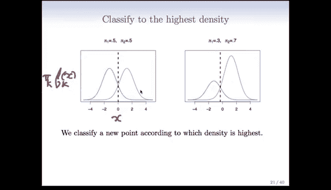

## 判别分析如何工作 🧠

为了更直观地理解，请看下面的示意图。图中展示了两个类别（绿色和紫色）在一维预测变量X上的情况。

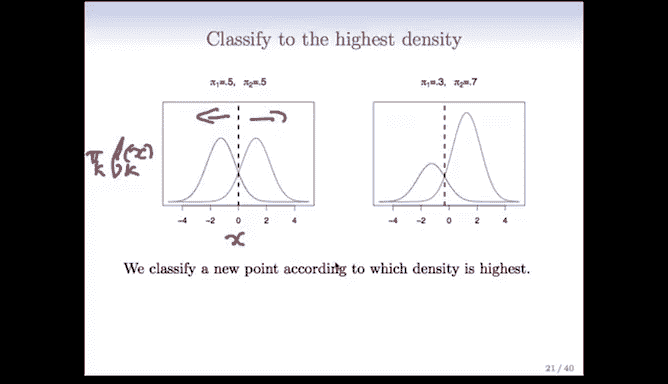

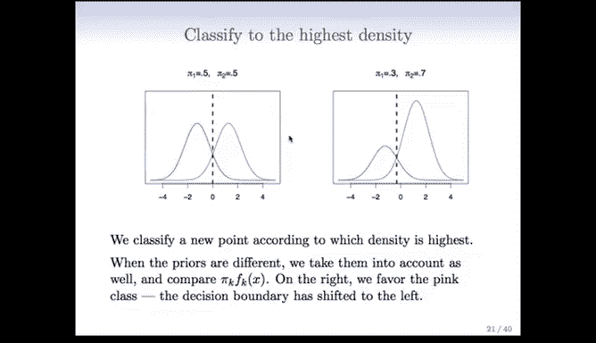

*   在左图中，两个类别的先验概率 **π_k** 相同。此时，分类边界（虚线）位于两个类别条件密度 **f_k(x)** 相等的位置。对于给定的X值，我们将其分配给密度更高的那个类别。
*   在右图中，紫色类别的先验概率 **π_k** 更高（例如0.7）。这相当于放大了紫色类别的密度曲线。结果，分类边界会向绿色类别方向移动。这是合理的，因为先验知识告诉我们紫色更常见，所以在不确定时，更倾向于将其分类为紫色。

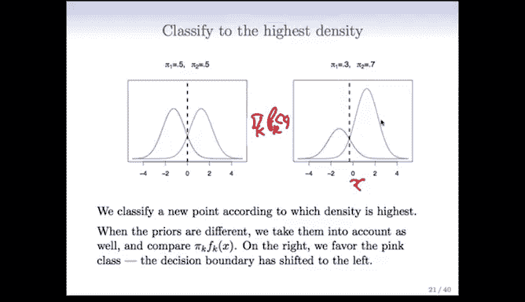

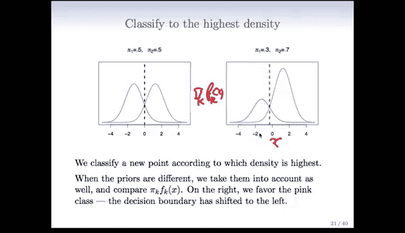

这个例子说明了先验概率 **π_k** 和类别条件密度 **f_k(x)** 如何共同决定最终的分类边界。

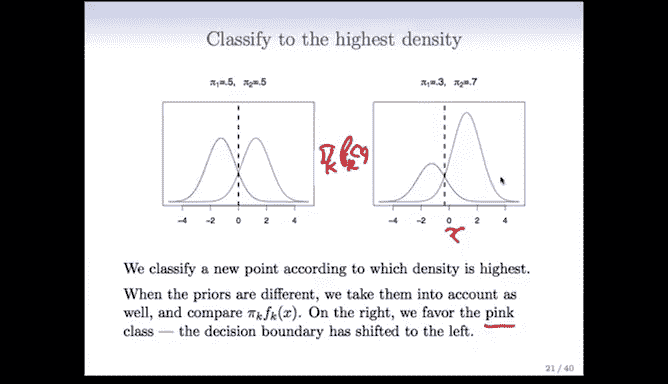

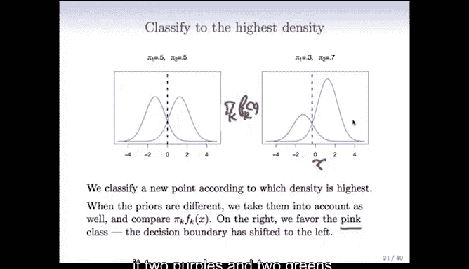

## 为什么使用判别分析？ 🤔

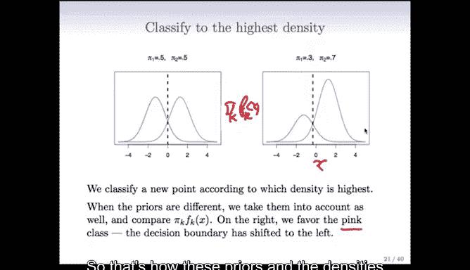

既然逻辑回归已经很不错，为什么还需要判别分析呢？主要有以下三个原因：

以下是判别分析在某些情况下优于逻辑回归的几个场景：

1.  **类别分离清晰时**：当预测变量能非常好地区分类别时，逻辑回归的参数估计会变得很不稳定（系数可能趋于无穷大）。而线性判别分析不受此问题影响，表现更稳健。
2.  **样本量小且预测变量近似正态分布时**：如果样本量较小，并且每个类别内的预测变量X大致服从正态分布，那么线性判别分析模型通常比逻辑回归更稳定。
3.  **处理多类别分类时**：逻辑回归可以推广到多类，但判别分析天然适用于多类别情况，并且如果正态分布的假设成立，基于贝叶斯定理得到的分类规则在理论上是**最优**的。

---

**本节课总结**：我们一起学习了判别分析的基本原理。判别分析通过为每个类别建立预测变量X的分布模型（常用高斯分布），并应用贝叶斯定理来进行分类。它在类别分离明显、样本量小或预测变量服从正态分布时，可能比逻辑回归更具优势。理解其背后的贝叶斯框架是掌握该方法的关键。