# Python 版 26：高斯判别分析（单变量） 📊

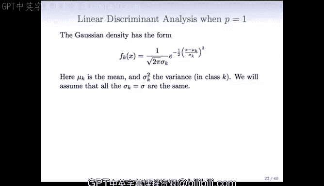

在本节课中，我们将学习高斯判别分析（Gaussian Discriminant Analysis, GDA）在单变量情况下的基本原理与数学推导。我们将从最简单的单一预测变量场景入手，理解其背后的概率模型、决策边界的形成，以及如何从数据中估计模型参数。

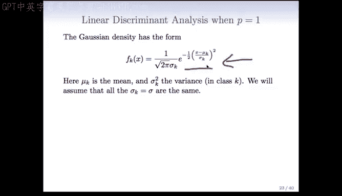

---

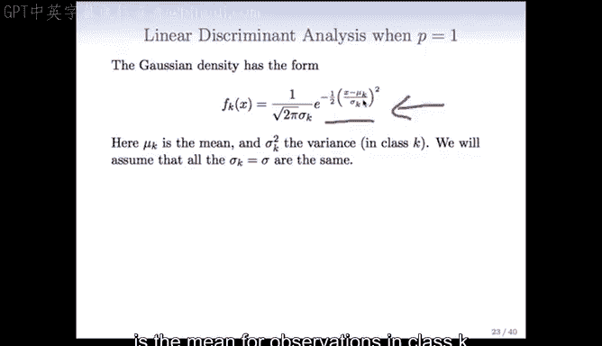

## 单变量情况下的高斯密度函数 📈

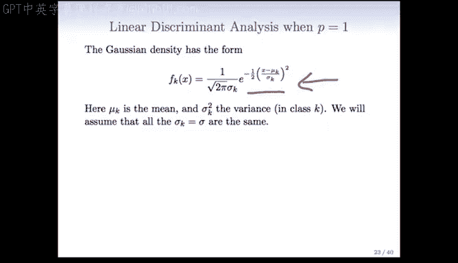

上一节我们介绍了判别分析的基本思想。本节中，我们来看看当只有一个预测变量 `x` 时，高斯判别分析的具体形式。

对于类别 `K`，其高斯密度函数的数学形式如下：

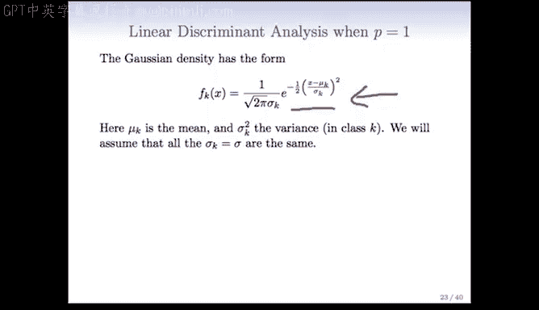

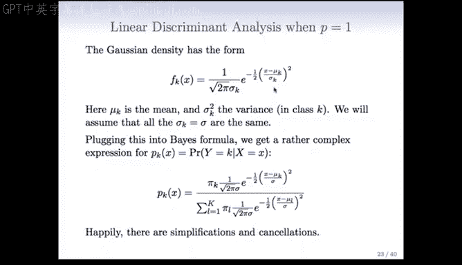

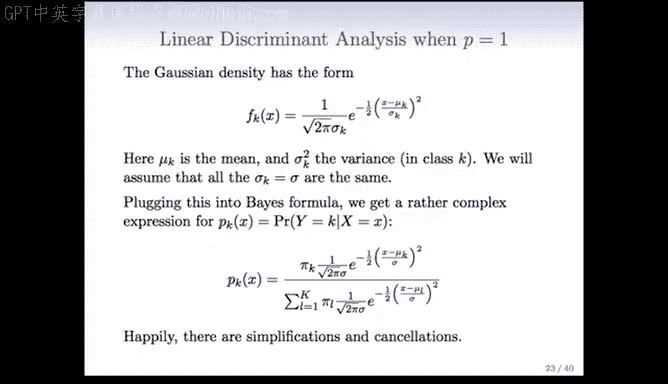

其核心部分是指数项，它依赖于变量 `x`：

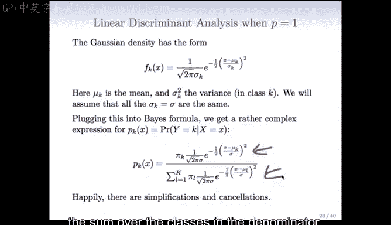

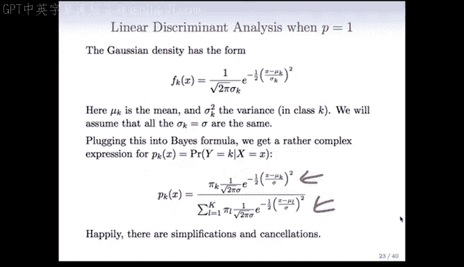

其中：
*   `μ_k` 是类别 `K` 中观测值的均值。
*   `σ_k` 是该变量在类别 `K` 中的方差。

## 方差假设与判别函数形式 🔄

首先，我们可以假设方差 `σ_k` 在每个类别中是相同的，即 `σ`。这是一个重要的简化假设，它将决定判别分析最终给出的是线性函数还是二次函数。

如果我们把这个高斯密度函数代入贝叶斯公式，会得到一个相当复杂的表达式：

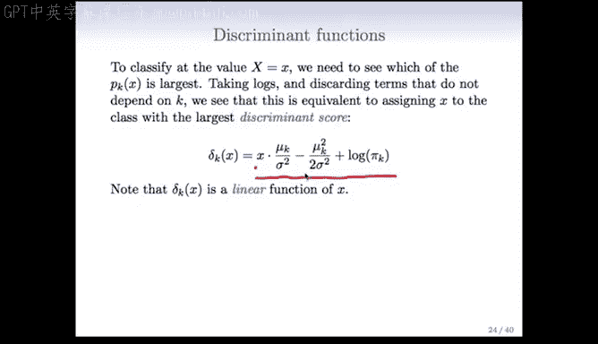

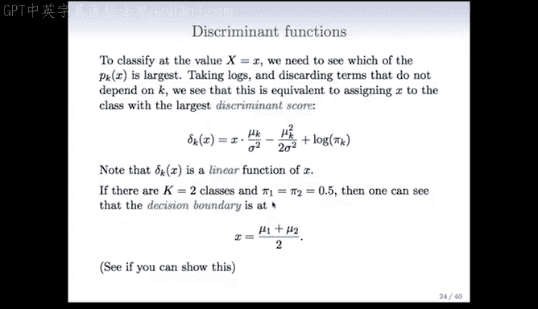

幸运的是，可以进行大量的简化和消元。

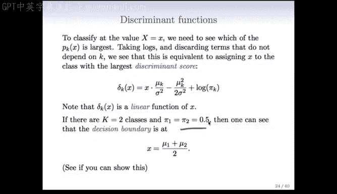

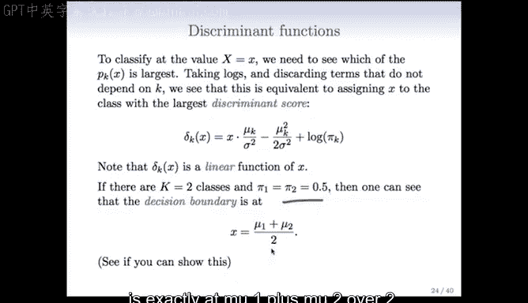

## 简化：对数变换与判别得分 📝

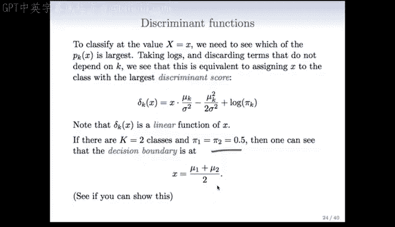

为了对观测值进行分类，我们并不需要精确计算每个类别的概率，只需要找出哪个类别的概率最大。因此，一个常见的技巧是取对数（尤其是在遇到指数形式时），并舍弃所有不依赖于类别 `K` 的项。

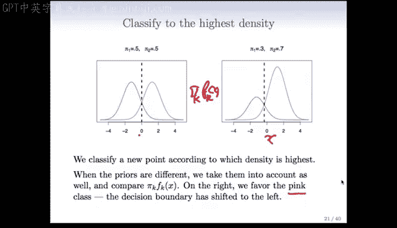

经过简化，复杂的概率表达式可以归结为一个更简单的**判别得分**函数。我们只需将观测值分配给判别得分最大的类别。

在单变量且各类别方差相等的假设下，判别得分函数是 `x` 的**线性函数**：

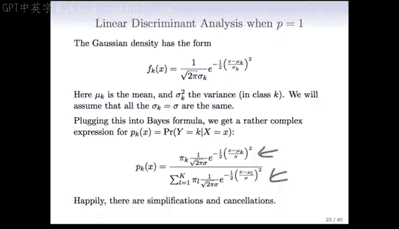

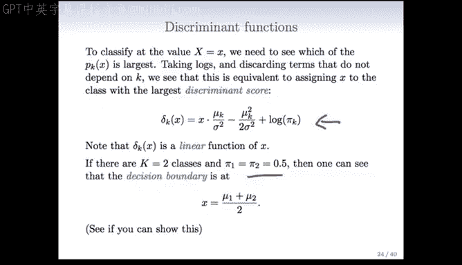

其中，系数是 `x` 的线性项，常数项由先验概率 `π_k` 和各类别的均值 `μ_k` 构成。

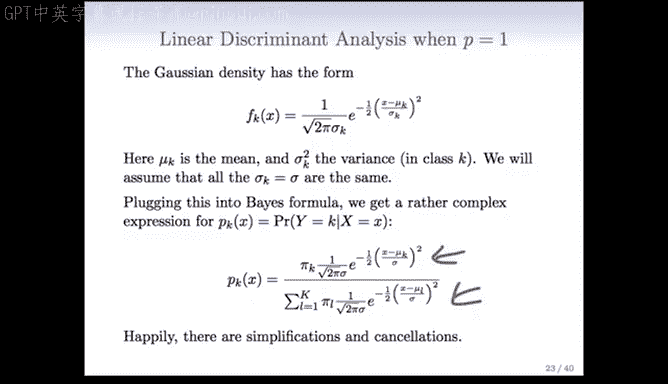

## 两类等先验概率的特例 ⚖️

现在，让我们考虑一个更简单的特例：只有两个类别，且它们的先验概率相等，即 `π_1 = π_2 = 0.5`。

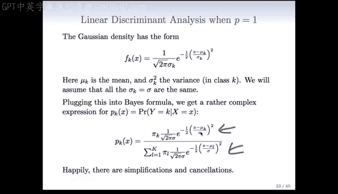

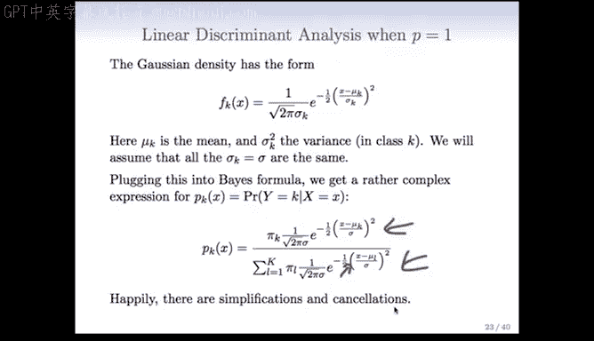

在这种情况下，决策边界会进一步简化。可以证明，决策边界恰好位于两个类别均值的中心点：

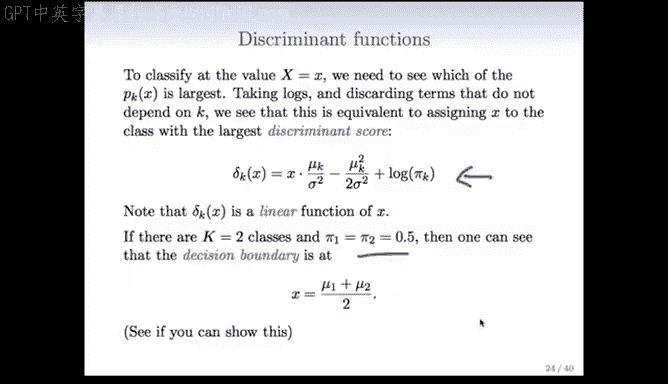

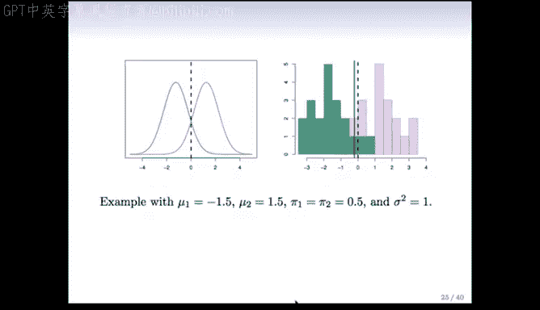

这非常直观：当两个类别的分布形状相同且先验概率相等时，最优的分界点就是它们均值的中间点。

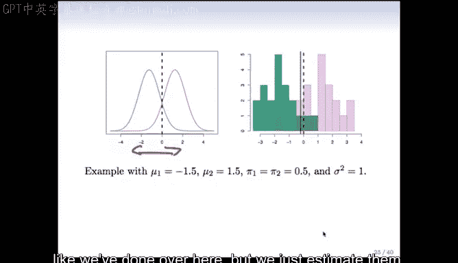

**关于消元的说明**：你可能会注意到原始高斯密度函数中有 `(x - μ_k)^2` 项，展开后包含 `x^2`。但在计算后验概率比时，分子和分母中的 `x^2` 项系数相同，因此在最终的线性判别函数中被消去了。

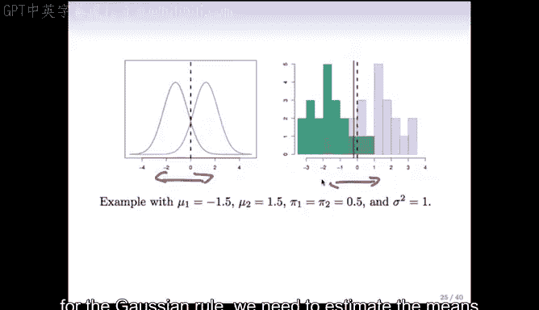

## 从数据中估计参数 📊

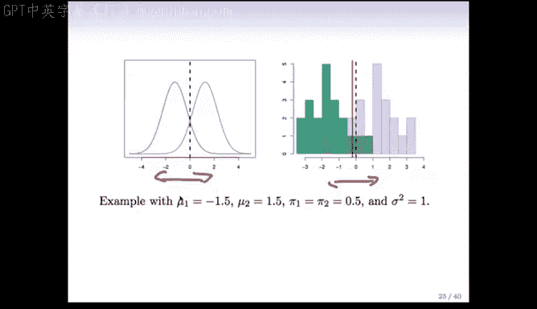

在实际应用中，我们无法直接获得真实的总体密度函数，只能通过数据来估计参数。以下是使用数据拟合高斯判别分析模型的步骤。

我们需要估计的参数包括：
1.  每个类别的先验概率 `π_k`。
2.  每个类别的均值 `μ_k`。
3.  共同的方差 `σ^2`。

以下是具体的估计公式：

**先验概率估计**：
`π_k` 的估计值是各类别样本数占总样本数的比例。

**均值估计**：
`μ_k` 的估计值是各类别中 `x` 的样本均值。公式为：
`μ_k = (1 / N_k) * Σ_{i: y_i = k} x_i`
其中，`N_k` 是类别 `k` 的样本数，求和仅针对属于类别 `k` 的样本 `x_i`。

**方差估计（合并方差）**：
由于假设方差相同，我们使用**合并方差估计**。一种计算方式是：
`σ^2 = (1 / (n - K)) * Σ_{k=1}^K Σ_{i: y_i = k} (x_i - μ_k)^2`
即，计算每个观测值与其所属类别均值的偏差平方，对所有类别求和，再除以 `n - K`（`n` 为总样本数，`K` 为类别数）。

另一种等价的理解方式是，先分别计算每个类别的样本方差，然后按各类别样本自由度进行加权平均。

将估计出的 `π_k`、`μ_k` 和 `σ^2` 代入判别得分函数，我们就得到了基于数据的决策规则。此时，决策边界可能不会精确落在理论值上（例如0点），但会非常接近。

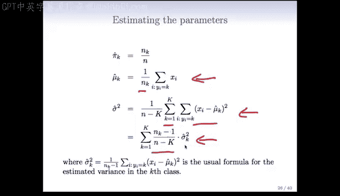

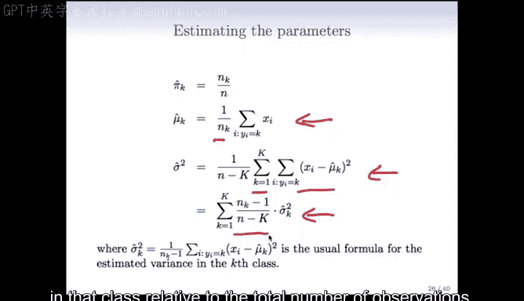

---

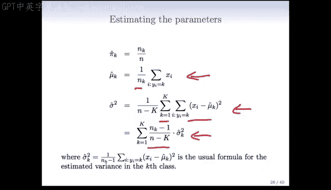

## 总结 ✨

本节课我们一起学习了单变量高斯判别分析的核心内容：
1.  **模型基础**：假设每个类别内的预测变量服从高斯（正态）分布。
2.  **关键假设**：各类别方差相等时，会推导出线性决策边界。
3.  **推导过程**：通过贝叶斯公式和对数变换，将分类问题转化为最大化线性判别得分的问题。
4.  **参数估计**：从数据中估计类别的先验概率、均值和合并方差。
5.  **决策**：通过比较各类别的判别得分对新观测值进行分类。

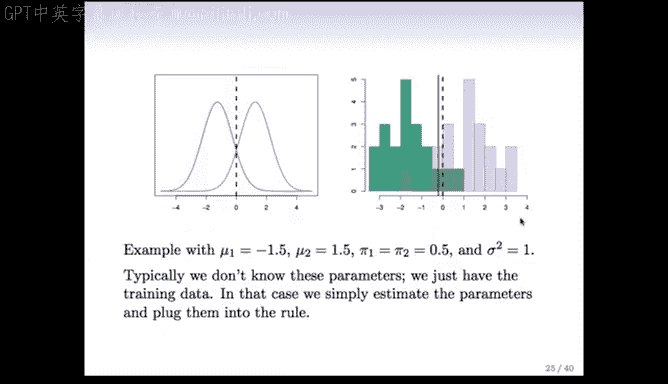

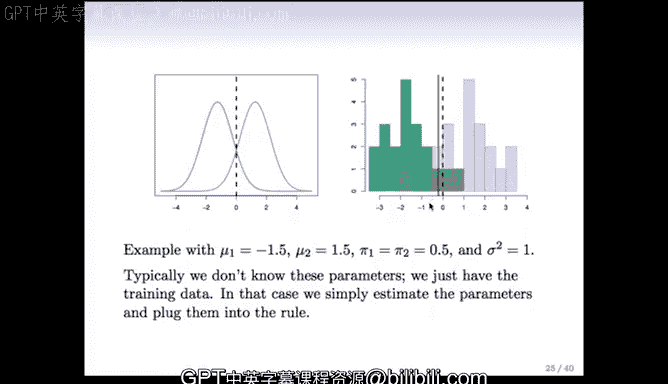

高斯判别分析为理解基于概率模型的分类方法提供了一个清晰的框架，并为后续学习更复杂的模型（如线性判别分析LDA和二次判别分析QDA）奠定了基础。