# Python 版 27：多元高斯判别分析 📊

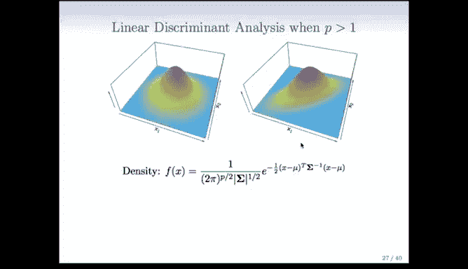

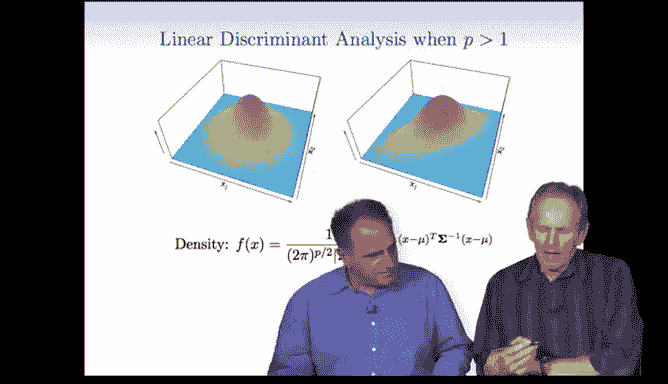

在本节课中，我们将学习高斯判别分析（GDA）如何从单变量情况扩展到多变量情况。我们将探讨其数学公式、可视化决策边界，并通过著名的鸢尾花数据集和信用数据集的例子来理解其应用和性能评估。

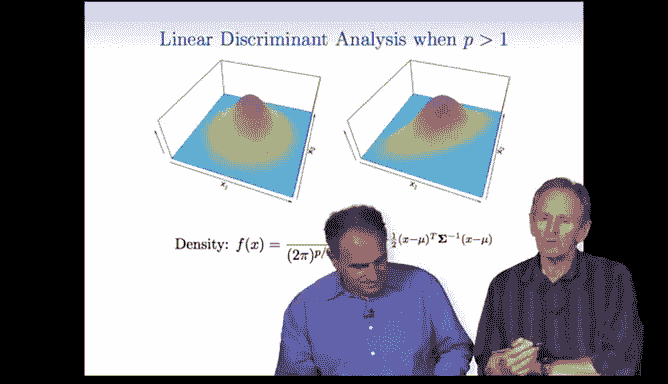

---

## 从单变量到多变量 🔄

上一节我们介绍了单变量高斯判别分析。本节中我们来看看当数据包含多个变量时的情况。

通常，在进行分类时，我们拥有的变量不止一个。

现在我们将转向多元高斯判别分析。

## 多元高斯密度函数 📈

下图展示了拥有两个变量时的高斯密度函数。这是一个漂亮的三维图。

图中高度用颜色编码。这里有两个变量，X1 和 X2。二维高斯密度看起来像一个钟形函数。

*   左侧是当两个变量不相关时的情形，它就像一个标准的钟形。
*   右侧是当变量存在相关性时的情形，此时钟形被拉伸了。可以看到 X1 和 X2 之间存在正相关。

这些是密度函数的图像。密度函数的公式看起来则不那么直观，如下所示：

**公式：多元高斯密度函数**
`p(x) = (1/((2π)^(p/2) |Σ|^(1/2))) * exp(-1/2 (x - μ)^T Σ^(-1) (x - μ))`

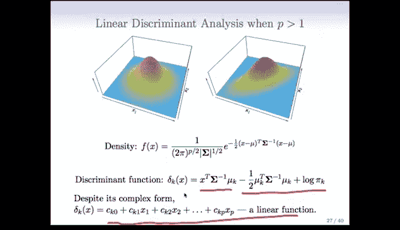

这个公式是单变量情况的推广。其中的 **Σ** 被称为协方差矩阵。如果你观察这个公式和之前的单变量公式，会发现它们有相似之处，特别是如果你了解向量代数。

通过简化（类似于我们之前所做的），我们可以推导出判别函数，其形式如下：

**公式：判别函数**
`δ_k(x) = x^T Σ^(-1) μ_k - 1/2 μ_k^T Σ^(-1) μ_k + log(π_k)`

这个公式看起来复杂，但重要的是，它同样是 **x** 的线性函数。它由 **x** 乘以一个系数向量，再加上一些常数项构成。

如果数学部分让你感到困扰，不必担心。关键点在于这是一个线性函数。事实上，它可以明确地写成以下形式：

**公式：线性判别函数**
`δ_k(x) = C_{k0} + C_{k1}x_1 + C_{k2}x_2 + ... + C_{kp}x_p`

这里的 `C_{k0}` 由上述公式中的常数项构成，而 `x_1, x_2, ..., x_p` 的系数则来自公式中的特定部分。请记住，这里的 **x** 是一个向量。

判别函数的思想是：为每个类别 **k** 计算一个 `δ_k(x)`，然后将样本分类到使该函数值最大的那个类别。

## 决策边界可视化 🎨

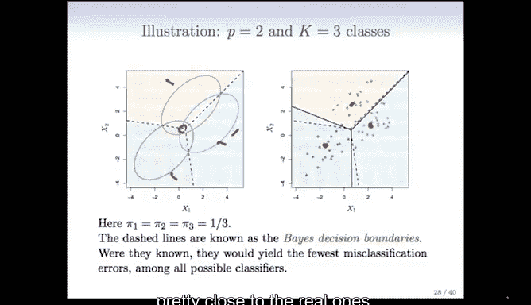

我们可以为判别分析绘制其他漂亮的图形，类似于之前的一维图。

这里，我们有两个变量和三个类别。我们不展示密度图，而是展示特定概率水平下的等高线。

*   蓝色类别有其概率等高线。
*   绿色类别有其概率等高线。
*   橙色类别有其概率等高线。

决策边界由虚线表示。它非常直观地展示了如何将样本分类为蓝色或橙色。决策边界恰好穿过等高线相交的点，无论是蓝-橙、蓝-绿还是绿-橙边界，它们都在中间区域交汇。

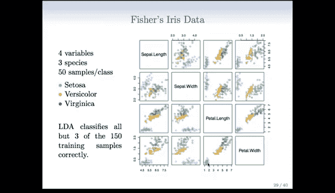

如果我们知道真实的密度，就能得到精确的决策边界，这被称为贝叶斯决策边界。当然，现实中我们并不知道。

但我们可以使用与之前类似但适用于多元情况的公式，来估计每个类别中高斯分布的参数（均值和协方差矩阵）。然后，我们将估计值代入公式，得到实线表示的估计决策边界。在这个例子中，估计的边界与真实边界非常接近。这些数据实际上是从高斯分布生成的，所以得到接近的结果并不奇怪。即使使用相对较少的点，我们也能得到与真实边界非常接近的决策边界。

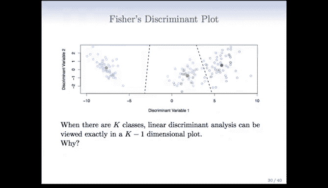

## 经典案例：费雪的鸢尾花数据集 🌸

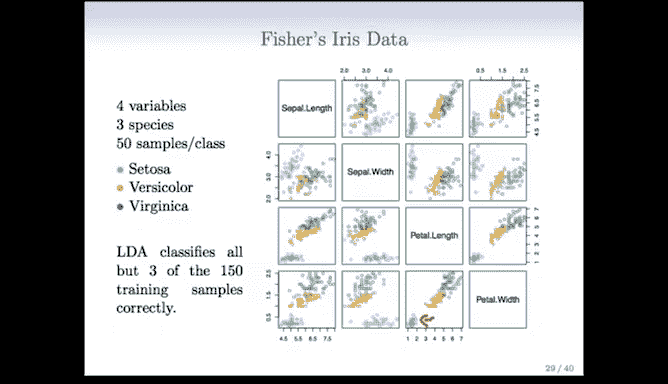

学习判别分析不能不提到费雪的鸢尾花数据集，它可能是最著名的数据集之一。

该数据集研究了三种鸢尾花：山鸢尾、变色鸢尾和维吉尼亚鸢尾。在散点图矩阵中，它们用三种颜色编码。

有四个变量被用来尝试自动分类这三个类别：
1.  萼片长度
2.  萼片宽度
3.  花瓣长度
4.  花瓣宽度

这些是花朵的特征。每个类别有50个样本。

观察这些散点图，可以看到一些很好的分离。例如，在花瓣长度和花瓣宽度的图中，蓝色类别（山鸢尾）与其他两个类别明显不同。在其他一些图中，类别之间似乎更混淆。但总体而言存在分离。这里的思路是利用所有这些变量共同构建一个判别规则来进行分类。

这个例子是费雪在其首次描述线性判别分析时使用的动机案例，因此线性判别分析通常也被称为费雪线性判别分析。

## 判别空间与可视化 📉

判别分析的一个优点是能产生一个漂亮的图。在上图中，有四个变量，我们展示了每个变量两两之间的散点图矩阵。

但事实证明，存在一个单一的图形可以捕获所有变量的分类信息。这就是判别变量图。

图中，横轴和纵轴分别是判别变量1和判别变量2。这些判别变量是原始变量的线性组合，但它们是按新方式组合的。当在这个二维空间中绘图时，可以看到非常好的类别分离。

这些判别变量来自于执行线性判别分析的过程。因为有三个类别，高斯LDA（或费雪线性判别分析）本质上是在测量哪个类别的中心（均值）最近，但它使用的是考虑了变量协方差的距离度量。

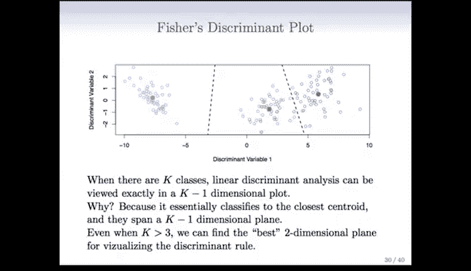

暂时忽略协方差，三个中心点实际上位于四维空间的一个子平面（二维子空间）中。判断哪个类别最近，本质上就是在这个子空间中的距离。这引出了这些漂亮的低维图。

因此，我们在这里有三个类别，可以制作一个二维图，它准确地捕获了分类所需的重要信息。当类别超过三个时，我们仍然可以找到二维图，但在那种情况下，二维图不能捕获所有信息，不过我们可以找到用于可视化判别规则的最佳二维图。这是线性判别分析在多类别分类中非常受欢迎的另一个重要原因。

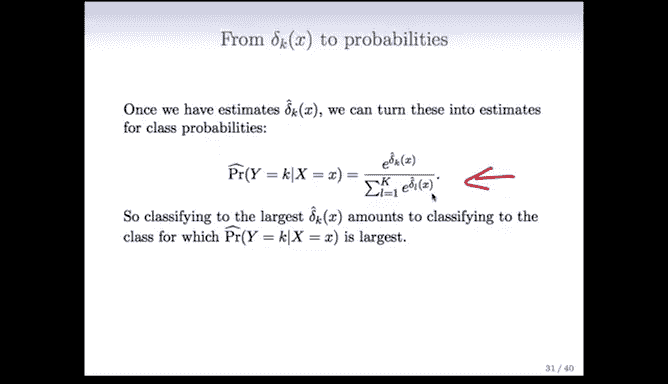

需要注意的是，在这个案例中，我们只有4个特征（变量），判别分析是一个非常有吸引力的方法。但想象一下，如果我们有4000个特征，那么我们需要代入估计的协方差矩阵将是4000x4000的大小。当变量数量非常大时，没有其他修改我们就无法进行判别分析。我们将在课程后面讨论一些处理这个问题的方法。

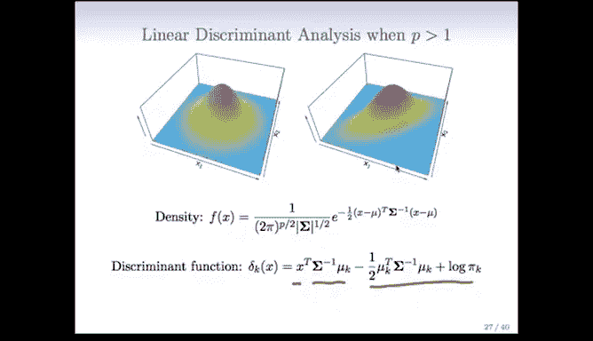

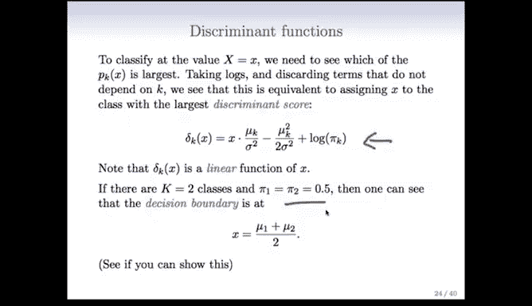

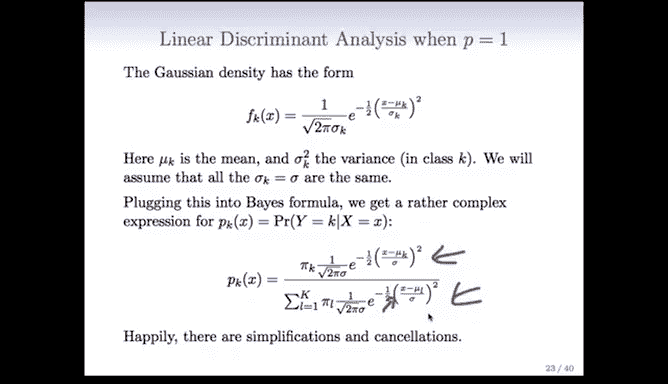

## 从判别函数到概率 📊

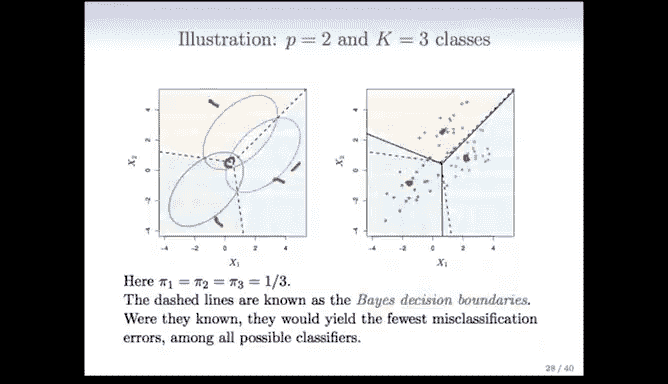

我们讨论了判别函数，它告诉你如何进行分类。但事实证明，你可以很容易地将其转化为概率。

表达式如下：

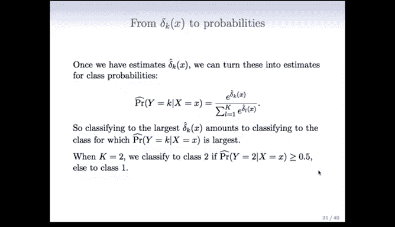

**公式：后验概率**
`P(Y = k | X = x) = exp(δ_k(x)) / [Σ_{l=1}^K exp(δ_l(x))]`

记住，我们通过大量简化得到了 `δ_k(x)`。事实证明，这些简化在计算概率时完全成立。换句话说，我们之前用于计算概率的表达式，经过所有常数项的抵消后，得到了这个仅涉及判别函数的简洁表达式。

因此，判别分析不仅能给我们一个分类器，还能给出属于每个类别的概率。在二分类情况下，如果属于类别2的概率大于0.5，则分类到类别2，否则分类到类别1，这与逻辑回归类似。

## 性能评估：混淆矩阵与错误率 📉

以下是信用数据的例子。我们生成了一个误分类表（混淆矩阵）。

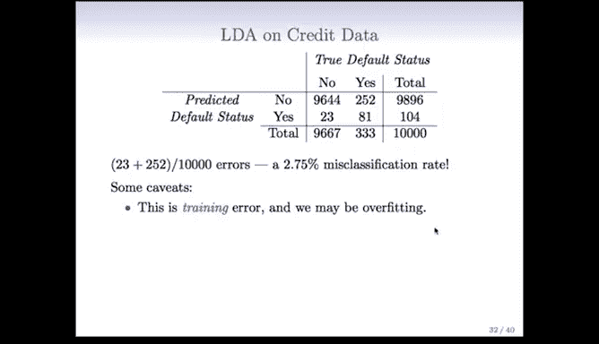

这个表格：
*   **横轴**是真实的违约状态（“否”或“是”）。数据集中有10000个样本。
*   **纵轴**是预测的违约状态（“否”或“是”）。

理想情况下，所有样本都应落在对角线上（预测正确）。实际上，我们正确分类了大部分“否”类，但正确分类的“是”类不多。
*   对角线上的数字是分类正确的数量。
*   非对角线上的数字是分类错误的数量。

总体而言，我们在这里的误分类错误率是2.75%。

这被称为混淆矩阵，它告诉你分类器的表现。但需要注意几点：
1.  这是**训练错误率**。我们根据这些数据拟合规则，然后又用同样的数据评估其性能，因此可能存在过拟合。不过，这里有10000个训练样本，而我们只拟合了少量参数，所以在这种情况下过拟合的可能性很小。对于小训练集，过拟合会是一个问题，那时就需要一个独立的测试集。
2.  虽然2.75%的误分类率看起来很好，但如果我们使用一个非常朴素的规则，即总是预测为最大的类别（根据先验概率分类，这里“否”类占多数），我们只会犯3.333%的错误。这被称为**零错误率**（Null Rate）。在为一个误分类率感到兴奋时，应始终牢记零错误率。
3.  另一个需要关注的是，可以将错误分解为不同类型。在真实的“否”类中，我们只犯了2%的错误（几乎不会将“否”误分类）。但在真实的“是”类中，我们犯了高达75.7%的错误。因此，错误在这个案例中是非常不平衡的，这可能不是一个好现象。

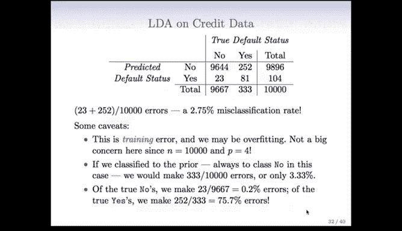

## 错误类型与阈值调整 ⚖️

我们将这些错误分解为更细的类别：
*   **假正例率（False Positive Rate）**：被错误分类为正例的负例样本比例。在本例中是2%。
*   **假反例率（False Negative Rate）**：被错误分类为负例的正例样本比例。在本例中是75.7%。

我们通过直观上正确的规则生成分类表：如果违约概率大于0.5，则预测为“是”。但这给了我们非常不平衡的假正例率和假反例率。

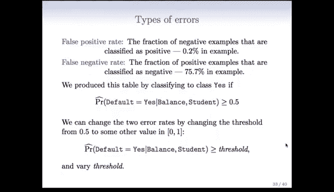

在某些情况下，特别是对于信用筛查这类例子，我们可能希望改变假正例率和假反例率，使其向一侧倾斜。我们可以通过改变分类阈值来实现这一点。

例如，可以不只在违约概率大于0.5时分类为“是”，而是降低阈值，以便捕获更多高风险违约案例。

下图展示了随着阈值降低（黑色线：总体错误率，橙色线：假正例率，蓝色线：假反例率）的变化：
*   假正例率增加，因为现在我们会将越来越多的负例分类为正例，但增加速度很慢。
*   假反例率随之下降。
*   即使在阈值为0.1时，假正例率也没有大幅增加，而假反例率则显著下降，从而改变了分类的平衡。

## ROC曲线与AUC 📈

阈值的变化可以总结在所谓的ROC曲线中。

ROC曲线展示了随着阈值变化，假正例率和真正例率之间的关系。
*   我们希望假正例率低，真正例率高。
*   45度线是“无信息”线，相当于随机猜测。
*   理想的ROC曲线应尽可能靠近左上角（真正例率1，假正例率0）。

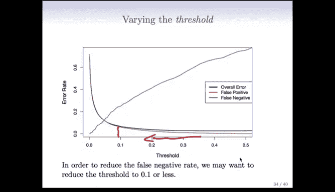

ROC曲线是一条单一的曲线，它概括了分类器在所有可能阈值下的性能。可以通过比较ROC曲线来比较不同的分类器。

为了更简洁地总结，我们有时使用曲线下面积（AUC）。AUC衡量了曲线接近左上角的程度，AUC越高越好。

---

## 总结 ✨

本节课中我们一起学习了：
1.  **多元高斯判别分析**的原理，其判别函数是特征的线性函数。
2.  如何通过**等高线图**可视化多元GDA的决策边界。
3.  通过**鸢尾花数据集**了解了GDA在多类别分类中的应用及其在**判别空间**的可视化优势。
4.  判别分析可以输出样本属于各类别的**后验概率**。
5.  使用**混淆矩阵**评估分类器性能，并理解**训练错误率**与**零错误率**的区别。
6.  识别**假正例**和**假反例**两种错误类型，并理解通过调整**分类阈值**可以平衡这两种错误。
7.  利用**ROC曲线**和**AUC**来全面评估和比较不同阈值下或不同分类器的性能。

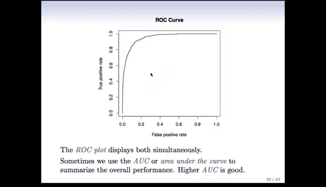

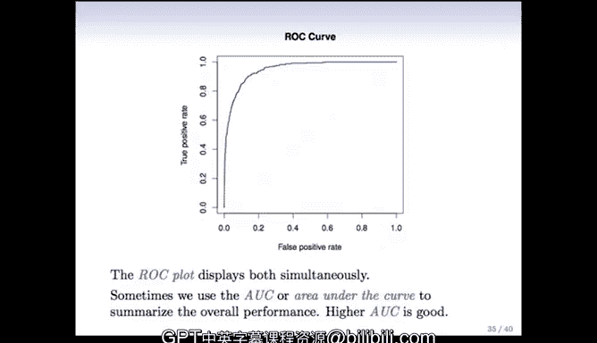

高斯判别分析为处理多变量分类问题提供了一个强大的概率框架，并兼具良好的可解释性和可视化能力。