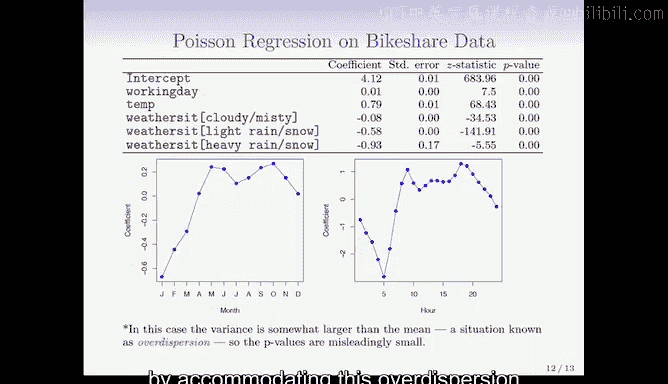

# Python 版 28：广义线性模型 📊

在本节课中，我们将要学习广义线性模型。这是一种强大的统计框架，能够统一处理多种不同类型的响应变量。我们将通过一个具体的例子——泊松回归，来理解其核心思想与应用。

---

## 概述

上一节我们介绍了用于定量响应的线性回归和用于二元响应的逻辑回归。然而，数据世界中还存在其他类型的响应变量，例如非负的计数数据。本节中，我们来看看**广义线性模型**，它提供了一个统一的框架来处理这些多样的响应类型。

---

## 一个例子：自行车共享数据 🚲

我们将使用华盛顿特区一个自行车租赁公司的数据集（`bikeshare`）来演示。在这个案例中，响应变量 `bikers` 是华盛顿特区共享单车项目每小时的用户数量。

预测变量包括温度、是否为工作日、天气状况（如多云、有雾、小雨/雪等）、月份以及一天中的小时数。

我们首先尝试拟合一个标准的**线性回归模型**。模型结果显示所有变量似乎都显著。从月份和小时的效应图中，我们可以看到一些符合直觉的模式：例如，在五月和六月租赁量更高，在通勤的早晚高峰时段使用量也更大。

然而，这里存在几个问题：
1.  响应变量 `bikers`（用户数量）是一个**非负的计数变量**。
2.  当我们绘制响应值与小时数的关系图时，发现**方差随着均值的增大而增加**。这与线性回归中方差恒定的假设相悖。
3.  线性模型的预测值中，有**10%是负数**，这在实际中是不可能的（用户数不能为负）。

一种可能的解决方法是建模 `log(bikers)`。这虽然能使方差更稳定，但也带来了新问题：预测值处于对数尺度，解释不便；并且当计数为0时无法取对数。

---

## 泊松回归模型

对于计数数据，**泊松分布**是一个更自然的选择。就像我们用二项分布建模0/1数据一样。

泊松分布的概率质量函数为：
`P(Y = k) = (λ^k * e^{-λ}) / k!`
其中，参数 `λ` 既是分布的均值，也是其方差：`Var(Y) = λ`。这正好解释了我们在数据中观察到的“方差随均值增加”的现象。

在泊松回归中，我们假设响应变量 `Y` 服从泊松分布，并且其均值 `λ` 会随着预测变量 `X` 的变化而变化。具体来说，我们假设**均值的对数**是 `X` 的线性函数：

`log(λ) = β₀ + β₁X₁ + ... + βₖXₖ`

或者等价地：
`λ = exp(β₀ + β₁X₁ + ... + βₖXₖ)`

这个模型形式自动保证了预测的均值 `λ` 始终为正数。

我们可以通过**最大似然估计**来拟合这个模型。拟合后得到的摘要输出与线性回归和逻辑回归类似，会给出每个变量的系数、标准误和P值等。需要注意的是，这里的系数是在**对数尺度**上解释的。

当我们绘制泊松回归模型中月份和小时的效应图时，其传达的信息与线性模型相似，但泊松模型在拟合时已经考虑了方差的变化，因此更为合理。

---

## 广义线性模型家族

到目前为止，我们在课程中已经涵盖了三种重要的广义线性模型：
1.  **高斯（正态）模型**：用于定量响应（线性回归）。
2.  **二项模型**：用于二元响应（逻辑回归）。
3.  **泊松模型**：用于计数响应（泊松回归）。

它们都属于同一个框架，其核心关系可以表示为：
`g(μ) = β₀ + β₁X₁ + ... + βₖXₖ`
其中，`μ = E(Y)` 是响应变量的均值，函数 `g(·)` 被称为**连接函数**。

以下是三种模型的连接函数：
*   **线性回归**：`g(μ) = μ` （恒等连接）
*   **逻辑回归**：`g(μ) = logit(μ) = log[μ / (1-μ)]` （Logit连接）
*   **泊松回归**：`g(μ) = log(μ)` （对数连接）

如何选择模型？这取决于响应变量的本质：
*   定量数据且分布大致对称 → 高斯模型（线性回归）。
*   二元数据（是/否）→ 二项模型（逻辑回归）。
*   计数数据 → 泊松模型。

此外，它们也有特征性的方差函数：
*   高斯：方差为常数。
*   二项：方差为 `μ(1-μ)`。
*   泊松：方差等于均值 `μ`。

广义线性模型家族还包括其他成员，例如：
*   **伽马模型**：常用于具有长右尾的正值数据。
*   **负二项模型**：用于存在过度离散（方差远大于均值）的计数数据。
*   **逆高斯模型**：用于其他特定的数据形态。

---

## 总结

本节课中我们一起学习了**广义线性模型**。我们了解到，GLM通过一个统一的框架（`g(μ) = Xβ`），将线性模型的思想扩展到了非正态分布的响应变量上。我们重点介绍了**泊松回归**在处理计数数据时的应用，并回顾了高斯模型（线性回归）和二项模型（逻辑回归）如何融入这个框架。选择哪种GLM取决于响应变量的类型和分布特性。这个强大的工具包使我们能够更灵活、更恰当地对现实世界中的各种数据进行建模。