# Python 版 29：二次判别分析与朴素贝叶斯 📊

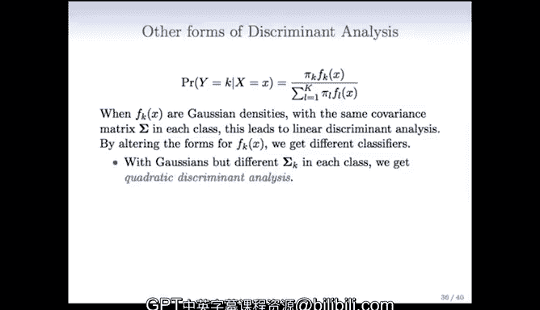

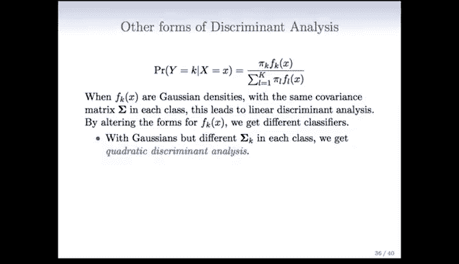

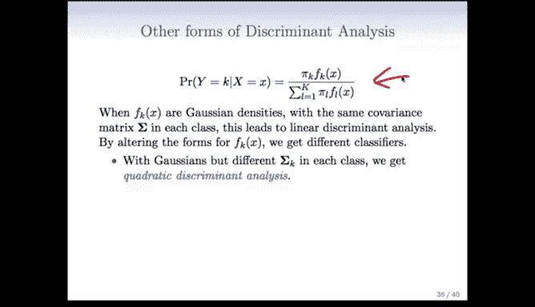

在本节课中，我们将要学习判别分析的两个重要扩展：**二次判别分析** 和 **朴素贝叶斯分类器**。我们将探讨它们与线性判别分析的区别、各自的适用场景以及背后的核心思想。

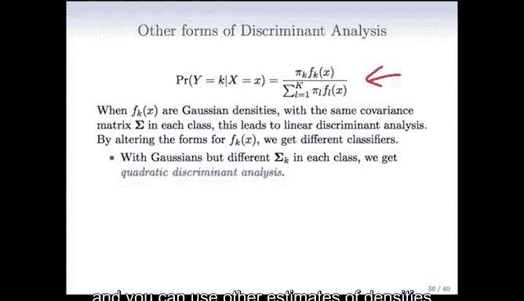

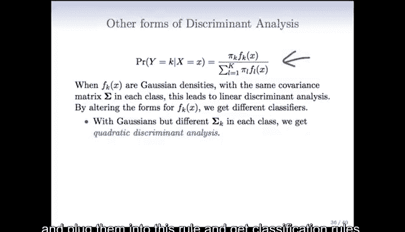

---

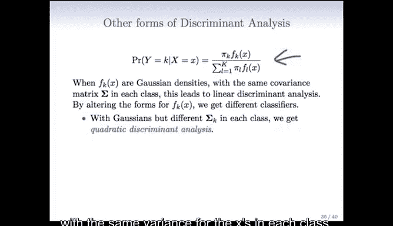

## 概述

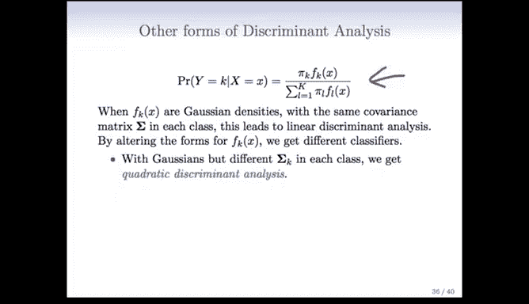

上一节我们介绍了基于高斯密度且假设各类方差相同的线性判别分析。本节中，我们来看看当放宽这些假设时，会得到哪些更灵活的分类方法。

---

## 从线性到二次判别分析

线性判别分析假设每个类别中的特征 `X` 服从高斯分布，且所有类别的协方差矩阵相同。这个假设使得判别函数中的二次项相互抵消，最终得到关于 `X` 的线性判别边界。

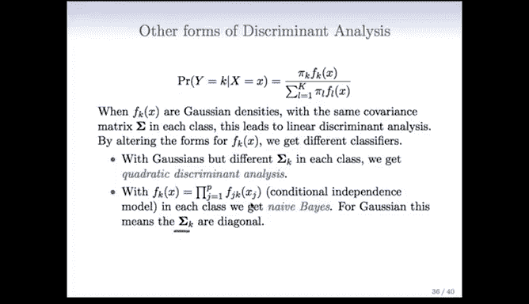

**如果每个类别的协方差矩阵不同呢？**

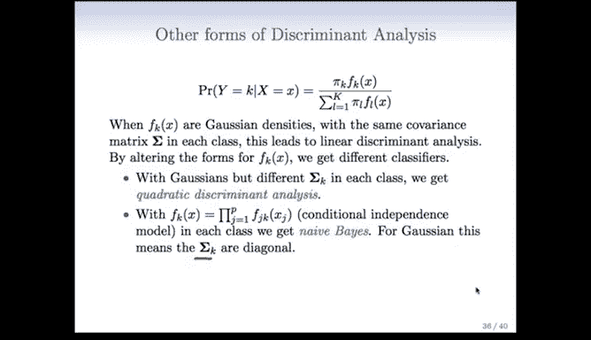

此时，判别函数中的二次项将不会抵消。判别函数会变成关于 `X` 的二次函数。这种方法被称为 **二次判别分析**。

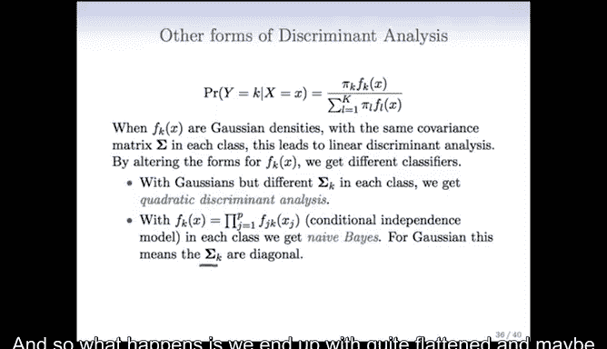

其判别函数的形式如下：

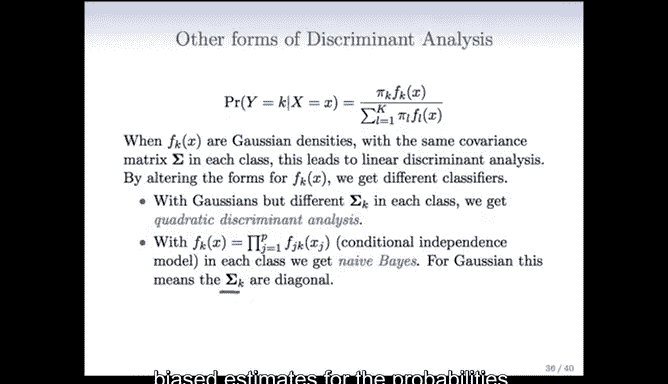

`δ_k(x) = -0.5 * (x - μ_k)^T Σ_k^{-1} (x - μ_k) - 0.5 * log|Σ_k| + log π_k`

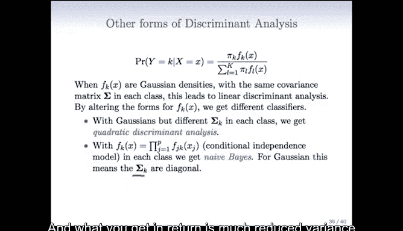

其中：
*   `μ_k` 是第 `k` 类的均值向量。
*   `Σ_k` 是第 `k` 类特有的协方差矩阵。
*   `π_k` 是第 `k` 类的先验概率。

由于 `Σ_k` 因类而异，判别边界从直线变为曲线（二次曲线）。

以下是两种方法的对比：
*   **左图**：真实边界是线性的（虚线）。线性判别分析表现良好，二次判别分析会产生轻微弯曲的边界，但对分类性能影响不大。
*   **右图**：真实数据的协方差矩阵不同，决策边界是曲线的。二次判别分析能很好地捕捉这个边界，而线性判别分析给出的边界则相差甚远。

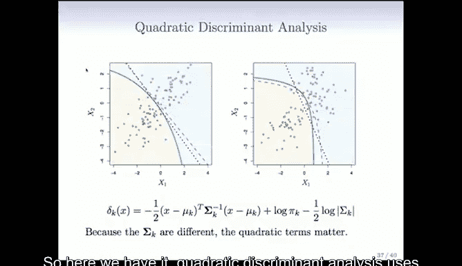

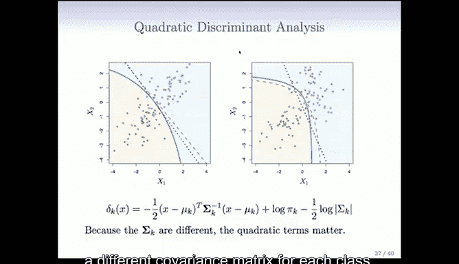

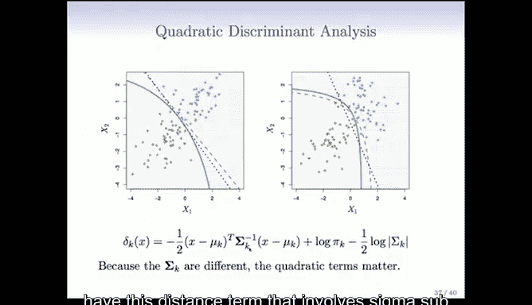

**二次判别分析在特征数量较少时很有吸引力。但当特征数量很大时，需要估计大量参数（多个大型协方差矩阵），计算可能变得不稳定。**

---

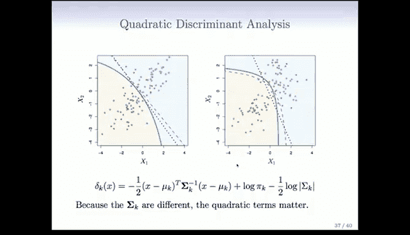

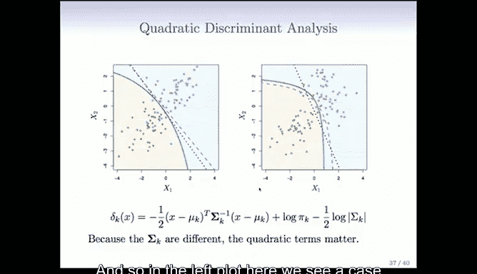

## 朴素贝叶斯分类器

为了解决高维问题中的参数估计难题，我们可以做一个更强的假设。

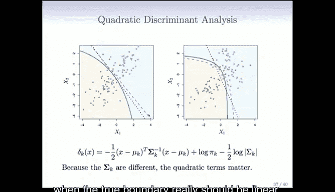

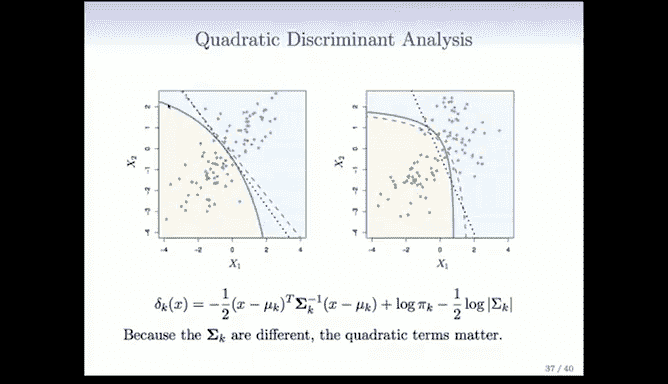

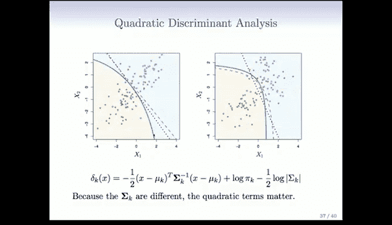

**核心假设**：在给定类别 `Y` 的条件下，所有特征 `X_j` 是相互独立的。

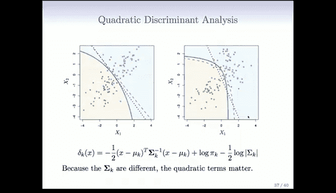

这意味着每个类别中的联合概率密度可以分解为各个特征边缘概率密度的乘积：

`P(X = x | Y = k) = Π_{j=1}^p P(X_j = x_j | Y = k)`

将这个假设代入贝叶斯分类规则，就得到了 **朴素贝叶斯分类器**。对于线性判别分析而言，这等价于假设每个类别的协方差矩阵 `Σ_k` 是对角矩阵。

**优势与权衡**：
*   **参数大幅减少**：一个完整的 `p` 维协方差矩阵有 `p^2` 个参数，而对角矩阵只需估计 `p` 个参数（方差）。
*   **假设通常不成立**：特征之间往往存在相关性，这个“朴素”的独立性假设在现实中很少完全正确。
*   **分类效果依然可能很好**：在分类任务中，我们通常只关心哪个类别的后验概率最大，而不需要概率估计绝对精确。虽然独立性假设可能带来有偏的概率估计，但**方差的大幅降低**（因为估计的参数更少）常常能带来更好的整体分类性能。

朴素贝叶斯的判别函数形式相对简单。对于高斯型特征，其判别函数为：

`δ_k(x) = Σ_{j=1}^p [ - (x_j - μ_{kj})^2 / (2σ_{kj}^2) ] - Σ_{j=1}^p log(σ_{kj}) + log(π_k)`

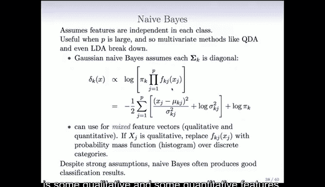

**处理混合类型特征**：朴素贝叶斯的一个实用优点是能轻松处理同时包含定量特征（如身高、体重）和定性特征（如颜色、性别）的数据集。
*   对于**定量特征**，可以使用高斯分布来建模。
*   对于**定性特征**，则可以使用直方图或概率质量函数（即各类别的经验频率）来建模。

---

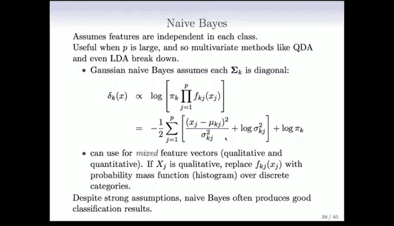

## 生成式学习 vs. 判别式学习

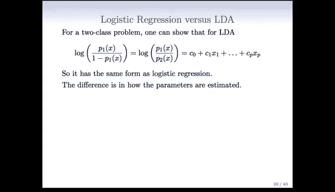

我们已经学习了两种主要的分类方法：逻辑回归和线性判别分析（及其扩展）。它们之间有何异同？

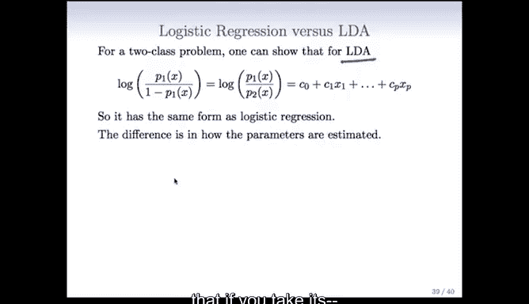

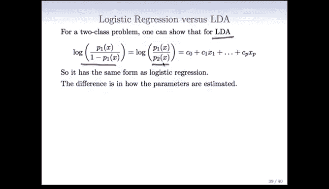

**一个关键联系**：对于二分类问题，可以证明线性判别分析得到的**对数几率**也是输入 `X` 的线性函数：

`log( P(Y=1|X=x) / P(Y=2|X=x) ) = β_0 + β^T x`

这与逻辑回归模型的形式完全相同。因此，两者都产生线性的决策边界。

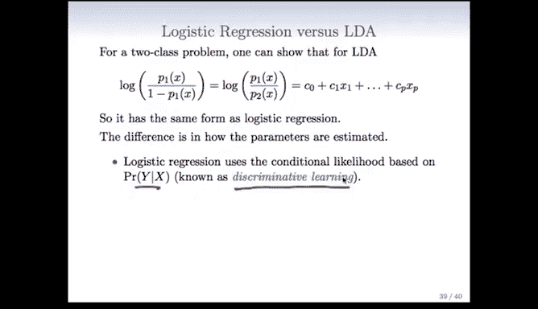

**根本区别在于参数估计的方式**：
*   **逻辑回归（判别式模型）**：通过最大化**条件似然函数** `P(Y | X)` 来估计参数。它直接对给定 `X` 后 `Y` 的条件分布进行建模。
*   **判别分析（生成式模型）**：通过最大化**联合似然函数** `P(X, Y)` 来估计参数。它先对每个类别下 `X` 的分布 `P(X | Y)` 和类先验 `P(Y)` 进行建模，然后利用贝叶斯定理得到 `P(Y | X)`。

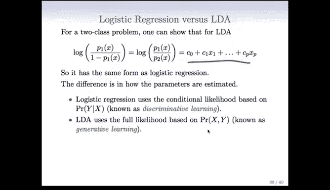

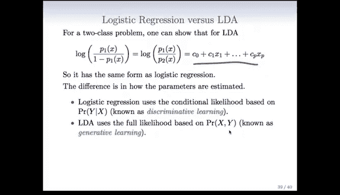

尽管估计原理不同，但在实际应用中，这两种方法的结果通常非常相似。

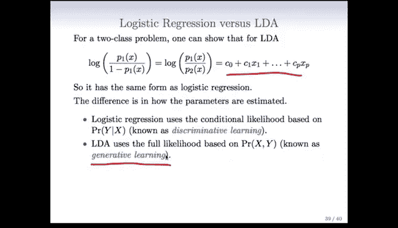

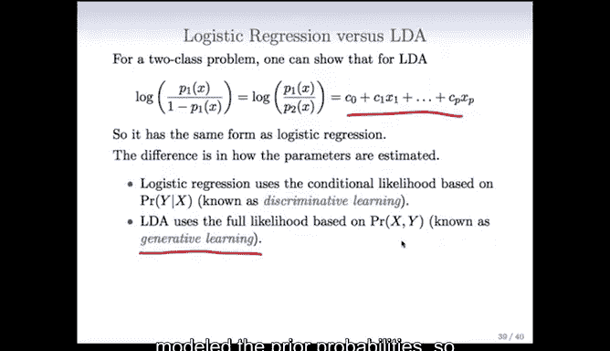

**补充一点**：逻辑回归也可以通过显式地加入特征的二次项（如 `X^2`, `X_i * X_j`）来拟合**非线性的二次决策边界**，这与二次判别分析的功能类似。

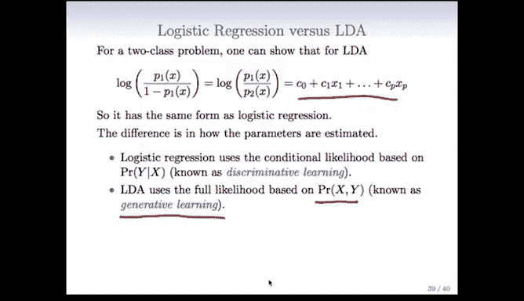

---

## 总结

本节课中我们一起学习了：
1.  **二次判别分析**：通过允许每个类别有自己的协方差矩阵，得到二次判别边界，能更好地拟合非线性模式，但计算成本随维度升高而增加。
2.  **朴素贝叶斯分类器**：通过假设特征条件独立，大幅减少高维问题中需估计的参数数量。虽然假设很强，但因其低方差特性，在实践中常常表现优异。
3.  **生成式与判别式模型的对比**：逻辑回归（判别式）直接对决策边界建模，而判别分析（生成式）通过对数据生成过程建模来间接得到分类器。两者在二分类情况下可得到相同形式的线性边界。

这些方法构成了分类问题的基础工具箱。在后续课程中，我们还将回到这些概念，探索更一般的版本，并学习另一种强大的分类方法——支持向量机。

---

**下节预告**：接下来我们将进入关于**交叉验证与自助法**的章节，并将有幸听到该方法发明者Bradley Efron教授的分享。