# Python 版 30：第四章实验 - 逻辑回归 I 📊 

在本节课中，我们将学习如何将第四章（分类）的理论知识应用于实践。我们将使用股票市场数据，并应用多种分类器进行分析。课程将重点介绍如何使用Python的`statsmodels`和`scikit-learn`库来拟合逻辑回归模型，并评估其预测性能。

---

## 数据导入与准备

首先，我们需要导入必要的库并加载数据。与之前的实验一样，我们在代码开头导入所有关键部分。其中一些导入是我们之前见过的，另一些则是新的，主要来自`ISLP`包和`scikit-learn`（或`sklearn`）包。

```python
# 导入必要的库
import numpy as np
import pandas as pd
from ISLP import load_data
from ISLP.models import (ModelSpec as MS,
                         summarize,
                         poly)
from sklearn.discriminant_analysis import (LinearDiscriminantAnalysis as LDA,
                                           QuadraticDiscriminantAnalysis as QDA)
from sklearn.naive_bayes import GaussianNB
from sklearn.neighbors import KNeighborsClassifier
from sklearn.preprocessing import StandardScaler
from sklearn.pipeline import Pipeline
```

请注意，这些包更新相对频繁。如果运行代码时遇到错误，可以访问`statlearning.com`网页上的论坛，我们会尽力解决并更新实验内容。同时，我们也维护了一个勘误页面。

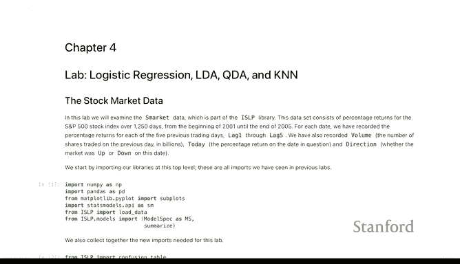

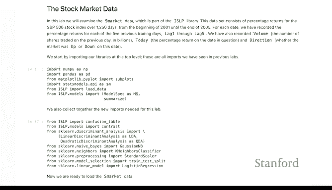

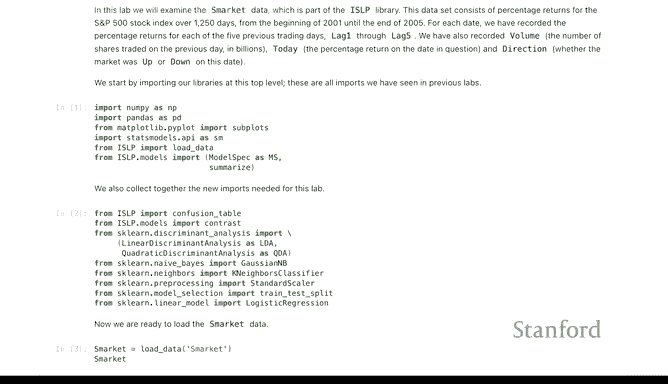

`scikit-learn`的一个优点是，除了分类器的名称不同，许多分类器的拟合方式几乎相同，这种模式在后续的分类和其他方法中会重复出现。

---

## 加载与探索数据

我们将从加载股票市场数据开始。我们的目标是预测股票价格是上涨（Up）还是下跌（Down），这是一个二分类问题。数据包含前五天的滞后收益率（`Lag1` 到 `Lag5`）以及交易量（`Volume`）。

```python
# 加载数据
Smarket = load_data('Smarket')
print(Smarket.head())
```


数据中的`Direction`变量是我们要预测的二元结果。其他变量是预测因子。

需要提前说明的是，预测股票市场非常困难。如果我们真的擅长此道，可能就不会在这里教学了。

为了初步了解数据，我们可以查看预测因子之间的相关性矩阵。如果预测股票涨跌很容易，我们可能会看到一些显著的相关性。

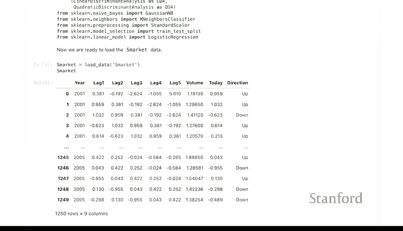

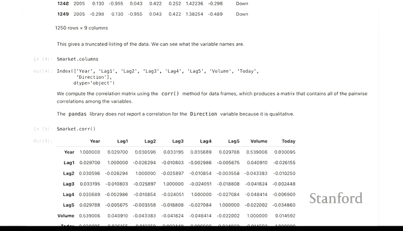

```python
# 计算并可视化相关性矩阵
correlation_matrix = Smarket.corr()
print(correlation_matrix)
```

结果显示，滞后变量之间的相关性都很小。但有一个明显的相关性出现在`Volume`（交易量）和`Year`（年份）之间。这是因为随着时间的推移，股票的交易量总体呈上升趋势。

---

## 拟合逻辑回归模型

逻辑回归是一种广泛使用的分类器，也是广义线性模型的一个例子。我们将使用`statsmodels`库中的`GLM`（广义线性模型）对象来拟合逻辑回归模型。

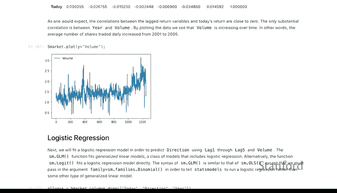

在第三章的实验中，我们使用了普通最小二乘法模型。这里的不同之处在于我们使用`GLM`，并且必须指定`family=Binomial()`来表示这是逻辑回归。

```python
from statsmodels.api import GLM
from statsmodels.formula.api import glm

# 定义模型公式：使用所有滞后变量和交易量预测Direction
all_features = 'Direction ~ Lag1 + Lag2 + Lag3 + Lag4 + Lag5 + Volume'
model_all = glm(formula=all_features,
                data=Smarket,
                family=Binomial())
# 拟合模型
results_all = model_all.fit()
# 查看模型摘要
print(results_all.summary())
```

模型摘要提供了每个变量的系数估计值，以及它们是否显著的评估。从结果来看，没有强有力的证据表明这些变量能有效预测股票第二天的涨跌。例如，`Lag1`的系数为负，暗示如果昨天上涨，今天可能下跌，但这种关系并不强。

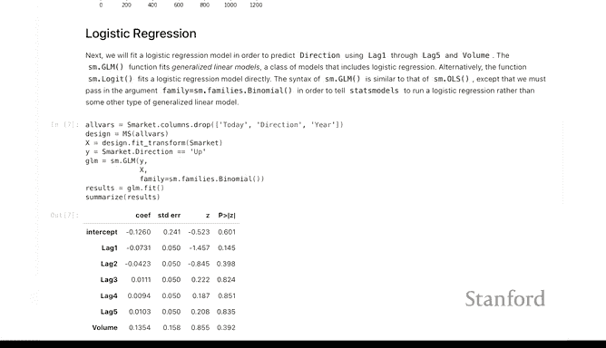

---

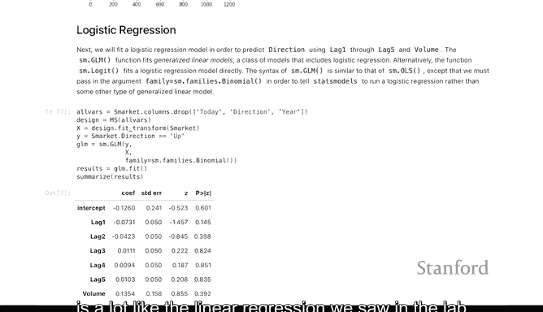

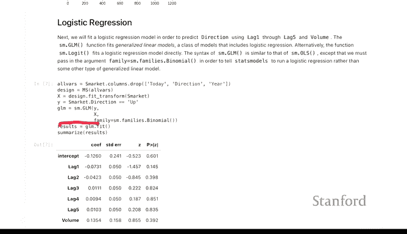

## 模型评估与训练误差

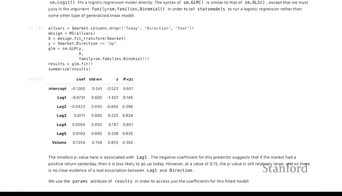

我们可以使用拟合的模型对象来获取预测值。对于二分类问题，预测值是概率。以下是获取前10个观测值的预测上涨概率：

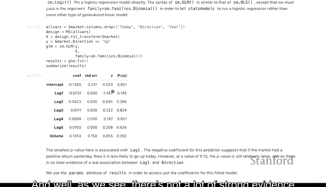

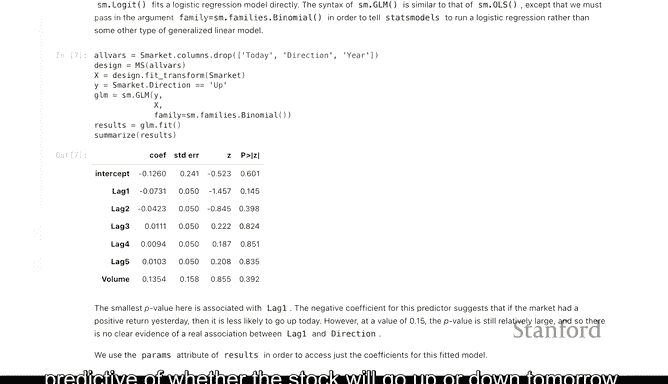

```python
# 获取所有观测值的预测概率（上涨概率）
probs_all = results_all.predict()
print(probs_all[:10])
```

接下来，我们通过混淆矩阵来评估分类器的准确性。我们将预测概率大于0.5的标记为“Up”，否则标记为“Down”，然后与真实标签进行比较。

```python
from ISLP import confusion_table

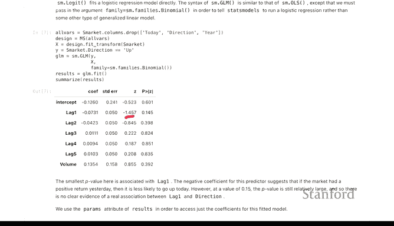

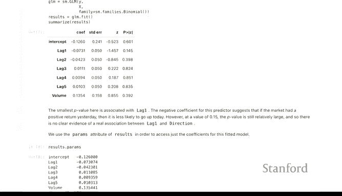

# 根据0.5阈值生成预测标签
pred_labels_all = np.where(probs_all > 0.5, 'Up', 'Down')
# 生成混淆矩阵
conf_matrix_all = confusion_table(pred_labels_all, Smarket['Direction'])
print(conf_matrix_all)
```

混淆矩阵的列代表真实标签，行代表预测标签。高对角线值表示高准确率。

我们可以计算准确率，即正确预测的数量除以总观测数。

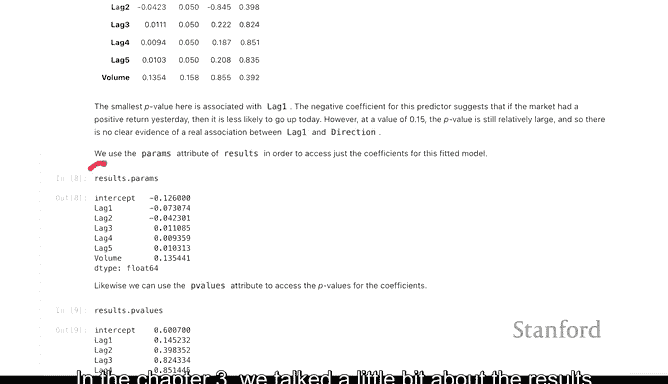

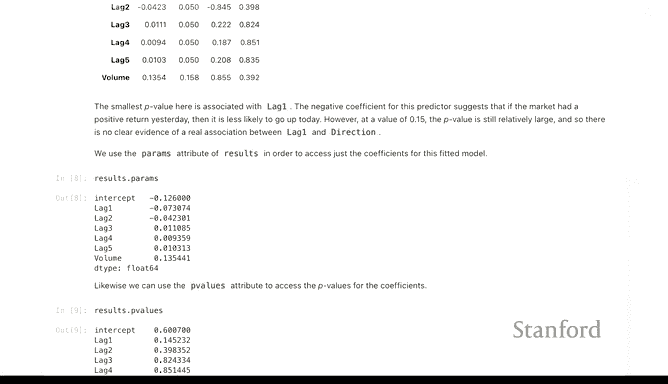

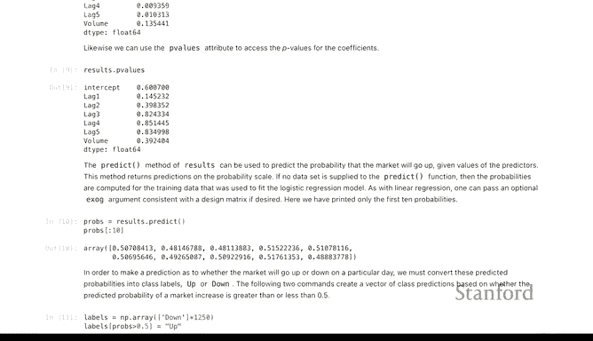

```python
# 计算准确率
accuracy_all = np.mean(pred_labels_all == Smarket['Direction'])
print(f"模型准确率: {accuracy_all:.2%}")
```

准确率约为52%，略高于50%的随机猜测水平。在金融领域，即使是2%的优势也可能被认为很有价值。但请注意，这是**训练误差**，可能过于乐观。

---

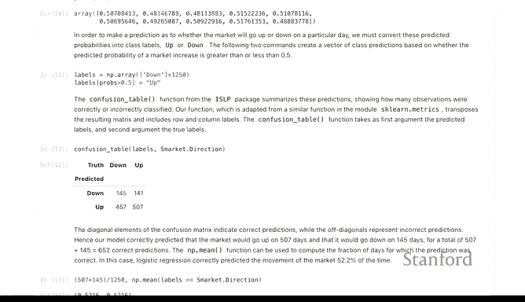

## 划分训练集与测试集

为了获得更真实的性能评估，我们需要将数据划分为训练集和测试集。由于这是时间序列数据，我们将按时间划分：2005年之前的数据作为训练集，之后的数据作为测试集。

```python
# 创建训练集（2005年及以前）和测试集（2005年以后）
train = (Smarket['Year'] <= 2005)
Smarket_train = Smarket[train]
Smarket_test = Smarket[~train]

# 准备训练和测试的特征与标签
X_train = Smarket_train[['Lag1', 'Lag2', 'Lag3', 'Lag4', 'Lag5', 'Volume']]
y_train = Smarket_train['Direction']
X_test = Smarket_test[['Lag1', 'Lag2', 'Lag3', 'Lag4', 'Lag5', 'Volume']]
y_test = Smarket_test['Direction']
```

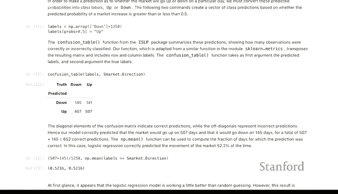

现在，我们在训练集上重新拟合逻辑回归模型，并在测试集上进行预测和评估。

```python
# 在训练集上拟合模型
model_train = glm(formula=all_features,
                  data=Smarket_train,
                  family=Binomial())
results_train = model_train.fit()

# 在测试集上进行预测
probs_test = results_train.predict(exog=X_test)
pred_labels_test = np.where(probs_test > 0.5, 'Up', 'Down')

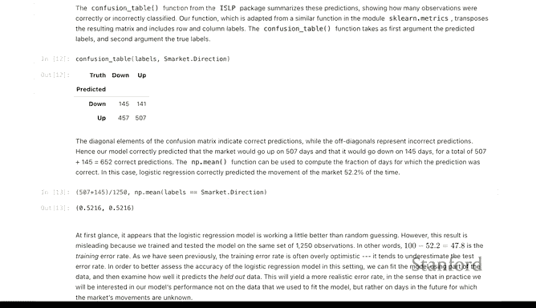

# 评估测试集性能
conf_matrix_test = confusion_table(pred_labels_test, y_test)
accuracy_test = np.mean(pred_labels_test == y_test)
print("测试集混淆矩阵:")
print(conf_matrix_test)
print(f"测试集准确率: {accuracy_test:.2%}")
```

测试准确率约为48%，略低于随机水平。这表明我们的模型在未见过的数据上预测能力很弱，可能只是接近随机猜测。

---

## 尝试更简单的模型

我们之前测试的模型使用了全部五个滞后变量和交易量。考虑到我们可能过度拟合了这六个变量，现在尝试一个更简单的模型，只使用`Lag1`和`Lag2`。

```python
# 定义简化模型公式
simple_features = 'Direction ~ Lag1 + Lag2'
model_simple = glm(formula=simple_features,
                   data=Smarket_train,
                   family=Binomial())
results_simple = model_simple.fit()

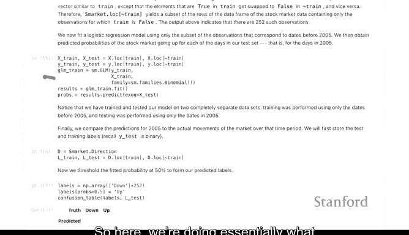

# 在测试集上使用简化模型进行预测
X_test_simple = Smarket_test[['Lag1', 'Lag2']]
probs_test_simple = results_simple.predict(exog=X_test_simple)
pred_labels_test_simple = np.where(probs_test_simple > 0.5, 'Up', 'Down')

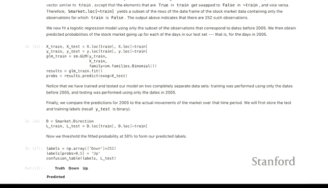

# 评估简化模型的测试集性能
accuracy_test_simple = np.mean(pred_labels_test_simple == y_test)
print(f"简化模型测试集准确率: {accuracy_test_simple:.2%}")
```

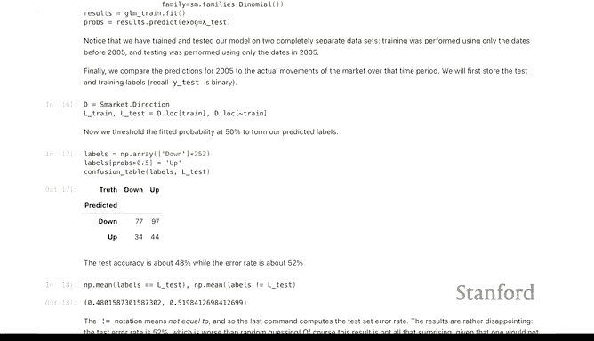

简化模型的测试准确率约为56%，优于随机猜测。这可能是通过使用更简单的模型来平衡偏差-方差权衡的一个例子。也许这是一个值得考虑的交易策略，但需要谨慎对待。

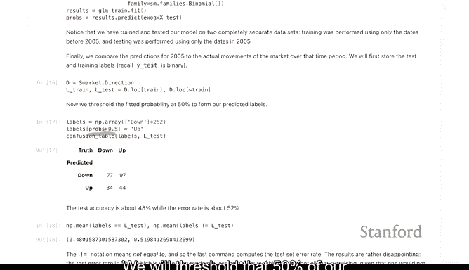

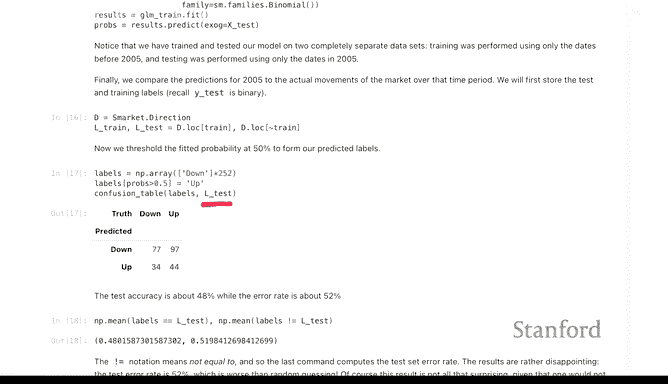

---

## 进行新预测

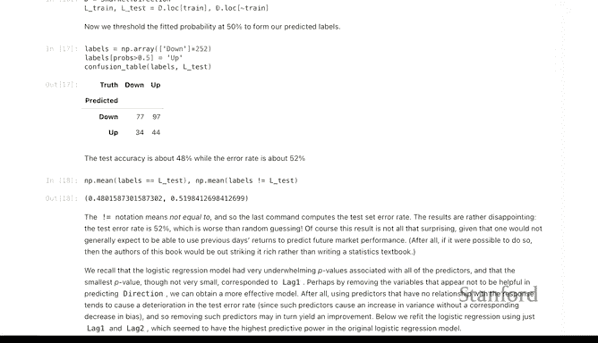

最后，如果你想利用新观测到的滞后数据进行向前预测，以下是一个小例子，展示如何计算预测概率。

```python
# 假设我们观察到新的 Lag1 和 Lag2 值
new_data = pd.DataFrame({'Lag1': [1.5], 'Lag2': [-0.8]})
# 使用简化模型预测上涨概率
new_prob = results_simple.predict(exog=new_data)
print(f"新观测数据的预测上涨概率: {new_prob[0]:.4f}")
```

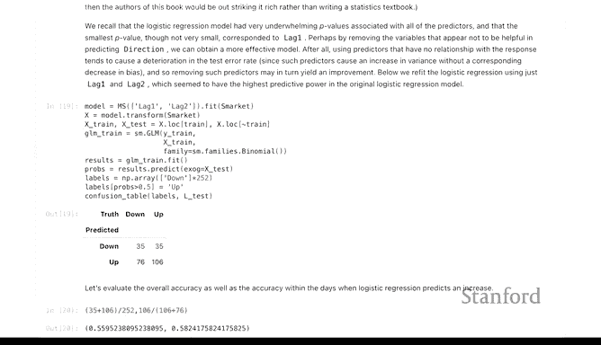

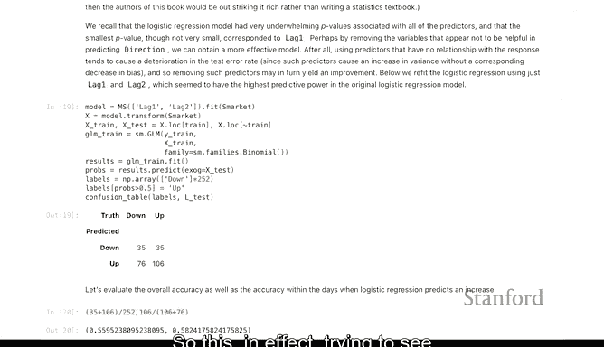

---

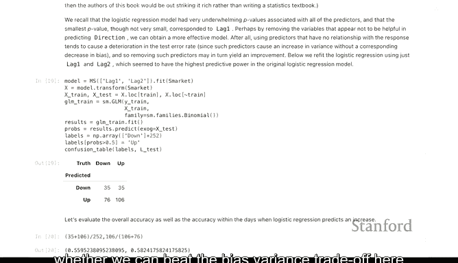

## 总结

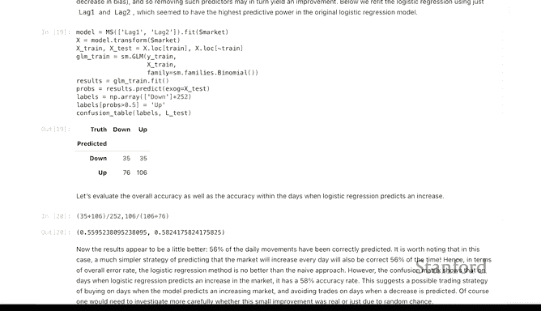

在本节课中，我们一起学习了如何将逻辑回归应用于股票市场数据的分类问题。我们涵盖了以下关键步骤：

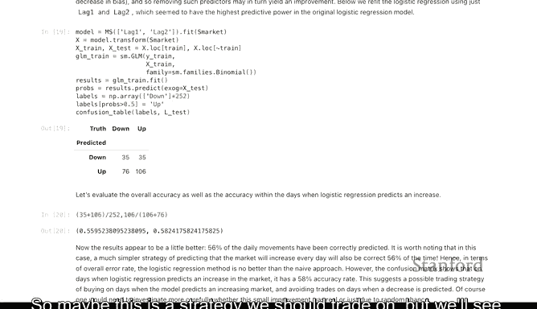

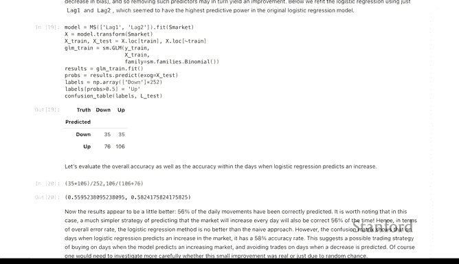

1.  **数据准备与探索**：加载数据，检查变量相关性。
2.  **模型拟合**：使用`statsmodels`的`GLM`与二项式族拟合逻辑回归模型。
3.  **性能评估**：
    *   计算训练误差，但认识到其乐观性。
    *   将数据按时间划分为训练集和测试集，以获得更真实的测试误差。
    *   使用混淆矩阵和准确率评估模型。
4.  **模型简化**：尝试使用更少的预测因子来应对可能的过拟合，并观察其对测试性能的影响。
5.  **新预测**：演示如何使用拟合好的模型对新数据进行预测。


实验结果表明，预测股票市场方向极具挑战性。即使是最佳模型，其性能也仅略高于随机水平，这印证了金融预测的难度。通过本实验，你掌握了应用和评估逻辑回归分类器的基本工作流程。