# Python 版 31：使用Scikit-learn实现线性判别分析(LDA)与相关分类器 🧠

在本节课中，我们将学习如何使用Python的Scikit-learn库实现线性判别分析（LDA）以及其他几种分类器，包括二次判别分析（QDA）、朴素贝叶斯（Naive Bayes）和K近邻（KNN）。我们将从逻辑回归过渡到Scikit-learn的分类器，并学习其通用的拟合与预测模式。

---

## 从逻辑回归到Scikit-learn分类器

上一节我们介绍了使用statsmodels进行逻辑回归。本节中，我们将开始使用Scikit-learn库中的一些分类器。第一个要拟合的模型是线性判别分析（LDA）。

Scikit-learn处理预测问题的通用模式是创建一个分类器对象。例如，我们创建一个名为`LDA`的对象，它是线性判别分析的简称。在创建这个估计器时，我们并不立即提供数据，而是先设置一些参数。例如，我们要求它存储协方差矩阵，以便后续检查。

```python
# 创建LDA估计器对象
lda = LinearDiscriminantAnalysis(store_covariance=True)
```

创建好估计器后，我们随后在特征矩阵`X`和响应变量`Y`上对其进行拟合。之后，我们可以对新的特征或原始特征进行预测。这是Scikit-learn中所有估计器工作的通用方式。

---

## 划分训练集与测试集

接下来，我们需要将数据划分为训练集和测试集。我们将按照以下方式创建训练集和测试集，并在训练数据上拟合模型。

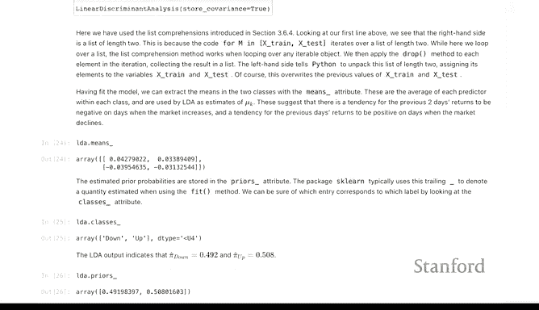

```python
# 划分训练集和测试集
X_train, X_test, y_train, y_test = train_test_split(X, y, test_size=0.3, random_state=42)
```

我们使用与之前相同的训练和测试设计矩阵，但需要注意，LDA要求我们移除截距项。如果不移除，可能会导致协方差矩阵不可逆的问题。

---


## 探索LDA模型的参数

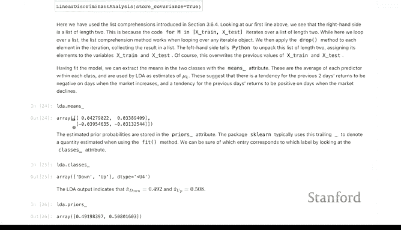

正如在理论部分所学，拟合LDA模型会得到几个关键参数。一个是公共协方差矩阵，另一个是各类别的均值。

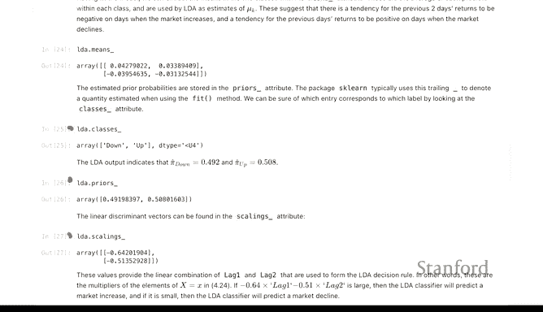

以下是获取这些参数的方法：
```python
# 拟合模型
lda.fit(X_train, y_train)

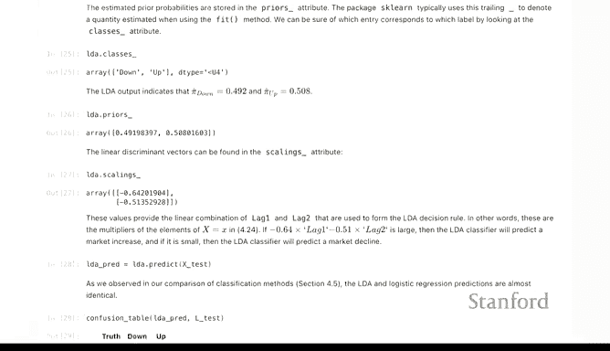

# 获取公共协方差矩阵
common_covariance = lda.covariance_

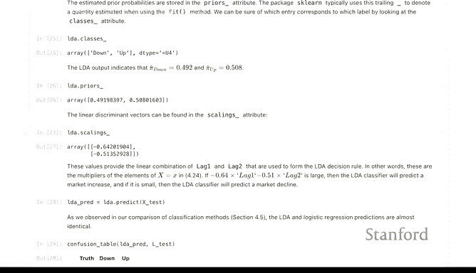

# 获取各类别的均值
class_means = lda.means_
```

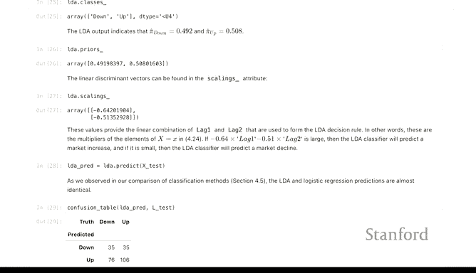

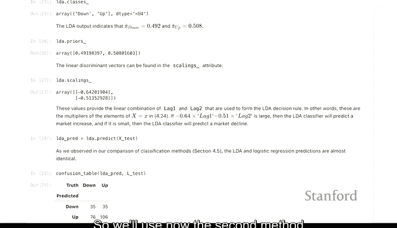

`class_means`矩阵的形状可以帮助我们理解其结构。例如，如果有两个类别和两个特征，它将是一个2x2的矩阵。文档会明确指出每一行对应一个类别的均值。`scalings_`属性则包含了用于分类的判别函数信息。


---

## 评估模型性能

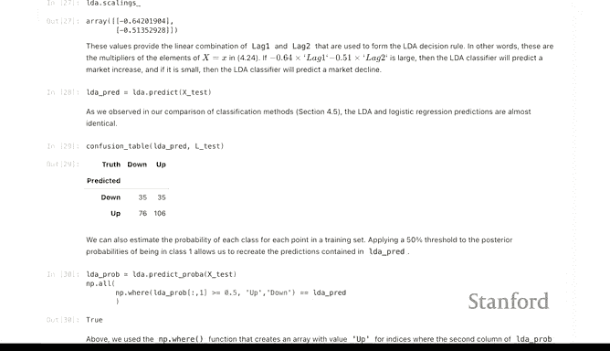

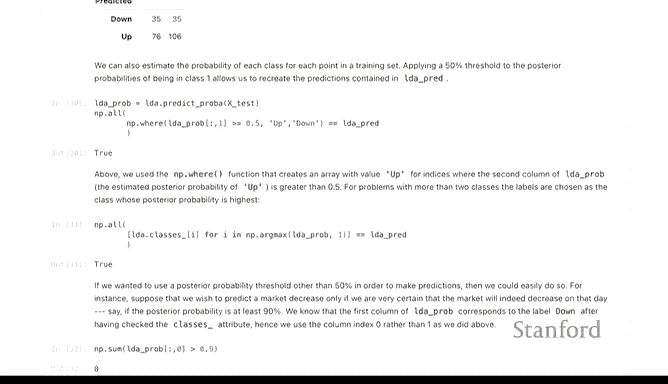

为了评估分类器在测试数据上的表现，我们使用Scikit-learn中分类器通用的`predict`方法。

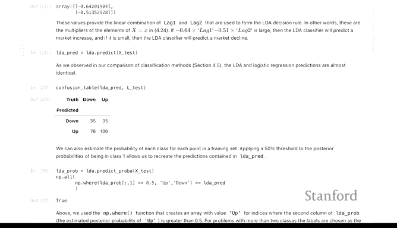

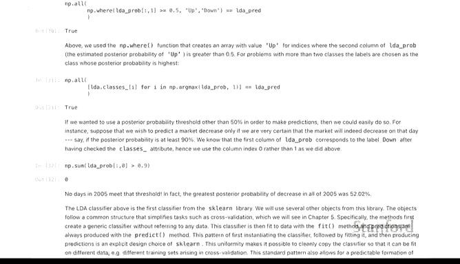

```python
# 在测试集上进行预测
y_pred = lda.predict(X_test)
```

然后，我们使用混淆矩阵来评估预测结果。虽然我们没有直接打印准确率，但可以通过混淆矩阵计算得出。

```python
# 生成混淆矩阵
conf_matrix = confusion_matrix(y_test, y_pred)
```

---

## 理解预测概率与阈值

大多数时候，我们基于50%的概率阈值将点分配到各个类别。然而，有时我们可能需要改变这个阈值。这可以通过直接调整应用于预测概率的阈值来实现。

LDA的`predict_proba`方法会返回每个测试样本属于各个类别的估计概率。第一列通常是属于“上涨”类别的概率，第二列是属于“下跌”类别的概率。

```python
# 获取预测概率
y_pred_proba = lda.predict_proba(X_test)
```

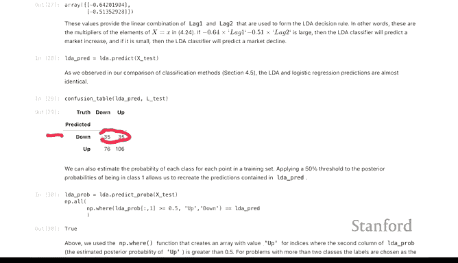

如果提高阈值，被分类为“上涨”的观测值会减少，被分类为“下跌”的会增多。这会改变混淆矩阵中非对角线区域的值，并可能影响整体准确率，具体取决于类别平衡和各类别内的准确率。

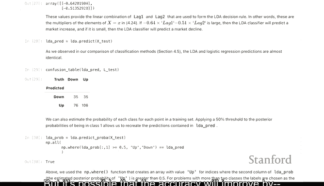

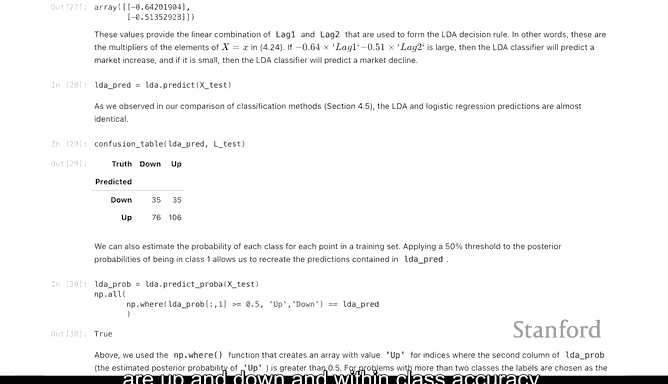

---

## 过渡到二次判别分析(QDA)

接下来，我们看看二次判别分析（QDA）。QDA与LDA非常相似，主要区别在于QDA为每个类别估计一个特定的协方差矩阵，而不是使用一个公共的协方差矩阵。

在代码实现上，QDA的拟合过程与LDA几乎完全相同。

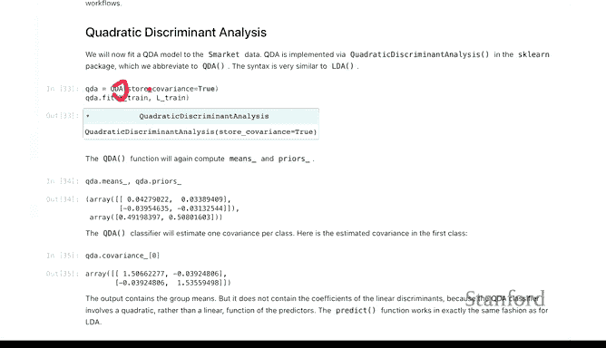

```python
# 创建并拟合QDA模型
qda = QuadraticDiscriminantAnalysis(store_covariance=True)
qda.fit(X_train, y_train)
```

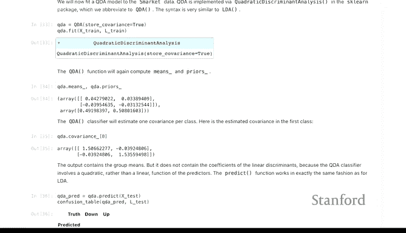

拟合后，我们可以查看每个类别的协方差矩阵。例如，第一个协方差条目对应“下跌”类别的协方差矩阵。

由于每个类别有自己的协方差矩阵，QDA产生的判别函数是二次函数。而在LDA中，由于假设协方差矩阵相同，判别函数是线性的。QDA的判别函数不能仅由`scalings_`矩阵描述，还需要结合协方差矩阵和均值差。

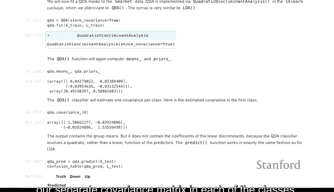

---


## 评估QDA模型

我们使用相同的方法评估QDA分类器的性能。

```python
# 预测并生成混淆矩阵
y_pred_qda = qda.predict(X_test)
conf_matrix_qda = confusion_matrix(y_test, y_pred_qda)
```

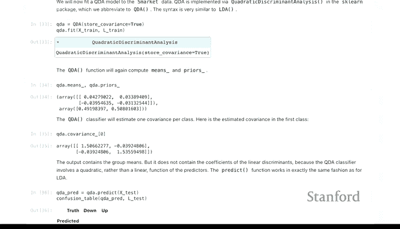

在这个例子中，QDA达到了约60%的准确率，这比之前使用相同特征和逻辑回归得到的55%要好，对于金融数据来说是一个不错的结果。

---

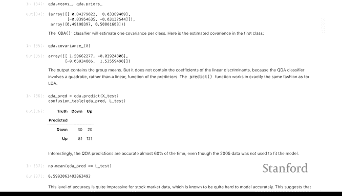

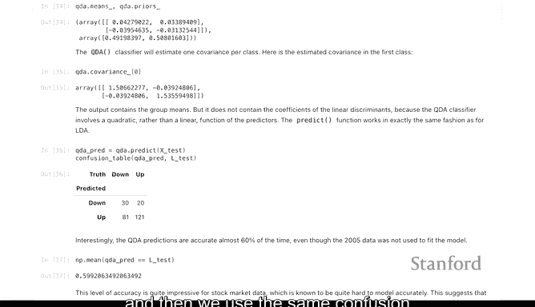

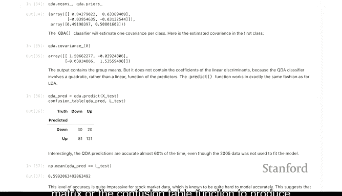

## 实现朴素贝叶斯分类器

我们希望你现在已经看到了Scikit-learn的使用模式。在了解了这个通用模式后，拟合许多不同的分类器就变得相当容易。接下来我们拟合朴素贝叶斯分类器。

从理论可知，当特征是连续变量时，朴素贝叶斯与QDA密切相关。它本质上是二次判别分析的一个受限版本，施加了协方差矩阵必须是对角矩阵的约束。这意味着它是一个参数更少的更简单模型。

在代码层面，它的拟合方式与QDA和LDA完全相同。

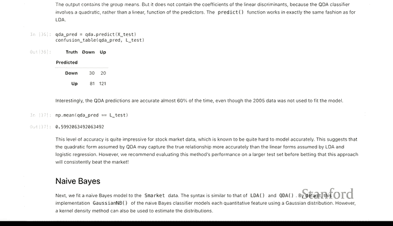

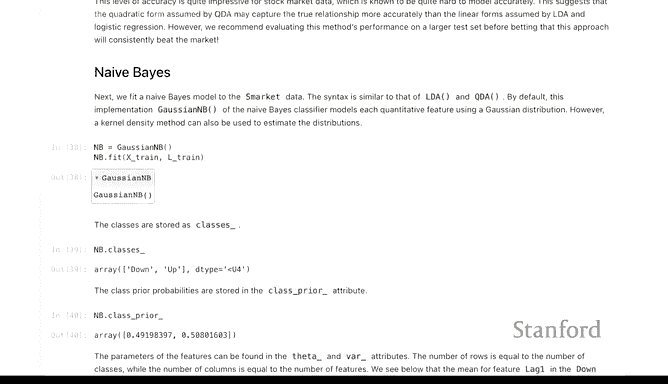

```python
# 创建并拟合朴素贝叶斯模型
nb = GaussianNB()
nb.fit(X_train, y_train)
```

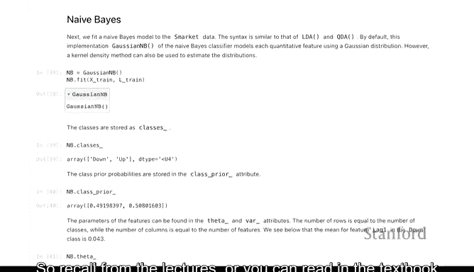

由于协方差矩阵是对角矩阵，我们只需要存储每个特征在每个类别内的方差，而不是完整的协方差矩阵。这可以通过`var_`属性来查看。

```python
# 查看各类别下特征的方差
class_variances = nb.var_
```

---

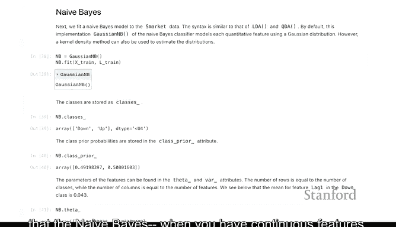

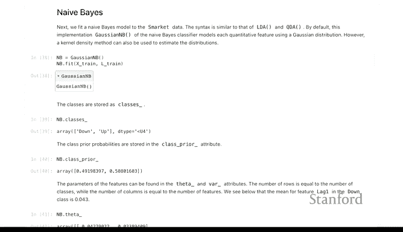

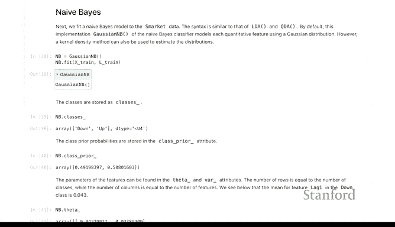

## 评估朴素贝叶斯模型

我们以类似的方式评估朴素贝叶斯分类器的预测效果。

```python
# 预测并生成混淆矩阵
y_pred_nb = nb.predict(X_test)
conf_matrix_nb = confusion_matrix(y_test, y_pred_nb)
```

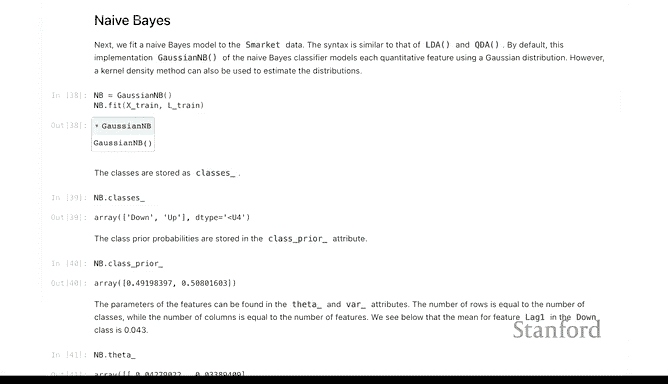

朴素贝叶斯分类器达到了约59%的准确率，与LDA非常接近。所有这些判别分析方法都表现得相当不错。

---

## 引入K近邻(KNN)分类器

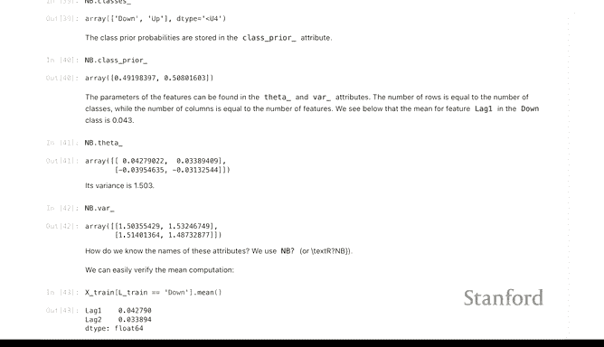

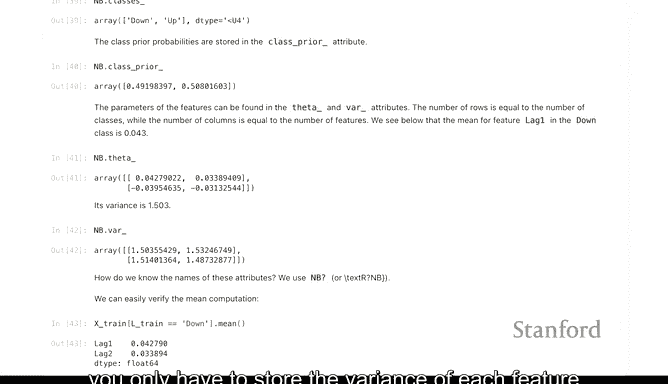

我们的最后一个主题是K近邻（KNN）分类器。KNN是一种基于实例的学习算法，它通过查找测试样本在特征空间中最近的K个训练样本，并根据这些“邻居”的类别来进行投票预测。

```python
# 创建并拟合KNN模型（例如，K=5）
knn = KNeighborsClassifier(n_neighbors=5)
knn.fit(X_train, y_train)
```

KNN的拟合过程只是存储训练数据，预测时则需要进行距离计算。其性能同样可以通过混淆矩阵来评估。

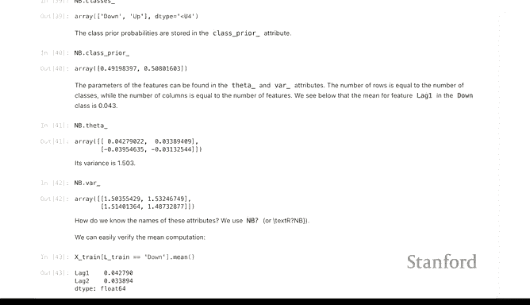

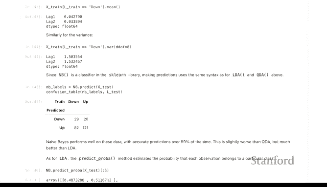

---

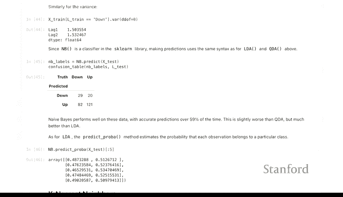

## 总结

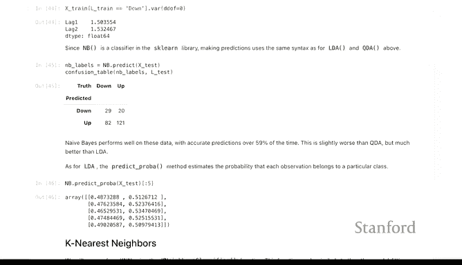

本节课中，我们一起学习了如何使用Scikit-learn库实现多种分类算法。我们从线性判别分析（LDA）开始，了解了其拟合、预测和评估的通用流程。接着，我们探索了二次判别分析（QDA），它放松了LDA的等协方差假设。然后，我们实现了朴素贝叶斯分类器，它是QDA的一种特殊形式。最后，我们简要介绍了K近邻（KNN）分类器。

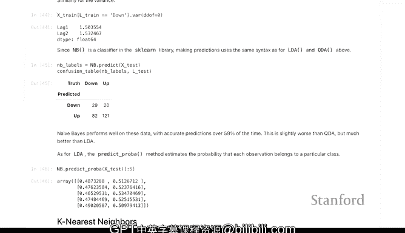


通过本节课，你应该掌握了在Scikit-learn中应用不同分类器的核心模式：**创建估计器 -> 拟合训练数据 -> 进行预测 -> 评估性能**。这种一致性使得尝试和比较多种机器学习模型变得非常简单直接。