# Python 版 32：K-最近邻(KNN)分类方法 I 📊

在本节课中，我们将学习K-最近邻分类方法。我们将了解其基本概念、如何在Python中使用`scikit-learn`库实现它，以及如何通过调整邻居数量来优化模型性能。我们还将讨论数据标准化的重要性，并比较KNN与之前学过的判别分析方法的表现。

---

## K-最近邻分类器简介

上一节我们介绍了线性判别分析和二次判别分析。本节中我们来看看另一种分类方法——K-最近邻。

K-最近邻是一种基于实例的学习算法。其核心思想是：对于一个待分类的新样本，查看在特征空间中与其最接近的K个训练样本，并根据这K个“邻居”的多数类别来预测该样本的类别。

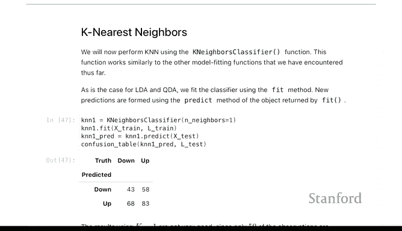

在代码实现上，使用`scikit-learn`的KNN分类器与使用LDA和QDA非常相似。

以下是导入和构建KNN分类器的基本代码：

```python
from sklearn.neighbors import KNeighborsClassifier
knn = KNeighborsClassifier(n_neighbors=1)
```

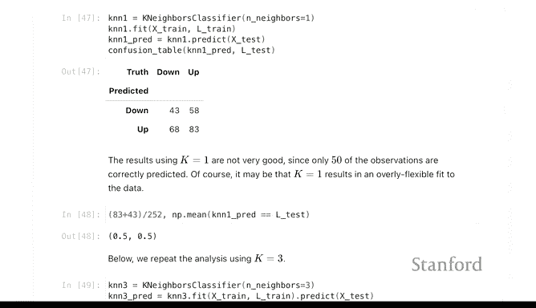

代码中拟合模型、在训练集上训练、在测试集上预测的步骤与之前的方法完全相同。同样，我们也可以计算混淆矩阵来评估性能。

---

## 使用单一邻居的KNN表现

我们首先尝试使用一个最近邻（K=1）进行分类。这是一个非常灵活的模型，可能具有较高的方差，容易过拟合。

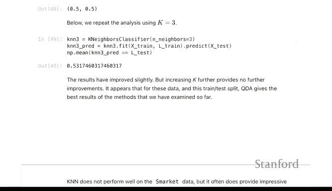

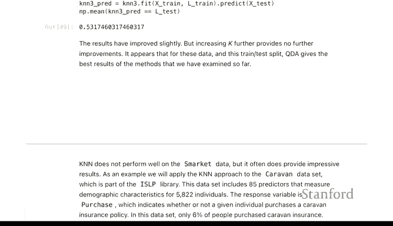


结果显示，使用一个最近邻的分类器表现不佳，测试准确率约为50%，这几乎是可能得到的最差结果。

---

## 调整邻居数量

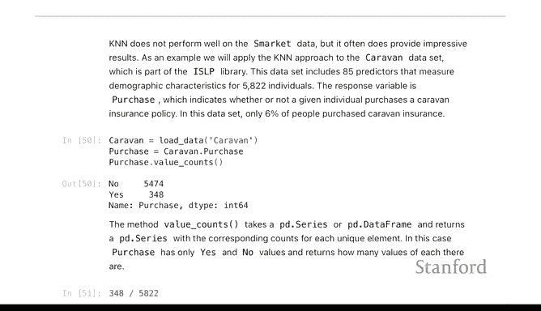

接下来，我们看看如果改变邻居数量，性能是否会提升。将邻居数改为3个。


使用三个邻居时，我们得到了约53%的准确率。这比使用一个邻居时有所改善，但仍然不如之前看到的判别分析方法。

K-最近邻方法非常具有适应性和灵活性，但在小数据集上尤其容易过拟合。因此，以简单的方式选择合适的K值非常重要，这也是我们接下来要做的。

---

## 引入新数据集：Caravan保险数据

我们将使用一个略有不同的数据集——来自`ISLR`包的Caravan数据集。该数据集的目标是预测人们是否会购买 caravan 保险。

> 注：在澳大利亚、新西兰、南非等地，“caravan”指露营车；在北美，通常称为“RV”（房车）。


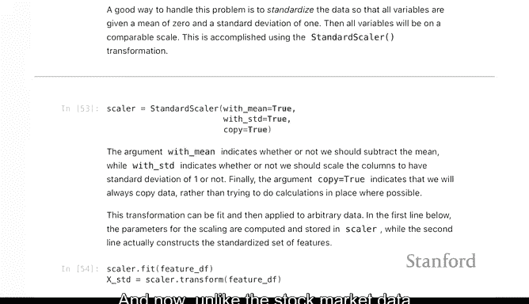

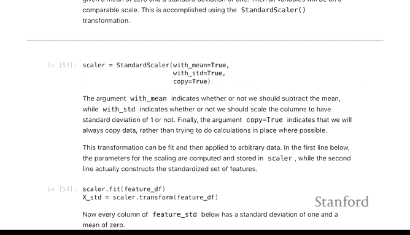

这是一个非常不平衡的分类问题，因为实际购买保险的人只占约6%。这与股市数据（涨跌大致各占50%）形成对比。

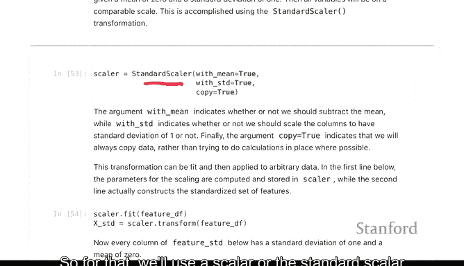

我们将使用“购买”列之外的所有特征来构建特征集。

---

## 特征标准化的重要性

与股市数据只有`Lag1`和`Lag2`两个特征不同，Caravan数据集包含许多特征，且这些特征的度量单位略有不同。

由于K-最近邻分类器使用点之间的距离，如果某个变量的单位与其他变量差异很大，它将在距离计算中占据主导地位。因此，在分类之前，我们需要对特征进行标准化。

我们使用`scikit-learn`中的`StandardScaler`来实现标准化。这是一个“转换器”的例子。


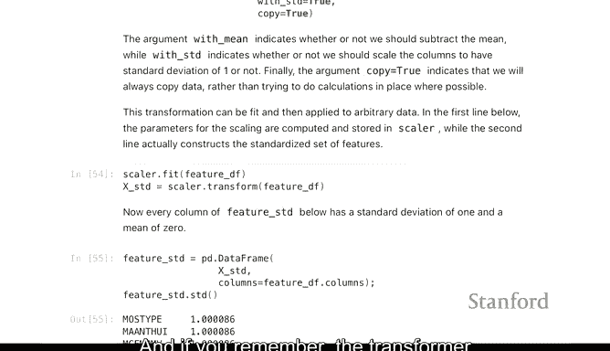

以下是标准化的步骤：

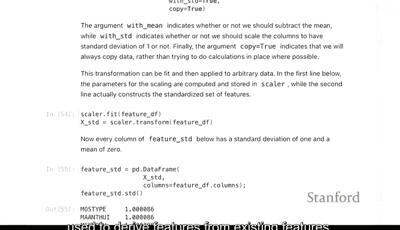

1.  **初始化转换器**：`scaler = StandardScaler()`
2.  **拟合转换器**：在特征集上调用`fit`方法，计算均值和方差等参数。
    
3.  **转换特征**：使用`transform`方法将特征转换为均值为0、方差为1的标准形式。
    

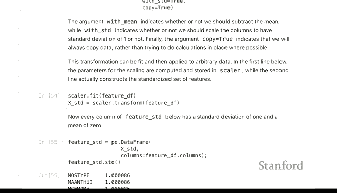

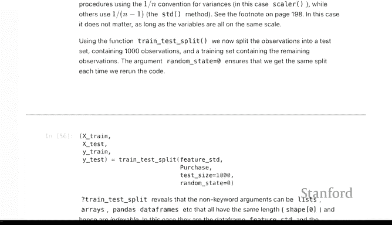

我们将使用标准化后的特征进行K-最近邻分类。

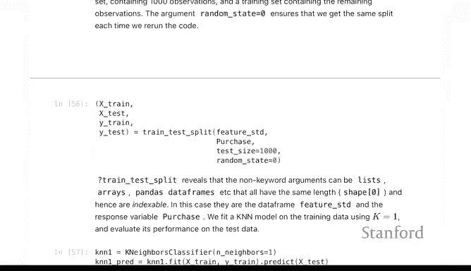

---

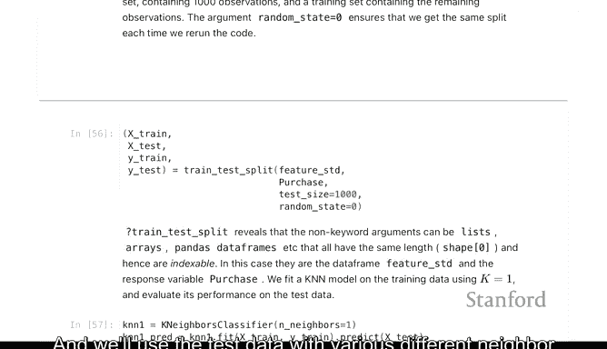

## 划分数据集与基线模型

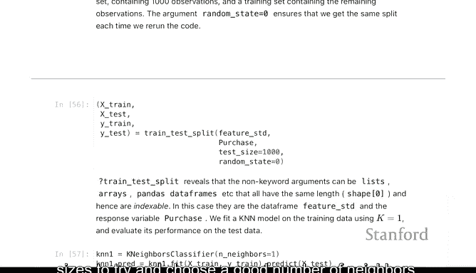

我们将数据分割为训练集和测试集。


然后，我们将在测试数据上使用不同数量的邻居来尝试选择一个合适的K值。


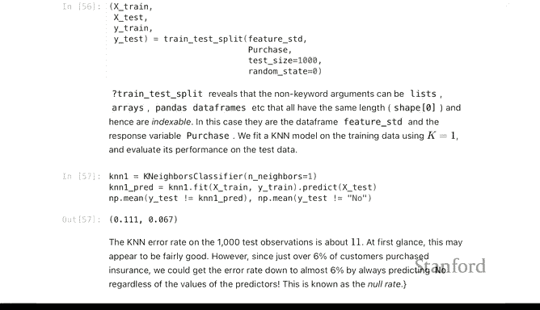

使用一个最近邻时，我们得到了约11%的准确率。虽然6%是如果我们仅使用截距模型（即无特征模型）可能得到的基线估计，11%显示出了一些改进，但改进幅度并不大。


---

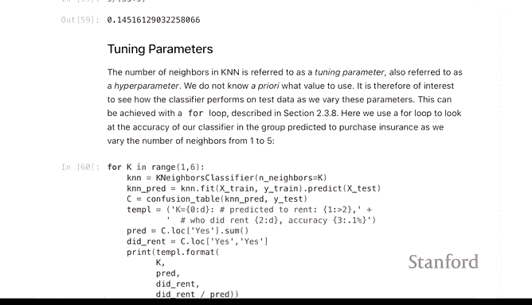

## 选择最优邻居数量（调参）

选择邻居数量是为估计器选择调整参数的一个例子，这是我们在后续例子中会经常遇到的常见任务。

以下是实现步骤：

我们将为不同的邻居数量（从1到5）拟合K-最近邻分类器。使用一个`for`循环遍历这些值。

在循环内部，我们将执行与之前类似的操作：在训练数据上拟合模型，在测试数据上预测，形成混淆矩阵，然后计算准确率。

为了简洁，我们可以将拟合和形成混淆矩阵的步骤合并为两行代码。

以下是核心代码逻辑：

```python
for k in range(1, 6):
    knn = KNeighborsClassifier(n_neighbors=k)
    knn.fit(X_train_std, y_train)
    y_pred = knn.predict(X_test_std)
    # 计算并打印准确率
    accuracy = np.mean(y_pred == y_test)
    print(f‘Neighbors={k}, Accuracy={accuracy:.4f}’)
```

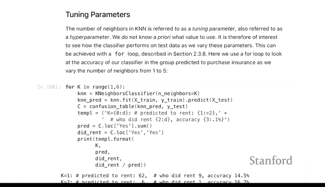

在后面的实验中，我们会绘制准确率或均方误差随调整参数变化的曲线图。这里我们先将其打印出来。

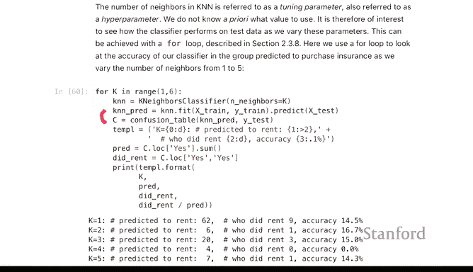


对于这个特定的训练-测试分割，我们可以看到大多数邻居数量能达到约14%或15%的准确率。

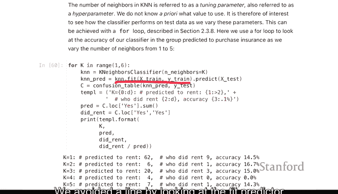

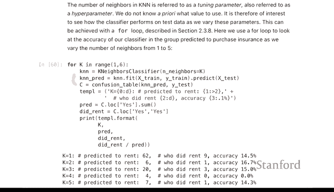

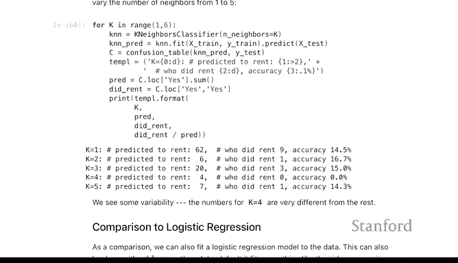


其中，使用4个邻居时出现异常，准确率显著不同。这可能是因为K-最近邻是一个噪声较大的分类器，有时会产生不稳定的结果。

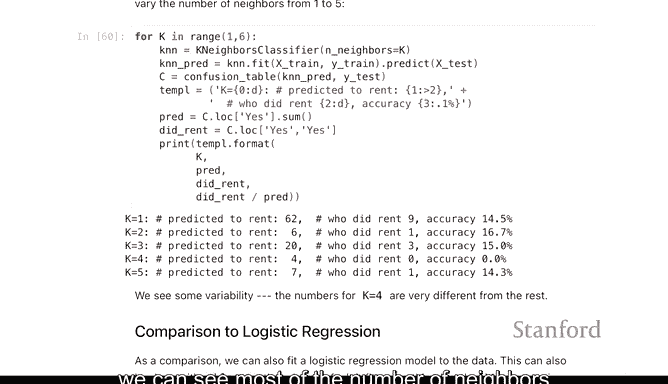

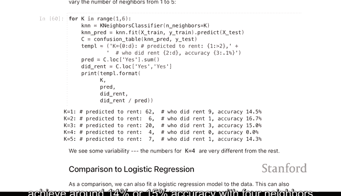


---

## 总结

本节课中我们一起学习了K-最近邻分类方法。我们了解到：

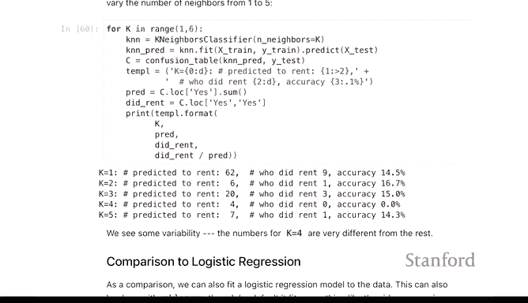

*   KNN是一种基于距离和邻居投票的简单而直观的分类算法。
*   在使用KNN时，对特征进行标准化至关重要，特别是当特征具有不同量纲时。
*   邻居数量`K`是一个关键的超参数：`K`值太小可能导致模型过拟合、方差高；`K`值太大可能导致模型欠拟合、偏差高。
*   我们可以通过在验证集上评估不同`K`值对应的性能来选择最优的`K`。
*   在Caravan不平衡数据集上，KNN展示了一定的预测能力，但其性能受`K`值选择和数据随机分割的影响。

这结束了我们今天实验课要讨论的内容。实验手册中还有几个部分（包括泊松回归），我们鼓励大家线下自行完成。


