# Python 版 33：📊 5.1 交叉验证

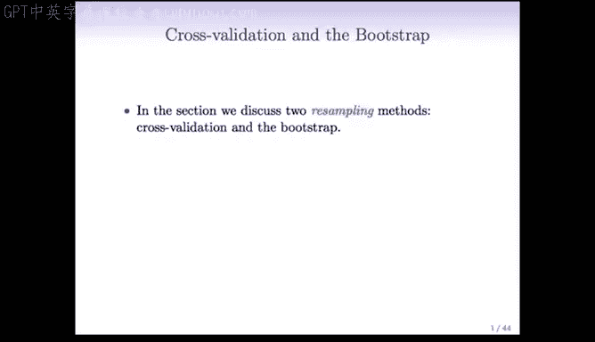

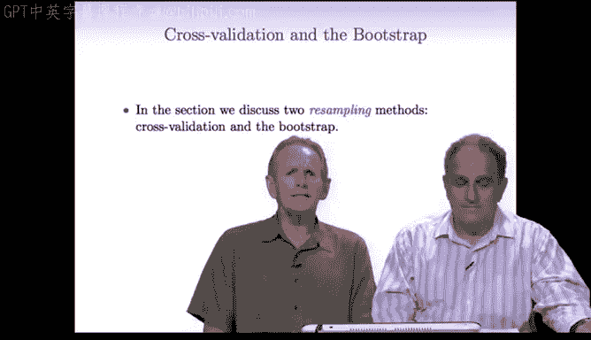

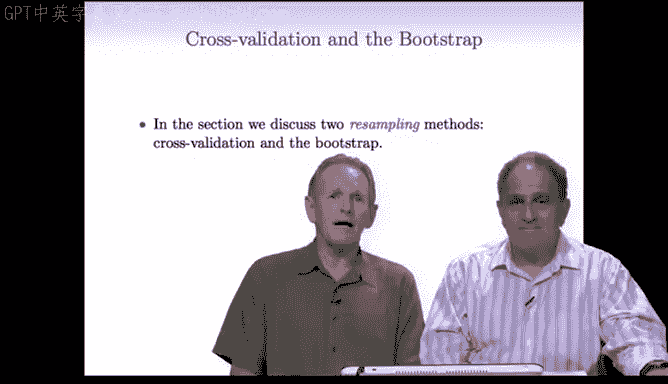

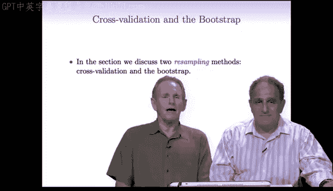

在本节课中，我们将要学习两种重要的重采样方法：**交叉验证** 和 **自助法**。我们将首先回顾训练误差与测试误差的概念，然后深入探讨交叉验证的原理、实现方式及其在模型评估与选择中的核心作用。

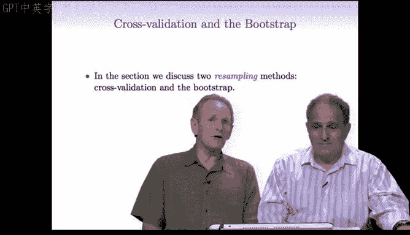

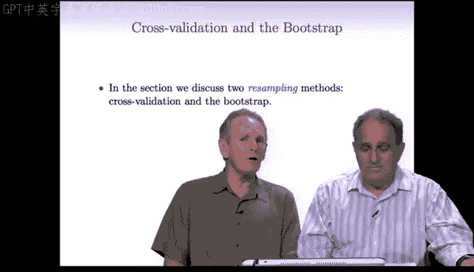

---

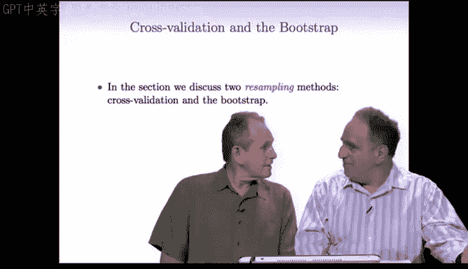

## 训练误差 vs. 测试误差

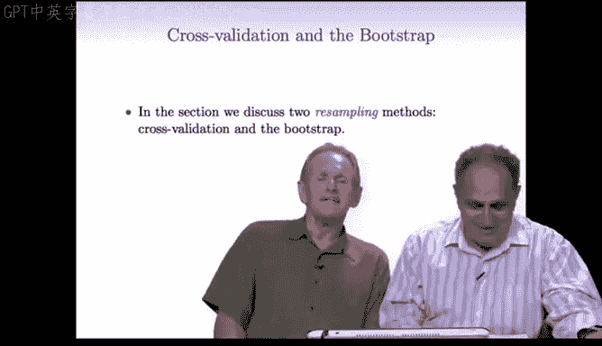

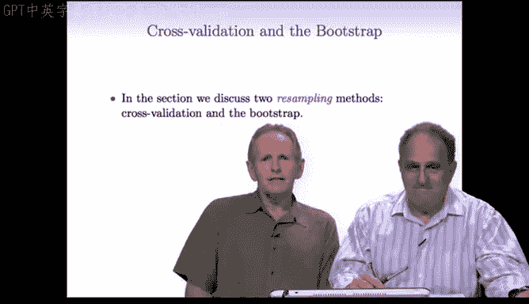

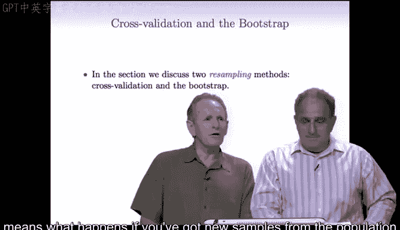

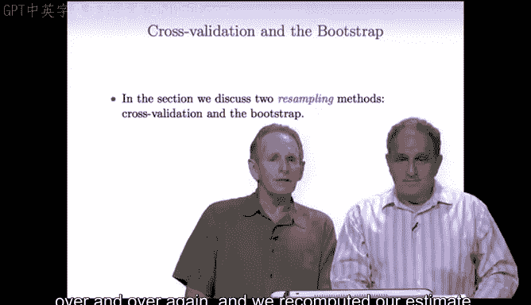

上一节我们介绍了回归与分类的预测方法。本节中我们来看看如何评估这些预测方法的性能。

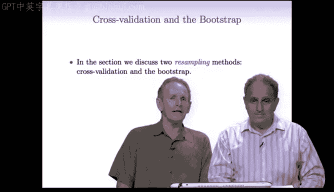

理想情况下，我们希望从总体中获得一个新样本，并观察我们的预测效果如何。然而，我们并不总是有新数据。我们不能直接使用训练数据来评估，因为这样会过于乐观。

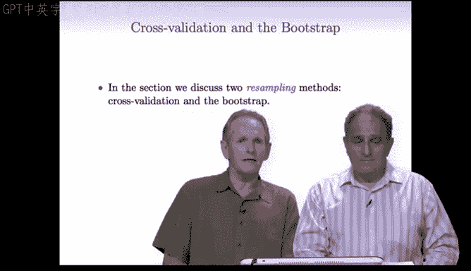

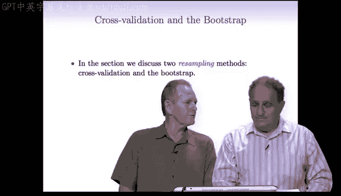

测试误差是我们在新数据上产生的误差。我们首先在训练集上拟合模型，然后将模型应用于模型从未见过的新数据。测试误差反映了模型在未来未见数据上的表现。

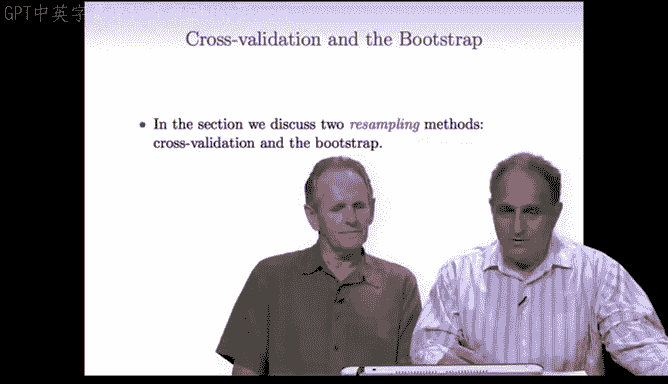

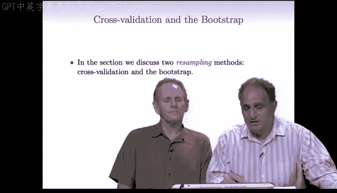

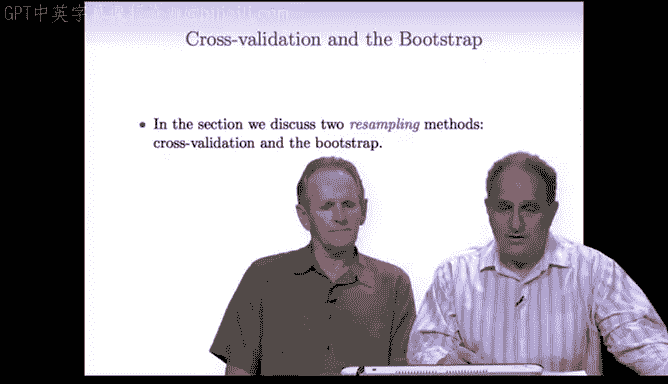

训练误差则更容易计算，我们可以在同一数据集上进行。它是将模型应用于训练它的同一数据时产生的误差。可以想象，训练误差通常低于测试误差，因为模型已经见过训练集，所以对训练集的拟合误差会更低。

我们拟合数据越用力（模型越复杂），训练误差看起来就越低。另一方面，测试误差可能会高得多。因此，训练误差并不是测试误差的良好替代指标。

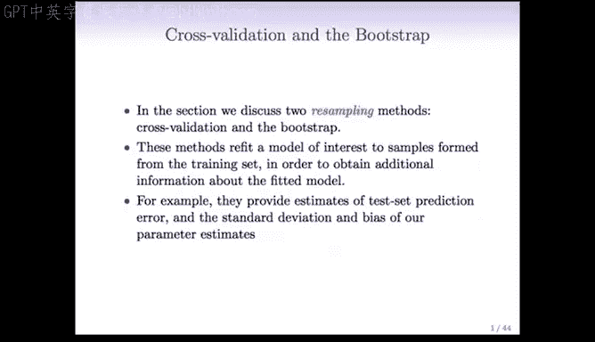

下图很好地总结了这些概念：

*   **横轴** 代表模型复杂度，从低到高。例如，在线性模型中，复杂度是特征或系数的数量。
*   **纵轴** 代表预测误差。
*   **蓝色曲线** 是训练误差。
*   **红色曲线** 是测试误差。

观察曲线：
*   当模型复杂度低时（例如只拟合一个常数），训练误差很高。
*   随着模型复杂度增加，训练误差持续下降。
*   测试误差起初也很高，随后下降，但在达到一个最小值（大约在中间位置）后开始再次上升。

在最小值点之后增加复杂度，就是**过拟合**的例子。在左侧，我们添加了对预测响应变量真正重要的特征，从而降低了测试误差。但在那之后，我们开始加入仅仅是噪声的特征。训练误差必须下降，但测试误差开始上升。

训练误差无法告诉我们关于过拟合的任何信息，因为它使用相同的数据来测量误差。参数越多，训练误差看起来越好。测试误差曲线则在某个模型复杂度水平上最小化，超过该点即为过拟合。

预测误差的组成部分实际上是**偏差**和**方差**。
*   **偏差** 是模型预测平均值与真实值之间的差距。
*   **方差** 是估计值围绕其平均值波动的程度。

当我们拟合程度不高时（模型简单），偏差高，方差低。随着模型复杂度增加（向右移动），偏差下降（因为模型能适应数据中更细微的模式），但方差上升（因为我们需要从相同数量的数据中估计更多参数）。偏差和方差共同构成预测误差，它们之间存在权衡，其总和在某个模型复杂度下达到最小。这就是**偏差-方差权衡**。

---

## 验证集方法

既然我们不能使用训练误差来估计测试误差，那该怎么办？最好的解决方案是，如果我们有一个大的测试集，可以直接使用它。但通常我们没有大的测试集。

有一些方法可以通过调整训练误差来获得测试误差的估计。这些方法包括 **Cp统计量**、**AIC** 和 **BIC**，我们将在课程后面讨论，不在本节中。

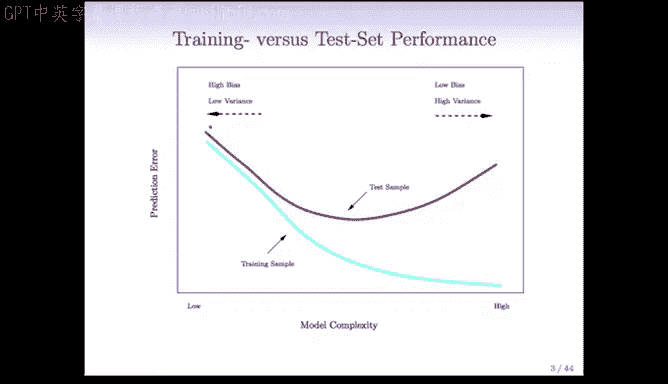

本节我们将讨论**交叉验证**或**验证**。这些方法涉及保留部分数据，将模型拟合到剩余部分，然后将拟合好的模型应用于我们保留的数据。

首先，让我们谈谈**验证集方法**。其基本思想很简单：我们将数据随机分成大致相等的两部分。第一部分称为**训练集**，第二部分称为**验证集**或**留出集**。

具体步骤如下：
1.  在训练集上拟合模型。
2.  将拟合好的模型应用于验证集。
3.  记录在验证集上产生的误差，即**验证集误差**。

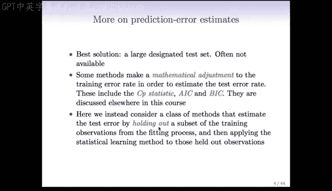

验证集误差为我们提供了测试误差的一个良好估计（至少是某种程度的估计）。对于定量响应，我们使用**均方误差**来衡量；对于定性或离散响应（分类问题），我们使用**分类错误率**。

以下是该过程的示意图：
*   数据集被随机分成两部分。
*   左侧蓝色部分是训练集。
*   右侧橙色/粉色部分是验证集。
*   我们根据训练集（蓝色部分）拟合模型，然后预测验证集（粉色部分）的观测值。

这似乎有点浪费，特别是当你的数据集非常小时。正如我们将看到的，交叉验证将消除这种浪费并提高效率。

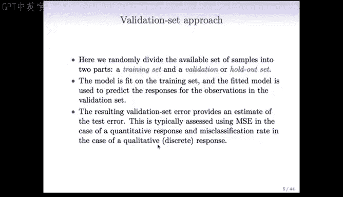

---

## 验证集方法的局限性

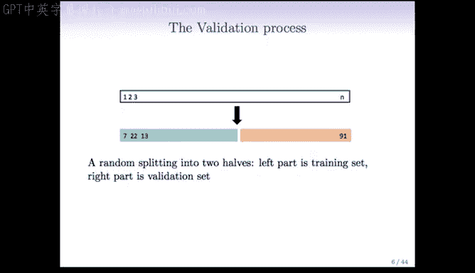

在汽车数据示例中，我们比较了线性模型与高阶多项式回归。我们将392个观测值随机分成两部分，每部分196个，分别作为训练集和验证集。

如果我们只进行一次分割，并记录均方误差作为多项式阶数的函数，会得到一条红色曲线。最小值似乎出现在2阶（二次模型）附近，之后曲线基本持平。

但是，当我们用更多不同的随机分割重复这个过程时，会出现很大的变异性。最小值确实倾向于出现在2阶附近，但误差值根据分割方式的不同，在大约16到24之间剧烈波动。

这是因为我们将数据分成两部分，当你分割数据时，根据分割方式的不同会产生很大的变异性。此外，训练集只有原始数据的一半大小。

即使存在这种变异性，曲线的形状往往大致相同，但高度（误差水平）却上下波动。这引出了我们使用验证（或交叉验证）的两个目的：
1.  选择最佳的模型规模（例如，多项式的阶数）。
2.  为我们提供一个关于误差有多好的概念，即最终拟合过程的实际测试误差。

将数据分成两部分的验证方法在第一个目的上似乎是成功的（最小值一致出现在2阶附近），但在告诉我们误差水平方面就不那么好了，因为我们在这里得到了一个非常宽的范围。

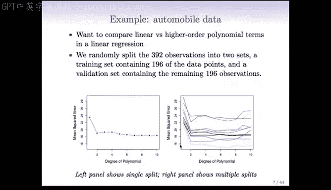

验证集方法存在一些缺点：
1.  **高度可变性**：因为我们将数据分成两部分，并且有很多种分割方式。
2.  **训练效率低**：每次训练时，我们丢弃了一半的数据，训练集只有原始训练集的一半大小。
3.  **估计偏差**：我们实际上得到的是基于 `n/2` 大小训练集的测试误差估计，而我们需要的是基于完整 `n` 大小训练集的测试误差估计。通常，训练数据越多，误差越低。因此，基于一半数据得到的误差估计可能会高于我们实际想获得的误差。

---

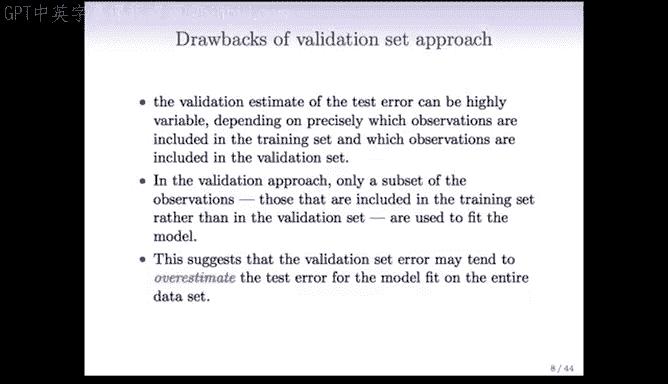

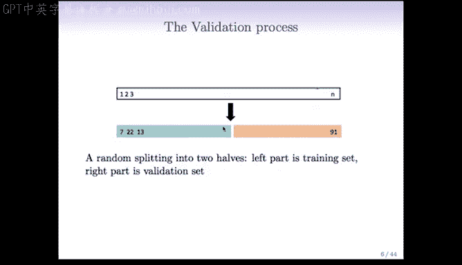

## 总结

本节课中我们一起学习了模型评估的基础。我们回顾了训练误差与测试误差的区别，以及过拟合和偏差-方差权衡的概念。我们介绍了**验证集方法**作为一种简单的模型评估技术，同时也指出了它的主要局限性：**估计的高方差**和**对数据利用的低效率**。

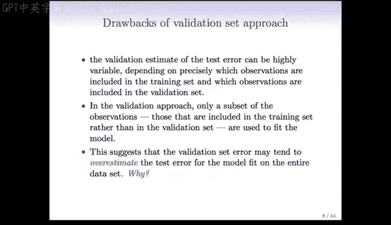

正因为这些局限性，我们需要更强大的方法。在下一节中，我们将探讨**交叉验证**，这是一种旨在克服这些缺点、提供更稳定和高效评估的重采样技术。