# Python 版 34：K折交叉验证 📊

在本节课中，我们将要学习一种非常重要的模型评估技术——K折交叉验证。我们将了解其核心思想、具体操作步骤、优缺点以及如何选择合适的K值。

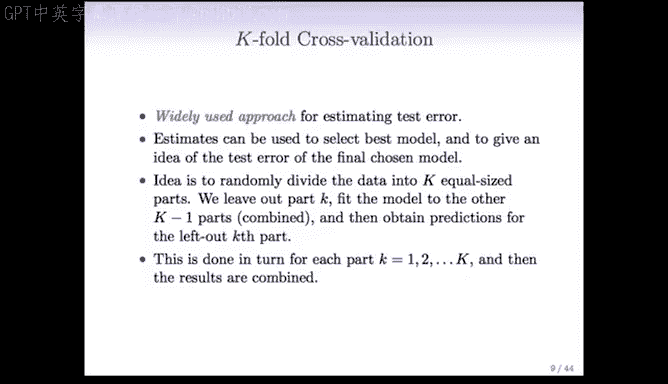

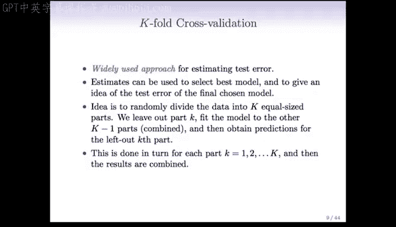

上一节我们介绍了验证集方法，并看到了该方法的一些缺点。本节中，我们将探讨K折交叉验证，它将解决其中的一些问题。这是一种极其灵活且强大的技术，用于估计预测误差和理解模型复杂度，在本课程后续章节以及实际工作中都会频繁使用。

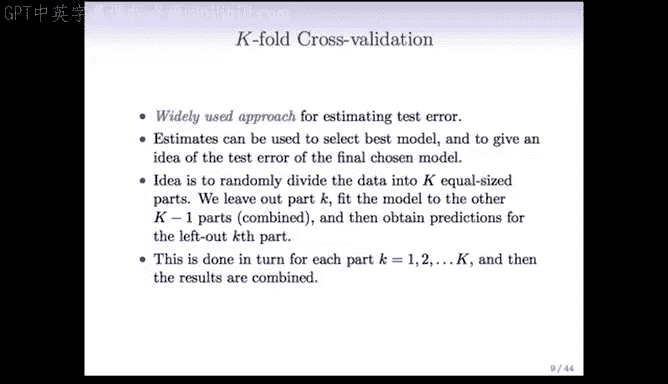

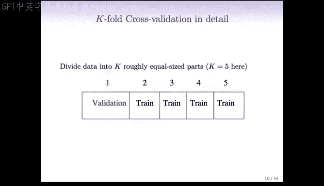

## K折交叉验证的核心思想 🧠

K折交叉验证的核心思想正如其名：它是一种验证方法，但像一场分为K幕的戏剧一样，会进行K次。在每一次中，其中一部分数据扮演验证集的角色，而其余K-1部分数据则扮演训练集的角色。

以下是K折交叉验证过程的直观展示。我们以五折交叉验证（K=5）为例进行说明：

1.  **数据划分**：首先，将整个数据集随机、大致均匀地划分为K个部分（或称“折”）。
2.  **轮流验证**：进行K轮训练和验证。在每一轮中：
    *   选择其中一个部分作为**验证集**。
    *   将剩余的K-1个部分合并，作为**训练集**。
    *   在训练集上拟合模型。
    *   使用拟合好的模型对验证集进行预测，并计算误差（例如均方误差）。
3.  **误差汇总**：将K轮计算得到的误差汇总，得到最终的交叉验证误差估计。

## 数学公式表示 📝

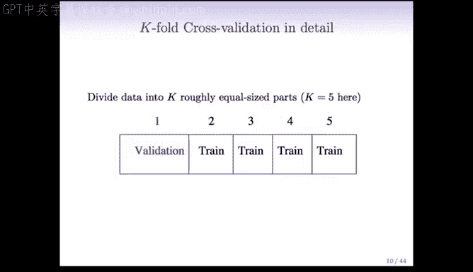

让我们用更精确的数学语言来描述这个过程。

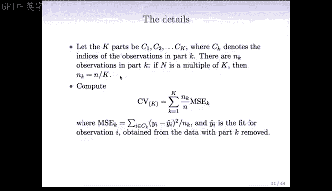

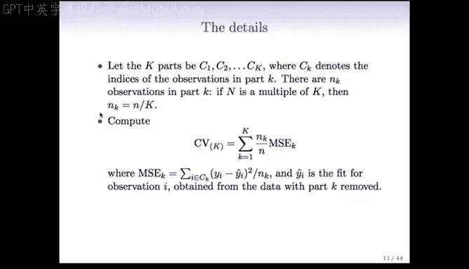

假设我们将数据划分为K个部分：`C₁, C₂, ..., Cₖ`。每个部分 `Cₖ` 包含 `nₖ` 个观测值。

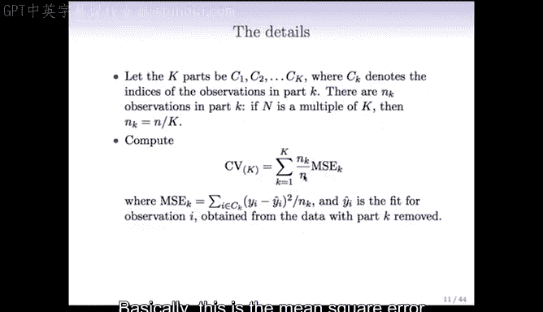

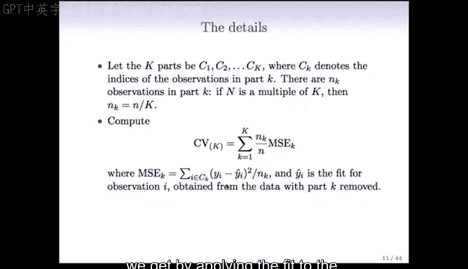

对于第k折（即第k部分作为验证集），我们在除 `Cₖ` 外的所有数据上训练模型，得到拟合函数 `f̂⁻ᵏ(x)`。然后计算该折的验证误差：

`MSEₖ = (1/nₖ) * Σ (yᵢ - f̂⁻ᵏ(xᵢ))²`，其中求和针对 `Cₖ` 中的所有观测值 `i`。

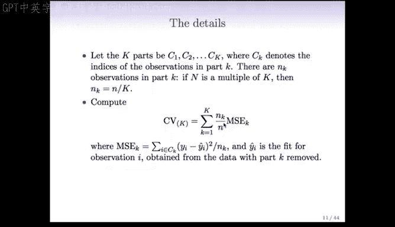

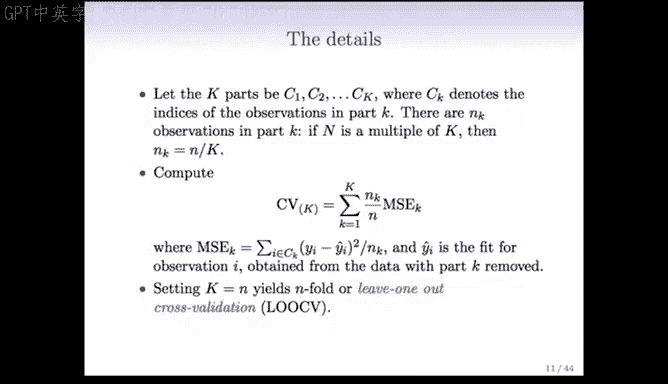

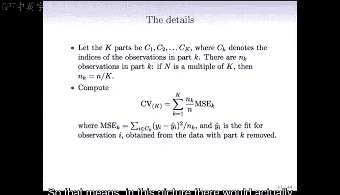

最终的K折交叉验证误差率是所有K折误差的平均值：

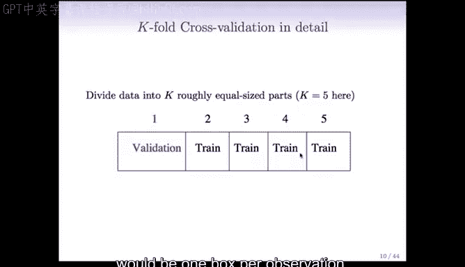

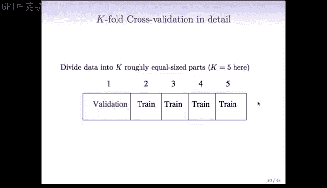

`CV₍ₖ₎ = (1/K) * Σ MSEₖ`，其中求和从 `k=1` 到 `K`。

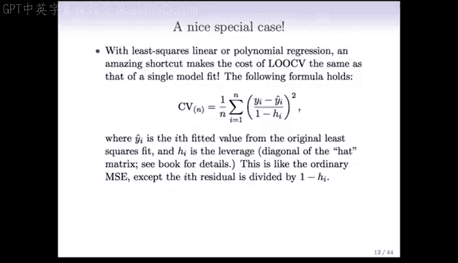

在实际计算中，如果各折大小不完全相等，我们通常使用加权平均：

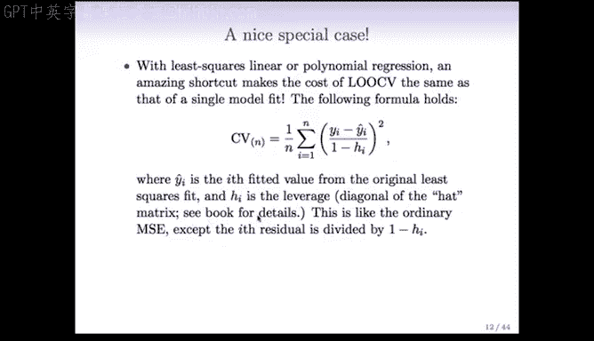

`CV₍ₖ₎ = Σ (nₖ / n) * MSEₖ`，其中 `n` 是总样本量。

## 留一法交叉验证：一个特例 🔬

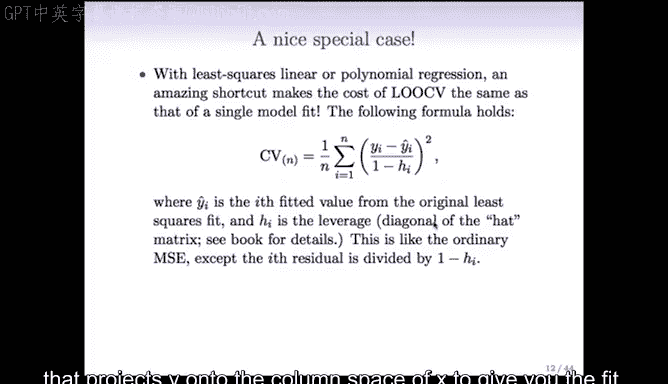

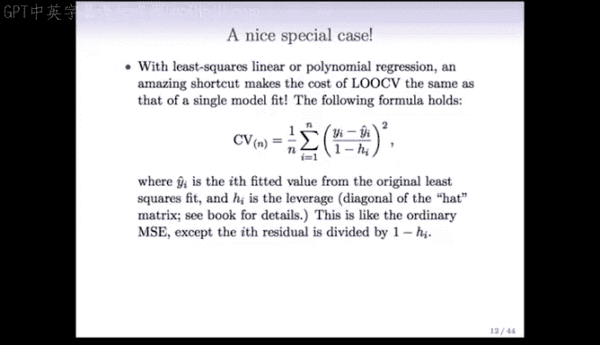

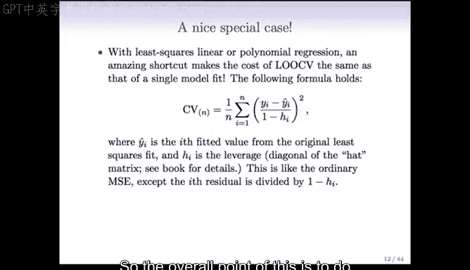

当折数K等于样本总数n时，K折交叉验证就变成了**留一法交叉验证**。

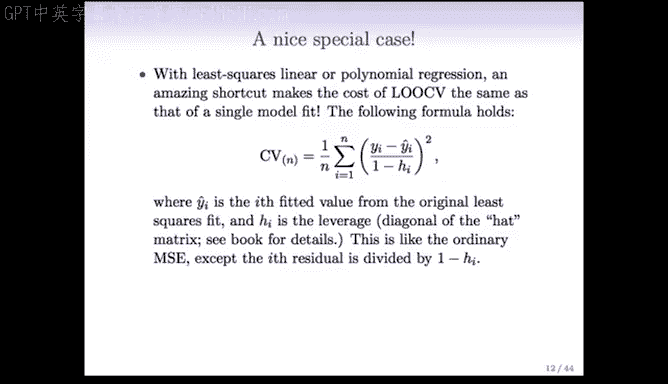

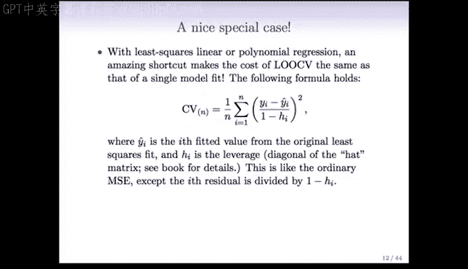

在留一法交叉验证中，每个观测值依次单独作为验证集，其余n-1个观测值作为训练集。这意味着需要进行n次模型训练。

对于最小二乘线性回归等特定模型，留一法交叉验证误差有一个非常高效的计算公式，无需真正进行n次拟合：

`CV₍ₙ₎ = (1/n) * Σ ( (yᵢ - ŷᵢ) / (1 - hᵢ) )²`

其中，`ŷᵢ` 是在**全部数据**上拟合模型后对第i个观测值的预测值，`hᵢ` 是“帽子矩阵” `H = X(XᵀX)⁻¹Xᵀ` 的第i个对角线元素。`hᵢ` 反映了第i个观测值对其自身预测值的影响力。

## 如何选择K值？权衡偏差与方差 ⚖️

选择K值是偏差与方差之间的权衡。

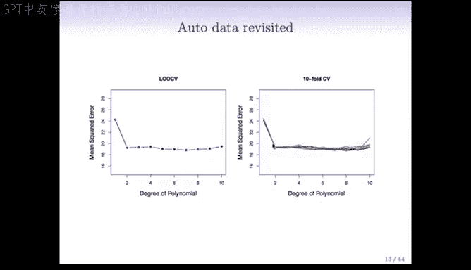

*   **留一法交叉验证（K=n）**：
    *   **优点（低偏差）**：每次训练使用的数据量几乎与全集相同（n-1个样本），因此对真实测试误差的估计偏差较小。
    *   **缺点（高方差）**：各次训练集之间高度相似（仅相差一个样本），导致计算出的n个误差值高度相关，其平均值的方差较大，结果不稳定。

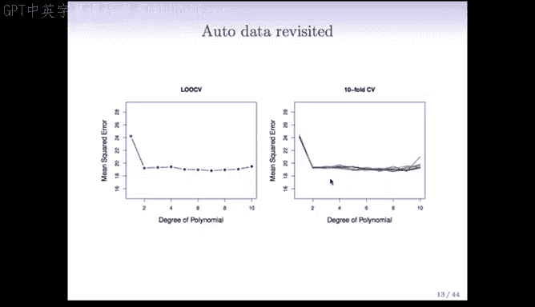

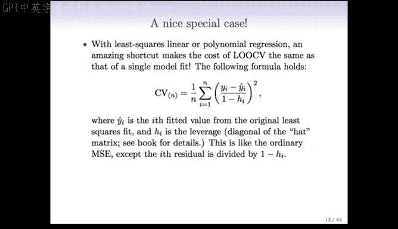

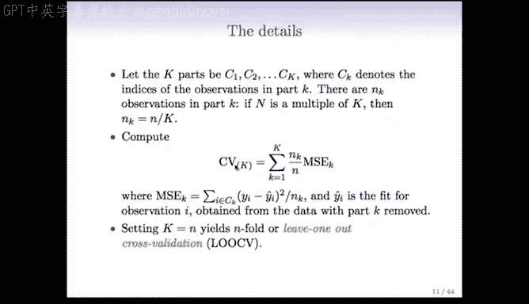

*   **较小K值（如K=2）**：
    *   **缺点（高偏差）**：每次训练集远小于原始数据集，导致对测试误差的估计通常偏高（过于悲观）。
    *   **可能的高方差**：如上一节所示，将数据一分为二进行验证，结果对数据划分方式非常敏感，方差也可能很大。

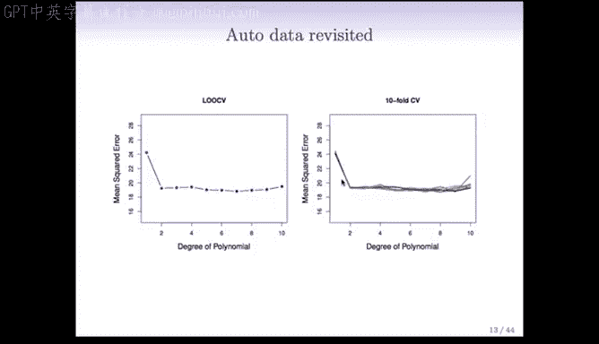

*   **折中的选择（K=5或10）**：
    *   实践证明，选择 **K=5 或 K=10** 通常在偏差和方差之间取得了良好的平衡。训练集大小是原始集的80%或90%，偏差可以接受；同时，不同折之间的训练集差异足够大，降低了误差估计之间的相关性，从而控制了方差。因此，5折或10折交叉验证是最常用、最推荐的选择。

## 交叉验证实践：以模拟数据为例 📈

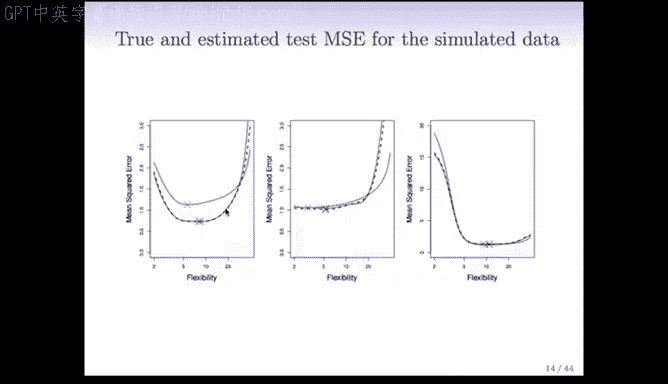

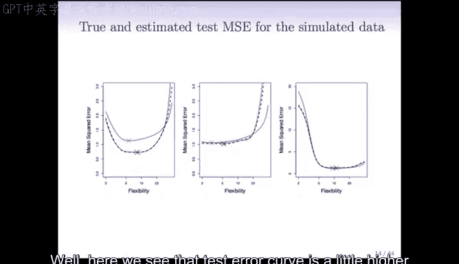

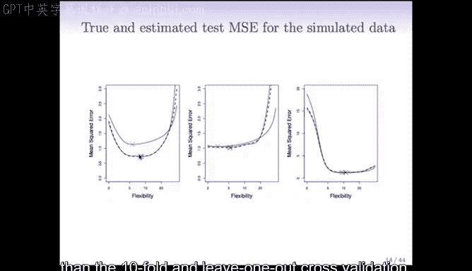

我们通过一个模拟数据的例子来观察不同交叉验证方法的表现。图中比较了留一法交叉验证（黑色虚线）和10折交叉验证（橙色曲线）与真实测试误差（蓝色曲线）的接近程度。

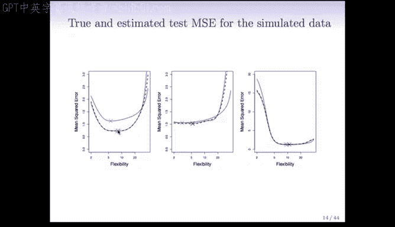

可以观察到：
1.  两种交叉验证曲线都能大致反映真实测试误差曲线的趋势。
2.  它们找到的最优模型复杂度（曲线最低点）与真实最优点可能略有偏差，但在误差曲线较为平坦的区域，这种偏差影响不大。
3.  10折交叉验证通常比留一法更稳定（方差更小）。

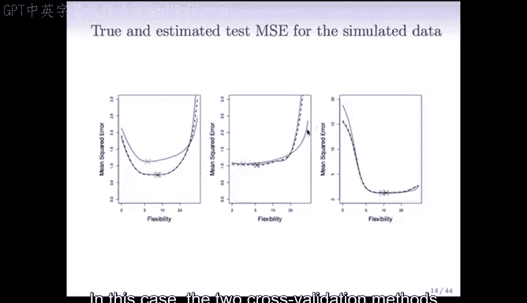

这个例子强调了交叉验证的核心价值：在无法获得大量独立测试数据时，它能为我们提供一个相对可靠、无偏的模型性能评估。

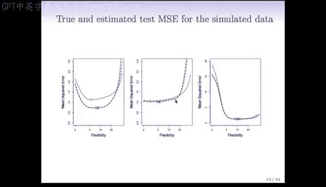

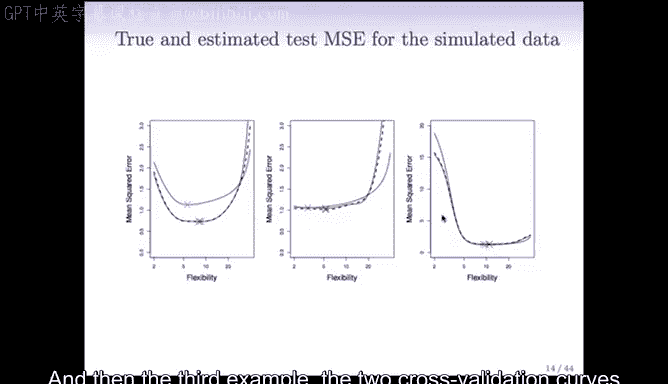

## 应用于分类问题与标准误 🎯

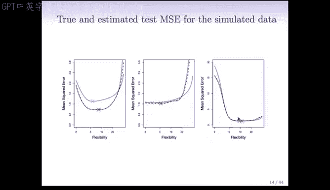

将交叉验证应用于分类问题与回归问题流程完全一致，唯一改变的是**误差度量标准**。我们不再使用均方误差，而是使用**误分类率**。

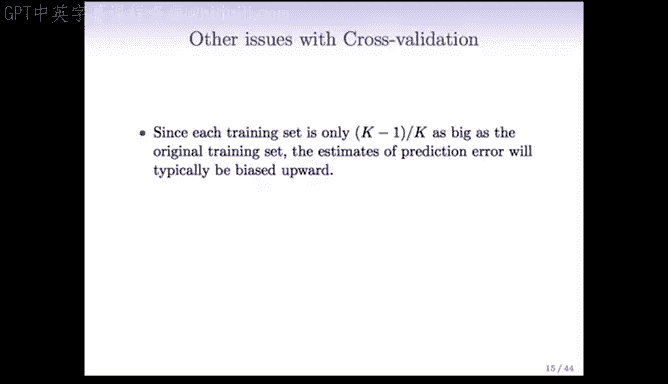

对于第k折，误分类率为：
`Errₖ = (1/nₖ) * Σ I(yᵢ ≠ ŷᵢ)`，其中 `I()` 是指示函数。

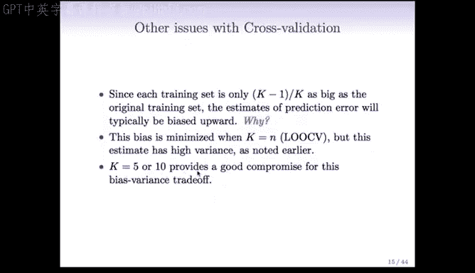

最终的交叉验证误分类率同样是各折误差的（加权）平均。

此外，由于交叉验证误差是一个平均值，我们可以计算其**标准误**来评估该估计的波动性：

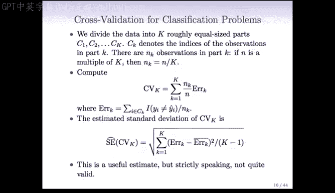

`SE(CV) = sqrt( Var(Err₁, Err₂, ..., Errₖ) / K )`

虽然各折误差并非完全独立（因为训练集有重叠），但据此计算的标准误在实践中仍然是一个有用的参考，可以帮助我们在绘制交叉验证曲线时添加误差带，直观了解估计的稳定性。

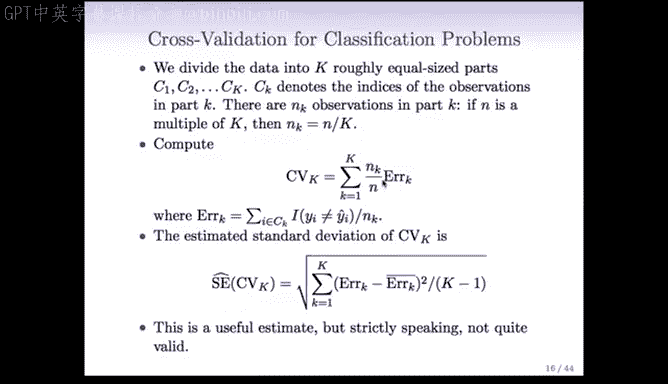

## 总结 📚

本节课中我们一起学习了K折交叉验证这一核心的模型评估技术。

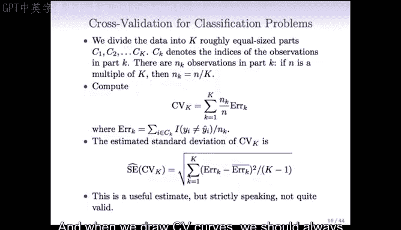

我们首先了解了其基本思想：通过将数据划分为K份并轮流将每一份作为验证集，来更高效、稳定地利用数据评估模型性能。我们学习了其数学表述，并认识了留一法交叉验证这一特例及其在特定模型下的高效计算公式。

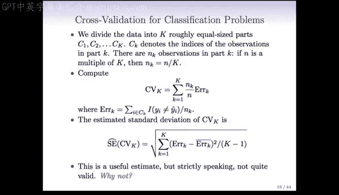

关键在于K值的选择，我们深入探讨了其中的偏差-方差权衡，并得出结论：**K=5或10通常是实践中的最佳折中选择**。

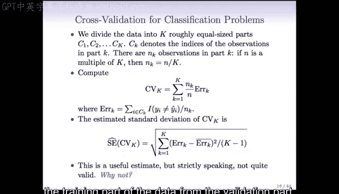

最后，我们看到了交叉验证在分类问题上的应用只需改变误差度量，并了解了如何计算交叉验证估计的标准误以评估其可靠性。

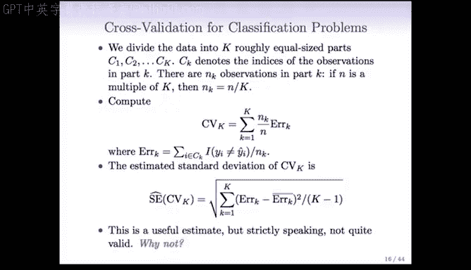

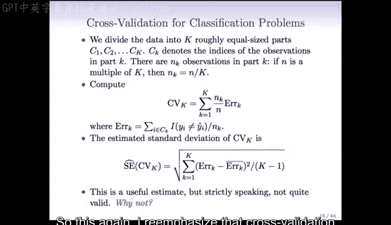

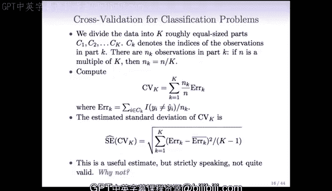

交叉验证之所以强大，根本在于它**明确地将训练过程与验证过程分离**，这为我们评估模型在未见数据上的表现（测试误差）提供了一个坚实的原则。在下一节讨论自助法时，我们将看到不遵循这一原则可能带来的问题。