# Python 版 35：交叉验证的错误与正确方式 🔍

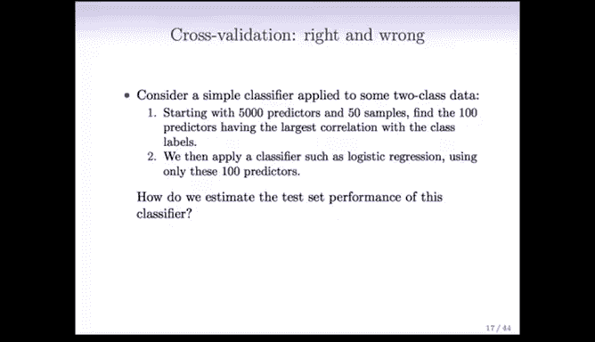

在本节课中，我们将深入探讨交叉验证这一重要技术。交叉验证是评估模型测试误差和判断模型复杂度的核心方法。然而，在实际应用中，存在一种常见但严重的错误使用方式。本节将通过一个具体案例，详细解释这种错误为何发生、其严重后果，并展示如何正确执行交叉验证。

---

## 交叉验证的错误方式 ❌

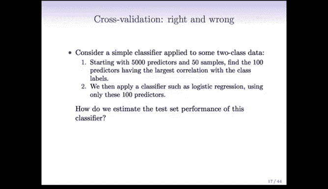

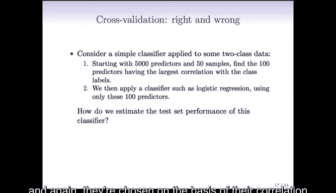

上一节我们介绍了交叉验证的基本概念，本节中我们来看看一种常见的误用情况。这种错误在数据维度远大于样本数（即“宽数据”）的场景下尤为严重。

设想一个简单的思想实验：我们拥有50个样本和5000个预测变量，这是一个预测变量数量远超样本数的典型场景。我们的目标是预测两个类别。

以下是构建分类器的一种方式：
1.  首先，我们筛选预测变量，找出与类别标签单独相关性最高的前100个预测变量。
2.  然后，我们仅使用这100个预测变量来构建一个分类器（例如逻辑回归模型），并丢弃其余的4900个变量。

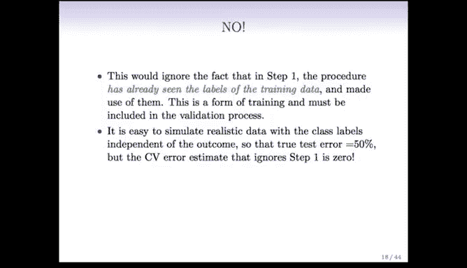

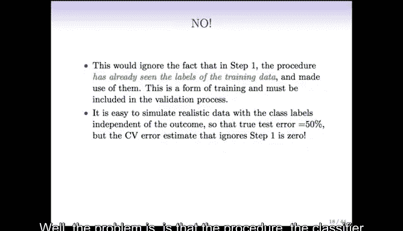

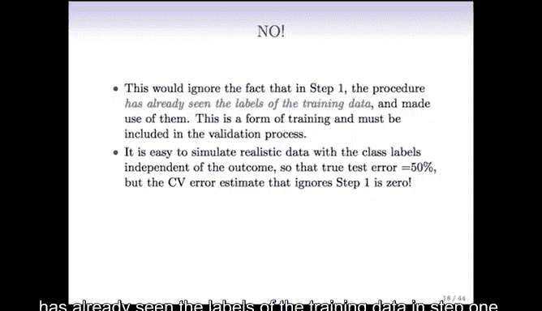

这看起来是合理的，我们可能希望处理更少的变量。但关键问题在于：**如何评估这个分类器的测试集误差？**

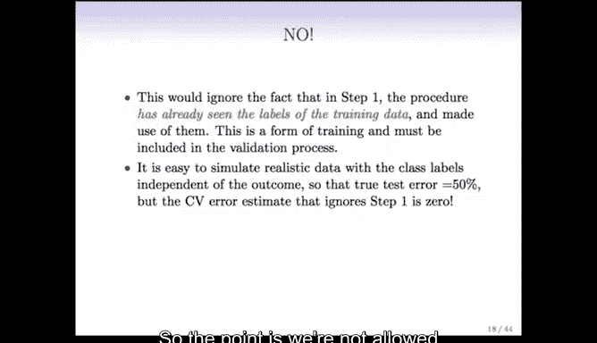

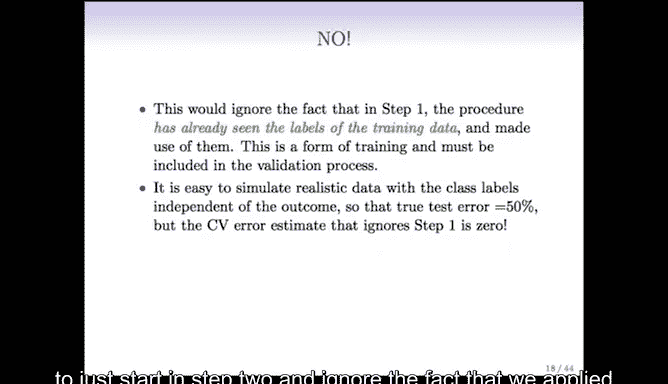

一个诱人的错误做法是：**忽略第一步的筛选过程**，假装我们一开始就只有这100个预测变量，然后直接对这100个变量应用交叉验证来评估模型。

**为什么这是错误的？**
问题在于，第一步筛选“最佳”100个预测变量的过程，已经使用了**所有样本的类别标签信息**。这意味着，在筛选阶段，模型已经“看到”了全部训练数据的响应变量，这本身就是一种“训练”。我们不能在后续的验证过程中忽略这一步。

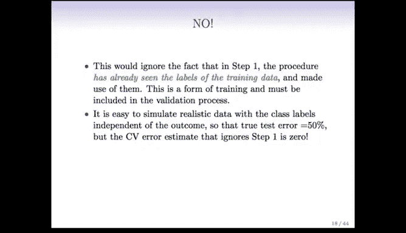

为了更清晰地说明，我们可以将预测变量数量增加到500万，而样本仍为50个。假设在总体中，所有预测变量与类别标签都**没有相关性**，那么真实的测试误差应为50%（相当于随机猜测）。

然而，如果我们从500万个不相关的变量中挑选出“看起来”最好的100个，由于随机波动，这100个变量在**当前数据集**中会表现出很强的分类能力。如果我们忽略筛选步骤，直接对这100个精心挑选的变量进行交叉验证，交叉验证会错误地给出一个很低的误差估计（甚至接近0%），而实际上模型的真实性能与抛硬币无异。

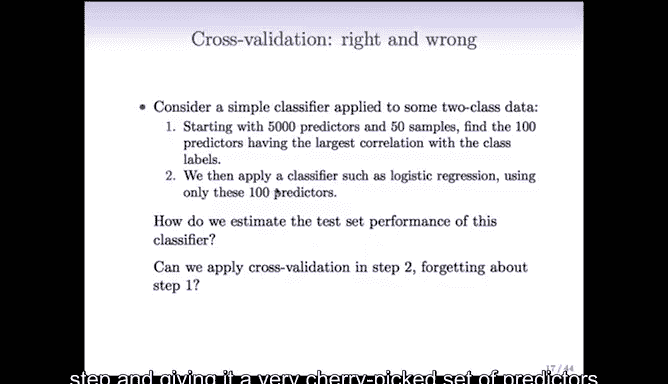

这种错误并非虚构，它在一些基因组学等高维数据研究中时有发生。研究人员面对成千上万的基因变量，常常先进行筛选以减少变量数量，然后在后续分析中忽略了筛选步骤对验证过程的影响，从而导致评估结果严重偏乐观。

---

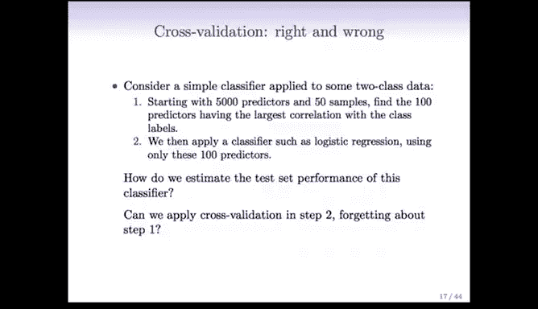

## 交叉验证的正确方式 ✅

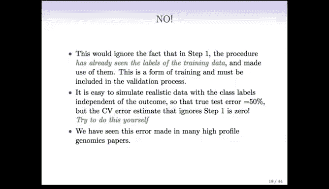

既然我们了解了错误的方式，那么正确的方式应该是怎样的呢？核心原则是：**必须将整个建模流程（包括任何形式的数据预处理、变量筛选）都纳入交叉验证的循环中。**

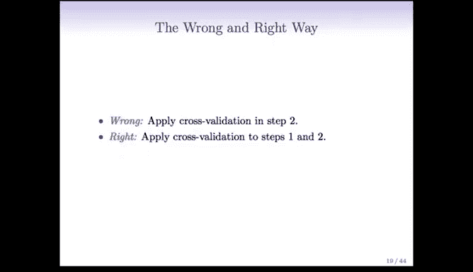

以下是两种方式的对比：

**错误方式图示：**
1.  基于**全部数据**筛选出最佳预测变量。
2.  仅对筛选后的变量和模型拟合步骤应用交叉验证。

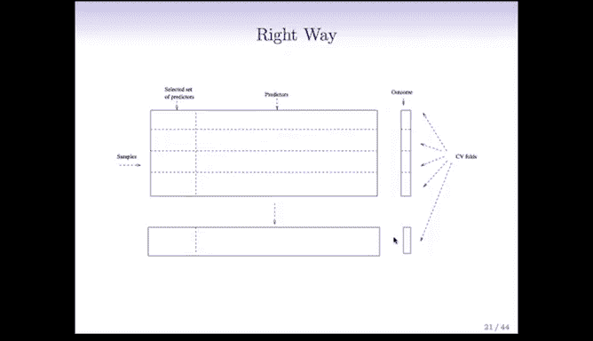

**正确方式图示：**
1.  在开始任何分析之前，先将数据划分为K折（例如5折）。
2.  对于每一折：
    *   将其作为测试集**暂时移除**。
    *   在剩余的K-1折数据（训练集）上，执行**完整的建模流程**，包括变量筛选和模型训练。
    *   使用在训练集上筛选出的变量和训练好的模型，去预测之前被移除的那一折（测试集）的响应变量。
3.  汇总所有K折的预测误差，得到交叉验证误差估计。

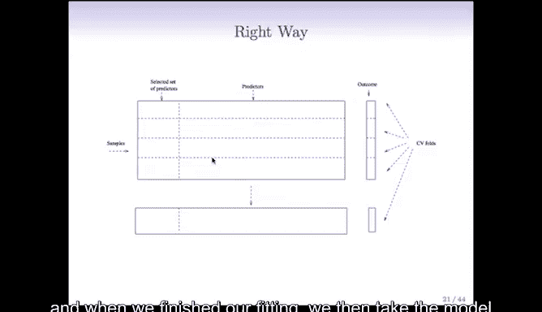

关键点在于，**每次训练模型时，变量筛选步骤都只能基于当前的训练集数据进行**。这样，筛选过程的随机性（每次可能选出不同的变量子集）就会被考虑在内，从而得到对测试误差的无偏估计。

---

## 一个真实案例

几年前，斯坦福大学一位工程学博士生在其论文中研究如何利用基因组单核苷酸多态性预测心脏病。他拥有约10万个预测变量和1个二分类响应变量。

他的分析流程是：
1.  首先，他使用某种筛选方法将变量从10万个减少到1000个。
2.  然后，他对这1000个变量构建模型，并应用交叉验证，得到了约35%的误差率，这在该领域看起来是一个不错的结果。

然而，在论文答辩中，有评委指出其交叉验证方法存在上述错误——他在第一步使用了全部数据进行变量筛选。起初，学生和导师都认为这个细节影响不大。但在评委的坚持下，学生重新按照正确方式进行了分析。几个月后，学生反馈：**修正后的交叉验证误差率变成了50%**。这个案例生动地说明了忽略预处理步骤会如何严重扭曲模型性能的评估。

---

## 总结

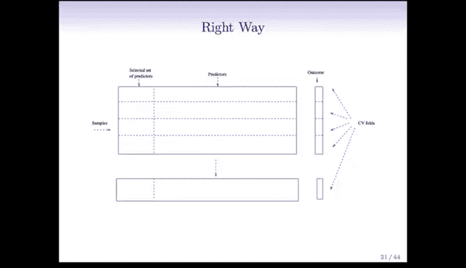

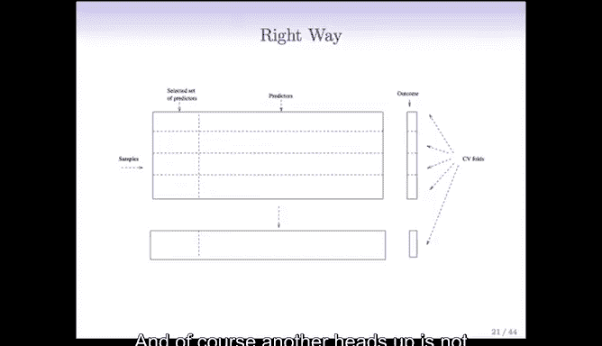

本节课我们一起学习了交叉验证中一个至关重要但常被忽视的要点：
*   **错误方式**：在数据预处理（如变量筛选）步骤中使用全部数据，然后仅对后续的模型训练部分进行交叉验证。这会导致对测试误差的严重低估，产生过于乐观的评估结果。
*   **正确方式**：必须将**整个建模流程**，包括任何依赖于响应变量的数据预处理步骤，都置于交叉验证循环之内。确保在每一折中，预处理和模型训练都只使用当前训练集的数据。

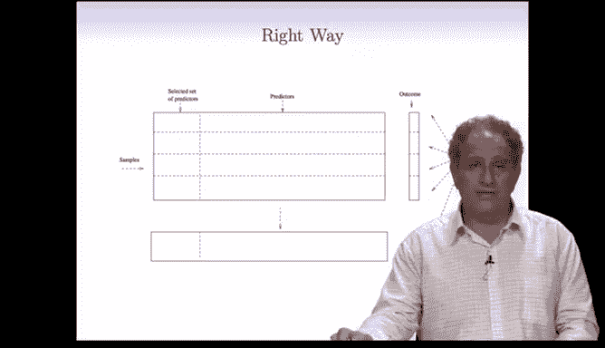

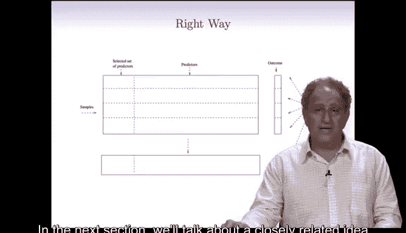

正确实施交叉验证对于获得可靠的模型性能评估至关重要，尤其是在处理高维数据时。在下一节中，我们将讨论一个与交叉验证紧密相关但不同的概念：自助法。