# Python 版 36：统计学习中的自助法（Bootstrap）📊

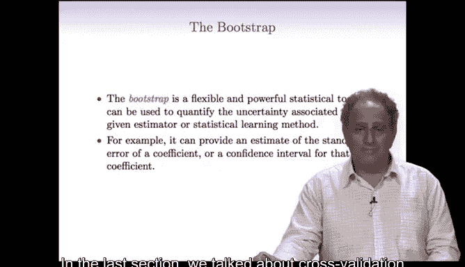

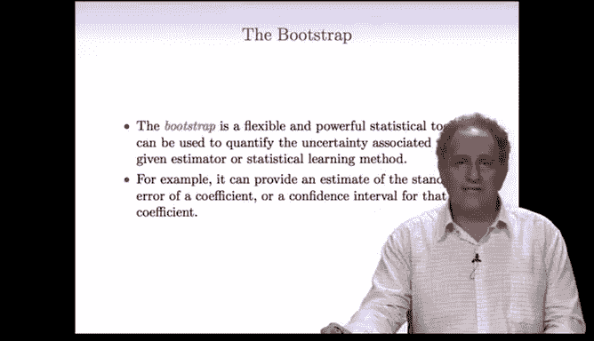

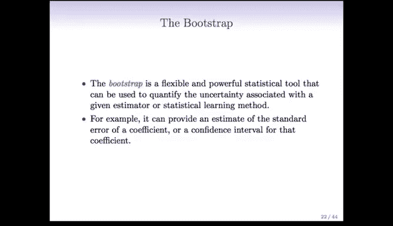

在本节课中，我们将要学习一种名为“自助法”（Bootstrap）的强大统计方法。自助法主要用于评估估计量的不确定性，特别是计算估计量的标准误和置信区间。它与上一节讨论的交叉验证有密切关联，但侧重于不同的统计推断目标。

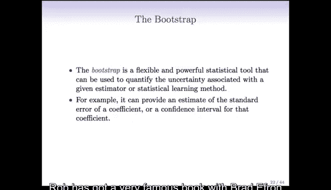

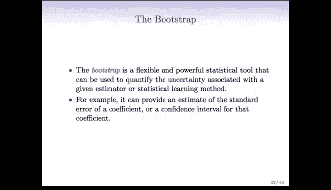

---

## 从投资组合问题引入

上一节我们介绍了交叉验证用于估计监督学习的测试误差。本节中，我们来看看如何评估一个估计量本身的变异性。

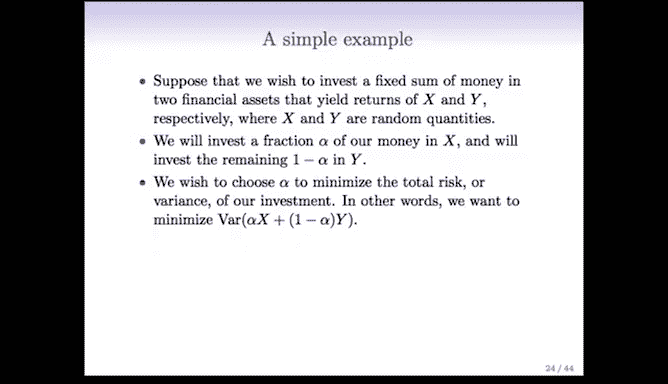

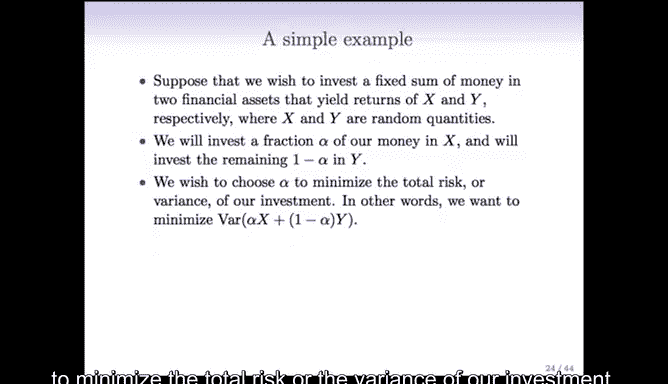

假设我们有一笔资金，希望投资于两种资产，其收益率分别为随机变量 **X** 和 **Y**。我们计划将资金的比例 **α** 投资于 **X**，剩余的比例 **1-α** 投资于 **Y**。

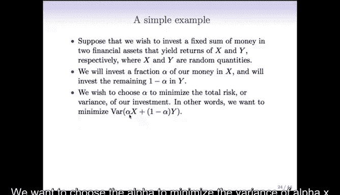

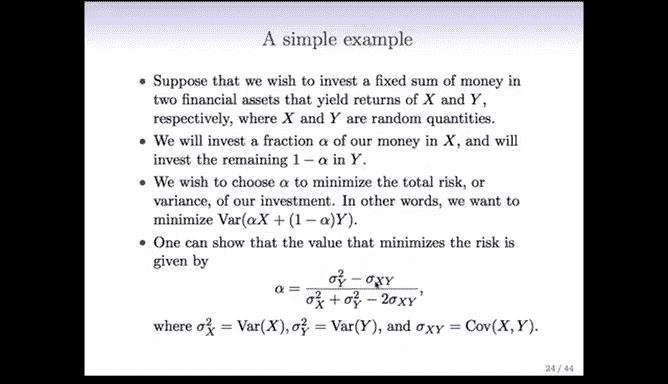

我们的目标是选择 **α**，以最小化投资组合的总风险，即其方差。用公式表示，我们希望最小化：

**Var(αX + (1-α)Y)**

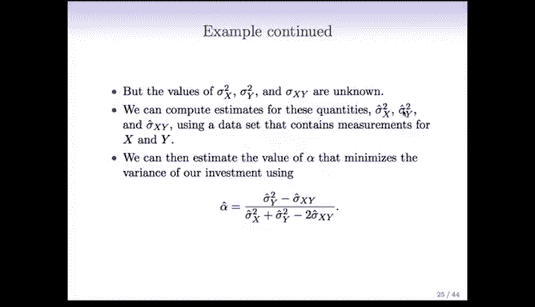

在总体模型中，可以证明最优的 **α** 由以下公式给出：

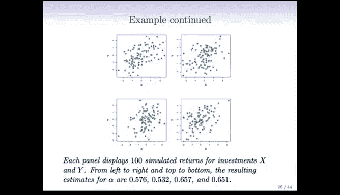

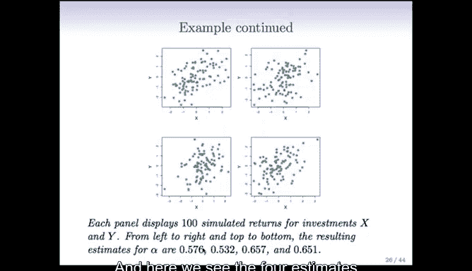

**α = (σ_Y² - σ_XY) / (σ_X² + σ_Y² - 2σ_XY)**

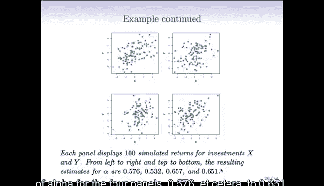

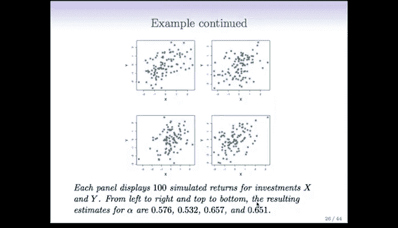

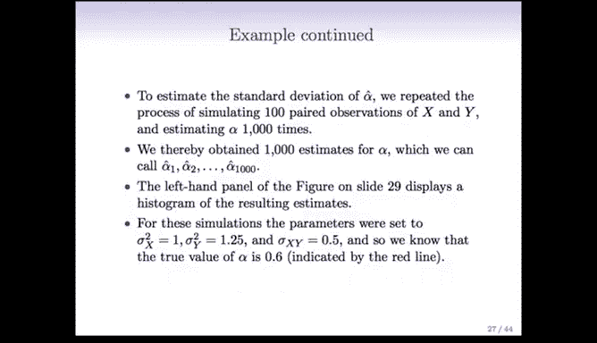

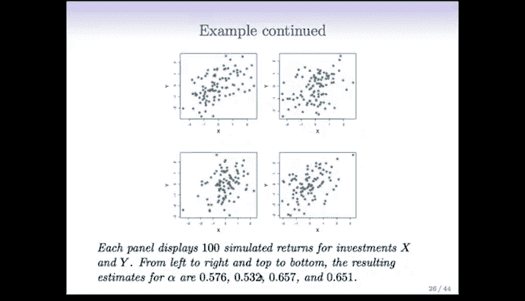

其中：
*   **σ_X²** 是 **X** 的方差。
*   **σ_Y²** 是 **Y** 的方差。
*   **σ_XY** 是 **X** 和 **Y** 的协方差。

然而，这些总体参数通常是未知的。在实践中，我们只能从一个样本数据集中计算出这些参数的估计值（样本方差和样本协方差），然后代入公式，得到 **α** 的一个估计值，记为 **α_hat**。

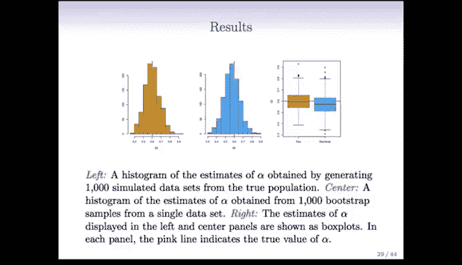

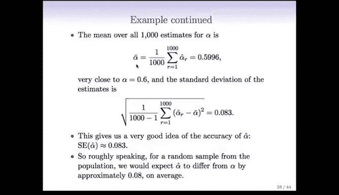

---

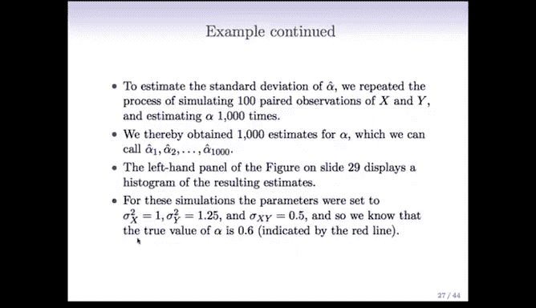

## 理想情况：从总体中重复抽样

为了评估 **α_hat** 的准确性（例如其标准误），最理想的方法是能够从真实总体中重复抽取许多个独立样本。

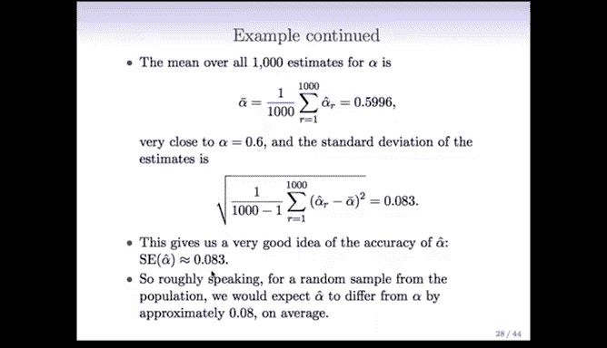

以下是该过程的步骤：
1.  从总体中抽取一个包含 **n** 对 **(X, Y)** 的样本。
2.  根据该样本计算 **α_hat**。
3.  将步骤1和2重复很多次（例如1000次），得到1000个 **α_hat** 的估计值。
4.  这1000个值形成的分布称为 **α_hat** 的**抽样分布**。
5.  计算这1000个 **α_hat** 的标准差，这个标准差就是 **α_hat** 的**标准误**，它衡量了估计量的变异性。

但问题在于，在现实世界中，我们通常只有一个样本数据集，无法访问总体以生成更多样本。

---

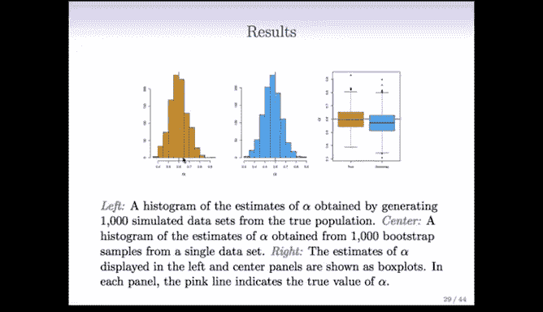

## 自助法核心思想：将样本视为“总体”

自助法的巧妙之处在于，它通过**对原始样本数据进行重抽样**来模拟从总体中抽样的过程。我们将手中的样本数据本身视为一个“经验总体”。

具体操作如下：
1.  从原始样本数据中**有放回地**随机抽取 **n** 个观测值，形成一个**自助样本**。这个样本的大小与原始样本相同。
2.  由于是有放回抽样，原始样本中的某些观测值可能在自助样本中出现多次，而另一些则可能一次也不出现。
3.  基于这个自助样本，重新计算我们感兴趣的统计量（例如 **α_hat**），得到一个自助估计值。
4.  将步骤1-3重复很多次（例如 **B=1000** 次），得到 **B** 个自助估计值。
5.  计算这 **B** 个自助估计值的标准差，将其作为原始估计量 **α_hat** 的标准误的估计。

以下是自助法抽样的一个简单图示说明：

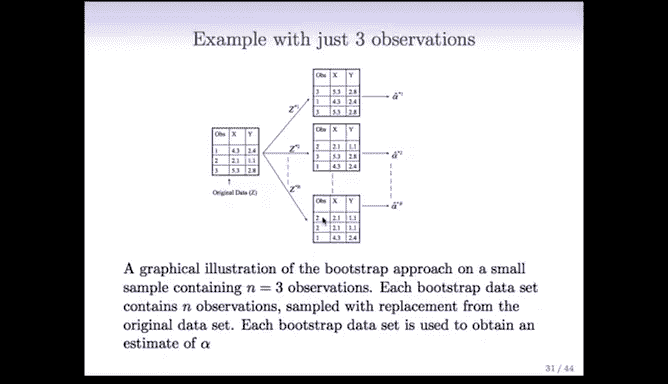

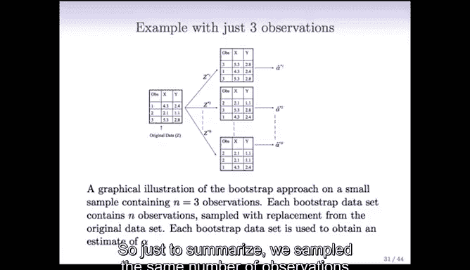

假设原始数据有3个观测值：`[观测1， 观测2， 观测3]`。
*   第一个自助样本可能是：`[观测3， 观测3， 观测1]`（观测3出现两次，观测2未出现）。
*   第二个自助样本可能是：`[观测2， 观测3， 观测1]`（每个观测值恰好出现一次）。
*   第三个自助样本可能是：`[观测2， 观测2， 观测1]`。

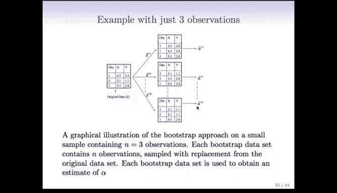

---

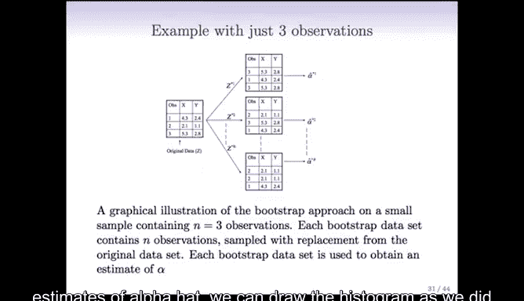

## 效果对比与总结

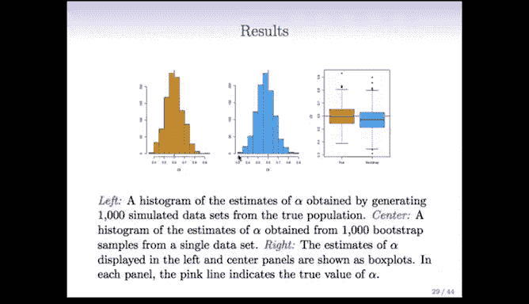

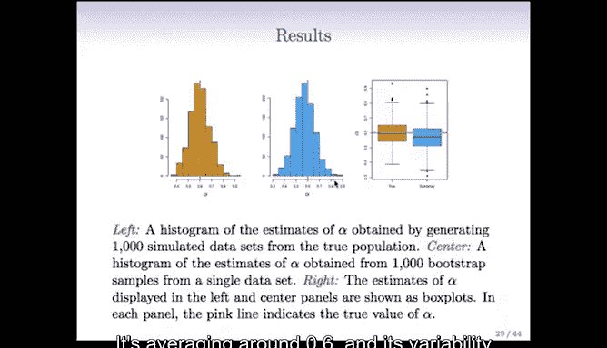

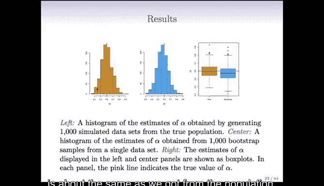

通过模拟实验可以验证自助法的效果。在已知真实总体的模拟中：
*   从真实总体重复抽样1000次得到的 **α_hat** 抽样分布，其标准误约为 **0.083**。
*   使用自助法（仅基于一个初始样本，进行1000次重抽样）得到的 **α_hat** 分布，其标准误约为 **0.087**。

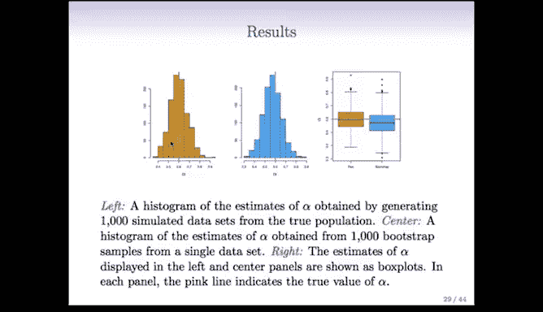

两者结果非常接近。这表明，自助法成功地利用单个样本数据，近似出了如果我们能从总体中重复抽样所能看到的估计量变异性。

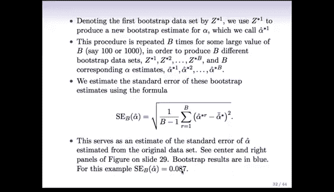

本节课中我们一起学习了自助法的基本原理和应用。它是一种极其有用的工具，允许我们仅利用手头的数据来评估几乎任何估计量的统计特性（如标准误、置信区间），而无需对总体分布做出强假设或能够获取新数据。在接下来的章节中，我们将探讨自助法更广泛的应用场景。