# Python 版 37：深入理解自助法 (Bootstrap) 📊

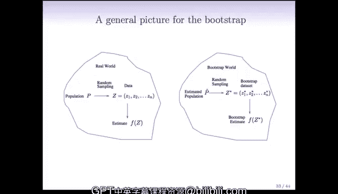

在本节课中，我们将更深入地探讨自助法 (Bootstrap) 的原理与应用。我们将回顾自助法的基本思想，并将其推广到更复杂的数据场景中，例如时间序列。同时，我们也会比较自助法与交叉验证在估计预测误差时的优劣。

---

## 自助法的世界观 🌍

上一节我们通过投资组合的例子介绍了自助法。现在，我们从更一般的角度来理解它。

下图展示了一个由伯克利的David Friedman提出的、非常有用的自助法示意图，它描绘了自助法的“世界观”。


*   **左侧（现实世界）**：我们有一个总体 (Population)，它产生了我们的训练数据，记作 **Z1, Z2, ..., Zn**。在投资例子中，每个 **Z** 就是一个 (X, Y) 投资对。我们从训练数据中计算出一个统计量或估计量，例如投资比例 **α̂**。
*   **我们的目标**：是估计 **α̂** 的标准误。理想情况下，如果我们能接触到总体，就可以反复抽取新样本来计算多个 **α̂**，从而直接得到其标准误。
*   **现实限制**：通常我们无法获得更多训练数据，只能使用手头已有的样本。

自助法的核心思想是：既然我们无法接触总体，就用一个“代理总体”来代替它。这个代理总体就是**经验分布函数 P̂**。

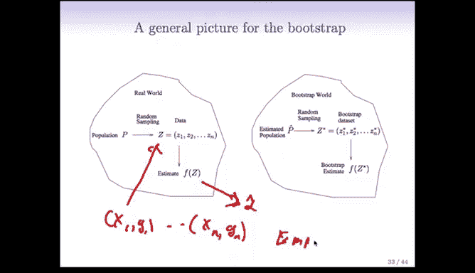

**公式：P̂**
它给训练样本中的每一个观测点 **Zi** 分配相同的概率 **1/n**。

从这个经验分布中抽样，就等价于**从原始训练数据中有放回地随机抽样**。这就是自助抽样的本质。

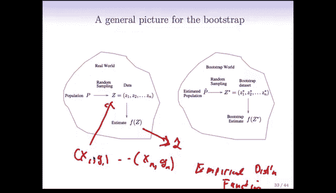

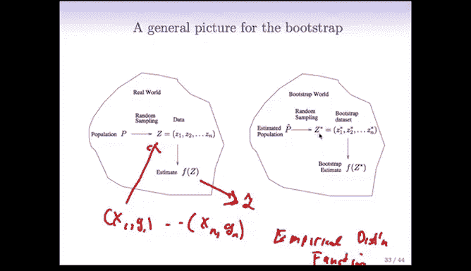

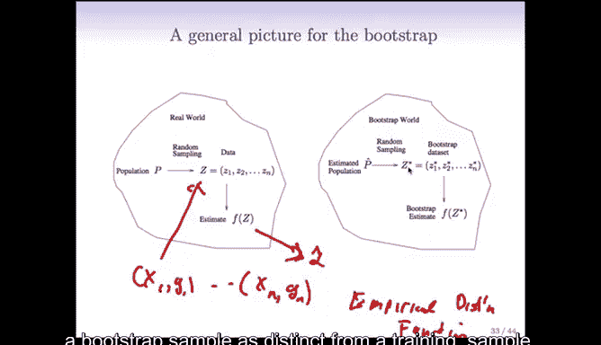

---

## 自助法的操作流程 🔄


基于上述世界观，自助法的操作流程可以概括为以下步骤：

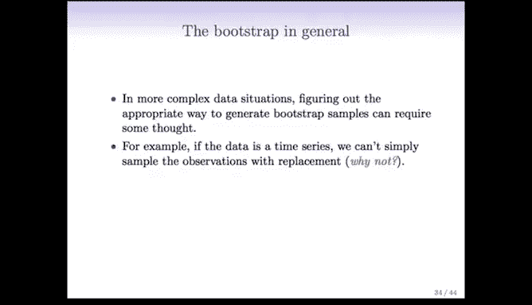

1.  **创建自助样本**：从原始训练数据（大小为 n）中，有放回地抽取 n 个观测，形成一个自助样本，记作 **Z\***。
2.  **计算统计量**：在这个自助样本上，重新计算我们关心的统计量（例如 **α̂**），得到 **α̂\***。
3.  **重复**：将步骤1和2重复进行数百次（例如 B=1000 次），得到一系列自助统计量：**α̂\*¹, α̂\*², ..., α̂\*ᴮ**。
4.  **估计标准误**：计算这些 **α̂\*** 值的标准差，作为原始估计量 **α̂** 的标准误的估计。

**代码：自助法伪代码**
```python
bootstrap_estimates = []
for b in range(B): # B 是自助抽样次数，例如 1000
    bootstrap_sample = sample_with_replacement(original_data, size=n)
    estimate_b = compute_statistic(bootstrap_sample) # 例如计算 alpha_hat
    bootstrap_estimates.append(estimate_b)

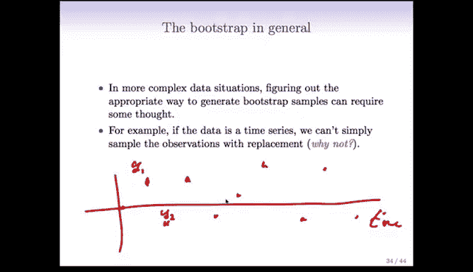

standard_error_estimate = np.std(bootstrap_estimates)
```


---

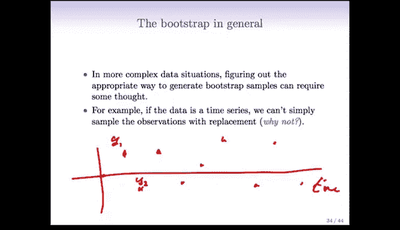

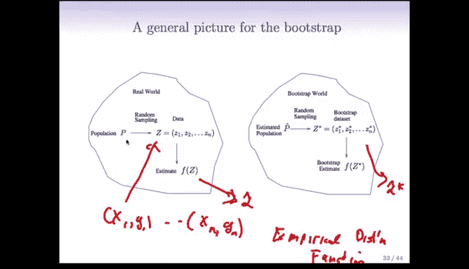

## 复杂情况下的自助法：时间序列示例 ⏳


上一节我们介绍了标准自助法流程，本节我们来看看当数据不满足独立同分布假设时，例如在时间序列中，该如何应用自助法。

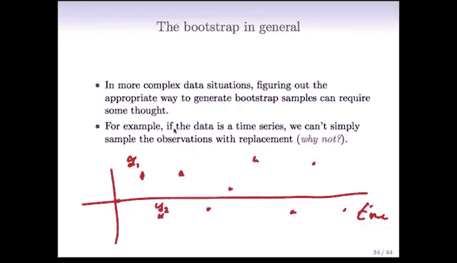

在时间序列中，相邻的观测点是相关的（例如今天的股价与昨天的股价相关）。如果我们简单地有放回抽取单个数据点，会破坏数据内在的时间依赖结构，导致自助样本无效。

解决方案是使用**分块自助法 (Block Bootstrap)**。

**核心思想**：将时间序列数据划分为连续的“块”，假设不同块之间的数据是近似独立的，而块内部保持原有的相关结构。然后，我们对这些“块”进行有放回抽样，再将抽到的块按顺序拼接，形成自助样本。

例如，如果我们使用块大小为3：
*   原始序列：[Y1, Y2, Y3, Y4, Y5, Y6, Y7, Y8, Y9]
*   划分为块：`块1 = [Y1,Y2,Y3]`, `块2 = [Y4,Y5,Y6]`, `块3 = [Y7,Y8,Y9]`
*   自助抽样：可能抽到 `[块2, 块2, 块1]`
*   拼接成自助样本：[Y4, Y5, Y6, Y4, Y5, Y6, Y1, Y2, Y3]

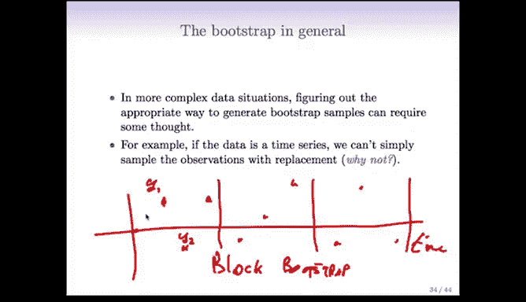

这种方法的关键在于，必须识别并基于数据中（近似）独立的部分进行抽样。


---

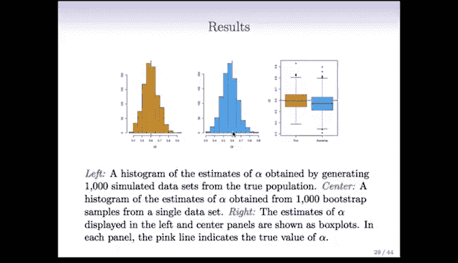

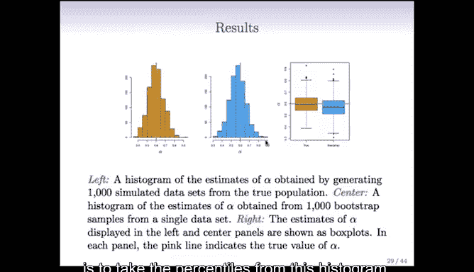

## 自助法的应用：置信区间 📈

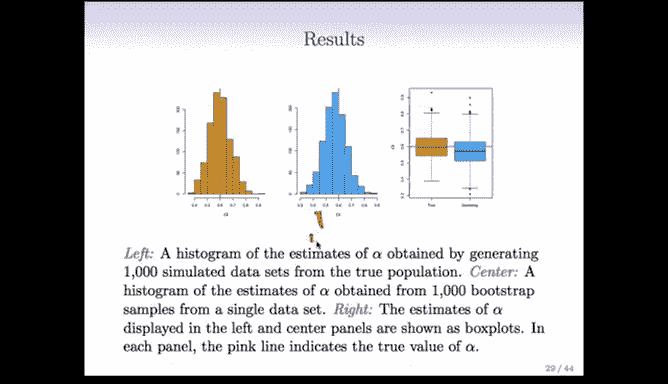

自助法不仅可用于估计标准误，另一个非常常见的用途是构建参数的置信区间。

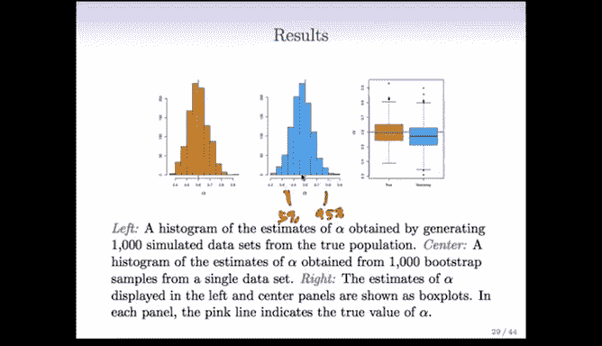

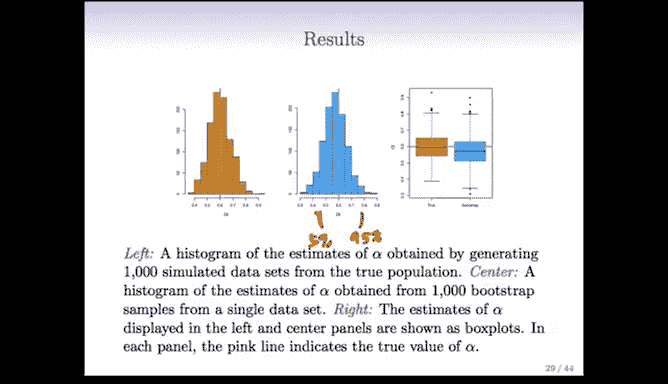

回顾投资例子中，我们通过1000次自助抽样得到了 **α̂\*** 的直方图。

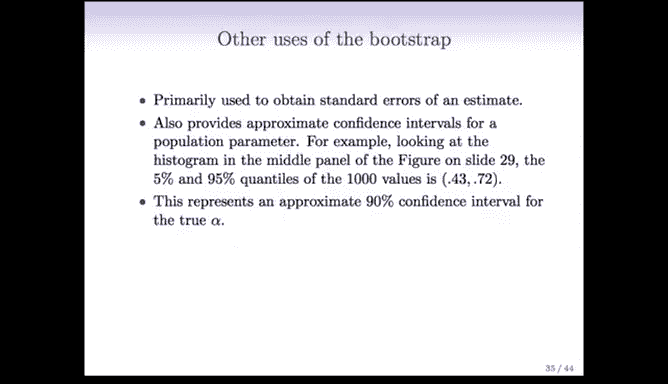

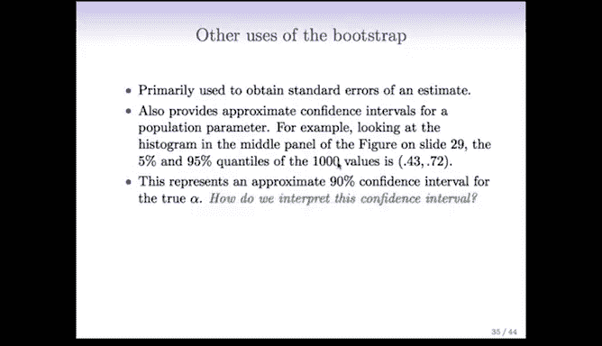


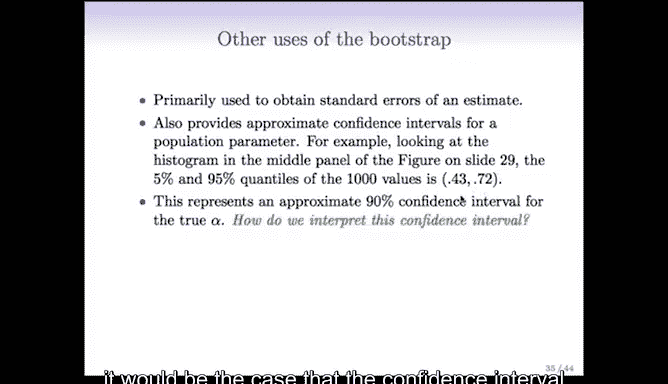

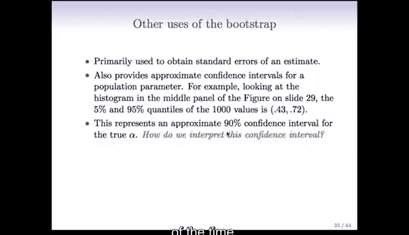

构建置信区间的一个合理方法是使用这个直方图的分位数。例如，要构建一个90%的置信区间：

**操作步骤**：
1.  从自助抽样得到的 **α̂\*** 值集合中，找出第5百分位数（即最小的5%的值）和第95百分位数。
2.  这两个分位数就构成了 **α** 的一个90%自助百分位数置信区间。

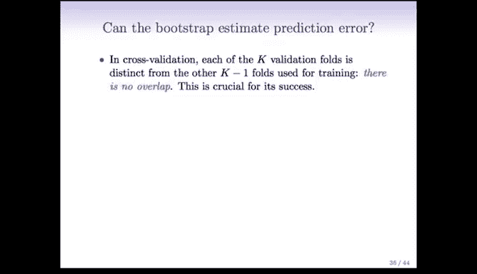

在示例中，我们得到的区间是 **(0.43, 0.72)**。


**区间解释**：如果我们能从总体中重复多次实验，那么用此方法构建的置信区间，将有90%的概率包含参数 **α** 的真实值。

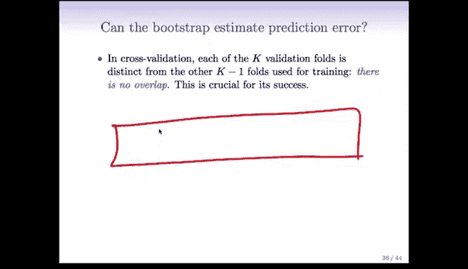

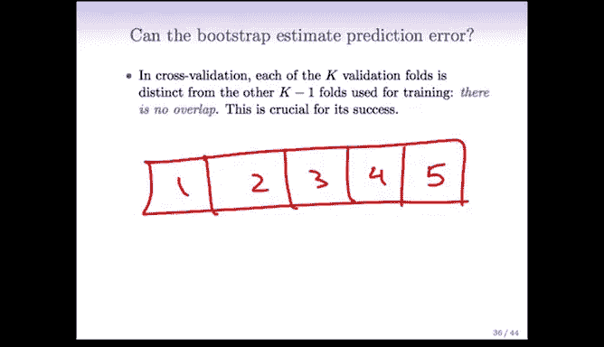

这是从自助法结果构建置信区间最简单直接的方法，被称为**自助百分位数区间**。

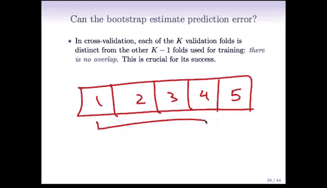

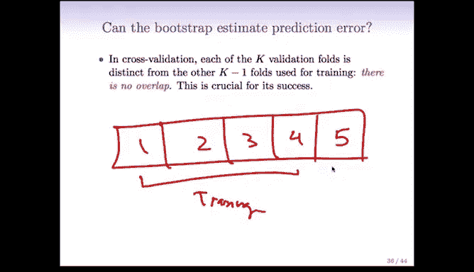

---

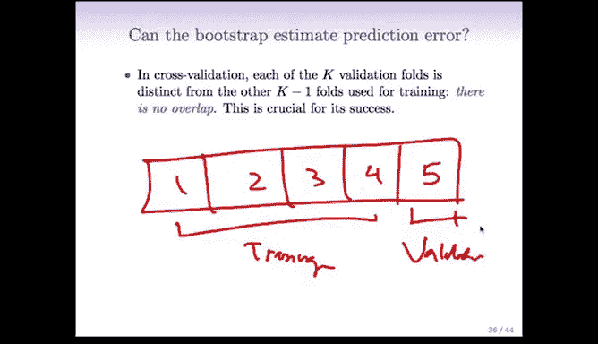

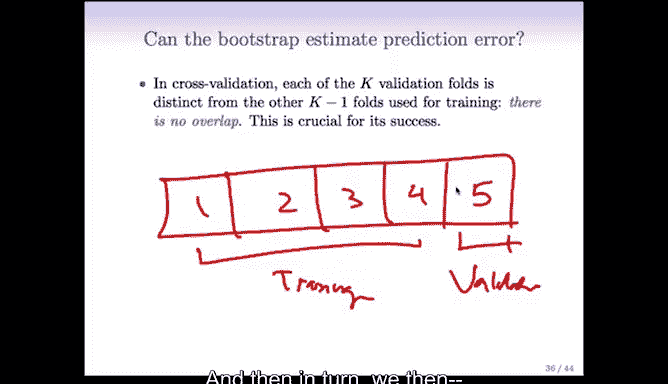

## 自助法与交叉验证：估计预测误差 ⚖️


我们已经讨论了自助法用于标准误和置信区间。那么，对于预测误差（如误分类错误）的估计呢？

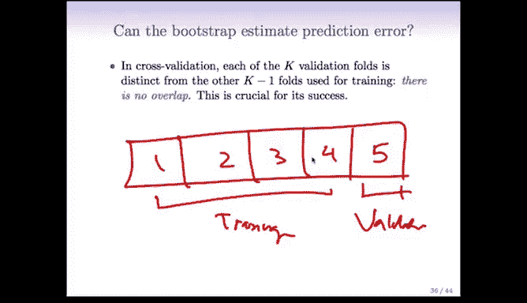

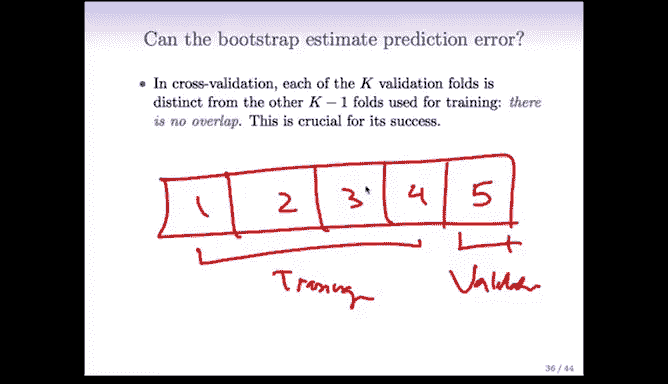

估计预测误差的主要工具是我们已经学过的**交叉验证**。让我们回顾一下K折交叉验证的工作方式：

**K折交叉验证流程**：
1.  将数据随机分为K个大小相似的子集（折）。
2.  对于第 i 折，将其作为验证集，其余 K-1 折作为训练集。
3.  在训练集上拟合模型，并在验证集上计算预测误差。
4.  对每一折都重复步骤2和3，最后将K次得到的误差估计平均。

**关键点**：在每一轮中，训练集和验证集是**完全分离**的。验证集的数据对于基于训练集构建的模型来说是“全新”的，这能较好地模拟在新数据上的预测性能。

现在，考虑使用自助法来估计预测误差。一个直观的想法是：
1.  生成一个自助样本作为训练集。
2.  用原始训练集作为验证集进行预测并计算误差。

然而，这个方法存在一个**严重问题**：每个自助样本平均包含了原始训练集中约 **2/3** 的数据点。这意味着，当我们用自助样本训练的模型去预测原始训练集时，大部分数据点（约2/3）在训练时已经被“见过了”。这会导致预测误差被严重低估，因为模型是在预测它已经熟悉的数据。

另一种想法（用原始训练集训练，用自助样本验证）问题更严重。虽然可以通过只记录自助样本中未出现在训练集的“袋外”点的误差来修正，但过程变得复杂，且最终效果与交叉验证类似。

**结论**：对于估计预测误差，**交叉验证方法更简单、更直接，通常效果也更好**。我们的建议是优先使用交叉验证。这体现了一个通用原则：如果简单方法能完成任务，就远比使用更复杂的方法要好。

---

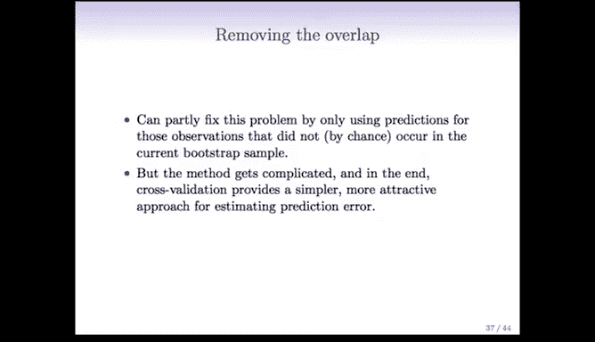

## 总结 📝

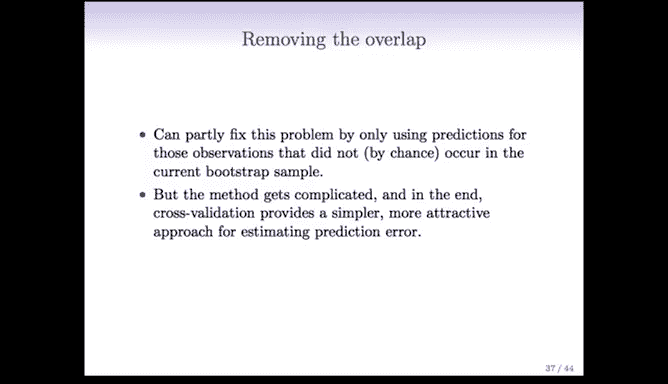

本节课我们一起深入学习了自助法。
*   我们首先从世界观的角度理解了自助法如何用经验分布代替未知总体。
*   然后，我们探讨了在时间序列等非独立数据中如何通过分块自助法来应用这一技术。
*   接着，我们学习了如何使用自助法构建参数的置信区间。
*   最后，我们比较了自助法与交叉验证在估计预测误差时的差异，并得出结论：对于预测误差估计，交叉验证是更简单有效的选择。

自助法是一个强大而灵活的工具，特别适用于标准误估计和置信区间构建，但在选择方法时，始终要考虑到数据的特性和具体问题的需求。