# Python 版 38：交叉验证 I 📊

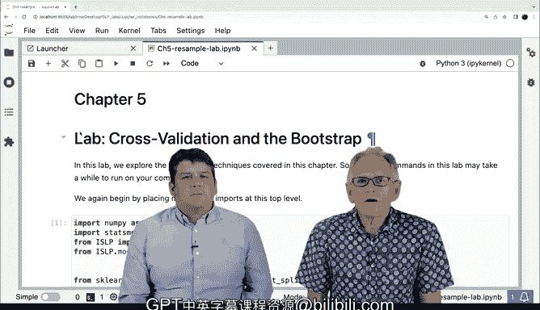

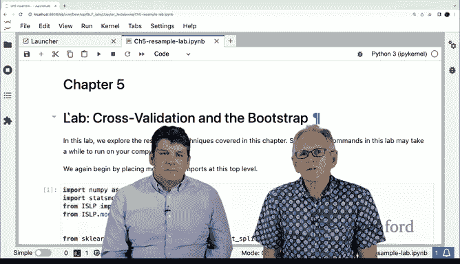

在本节课中，我们将学习如何使用交叉验证来评估和选择统计学习模型。我们将从简单的训练-测试集分割开始，然后介绍更高效的K折交叉验证方法，并使用Python的`scikit-learn`库来实现。

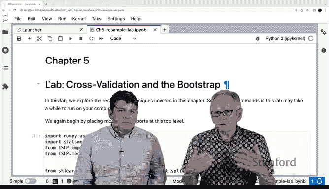

---

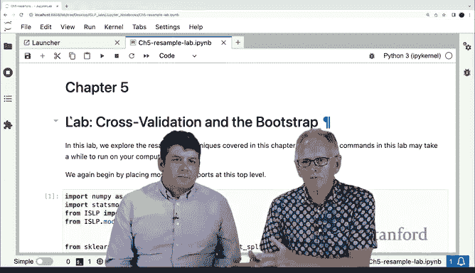

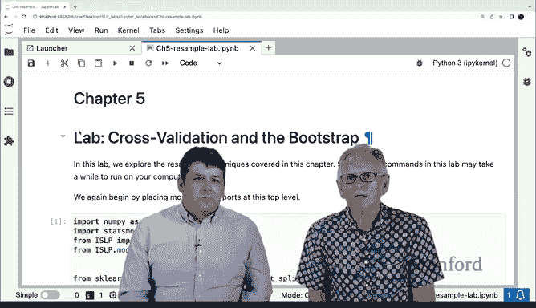

## 概述

模型验证是统计学习中的关键步骤。其核心思想是：在训练数据上拟合模型，然后在未参与训练的测试集或验证集上评估其性能。这样可以更可靠地估计模型在未知数据上的表现。

上一节我们介绍了模型验证的基本概念，本节中我们来看看如何在Python中具体实现。

---

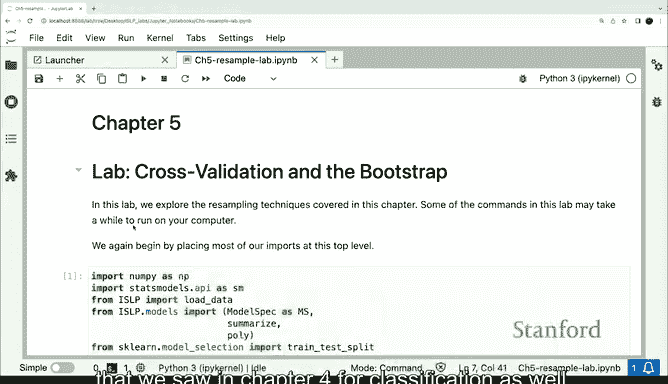

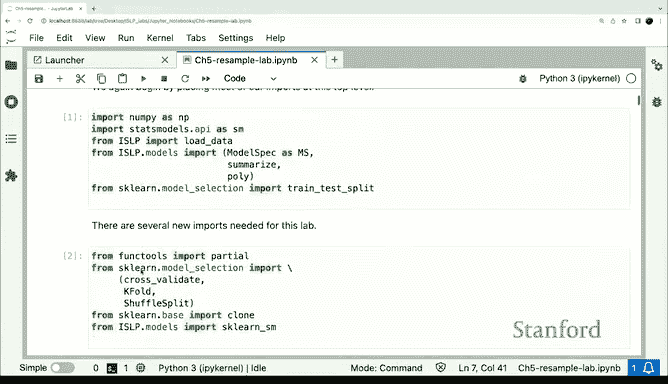

## 导入必要的库

首先，我们需要导入一些关键的Python库。`scikit-learn`提供了统一的接口来交叉验证各种模型，这是其一大优势。

```python
from sklearn.model_selection import train_test_split, KFold, cross_val_score
from ISLP import load_data
from ISLP.models import ModelSpec, sklearn_sm
import numpy as np
import pandas as pd
```

关键导入说明：
*   `KFold`：用于实现K折交叉验证。
*   `cross_val_score`：用于实际执行模型交叉验证的函数。
*   `sklearn_sm`：这是一个包装器，允许我们将`statsmodels`库中的模型（如普通最小二乘回归）以`scikit-learn`兼容的方式进行交叉验证。

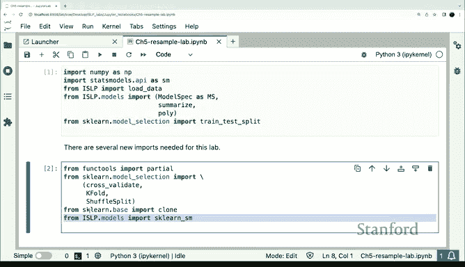

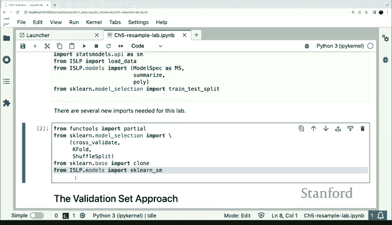

将所有导入语句放在代码开头是Python的最佳实践，这样可以清晰地了解运行实验所需的依赖。

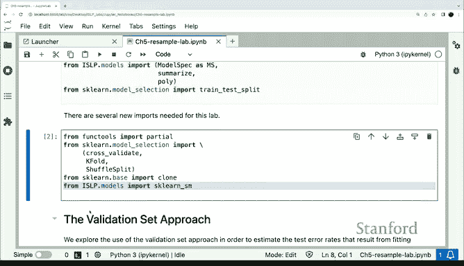

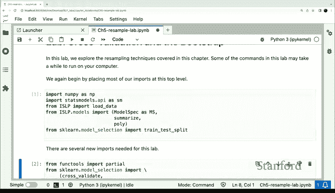

---

## 使用训练-测试集分割

我们将使用`Auto`数据集，目标是预测汽车的每加仑英里数（`mpg`）。数据集共有392个样本。

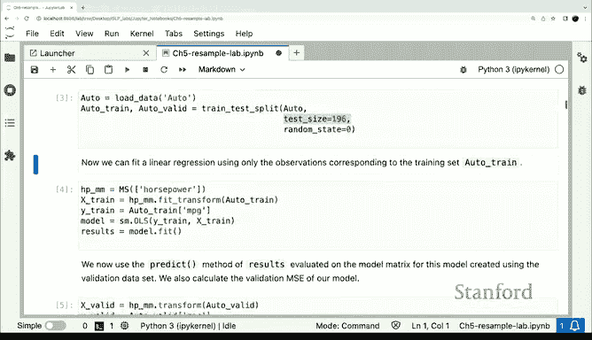

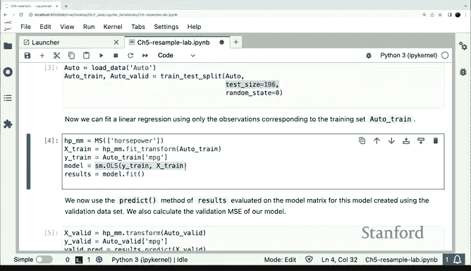

首先，我们使用`train_test_split`函数将数据集分成两个大小相等（各196个样本）的子集：训练集和测试集。

```python
auto = load_data('Auto')
X = auto[['horsepower']]
y = auto['mpg']

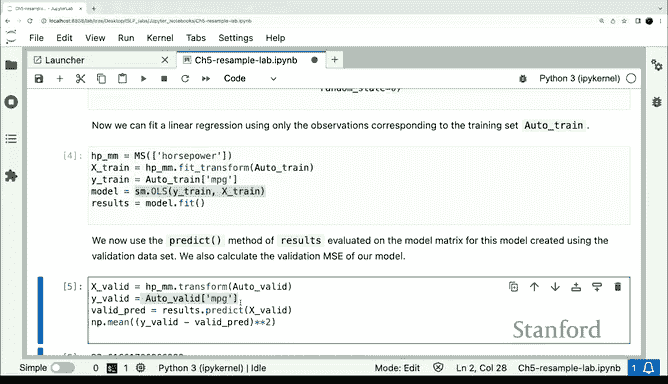

X_train, X_test, y_train, y_test = train_test_split(X, y, test_size=0.5, random_state=0)
```

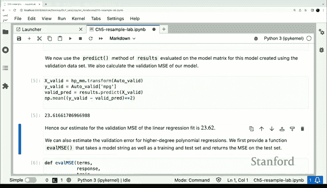

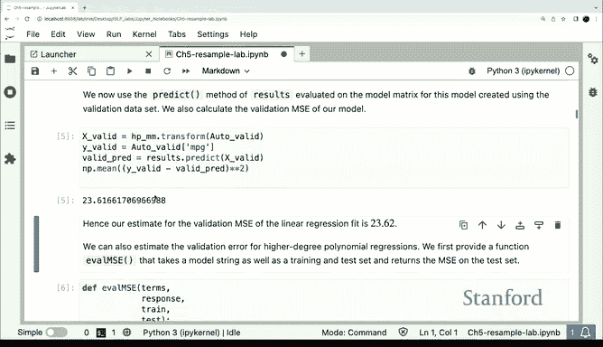

接下来，我们在训练集上拟合一个以`horsepower`为特征的简单线性回归模型。

```python
model_spec = ModelSpec(['horsepower'], intercept=False)
M_train = model_spec.fit_transform(X_train)
M_test = model_spec.transform(X_test)

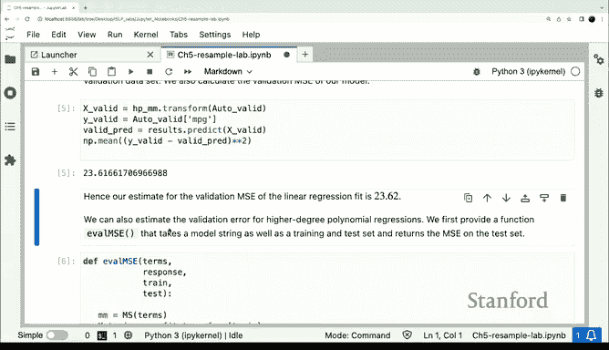

from statsmodels.api import OLS
model = OLS(y_train, M_train).fit()
```

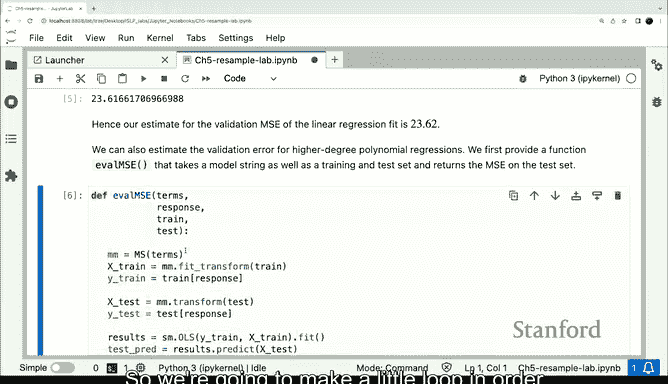

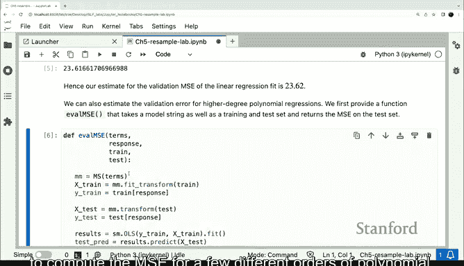

然后，我们在测试集上计算模型的均方误差（MSE）。

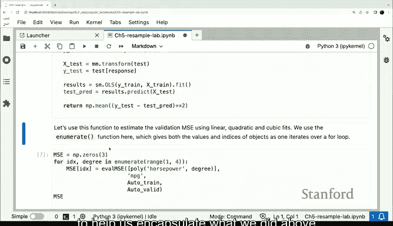

```python
y_pred = model.predict(M_test)
mse = np.mean((y_test - y_pred) ** 2)
print(f'测试集MSE: {mse:.2f}')
```
**输出示例**：`测试集MSE: 23.62`

---

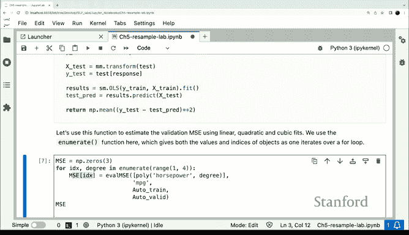

## 比较不同多项式模型

我们可能不仅想使用线性项，还想尝试不同阶数的多项式。我们可以使用训练-测试集分割来比较不同模型的性能。

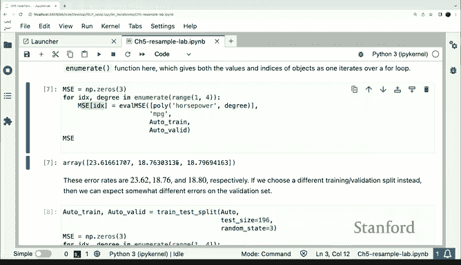

以下是用于评估给定多项式阶数模型的辅助函数：


```python
def eval_mse(degree, X_train, X_test, y_train, y_test):
    model_spec = ModelSpec([('horsepower', np.power, degree)], intercept=False)
    M_train = model_spec.fit_transform(X_train)
    M_test = model_spec.transform(X_test)
    model = OLS(y_train, M_train).fit()
    y_pred = model.predict(M_test)
    return np.mean((y_test - y_pred) ** 2)
```

现在，我们使用一个`for`循环来计算不同多项式阶数（1到5阶）下的测试集MSE。

```python
mse_values = []
for d in range(1, 6):
    mse_val = eval_mse(d, X_train, X_test, y_train, y_test)
    mse_values.append(mse_val)
    print(f'阶数 {d}: MSE = {mse_val:.2f}')
```

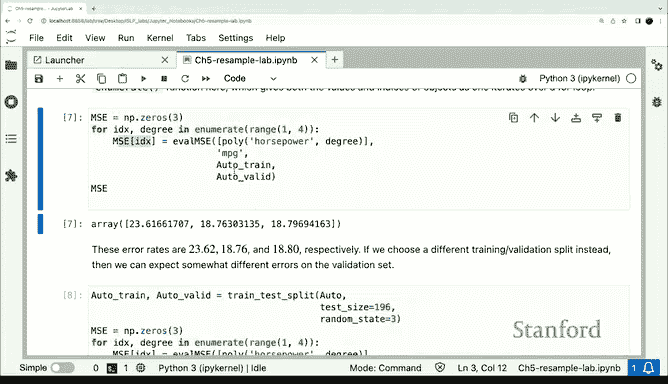

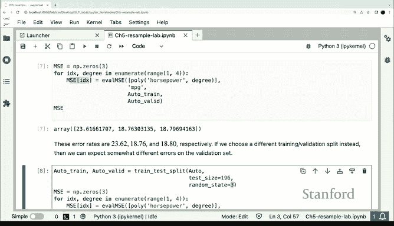

以下是可能的结果：
*   线性（1阶）: MSE ~23.6
*   二次（2阶）: MSE显著降低
*   三次及以上（3-5阶）: MSE改善很小甚至变差

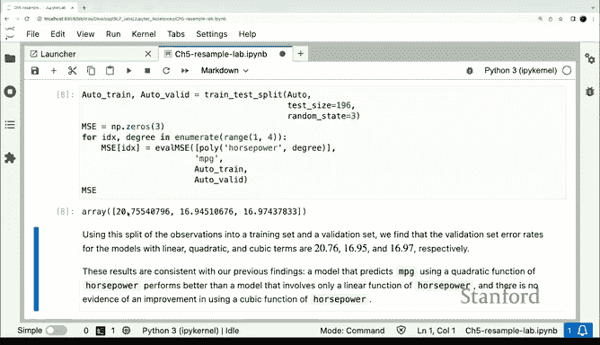

这表明使用二次多项式可能就足够了，更高阶数带来的收益有限。

---

## 理解分割的随机性

需要注意的是，上述结果依赖于一次特定的随机分割（`random_state=0`）。如果我们改变随机种子，结果会略有不同。

```python
# 使用不同的随机种子重新分割
X_train2, X_test2, y_train2, y_test2 = train_test_split(X, y, test_size=0.5, random_state=1)
# 重新评估线性模型
mse_new = eval_mse(1, X_train2, X_test2, y_train2, y_test2)
print(f'新分割下的线性模型MSE: {mse_new:.2f}')
```
**输出示例**：`新分割下的线性模型MSE: 20.70`

这种差异性源于将数据随机分成两部分的偶然性。此外，将本就不大的数据集对半分割，意味着训练模型时只用了50%的数据，这可能不是最有效的数据利用方式。

---

## 引入交叉验证

交叉验证是一种更高效、更稳定的模型评估方法。例如，在留一法交叉验证中，每个用于训练的模型都使用了n-1个数据点，这比简单的对半分割使用了更多的数据。

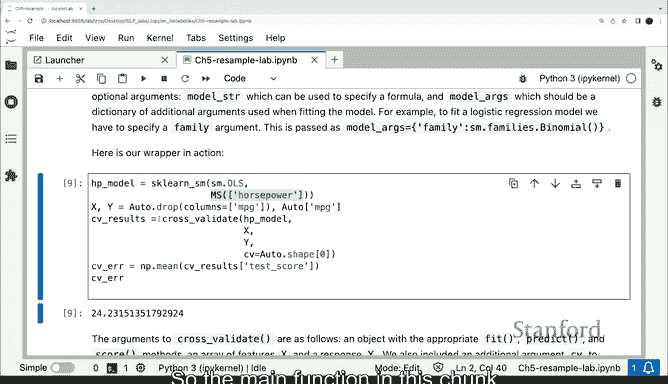

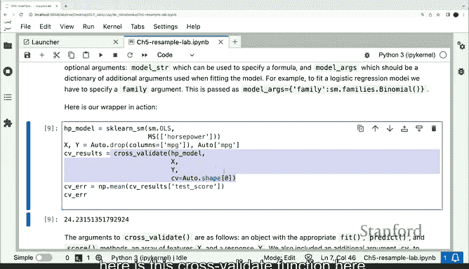

`scikit-learn`的`cross_val_score`函数为交叉验证各种模型提供了统一的接口。

首先，我们使用留一法交叉验证（即K折交叉验证中K等于样本数n）来评估线性模型。

```python
from sklearn.model_selection import cross_val_score

# 创建一个scikit-learn兼容的估计器
model_spec = ModelSpec(['horsepower'], intercept=False)
estimator = sklearn_sm(OLS)

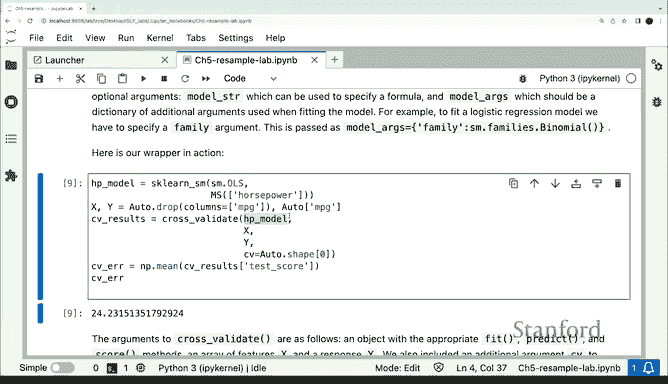

# 执行留一法交叉验证
cv_scores = cross_val_score(estimator, X, y, cv=len(auto), scoring='neg_mean_squared_error')
mse_cv_loocv = -cv_scores.mean()
print(f'留一法交叉验证MSE: {mse_cv_loocv:.2f}')
```

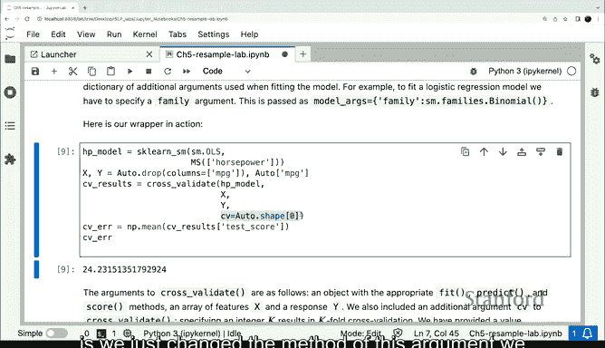

---

## 使用K折交叉验证

留一法计算量较大。更常用的方法是K折交叉验证（例如10折）。在`scikit-learn`中，我们只需改变传递给`cross_val_score`的`cv`参数。

```python
# 创建10折交叉验证分割器，并打乱数据
cv = KFold(n_splits=10, shuffle=True, random_state=0)

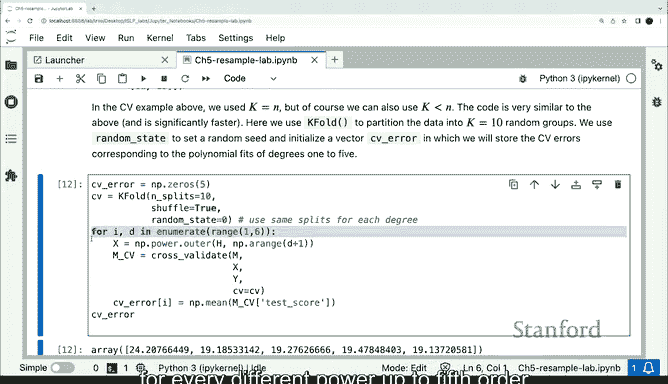

# 循环评估不同阶数的多项式
cv_mses = []
for d in range(1, 6):
    model_spec = ModelSpec([('horsepower', np.power, d)], intercept=False)
    estimator = sklearn_sm(OLS)
    scores = cross_val_score(estimator, X, y, cv=cv, scoring='neg_mean_squared_error')
    cv_mse = -scores.mean()
    cv_mses.append(cv_mse)
    print(f'多项式阶数 {d} - 10折CV MSE: {cv_mse:.2f}')
```

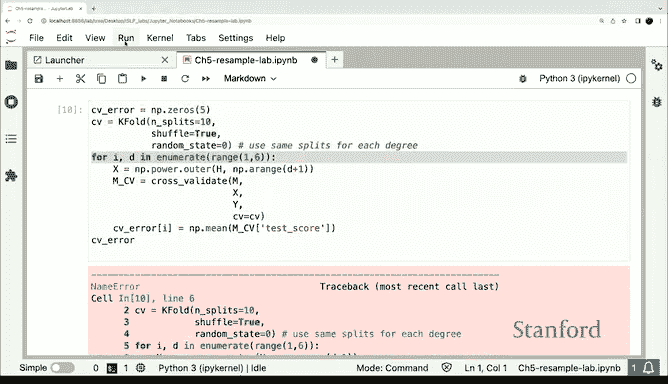

交叉验证得到的结果模式与训练-测试集分割相似：二次多项式之后，性能提升微乎其微。但交叉验证的估计通常更稳定，并且更有效地利用了数据。

---

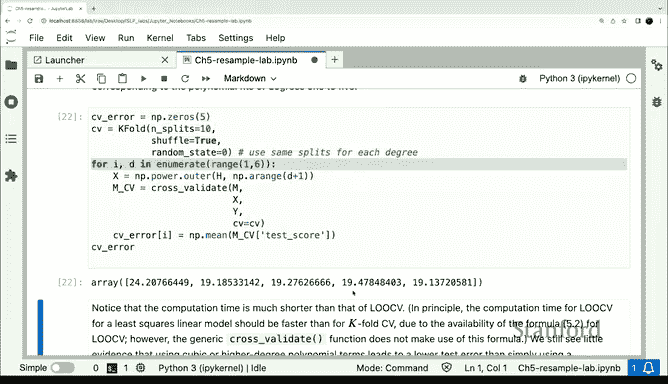

## 总结

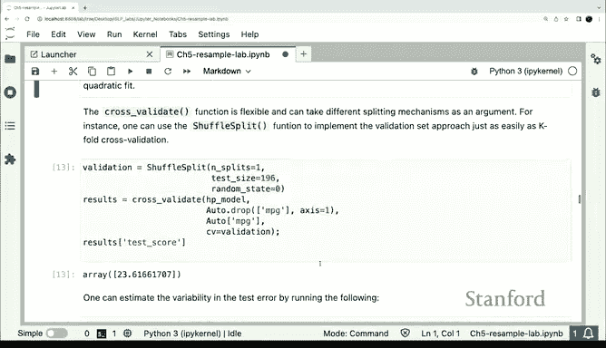

本节课中我们一起学习了模型评估的两种核心方法：
1.  **训练-测试集分割**：简单直观，但结果对单次分割敏感，且数据利用效率不高。
2.  **交叉验证**：尤其是K折交叉验证，通过多次分割、平均评估结果，提供了更稳定、偏差更小的性能估计，并更充分地利用了数据。

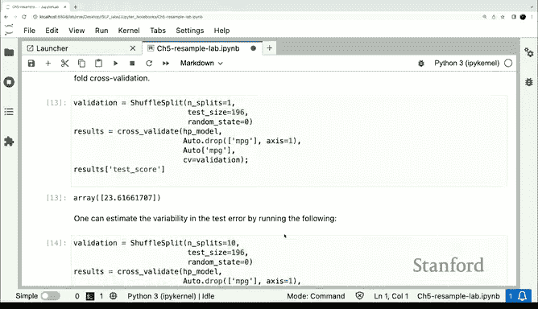

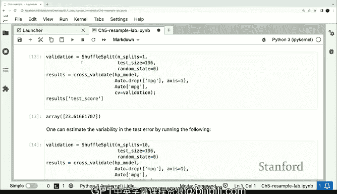


我们使用`scikit-learn`库演示了如何轻松实现这两种方法，并比较了不同复杂度（多项式阶数）的模型。交叉验证是选择最佳模型和调整超参数的强大工具。