# Python 版 39：Bootstrap方法 I 📊

在本节课中，我们将要学习Bootstrap方法。Bootstrap在某些方面与交叉验证类似，但它是一个更通用的过程。我们将展示如何使用Bootstrap来衡量一个复杂统计量的方差。

## 概述

Bootstrap是一种强大的重采样技术，用于估计统计量的抽样分布。它特别适用于那些没有简单解析表达式的复杂统计量。本节将通过一个投资组合优化的具体例子来演示其应用。

## Bootstrap的核心思想

上一节我们介绍了模型评估的交叉验证方法，本节中我们来看看Bootstrap。Bootstrap的基本思想是通过对原始数据集进行有放回的重复抽样，生成许多“Bootstrap样本”，然后在每个样本上重新计算我们感兴趣的统计量。这些统计量的分布可以用来估计原始统计量的变异性。

## 应用实例：投资组合优化

我们跟随教材中的一个例子，这是一个投资问题，目标是决定两种资产的最优投资比例以最小化投资组合的方差。这个最优比例α是一个关于资产方差和协方差的函数。

在教材的公式5.7中，给出了计算最优投资比例α的公式。这个公式是方差项与协方差项的比率。通常，为这样的函数寻找方差没有简洁的闭式解，这正是Bootstrap方法的理想应用场景。

以下是计算最优投资比例α的函数代码：

```python
def alpha_func(data, idx):
    """
    根据给定的数据索引，计算最优投资比例α。
    参数:
        data: 包含资产回报的数据框
        idx: 用于抽样的行索引列表
    返回:
        计算出的α值
    """
    # 从数据框中根据索引选择数据
    data_sample = data.iloc[idx]
    # 计算协方差矩阵
    cov_matrix = np.cov(data_sample[‘X‘], data_sample[‘Y‘])
    # 根据公式5.7计算α
    alpha = (cov_matrix[1,1] - cov_matrix[0,1]) / (cov_matrix[0,0] + cov_matrix[1,1] - 2*cov_matrix[0,1])
    return alpha
```

## Bootstrap标准误的计算过程

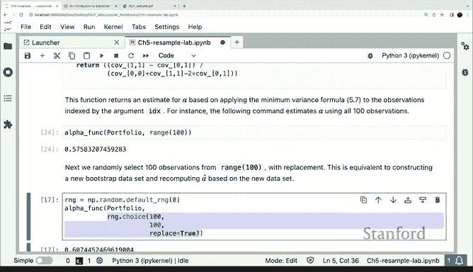

Bootstrap的工作方式是：我们从数据框中有放回地随机抽取样本。`idx`参数是一个整数列表，代表从数据框中抽取的行索引。对于每一个不同的索引集合，我们计算统计量α。Bootstrap收集所有这些估计值，然后我们可以使用这些估计值的样本标准差作为原始估计量方差的估计。

具体步骤如下：
1.  从原始数据中，有放回地抽取一个大小为n（总样本量）的Bootstrap样本。
2.  在这个重采样的数据框上计算我们感兴趣的统计量（例如α）。
3.  重复上述过程很多次（例如1000次）。
4.  计算这多次重复所得统计量的标准差，这就是Bootstrap标准误。

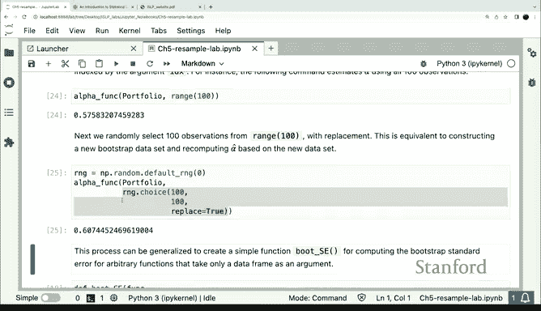

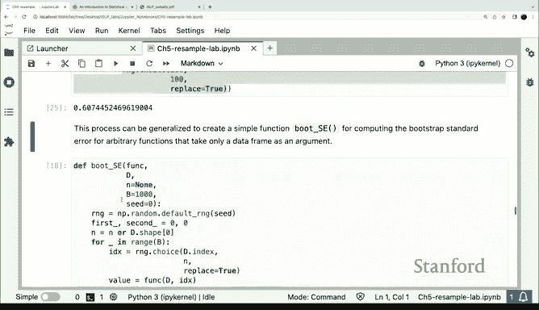

当我们对整个数据集计算统计量时，得到点估计约为0.58。Bootstrap可以帮助我们了解这个估计值的变异性。

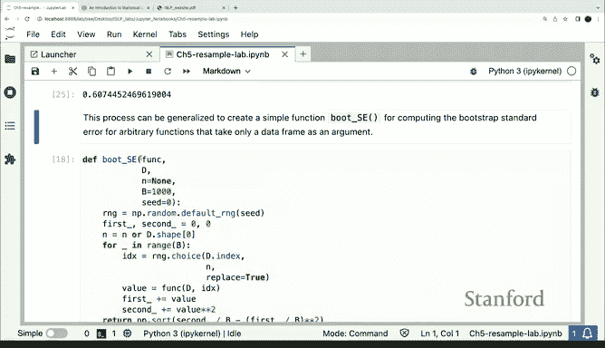

## 实现Bootstrap标准误函数

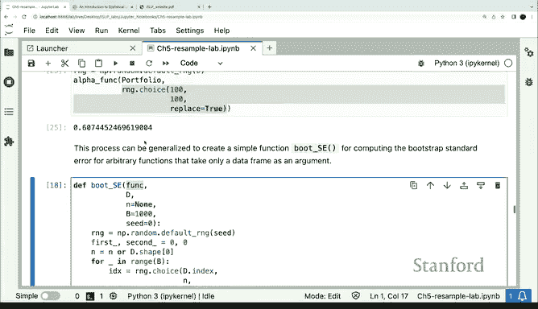

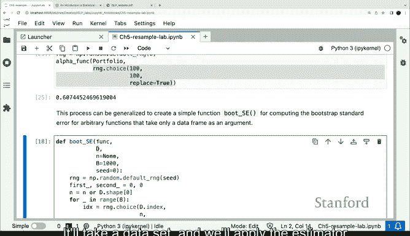

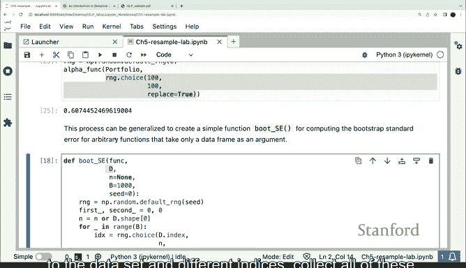

虽然Python有一些现成的Bootstrap包，但我们的例子足够简单，可以自己编写函数来加深理解。

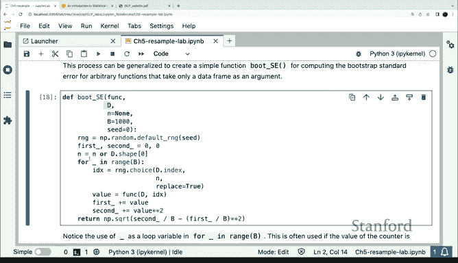

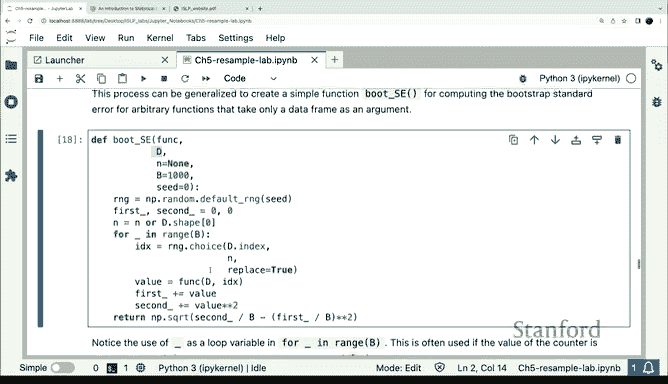

以下是计算Bootstrap标准误的函数：

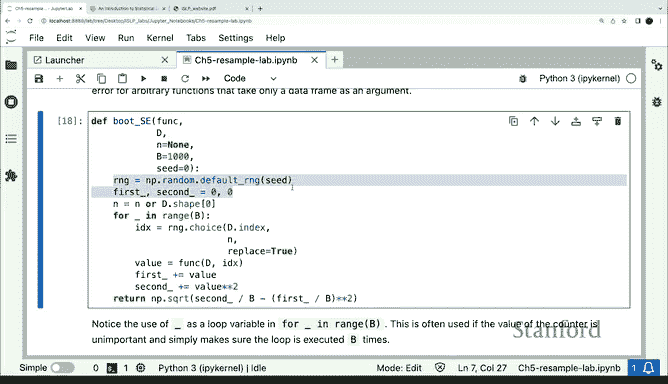

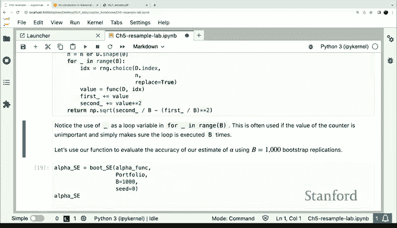

```python
def boot_SE(estimator, data, n_boot=1000):
    """
    计算给定估计量的Bootstrap标准误。
    参数:
        estimator: 估计量函数，例如alpha_func
        data: 原始数据
        n_boot: Bootstrap重复次数，默认为1000
    返回:
        Bootstrap标准误
    """
    n = len(data)
    boot_estimates = []  # 用于存放所有Bootstrap估计值

    # 设置随机种子以保证结果可重现
    np.random.seed(42)

    for i in range(n_boot):
        # 生成有放回的随机索引
        idx = np.random.choice(n, size=n, replace=True)
        # 计算当前Bootstrap样本的估计值
        estimate = estimator(data, idx)
        boot_estimates.append(estimate)

    # 计算所有估计值的标准差作为标准误
    se = np.std(boot_estimates, ddof=1)
    return se
```

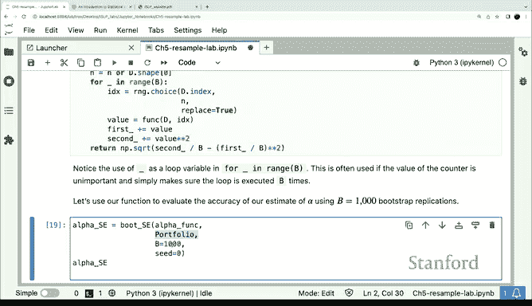

让我们将这个函数应用到我们的例子上。我们传入点估计函数`alpha_func`、实际数据集，并要求进行1000次抽样。

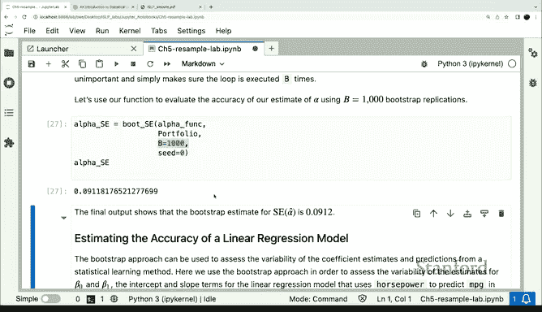

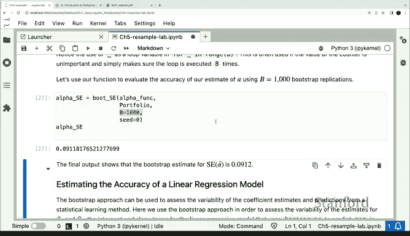

运行结果告诉我们，Bootstrap标准误约为0.09。因此，如果我们想为真实的最优α构建一个置信区间，它可以表示为 **0.58 ± 2 * 0.09**，这将是一个相当好的置信区间。这个过程非常快速，只用了1000次重复，函数也非常简单。

## Bootstrap在线性回归中的应用

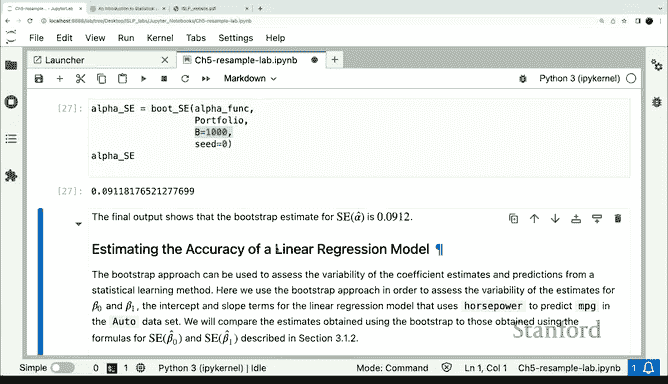

本课程实验的其余部分，展示了如何在线性回归中应用Bootstrap。它遵循与上述类似的模式，但区别在于这里的函数稍微复杂一些：它是一个将回归模型拟合到具有特定索引集合的数据框的函数。除此之外，它将使用完全相同的`boot_SE`函数来计算标准误。这部分内容留作线下练习。

Bootstrap方法非常有用，它是一个直接易用的方法，可以应用于相当复杂的函数，并获取这些函数的标准误。可以说它是“自动魔法”般的工具。值得一提的是，Bootstrap是由斯坦福大学统计系的Bradley Efron教授发明的，他现在是荣誉退休教授。

## 总结

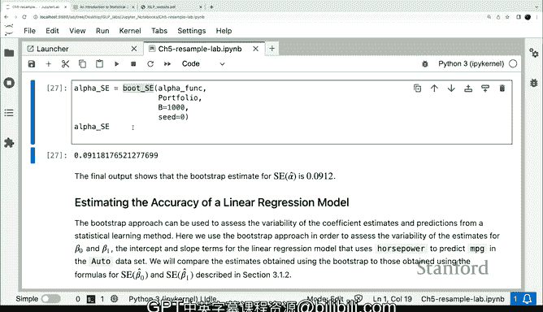


本节课中我们一起学习了Bootstrap方法。我们了解了它的核心思想是通过重采样来估计统计量的变异性，并通过一个投资组合优化的具体实例，演示了如何编写函数计算复杂统计量（最优投资比例α）及其Bootstrap标准误。最后，我们提到了Bootstrap在线性回归等更广泛场景中的应用及其重要性。Bootstrap是一种强大而灵活的工具，能够为缺乏理论方差公式的估计量提供可靠的推断基础。