# Python 版 40：模型选择与正则化 - 6.1 引言与最优子集选择 📊 

在本节课中，我们将学习模型选择与正则化的基本概念。我们将探讨如何在线性模型的框架下，通过选择或压缩特征系数来提升模型的解释性和预测能力。课程将涵盖最优子集选择、逐步选择方法以及正则化技术。

---

## 🎯 引言：为何需要改进线性模型？

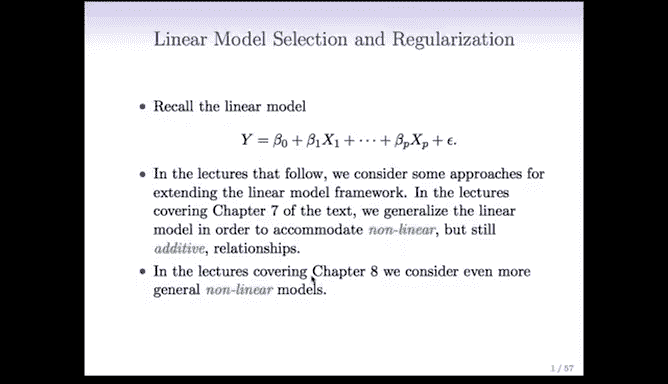

上一节我们回顾了线性模型的基本形式。线性模型因其简单性和可解释性而非常重要，通常形式为：

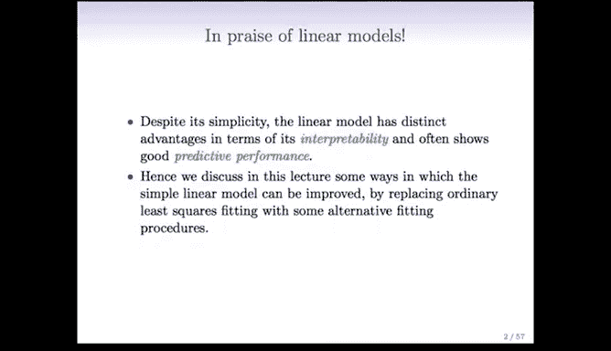

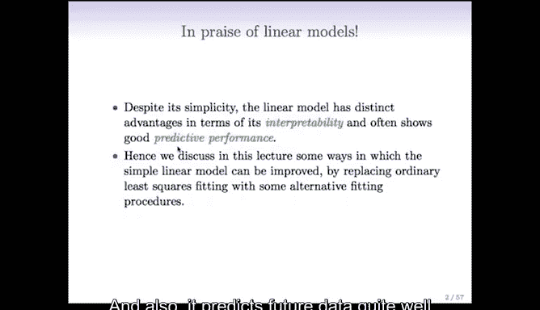

**Y = β₀ + β₁x₁ + β₂x₂ + ... + βₚxₚ + ε**

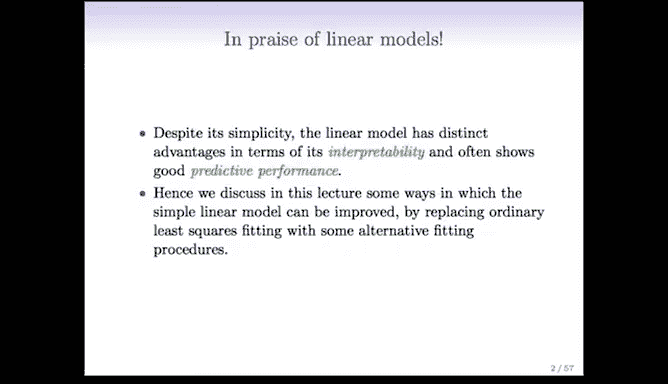

然而，在某些情况下，最小二乘法拟合的线性模型可能不是最优选择。特别是在以下两种场景中，我们需要对模型进行改进：

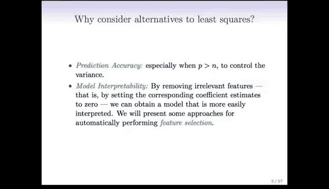

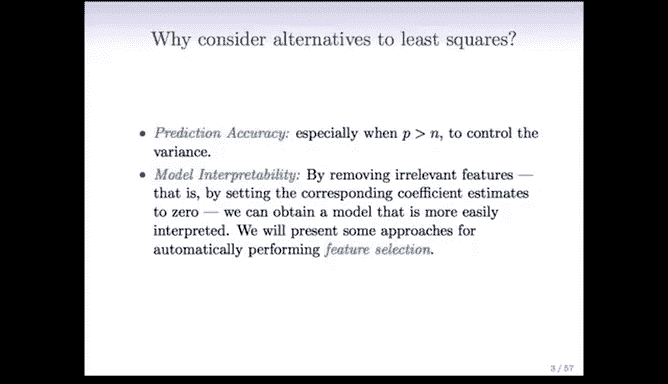

1.  **特征数量（p）大于样本数量（n）**：此时最小二乘解甚至无法定义，我们必须减少特征数量以获得可行解。
2.  **提升预测性能与可解释性**：即使特征数量不多，通过选择最重要的特征或压缩系数，我们也可以避免过拟合，获得在未知数据上表现更好的模型，同时使模型更易于理解和解释。

因此，今天我们将讨论三类主要技术来改进线性模型：**子集选择**、**正则化（压缩）方法**和**降维**。这些概念虽然在线性回归的背景下介绍，但同样适用于逻辑回归等其他模型。

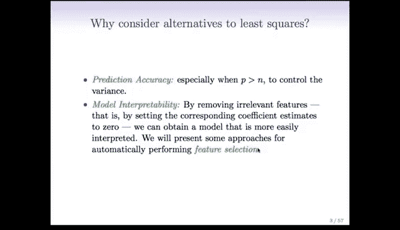

---

## 🔍 最优子集选择

本节中，我们来看看第一种技术：最优子集选择。这是一种非常直观的方法，其核心思想是：如果我们有 `p` 个预测变量，但希望得到一个只包含其中一部分变量的更简单模型，那么最自然的方式就是尝试所有可能的变量子集，并从中选出“最佳”模型。

以下是执行最优子集选择的具体步骤：

### 步骤 1：生成所有可能大小的“最佳”模型

我们按模型大小（包含的预测变量数量）系统地生成一系列候选模型。

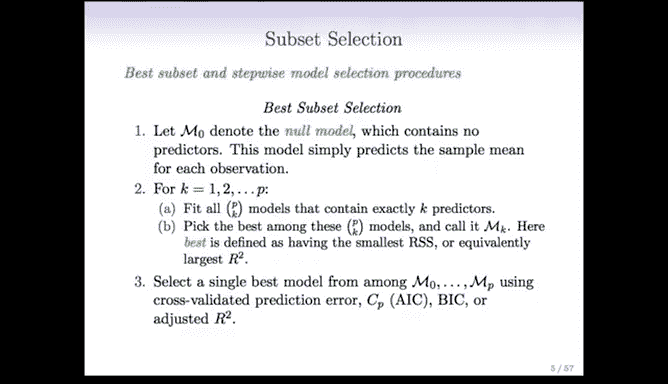

*   **M₀**：零模型，仅包含截距项。它用样本均值预测所有观测值。
*   **M₁**：最佳的单变量模型。我们拟合所有 `p` 个只包含一个预测变量的模型，并选择其中最好的一个（例如，残差平方和最小或 R² 最大）。
*   **M₂**：最佳的双变量模型。我们拟合所有包含两个预测变量的模型。这样的模型共有 **C(p, 2)** 个（即 `p` 选 `2` 的组合数）。我们选择其中最好的一个。
*   **以此类推**：我们继续这个过程，找到最佳的三变量模型（M₃）、四变量模型……直到包含所有 `p` 个预测变量的完整模型 **Mₚ**。

组合数的计算公式为：
**C(p, k) = p! / [k! * (p - k)!]**

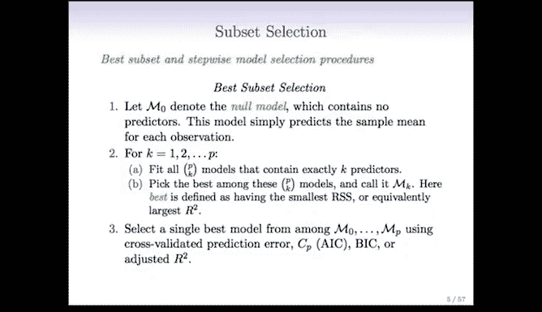

### 步骤 2：从候选模型中选择最终模型

现在，我们得到了从 M₀ 到 Mₚ 的一系列模型，每个都是其对应大小的“最佳”模型。然而，我们不能简单地选择训练误差（如残差平方和最小）最小的模型，因为更复杂的模型天然在训练集上表现更好，但这可能导致过拟合。

因此，我们需要使用能够估计测试误差的方法，从 M₀ 到 Mₚ 中选出一个最终的、泛化能力最好的模型。可选的方法包括：
*   交叉验证
*   马洛斯 Cp 准则
*   贝叶斯信息准则
*   调整后的 R²

我们将在后续详细讨论其中一些方法。

---

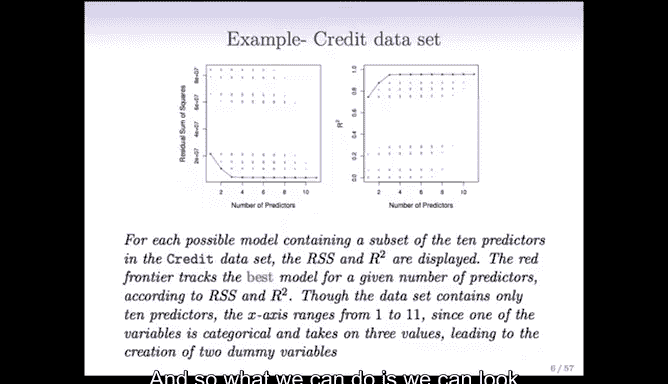

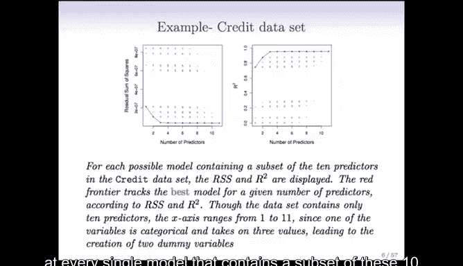

## 📈 实例演示：信用卡数据集

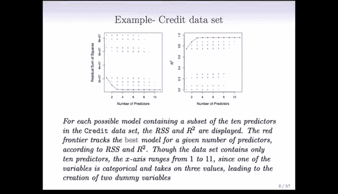

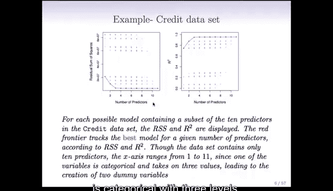

让我们通过一个具体例子来理解最优子集选择的过程。我们使用一个包含10个预测变量（如信用卡数量、信用评级、信用额度等）的信用卡数据集，目标是预测定量响应变量“信用卡余额”。

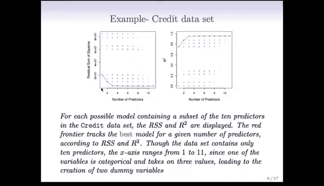

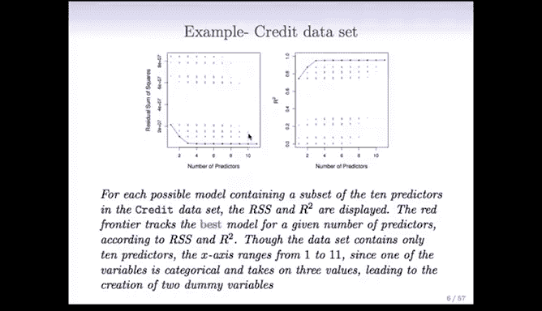

下图展示了分析结果：

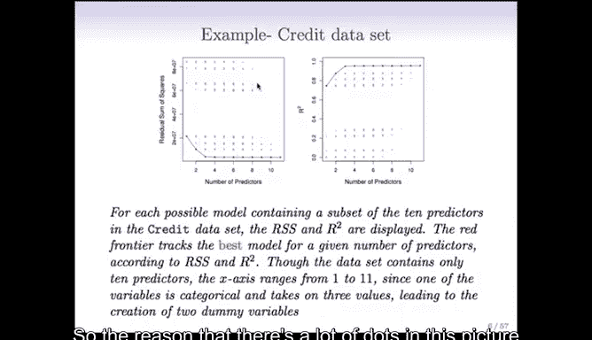

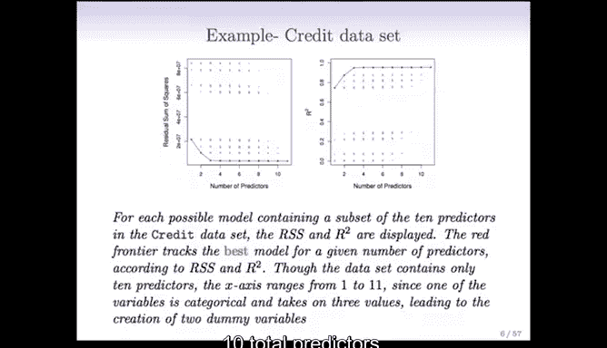

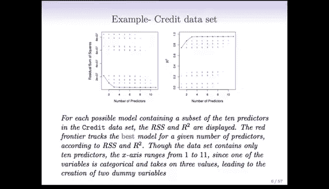

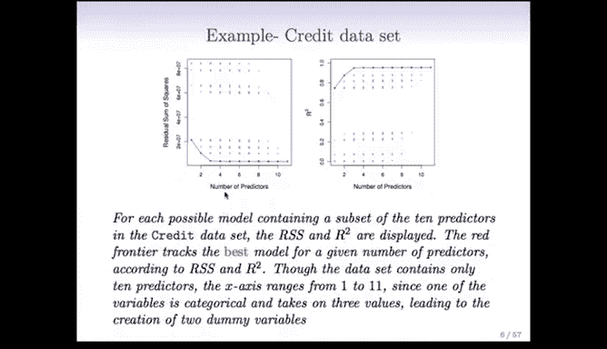

**左图（残差平方和 vs. 预测变量数量）**：
*   每个灰点代表一个包含特定子集预测变量的模型及其残差平方和。
*   由于有10个预测变量，总共存在 **2¹⁰ = 1024** 个子集模型（图中有些点重叠）。
*   **红色曲线**连接了每个模型大小下的最佳模型（即 M₁, M₂, ..., M₁₀）。可以看到，随着模型变大，残差平方和单调下降。

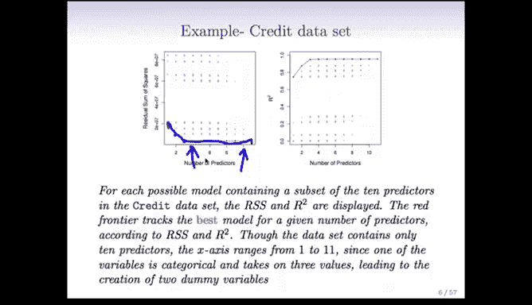

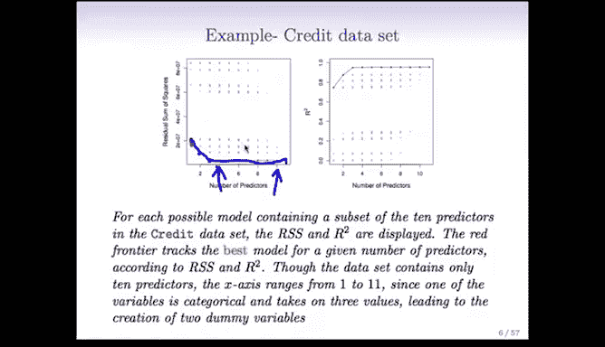

**右图（R² vs. 预测变量数量）**：
*   同样，灰点代表所有子集模型。
*   **红色曲线**同样代表每个大小下的最佳模型。
*   随着模型包含更多变量，R² 单调上升。

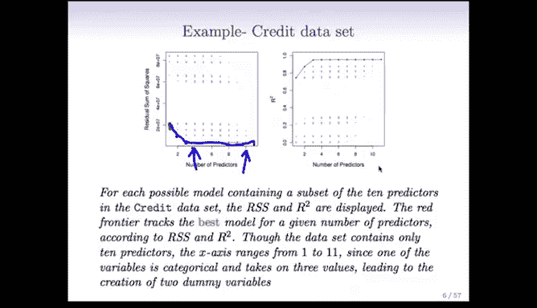

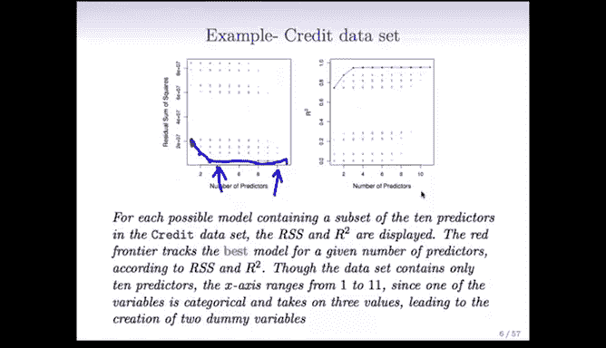

**关键点**：
为什么曲线是单调的？因为当我们在一个 `k` 变量模型的基础上增加一个变量时，最差的情况是将新变量的系数设为0，这样模型性能就和原来的 `k` 变量模型完全一样。因此，增加变量不会使模型在训练集上的表现变差，性能曲线永远不会上升，最多保持平坦。

**模型选择的挑战**：
虽然我们可以轻易地在相同大小的模型中选出最佳者（例如，在8个变量的所有模型中，残差平方和最小的那个），但比较不同大小的模型（例如，一个4变量模型和一个8变量模型）则要困难得多。我们不能直接比较它们的训练误差，因为更复杂的模型总是占优。这正是为什么我们需要在步骤2中使用交叉验证、BIC等准则来进行公平比较，以选择出在测试集上可能表现最好的模型。

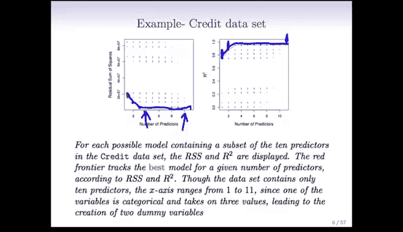

---

## 🎓 总结

本节课中，我们一起学习了模型选择与正则化的动机，并深入探讨了**最优子集选择**这一具体方法。

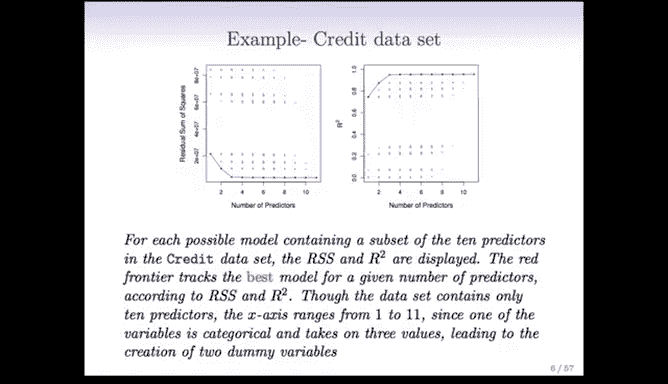

*   我们了解到，为了处理高维数据、提升预测精度和模型可解释性，需要改进普通的最小二乘线性模型。
*   最优子集选择通过**穷举搜索**所有可能的预测变量组合，为每个模型大小找到一个最佳候选模型。
*   该方法分为两步：首先生成从零变量到全变量的一系列“最佳”候选模型；然后，必须使用交叉验证或信息准则等方法来从这些不同复杂度的模型中选出最终的、泛化能力最优的模型。
*   我们通过信用卡数据集的例子直观地看到了模型性能（残差平方和、R²）如何随模型复杂度变化，并理解了比较不同大小模型的挑战。

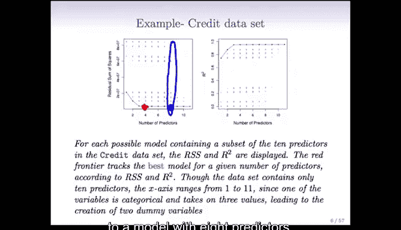

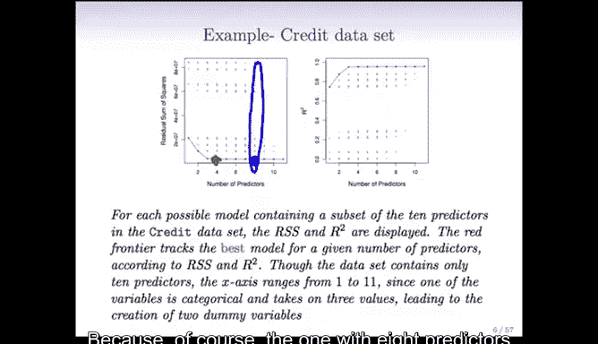

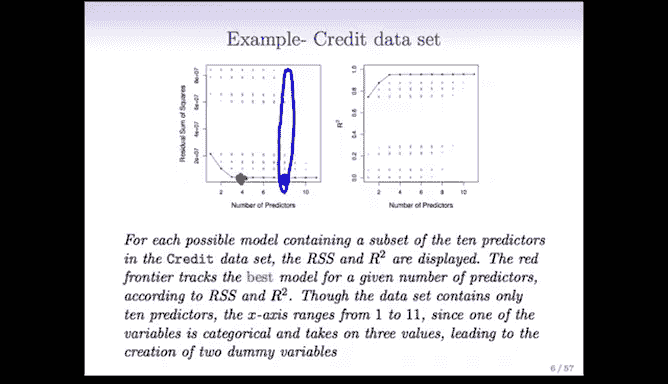

在接下来的课程中，我们将继续学习其他更高效的子集选择方法（如逐步选择）以及正则化技术。