# Python 版 42：📉 6.3 向后逐步选择法

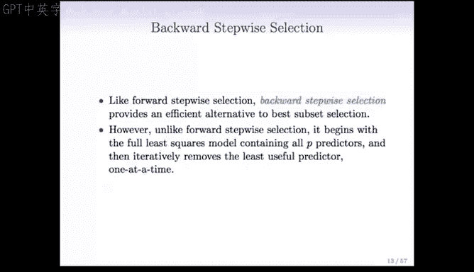

在本节课中，我们将要学习一种与向前逐步选择法相反的模型选择方法——向后逐步选择法。我们将了解其工作原理、计算优势、适用条件以及与向前逐步选择法的关键区别。

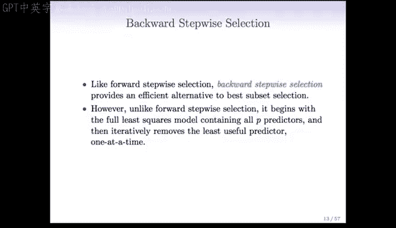

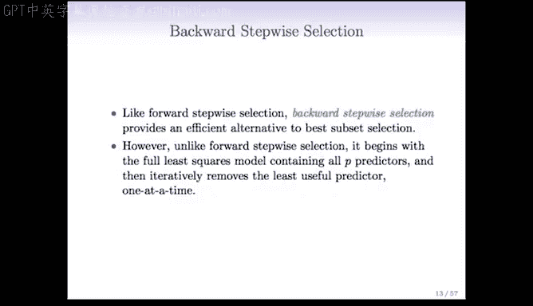

上一节我们介绍了向前逐步选择法，本节中我们来看看它的反向操作——向后逐步选择法。与向前逐步选择法一样，向后逐步选择法也是最优子集选择的一种高效替代方案，但其操作方向完全相反。

## 🔄 向后逐步选择法概述

回忆在向前逐步选择法中，我们从仅包含截距项的模型 **M0** 开始，然后逐个添加特征，依次得到 **M1**、**M2** 等模型。

相比之下，在向后逐步选择法中，我们从包含全部 **P** 个预测变量的模型 **MP** 开始，然后逐个移除预测变量，直到得到仅包含截距项的模型 **M0**。

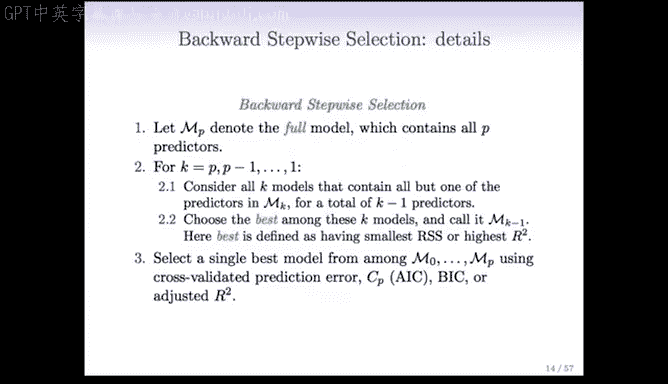

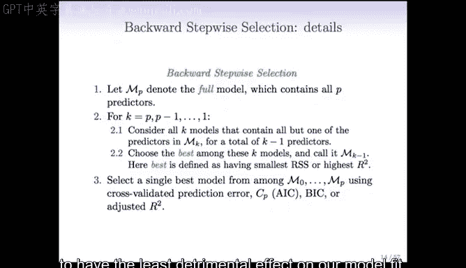

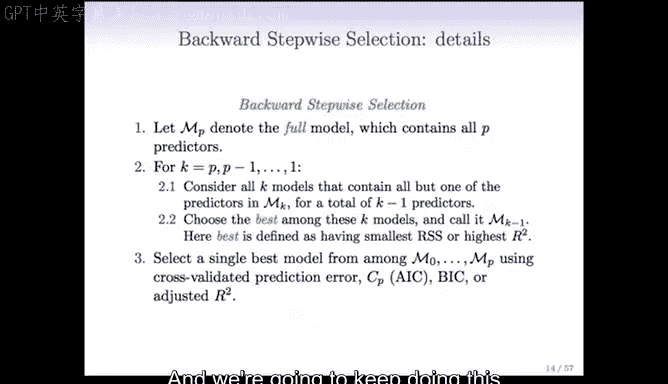

以下是向后逐步选择法的详细步骤：

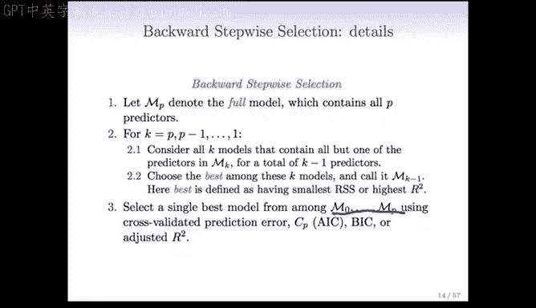

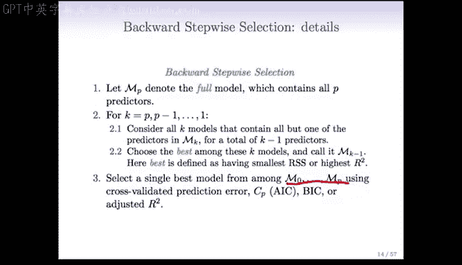

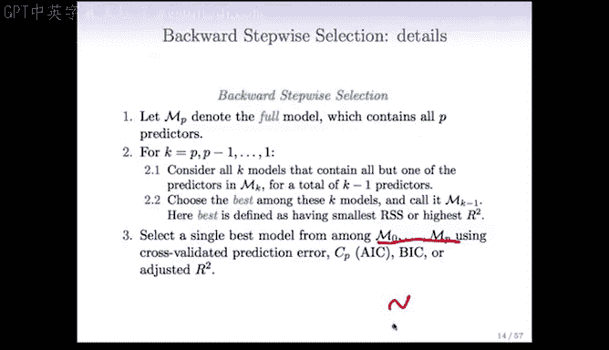

1.  **初始化**：从包含所有 **P** 个预测变量的模型 **MP** 开始。这相当于未进行任何特征选择时拟合的普通最小二乘模型。
2.  **评估移除效果**：考虑从当前模型（例如 **MP**）中移除每一个预测变量。评估移除哪个预测变量对模型拟合效果（如 **RSS** 或 **R²**）的影响最小，即找出最不重要的预测变量。
3.  **移除最不重要变量**：移除上一步中识别出的最不重要的预测变量，得到新模型（例如 **MP-1**）。
4.  **迭代**：对新的模型（**MP-1**）重复步骤 2 和 3，继续移除最不重要的预测变量。
5.  **终止**：持续此过程，直到模型只剩下一个预测变量（**M1**），最终到仅包含截距项的模型（**M0**）。

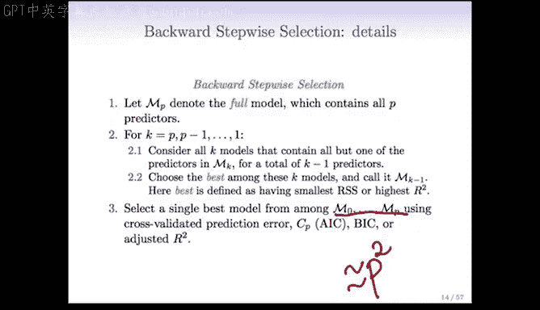

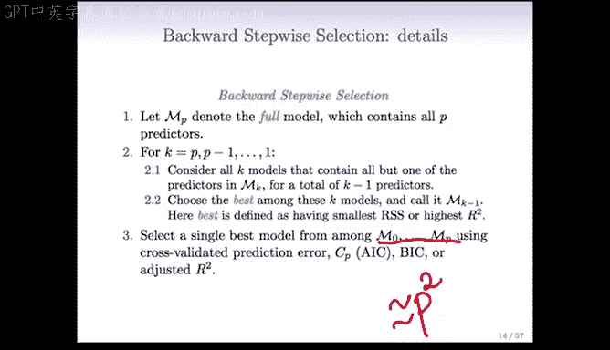

通过这个过程，我们同样会得到一系列从 **M0** 到 **MP** 的模型。然后，我们需要使用交叉验证、**AIC**、**BIC** 或调整后 **R²** 等准则，从这些模型中选择最优的一个。

## ⚙️ 计算优势与局限性

与向前逐步选择法类似，向后逐步选择法考察的模型数量约为 **P²**（更精确地说是 **P²/2**），而不是最优子集选择的 **2ᴾ** 个。当预测变量数量 **P** 处于中等或较大规模时，这是一个极佳的计算效率替代方案。

然而，同样地，向后逐步选择法并不能保证找到包含特定数量预测变量的最优模型。在训练集上，其得到的模型的 **RSS** 可能比最优子集选择的模型大（或 **R²** 更小）。但这通常是可以接受的，因为从长远来看，它在测试集上可能表现更好，更不用说其计算效率更高了。

## ⚠️ 向后与向前逐步选择法的关键区别

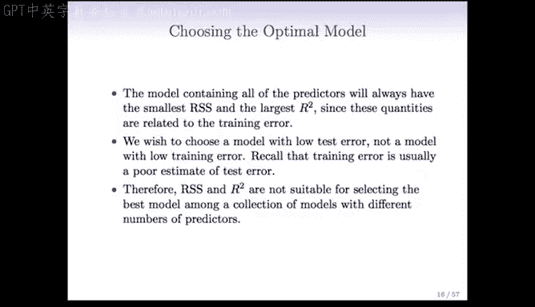

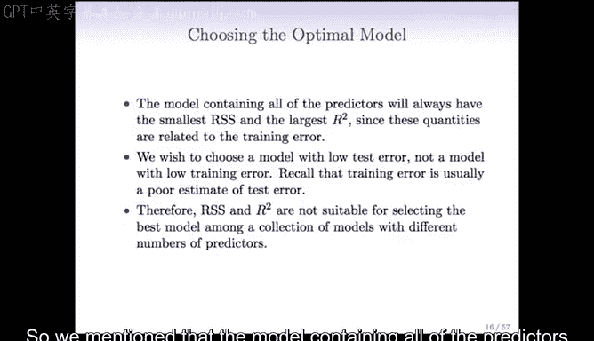

向后与向前逐步选择法的一个主要区别在于起点。向后选择法从包含所有预测变量的模型开始，这就要求我们必须满足 **观测数 n 大于变量数 p** 的条件。因为只有当 **n > p** 时，我们才能拟合最小二乘模型。如果 **p > n**，最小二乘模型甚至无法定义。

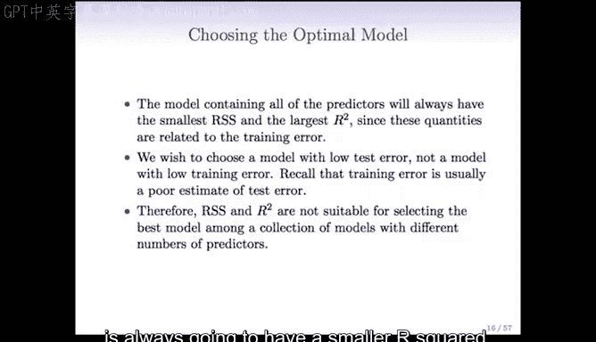

相比之下，向前逐步选择法无论 **n < p** 还是 **n > p** 都可以进行。

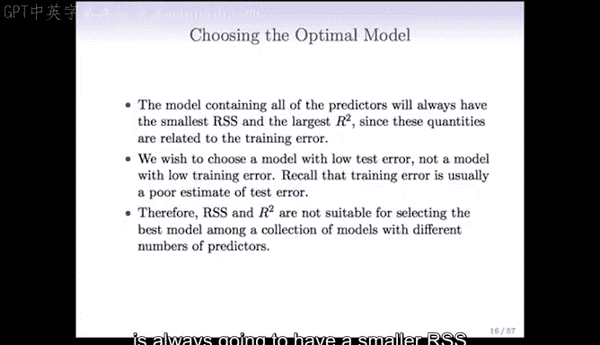

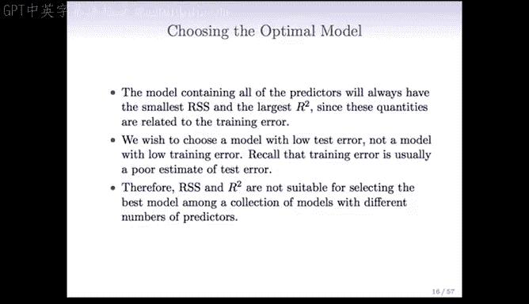

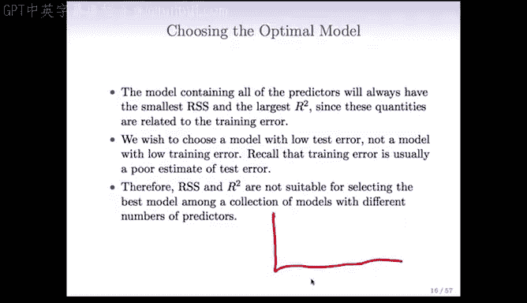

## 📊 为何不能仅依赖 RSS 或 R² 选择模型

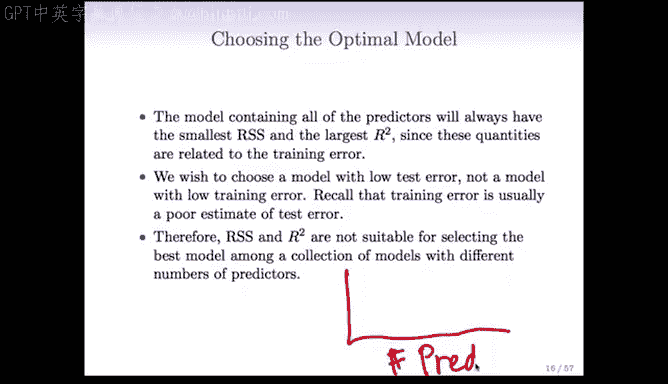

包含所有预测变量的模型 **MP** 总是拥有最小的 **RSS** 和最大的 **R²**，因为这些指标衡量的是训练误差。如果我们绘制“预测变量数量”与“RSS”的关系图，曲线是单调递减的；绘制“预测变量数量”与“R²”的关系图，曲线是单调递增的。

因此，如果我们仅根据 **RSS** 或 **R²** 在 **M0** 到 **MP** 的模型序列中选择，我们总是会选择最大的模型（**MP**）。但我们的目标是获得在未见数据（测试集）上误差低的模型。不幸的是，训练误差通常是测试误差的一个很差估计。所以，**RSS** 和 **R²** 本身并不适合用于在不同变量数量的模型之间进行选择。

---

本节课中我们一起学习了向后逐步选择法。我们了解到它是一种从全模型开始、通过逐步移除最不重要变量来筛选特征的高效方法。其计算复杂度约为 **O(P²)**，远低于最优子集选择。但需要注意，它要求数据满足 **n > p** 的条件，并且与向前选择法一样，不能保证找到理论上的最优模型。最终模型的选择需要依赖交叉验证或信息准则，而非单纯的训练误差指标。