# Python 版 43：6.4 估计测试误差 📊

在本节课中，我们将学习如何估计模型的测试误差。这是模型选择过程中的关键一步，因为我们需要一个标准来比较不同复杂度（例如，包含不同数量预测变量）的模型，并从中选出最佳模型。

## 概述

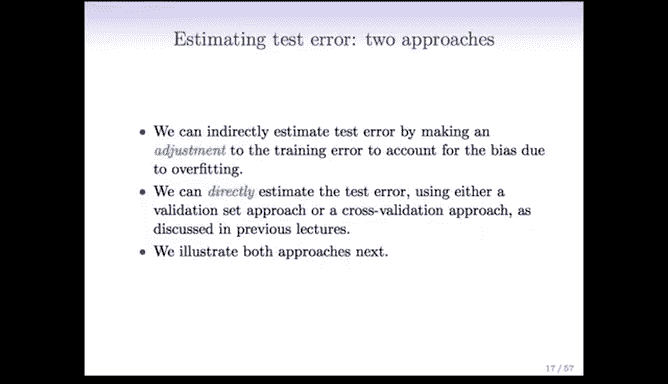

上一节我们讨论了最佳子集选择等模型选择方法，它们会生成一系列模型（M0, M1, ..., Mp）。为了从中选择最优模型，我们需要一种方法来估计每个模型的测试误差。

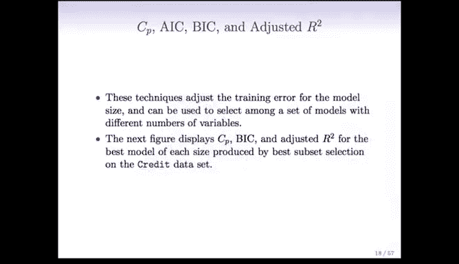

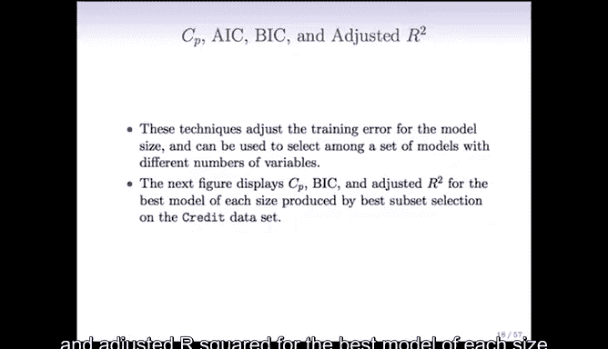

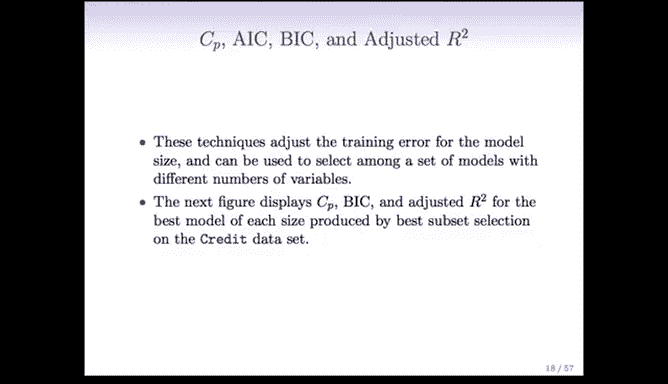

基本上，有两种主要思路来估计测试误差：
1.  **间接估计**：通过计算训练误差并进行调整，以抵消过拟合带来的偏差，从而间接估计测试误差。
2.  **直接估计**：使用交叉验证或验证集方法，直接在部分数据上拟合模型，并在另一部分数据上评估其性能。

本节我们将重点讨论第一种方法，即通过调整训练误差来间接估计测试误差的几种常用准则。

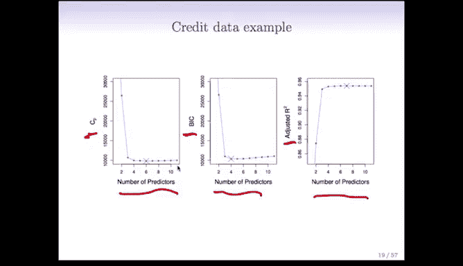

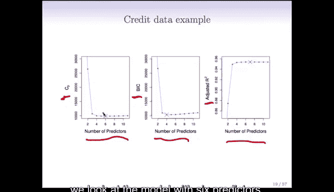

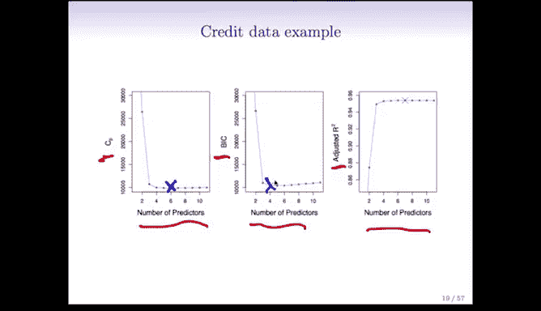

## 调整训练误差的准则

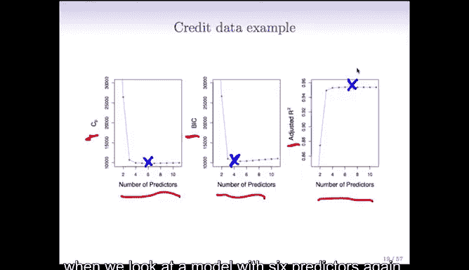

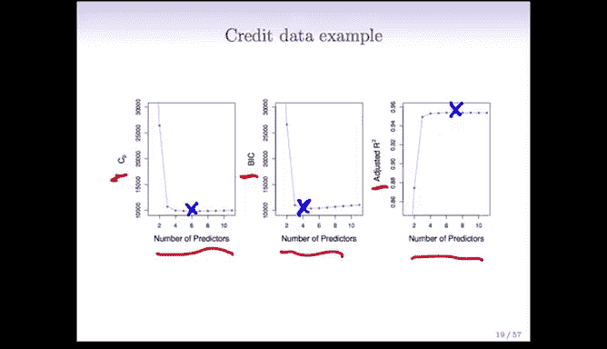

以下是几种通过调整训练误差来估计测试误差的常用准则。它们都可用于在不同变量数量的模型中进行选择。

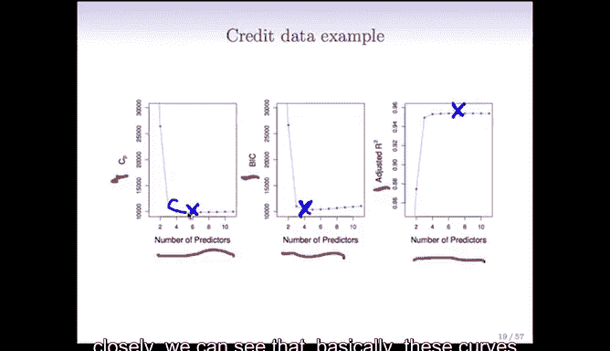

我们将以信用数据为例，展示使用最佳子集选择后，不同大小最佳模型的 Cp、BIC 和调整后 R² 值。

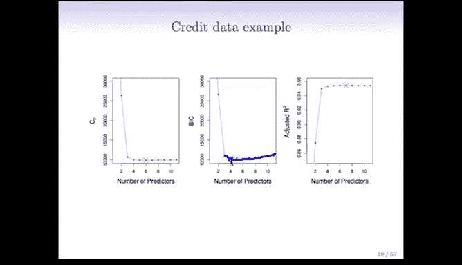

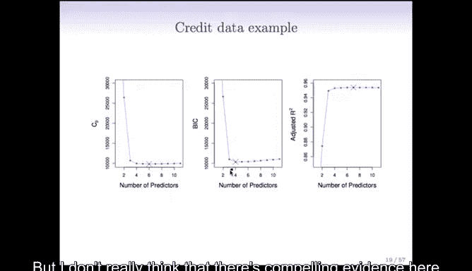

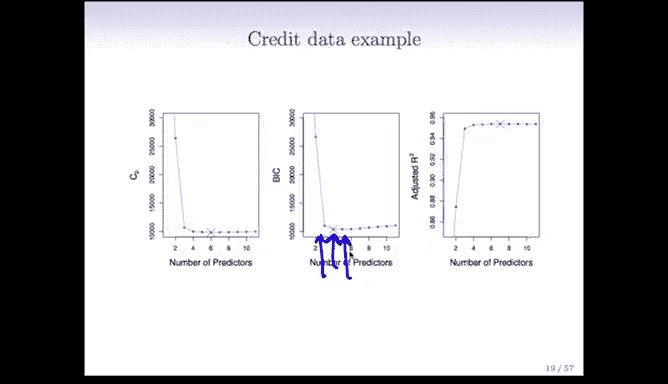

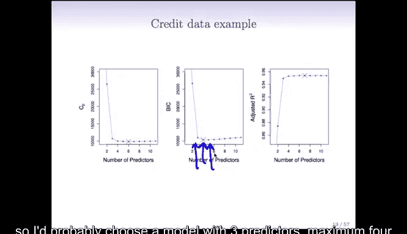

在这些图中，X 轴代表模型中的预测变量数量，Y 轴分别代表 Cp、BIC（贝叶斯信息准则）和调整后 R²。我们的目标是：**Cp 和 BIC 越小越好，调整后 R² 越大越好**。

观察这些曲线：
*   Cp 在包含 **6** 个预测变量的模型上最小。
*   BIC 在包含 **4** 个预测变量的模型上最小。
*   调整后 R² 在包含 **6** 个预测变量的模型上最大。

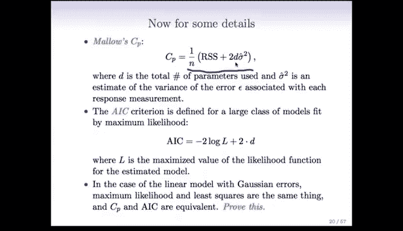

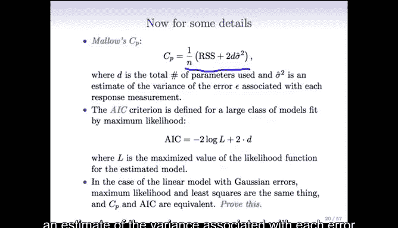

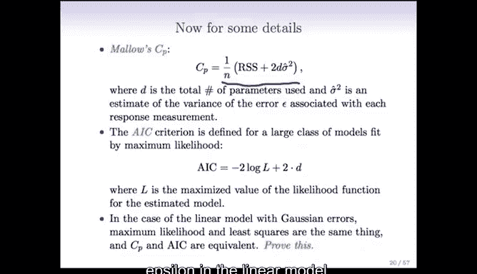

这表明，对于这个信用数据集，使用 **4 到 6** 个预测变量可能是合适的。更仔细地观察会发现，曲线在预测变量数量达到 3 或 4 个之后基本变得平坦。因此，基于这些图，很可能我们只需要最多 3 或 4 个预测变量就能在这个数据上做出很好的预测。通常，模型越简单越好。

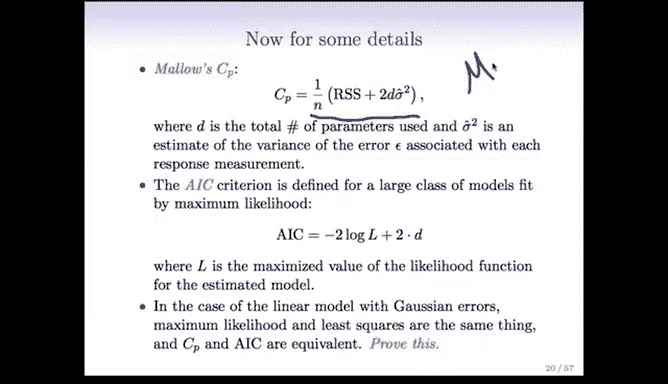

接下来，我们详细看看这些准则的定义。

### 1. Mallow's Cp

Cp 是对训练残差平方和（RSS）的调整，旨在给出测试 RSS 的估计。其定义公式如下：

对于一个包含 **d** 个预测变量（包括截距项）的模型，其 Cp 统计量为：
`Cp = (1/n) * (RSS + 2 * d * σ̂²)`
其中：
*   **RSS** 是该模型的残差平方和。
*   **d** 是模型中预测变量的数量（包括截距）。
*   **σ̂²** 是线性模型中误差项 ε 方差的估计值。通常使用包含所有 **p** 个预测变量的“全模型”的残差均方（MSE）来估计 σ̂²。

**使用方法**：计算所有候选模型（M0 到 Mp）的 Cp 值，然后选择 **Cp 值最小的模型**。

**注意事项**：Cp 方法要求样本量 **n** 大于预测变量总数 **p**，这样才能拟合全模型并得到 σ̂² 的有效估计。当 p 接近或大于 n 时，此方法会遇到问题。

### 2. 赤池信息准则 (AIC)

AIC 是另一个广泛使用的准则，其定义更为一般化：
`AIC = -2 * log(L) + 2 * d`
其中：
*   **L** 是所估计模型的最大似然值。
*   **d** 是模型中参数的数量。

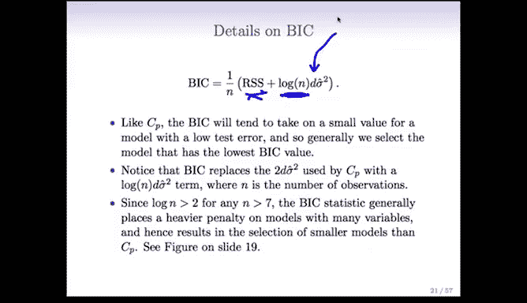

对于线性回归模型（在误差服从正态分布的假设下），可以证明 `-2*log(L)` 与 `RSS/σ̂²` 成正比。因此，**在线性模型背景下，选择最小 AIC 的模型等价于选择最小 Cp 的模型**。

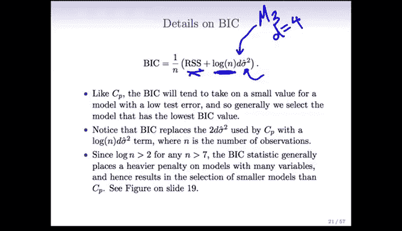

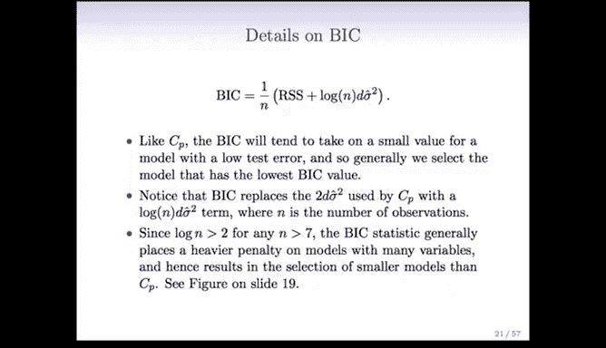

AIC 的优势在于其形式通用，可应用于逻辑回归等其他类型的模型。

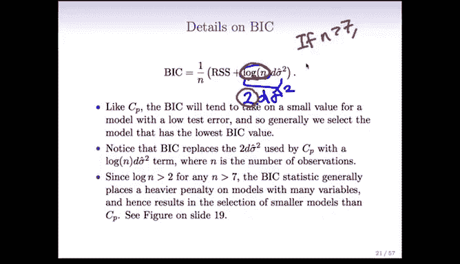

### 3. 贝叶斯信息准则 (BIC)

BIC 与 AIC 和 Cp 类似，但源于贝叶斯观点。其公式为：
`BIC = (1/n) * (RSS + log(n) * d * σ̂²)`
其中：
*   **n** 是样本观测数。
*   其他项与 Cp 定义相同。

与 AIC（对应项为 `2 * d * σ̂²`）相比，BIC 用 `log(n) * d * σ̂²` 作为惩罚项。由于当 **n > 7** 时，`log(n) > 2`，因此 **BIC 对模型复杂度的惩罚通常比 AIC 更重**。这导致 BIC 倾向于选择 **变量更少、更简洁的模型**。

**使用方法**：同样，我们选择 **BIC 值最小的模型**。

### 4. 调整后 R² (Adjusted R²)

首先回顾一下 R²（决定系数）：
`R² = 1 - (RSS / TSS)`
其中 TSS（总平方和）是 `Σ(y_i - ȳ)²`。R² 越大，表示模型对数据的拟合越好，但它无法直接用于比较不同变量数量的模型（因为增加变量总会提高 R²）。

调整后 R² 通过引入与模型复杂度相关的惩罚项来解决这个问题：
`调整后 R² = 1 - [RSS/(n-d-1)] / [TSS/(n-1)]`
其中 **d** 是模型中预测变量的数量。

**核心思想**：当 **d** 很大时，分母 `(n-d-1)` 会变小，从而使得 RSS 被一个较小的数除，这相当于对复杂模型进行了惩罚。因此，调整后 R² 可以在不同变量数的模型间进行有意义的比较。

**目标**：选择 **调整后 R² 最大的模型**。

**优势**：与 Cp、AIC、BIC 不同，调整后 R² **不需要估计 σ̂²**，因此在 **p > n** 的情况下理论上也可以应用。此外，对于非统计学背景的研究者来说，它更容易解释。

**局限性**：调整后 R² 主要适用于线性模型，难以推广到逻辑回归等其他模型。此外，对于一些参数数量 **d** 不明确或难以定义的模型（如即将介绍的岭回归和 LASSO），这些基于调整训练误差的方法（包括调整后 R²）可能都无法直接应用。

## 总结

本节课我们一起学习了四种通过调整训练误差来间接估计测试误差、并进行模型选择的准则：
1.  **Mallow‘s Cp**：基于 RSS 和模型复杂度（d）的调整，选择 Cp 最小的模型。要求 n > p。
2.  **AIC**：基于最大似然的通用准则，在线性模型中与 Cp 等价。选择 AIC 最小的模型。
3.  **BIC**：与 AIC 类似，但对模型复杂度的惩罚更重，倾向于选择更简单的模型。选择 BIC 最小的模型。
4.  **调整后 R²**：对经典 R² 进行调整，引入对变量数量的惩罚。选择调整后 R² 最大的模型。优点是不需要估计 σ̂²。

这些方法各有特点和适用场景。然而，它们都依赖于特定的模型形式（尤其是线性框架）和参数数量 **d** 的定义。在下一节，我们将探讨更通用、更直接的测试误差估计方法——**交叉验证**和**验证集方法**，它们几乎可以应用于任何类型的模型，且不依赖于模型参数的明确计数。