# Python 版 44：验证与交叉验证 📊

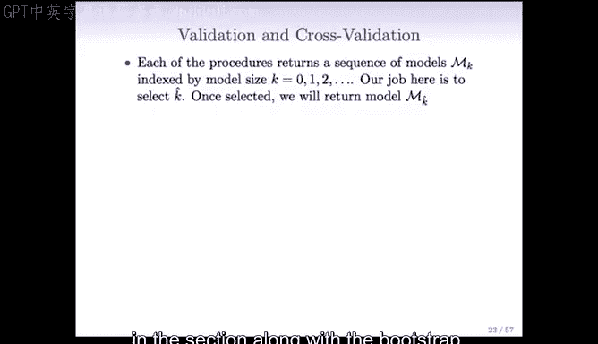

在本节课中，我们将要学习模型选择中的两种重要方法：验证集方法和交叉验证方法。我们将了解它们的基本思想、操作步骤，以及相较于之前讨论的AIC、BIC等方法的优势。

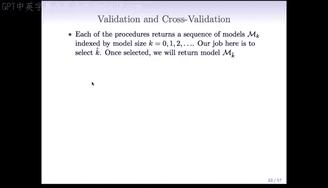

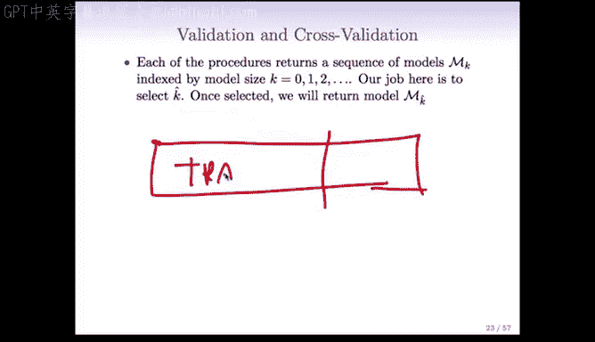

## 概述

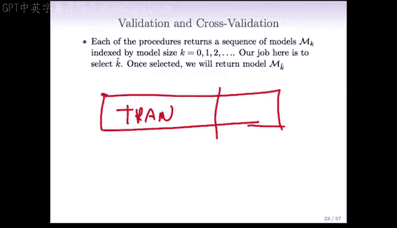

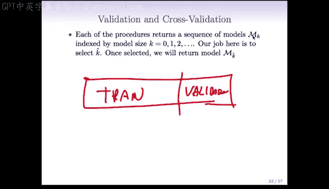

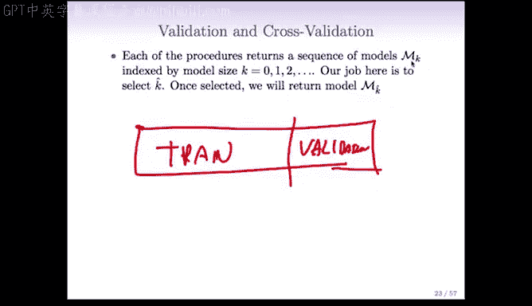

上一节我们介绍了基于调整RSS、AIC和BIC等准则的模型选择方法。本节中，我们来看看两种更直接的评估方法：验证集方法和交叉验证方法。它们不依赖于对残差平方和（RSS）的复杂调整，而是通过将数据划分为不同部分来直接估计模型的预测误差。

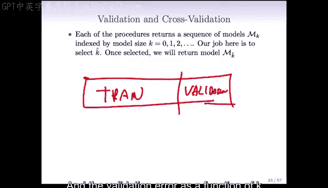

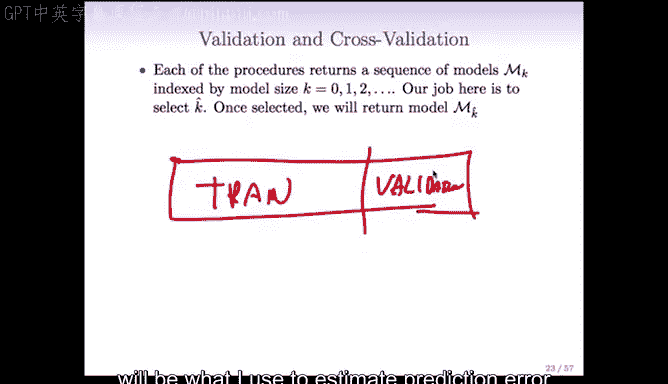

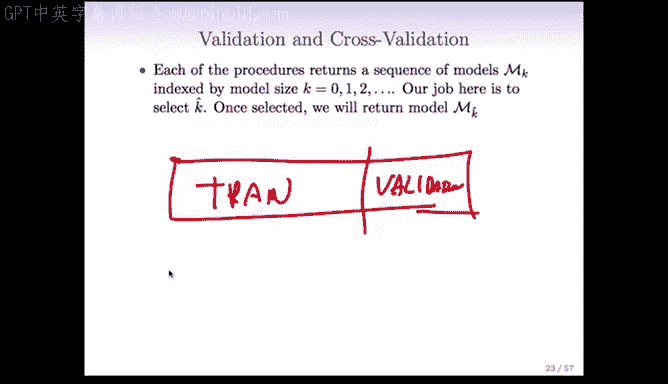

## 验证集方法

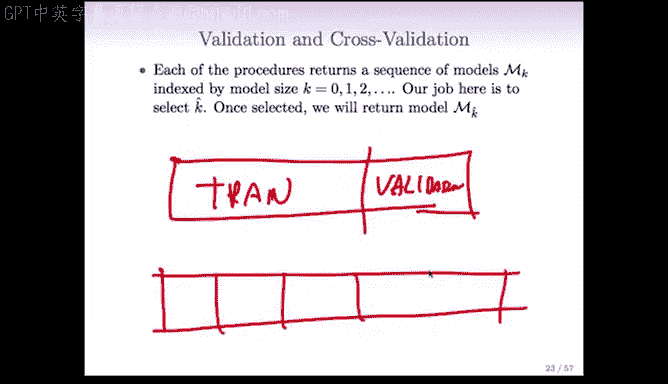

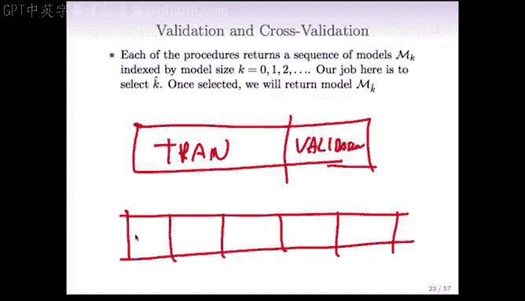

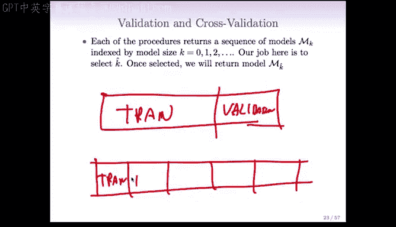

验证集方法的核心思想是将可用数据划分为两个互斥的部分：训练集和验证集。

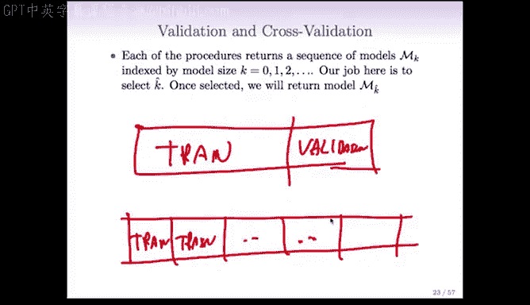

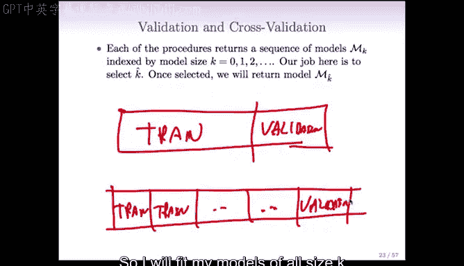

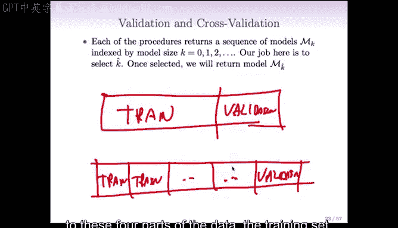

以下是验证集方法的基本步骤：

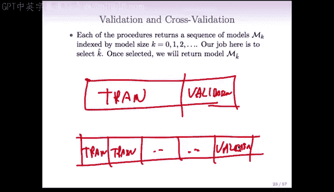

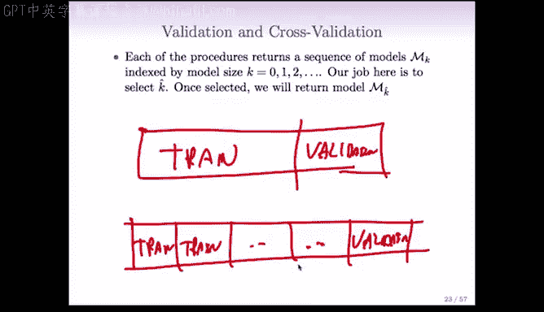

1.  **数据划分**：将数据集随机划分为两部分。例如，可以随机选择四分之三的数据作为训练集，剩余四分之一作为验证集。
2.  **模型训练**：在训练集上，使用不同模型复杂度（例如，不同数量的预测变量K）拟合一系列模型。
3.  **误差评估**：将上一步在训练集上得到的每个模型，应用于验证集，并计算其预测误差。
4.  **模型选择**：绘制验证集误差随模型复杂度K变化的曲线。选择使验证集误差最小的K值，对应的模型即为最优模型。

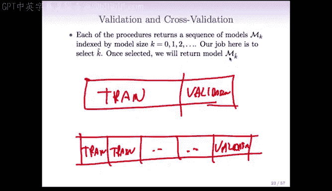

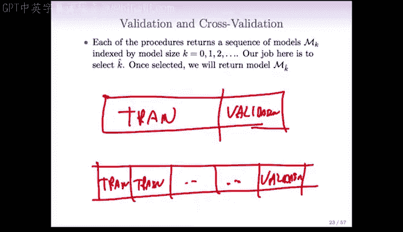

## 交叉验证方法

交叉验证是验证集方法的一种扩展，旨在更有效地利用数据。最常用的是K折交叉验证。

以下是K折交叉验证（以5折为例）的基本步骤：

1.  **数据划分**：将数据集随机、大致平均地划分为5个部分（或称“折”）。
2.  **循环训练与验证**：
    *   将第1部分作为验证集，第2-5部分合并作为训练集。在训练集上拟合不同复杂度的模型，并在验证集上计算误差。
    *   将第2部分作为验证集，第1、3、4、5部分作为训练集，重复上述过程。
    *   以此类推，直到每一部分都轮流充当过一次验证集。
3.  **误差汇总**：对于每个模型复杂度K，将它在5次验证中计算出的误差进行平均，得到该K值下的交叉验证误差估计。
4.  **模型选择**：绘制交叉验证误差随K变化的曲线，并选择使该误差最小的K值。

## 验证与交叉验证的优势

与基于AIC、BIC等公式的方法相比，验证和交叉验证方法有几个显著优势：

*   **无需估计σ²**：在特征数量P大于样本数量N的高维数据场景下，准确估计误差方差σ²非常困难。交叉验证完全避免了这个问题。
*   **无需明确参数数量D**：对于即将学习的岭回归、Lasso等收缩方法，模型的有效参数数量D并不明确。交叉验证同样绕开了定义和估计D的难题。

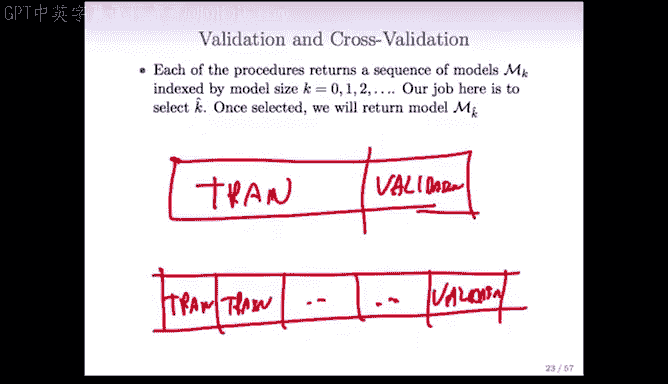

因此，交叉验证在处理现代高维数据时，提供了一种更稳健、更直接的模型评估和选择途径。

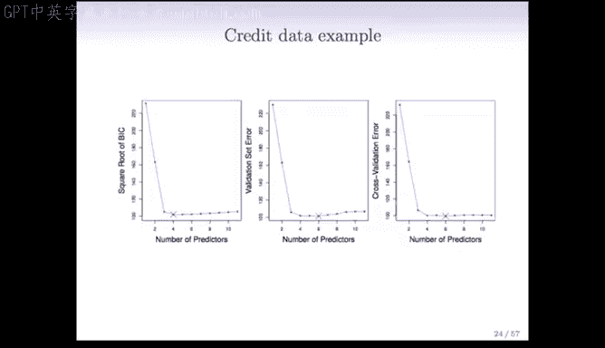

## 实例：信用卡数据集分析

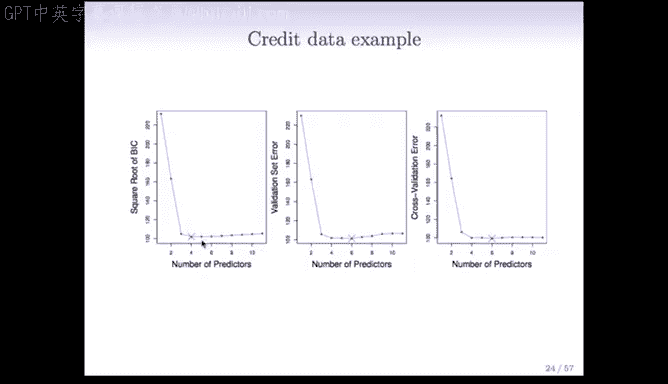

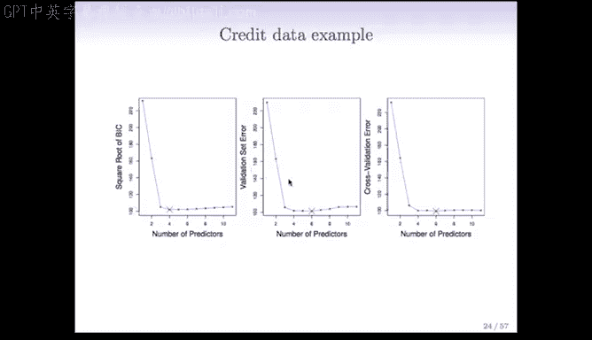

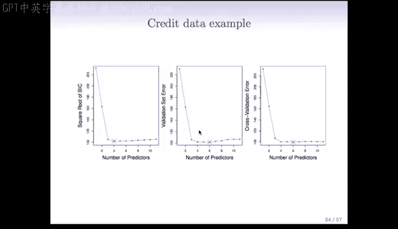

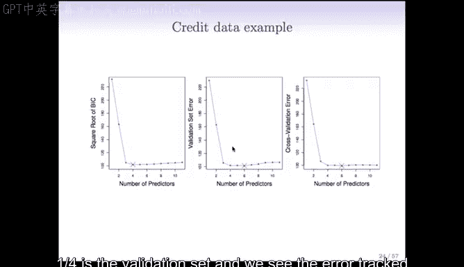

让我们通过信用卡数据集的例子，直观地比较不同方法。

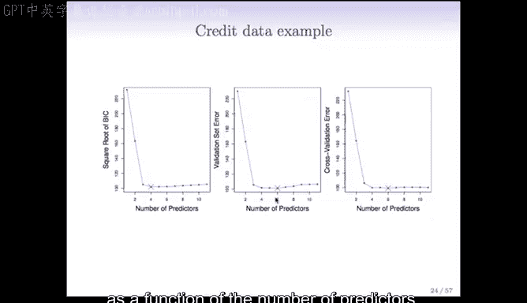

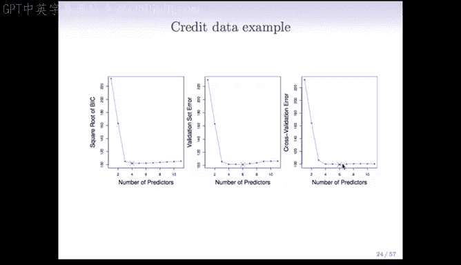

*   **验证集方法**：将数据按3:1划分为训练集和验证集。结果显示，验证集误差在模型包含约6个预测变量时达到最小。
*   **交叉验证方法**：采用10折交叉验证，得到的结果与验证集方法类似，最优模型大小也在6个预测变量附近。
*   **BIC准则**：作为对比，BIC倾向于选择更简约的模型，在本例中选择了约4个预测变量的模型。

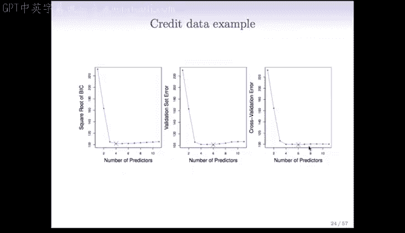

值得注意的是，本例中误差曲线在模型大小为4到11之间都非常平坦，这意味着这些模型的预测性能差异不大。

## 一倍标准误规则

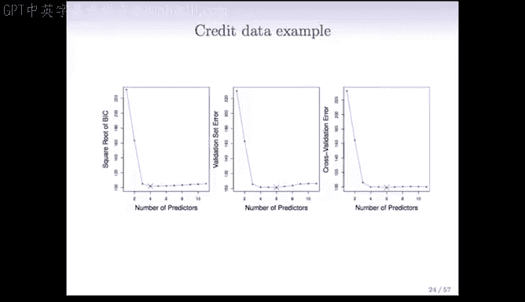

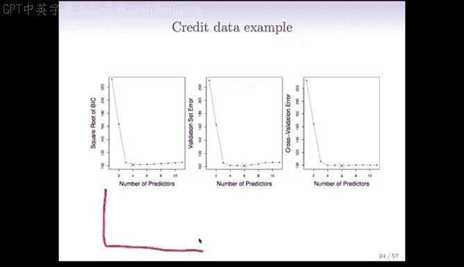

由于交叉验证误差估计本身存在随机波动，一个常用的实践准则是“一倍标准误规则”。

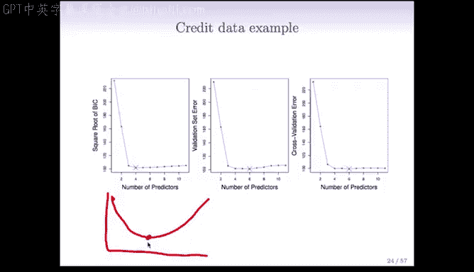

该规则的操作如下：
1.  计算最优模型（误差最小点）对应的交叉验证误差的标准误。
2.  在误差-复杂度曲线上，从最小误差点向上画出一个标准误的距离，形成一条水平线。
3.  选择**复杂度最低**（即预测变量最少）且其交叉验证误差落在这条水平线以下的模型。

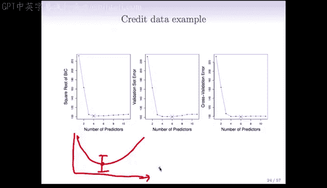

**公式表示**：选择满足 `CV Error(K) ≤ Min(CV Error) + SE(Min(CV Error))` 的最小K值。

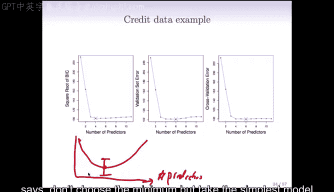

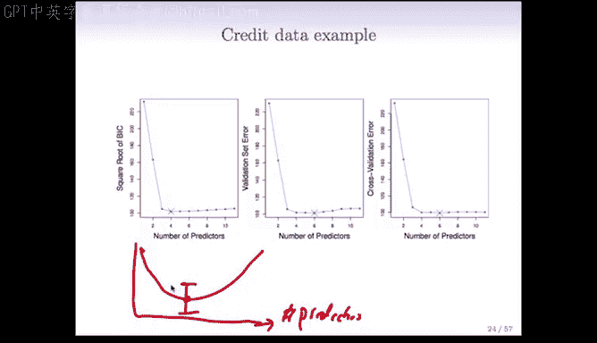

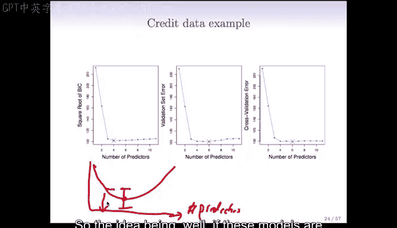

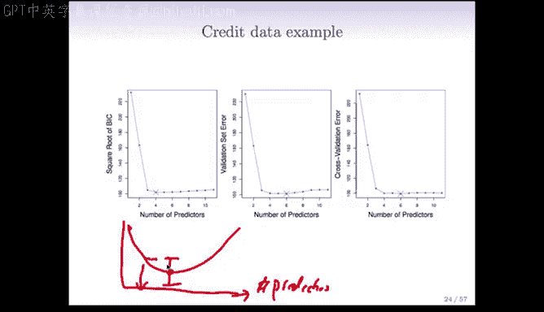

这样做的理由是：如果多个模型的误差在一个标准误的范围内，那么基于现有数据，我们无法有效区分它们的性能。此时，选择更简单、更易于解释的模型是更合理的。

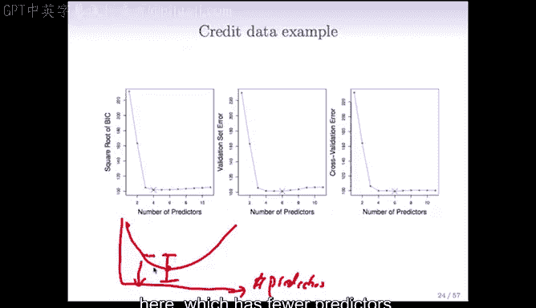

## 总结

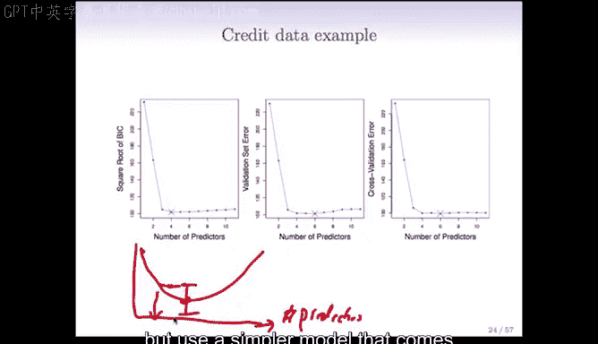

本节课中我们一起学习了模型选择的两种重要实践方法：验证集法和交叉验证法。我们了解了它们通过数据划分来直接估计预测误差的基本流程，并认识到它们在高维数据背景下，避免了估计σ²和D的难题，因而更具优势。最后，我们还介绍了一倍标准误规则，它帮助我们在模型性能相近时，倾向于选择更简洁的模型。这些方法为我们在实际数据分析中选择合适的模型复杂度提供了强大而实用的工具。