# Python 版 45：6.6 收缩方法与岭回归 📊

## 概述

在本节课中，我们将要学习两种重要的收缩方法：岭回归和Lasso。这些方法通过引入惩罚项来约束模型系数，从而在拟合数据的同时控制模型的复杂度，尤其适用于变量数量庞大的数据集。

---

## 从最小二乘法到收缩方法

上一节我们介绍了前向选择、后向选择和全子集选择等模型选择技术。所有这些方法都基于最小二乘法进行拟合。现在，我们来看看一种不同的方法——收缩方法。

收缩方法，特别是岭回归和Lasso，不再单纯使用最小二乘法进行拟合。它们采用了一个包含惩罚项的新准则，这个惩罚项通常会将系数向零的方向“收缩”。这些方法非常强大，尤其适用于变量数量可能达到数千甚至数百万的大型数据集。

值得一提的是，岭回归、Lasso这类收缩方法是当前统计学研究的热点领域，每天都有相关的新论文发表。虽然岭回归的思想在20世纪70年代就已提出，但直到近十年，随着计算能力的飞速发展，它才与Lasso一起变得非常流行。

---

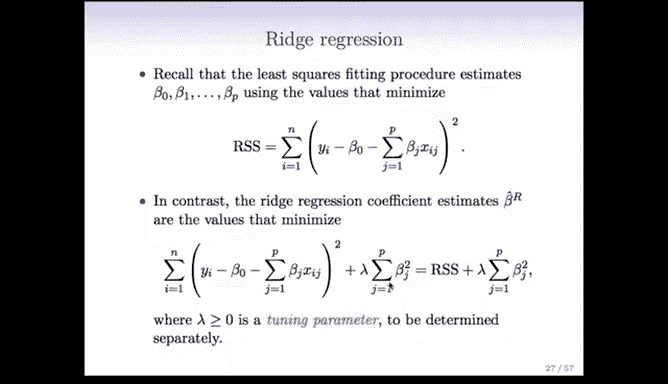

## 岭回归的原理

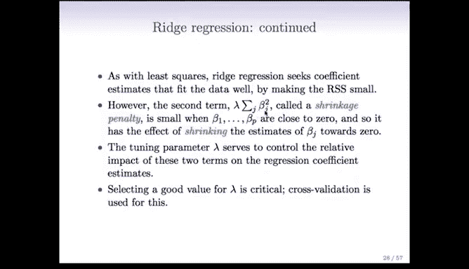

首先，让我们回顾一下最小二乘法。其训练误差，即残差平方和（RSS），是观测值 **y** 与预测值之间偏差的平方和。最小二乘法的目标就是找到使RSS最小的系数。

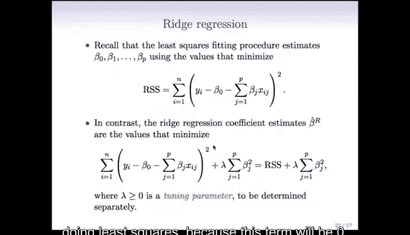

岭回归的做法则有所不同。它在RSS的基础上增加了一个惩罚项。这个惩罚项包含一个需要通过交叉验证等方法选择的调优参数 **λ**，乘以所有系数平方和。

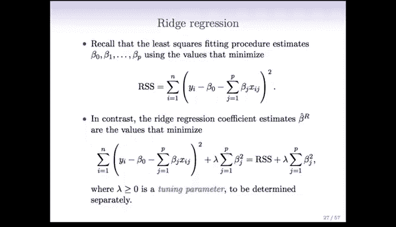

**岭回归的目标函数公式如下：**

`RSS + λ * Σ(β_j²)`

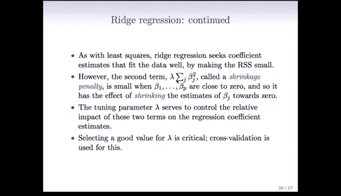

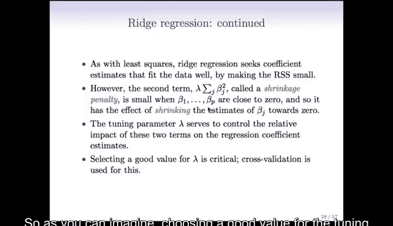

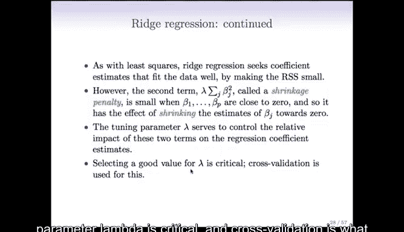

我们的目标是使这个总和最小化。这意味着我们既要通过减小RSS来获得良好的拟合，同时惩罚项又会从反方向施加压力——系数越大，惩罚越重。因此，我们需要为较大的系数“付出代价”。

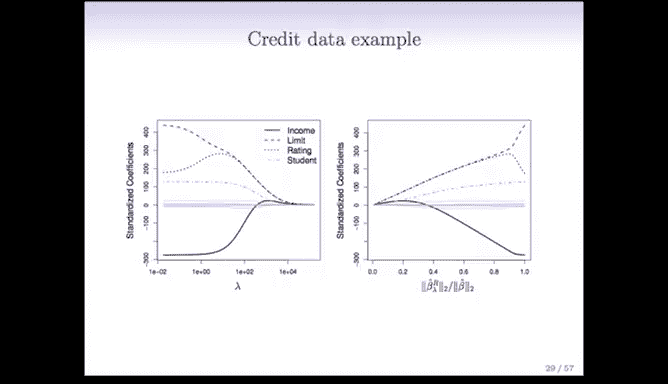

这本质上是在拟合优度与系数大小之间进行权衡。这种方法被称为“收缩惩罚”，因为它鼓励参数向零收缩。收缩的程度由调优参数 **λ** 决定。

*   如果 **λ = 0**，惩罚项消失，岭回归就退化为普通最小二乘回归。
*   随着 **λ** 增大，我们为较大的系数付出的代价也越来越高。
*   如果 **λ** 变得极大，那么无论系数对拟合有多大帮助，它们都必须非常接近零，才能使惩罚项足够小。

换句话说，这个惩罚项的效果是将系数向零收缩。零是一个自然的收缩目标，因为如果一个系数为零，就意味着对应的特征没有出现在模型中。调优参数 **λ** 控制着拟合优度与系数大小之间的权衡。因此，选择一个合适的 **λ** 值至关重要，我们通常使用交叉验证来完成这个任务。

---

## 岭回归的系数路径

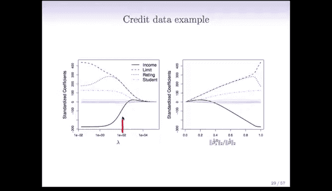

对于固定的 **λ** 值，我们需要找到使上述准则最小的系数解。这是一个有简单数值解的优化问题，有现成的计算机程序可以完成。

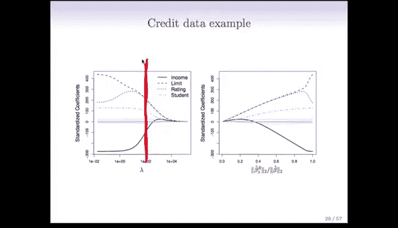

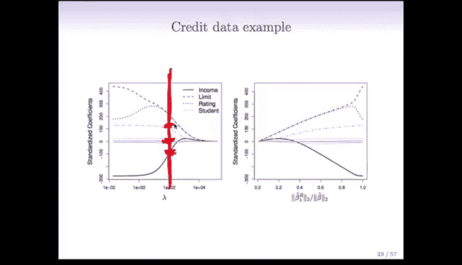

以下是信用数据集的岭回归示例。图中绘制了标准化系数随 **λ** 值变化的“系数路径”：

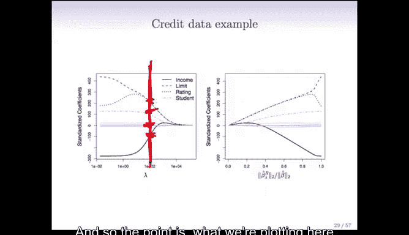

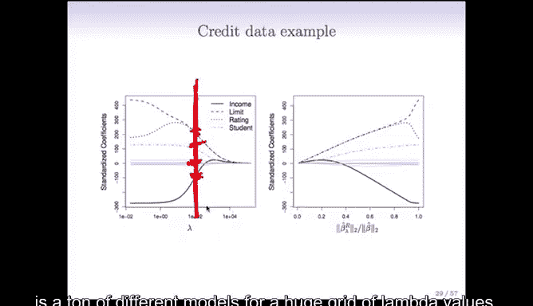

*   在图的左侧，**λ** 接近零，几乎没有约束，我们得到的结果几乎就是普通最小二乘估计。
*   随着 **λ** 增大，惩罚项推动所有系数向零收缩，因为我们为非零系数付出的代价越来越大。
*   在图的右侧，**λ** 非常大（例如超过10,000），所有系数都基本收缩到零。
*   在中间区域，系数随着 **λ** 增大而向零收缩，但并非均匀收缩。例如，“评级”变量的系数起初可能增大，然后才收缩回零。

我们需要从这一系列 **λ** 值对应的模型中，选择一个 **λ**，然后查看该垂直切面（即该 **λ** 值下）的系数估计值。例如，如果我们选择 **λ = 100**，那么看起来大约有3到4个系数显著非零，而其他系数（图中灰色线条）虽然不完全为零，但已经非常小了。

另一种常见的图示方式是绘制系数随其L2范数变化的路径。L2范数的定义如下：

**L2范数公式：**
`||β||₂ = √(Σ β_j²)`

在这种图示中：
*   当L2范数为0时，所有系数为0，对应 **λ** 极大的情况。
*   当L2范数最大时，对应 **λ = 0** 的普通最小二乘估计。
*   中间状态同样展示了系数向零收缩的过程。

这两种图示本质上是相同的，只是横坐标的参数化方式不同。

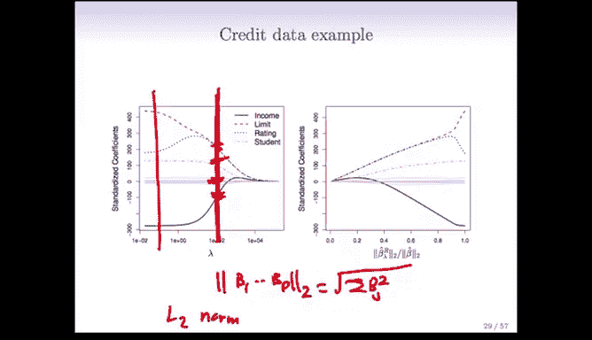

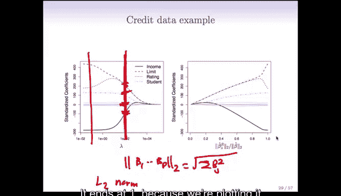

---

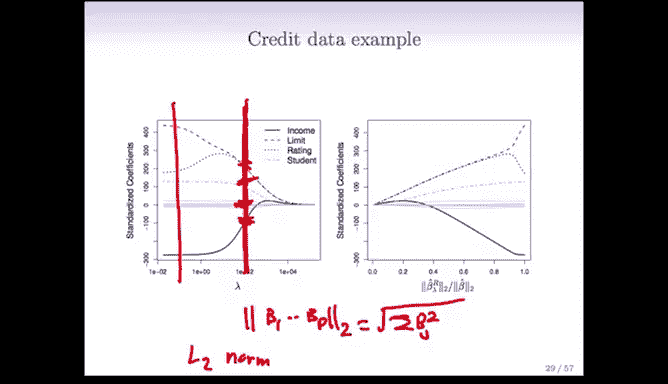

## 变量的标准化

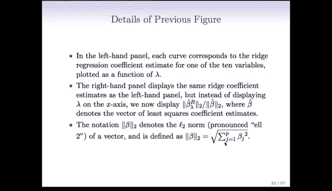

岭回归的一个重要特点是，变量的缩放（标准化）会影响结果。在普通最小二乘法中，变量的缩放是“尺度不变”的，因为改变单位只会导致系数发生相应的反向变化，最终预测结果不变。

但在岭回归这类惩罚方法中，情况有所不同。回顾岭回归的目标函数，所有系数被一起放入惩罚项（系数的平方和）中。如果改变某个变量的单位，其系数的大小就必须改变以适应新的尺度，但这个系数又会与其他特征的系数在同一个惩罚项中竞争。因此，特征的尺度至关重要。

**结论是：在应用岭回归之前，通常需要对预测变量进行标准化。** 标准化意味着对每个特征，将其除以该特征在所有观测上的标准差。这样处理后，每个特征的标准差都变为1，使得不同特征的系数具有可比性。

---

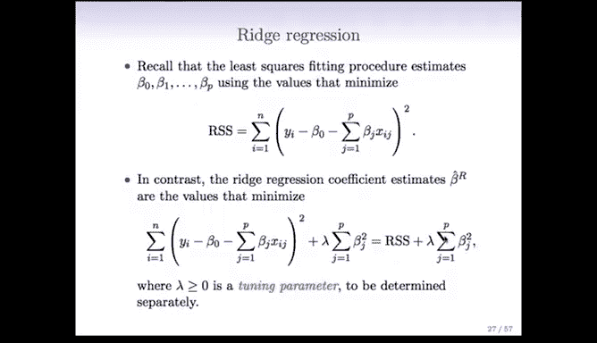

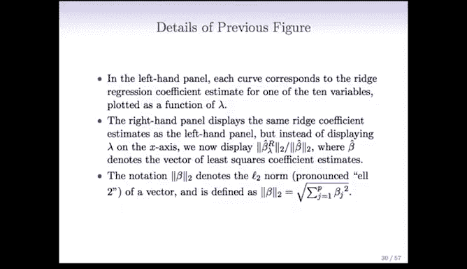

## 岭回归与最小二乘法的比较

让我们看一个模拟示例。该示例有50个观测值和45个预测变量，所有预测变量都被赋予了非零的真实系数。

图中展示了岭回归的偏差（黑色）、方差（绿色）和测试误差（紫色）随 **λ** 变化的情况：
*   在左侧（**λ** 接近0，即普通最小二乘法），方差很高。
*   随着 **λ** 增大，偏差基本保持不变，但方差显著下降。
*   岭回归通过将系数向零收缩来控制方差，防止系数变得过大。
*   均方误差（偏差与方差之和）呈现出一个U形曲线，并在某个中间点达到最小（图中以“X”标记）。这个点的均方误差低于普通最小二乘法的误差。

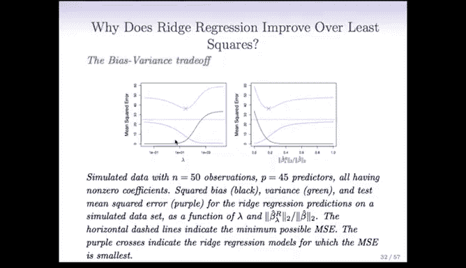

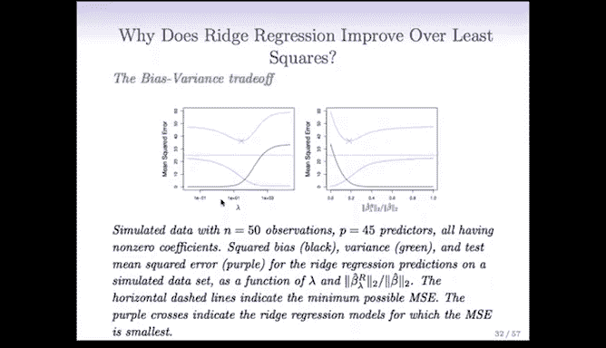

这个U形曲线在我们考虑不同复杂度模型时反复出现，通常存在一个“最佳点”使得测试误差最小，而这正是我们追求的目标。

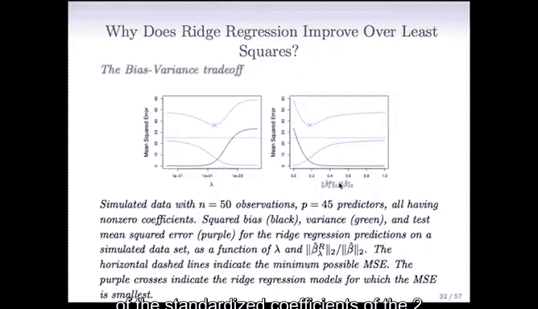

---

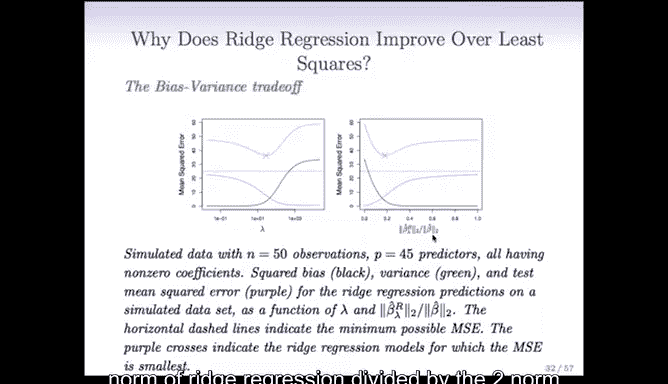

## 岭回归的局限性

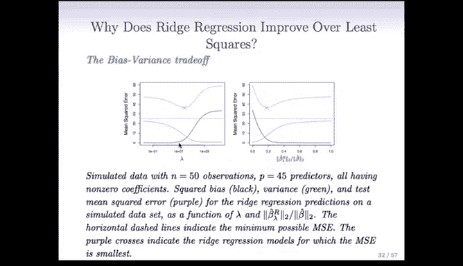

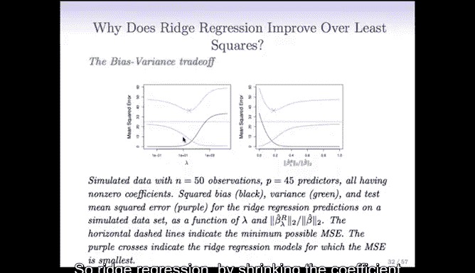

回顾信用数据的系数路径图，你可能注意到一个现象：**岭回归的系数虽然可以变得非常小，但几乎永远不会精确地等于零**。除非极其幸运，否则从数学上可以证明，系数不会被精确地收缩到零。

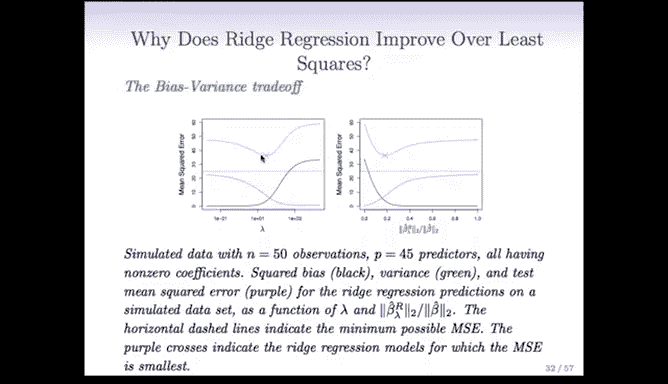

岭回归是以一种连续的方式将系数向零收缩，但并不会通过将系数精确设置为零来进行变量选择。在某些情况下，这似乎有些遗憾，因为许多系数已经非常微小，如果它们能精确为零，模型解释起来会更加简洁清晰。

这正好为我们引出了下一个强大的方法——**Lasso**。

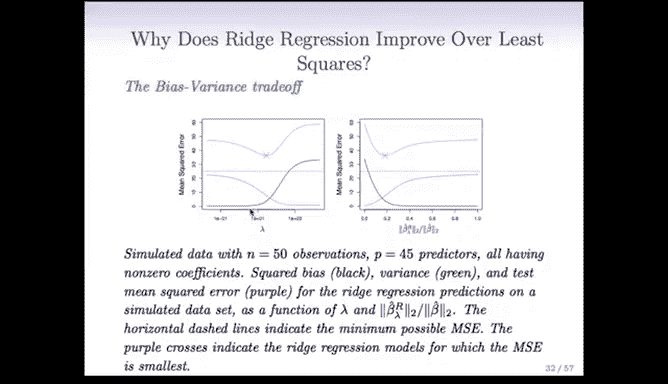

---

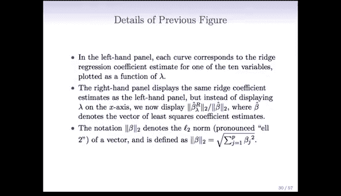

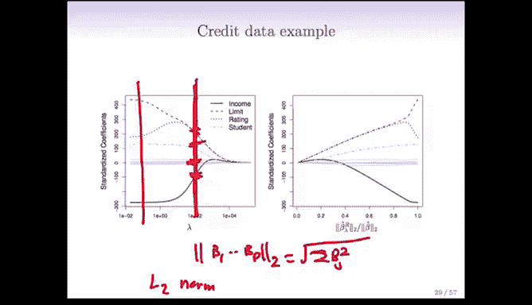

## 总结

本节课中，我们一起学习了收缩方法的核心思想，并深入探讨了岭回归。
*   岭回归通过在最小二乘法的目标函数中增加一个L2惩罚项（系数平方和）来工作。
*   惩罚项的强度由调优参数 **λ** 控制，通过交叉验证选择。
*   岭回归能有效降低模型方差，提高预测精度，尤其适用于高维数据。
*   应用岭回归前，通常需要对预测变量进行标准化。
*   岭回归的局限性在于其收缩是连续的，不能进行精确的变量选择（即系数不为零）。

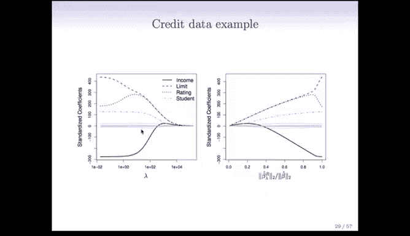

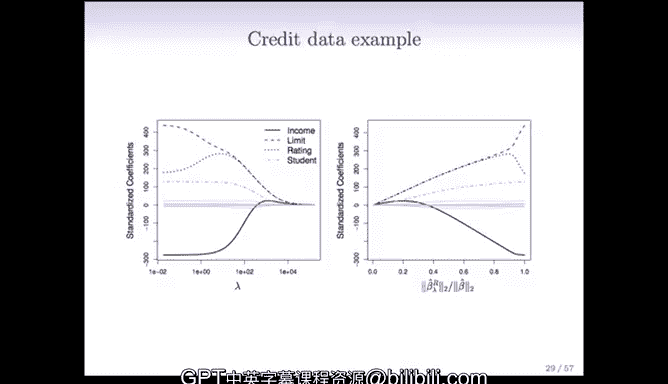

这为下一节我们将要学习的、能够进行变量选择的Lasso方法做好了铺垫。