# Python 版 46：Lasso回归 📏

在本节课中，我们将要学习一种名为Lasso回归的统计学习方法。Lasso回归与上一节介绍的岭回归非常相似，但它有一个关键的不同点：Lasso回归能够将某些变量的系数**精确地压缩为零**，从而实现变量选择。这使得它在处理高维数据时特别有用。

## 概述

岭回归的一个缺点是它不会真正地选择变量，也不会将系数设为零。在某些情况下，如果某些变量的系数很小，我们更希望它们直接变为零，这样我们就可以忽略这些变量。Lasso回归就是为了解决这个问题而设计的。

## Lasso回归的准则

Lasso回归的优化准则与岭回归类似，但惩罚项不同。其目标是最小化以下公式：

`RSS + λ * Σ|β_j|`

其中：
*   `RSS` 是残差平方和。
*   `λ` 是一个调节参数，控制惩罚的强度。
*   `Σ|β_j|` 是所有回归系数绝对值的和，这被称为 **L1惩罚**。

相比之下，岭回归使用的是系数的平方和 `Σβ_j²`，即 **L2惩罚**。

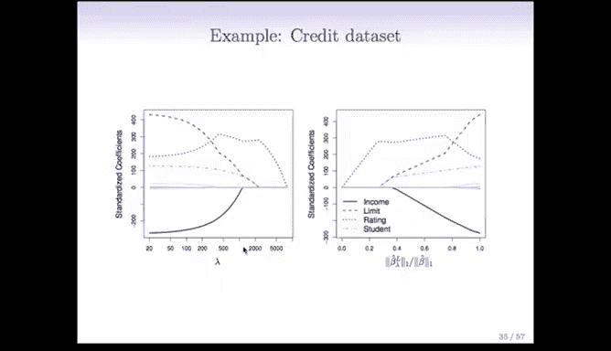

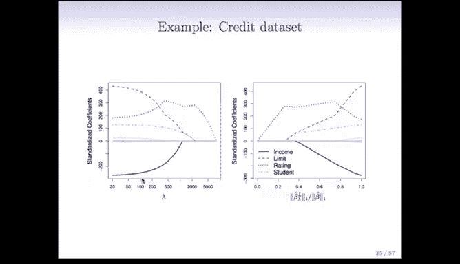

## Lasso回归的效果

这个从平方和到绝对值和的微小改变，带来了非常重要的效果。

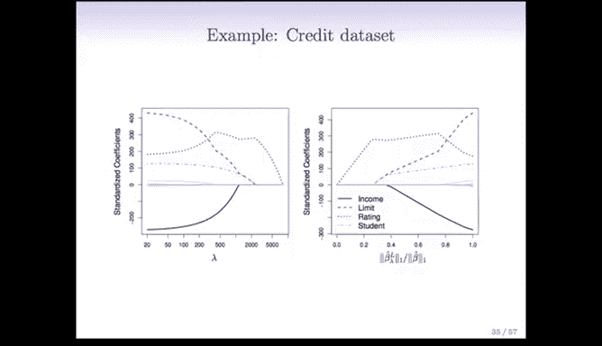

与岭回归一样，Lasso回归也会将系数向零收缩。但是，当调节参数 `λ` 足够大时，Lasso回归能够**将某些变量的系数精确地设为零**。这意味着它不仅进行收缩，还像最优子集选择法一样，实现了变量选择。

我们称这种特性为**稀疏性**。Lasso回归产生的是稀疏模型，即只包含全部变量中的一个子集的模型。

## Lasso回归的起源与应用

Lasso回归由Robert Tibshirani教授在1996年提出。虽然最初并未引起广泛关注，但在过去十年左右，它已成为统计学、计算机科学等领域的热门话题。其流行的一个关键原因是计算上的进步。Lasso回归是一个凸优化问题，随着凸优化算法和计算机性能的发展，现在即使面对非常大的数据集（变量数P和样本数N都很大），也能在个人电脑上快速求解。

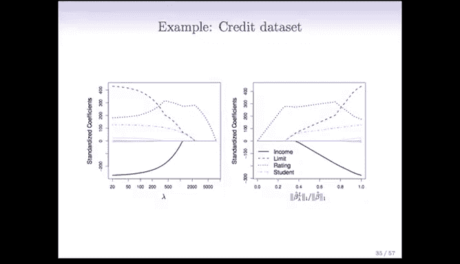

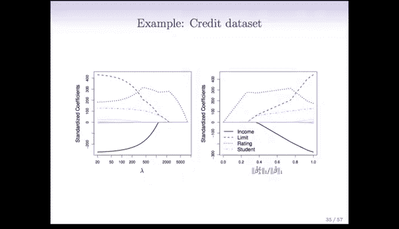

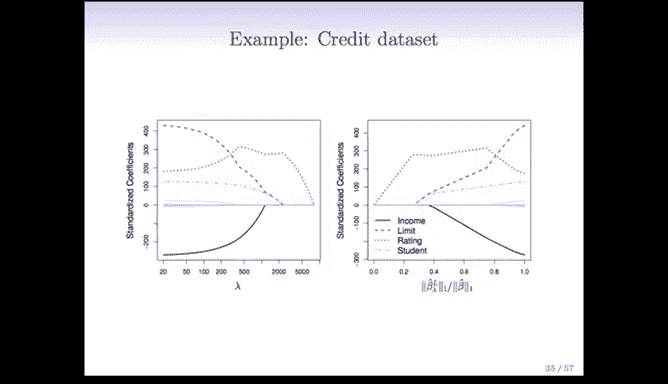

例如，使用R语言中的`glmnet`包，即使变量数量达到数万，也能在标准台式电脑上在一分钟内完成求解。

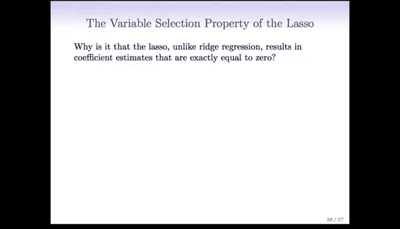

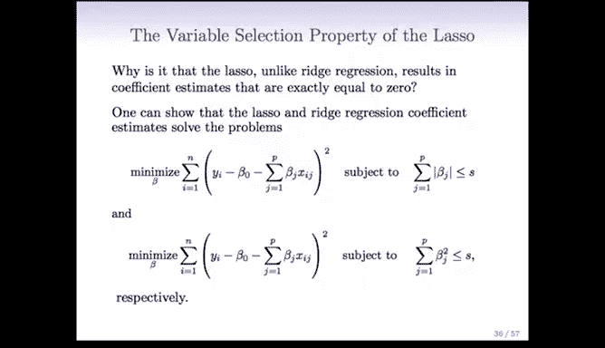

## Lasso回归的直观演示

让我们在之前的信用数据集上看看Lasso回归的效果。下图展示了标准化系数如何随 `λ` 值的变化而变化。

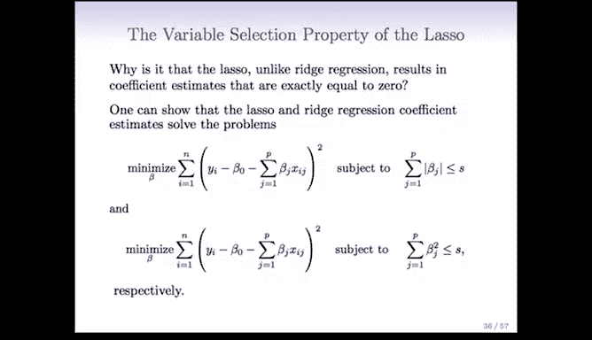

当 `λ` 很小时，我们得到几乎与最小二乘法相同的估计。随着 `λ` 增大，系数开始收缩。但与岭回归不同的是，在某个临界点之后，图中灰色的变量的系数会**精确地变为零**。例如，在某个 `λ` 值下，我们只需要保留蓝、红、橙三条线代表的三个变量，其他变量都可以丢弃。

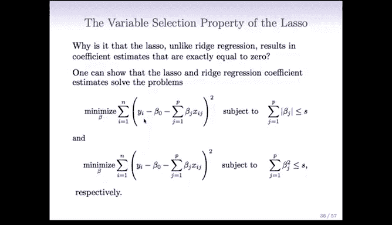

下图从另一个角度展示了这种收缩和选择过程。

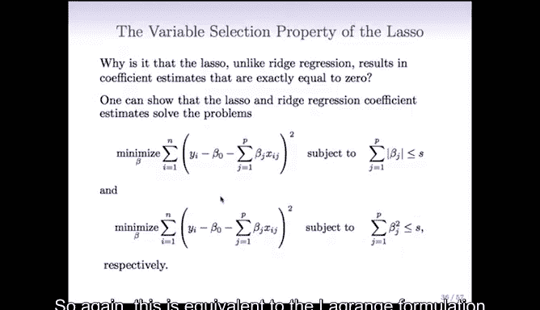

## Lasso回归的实际意义

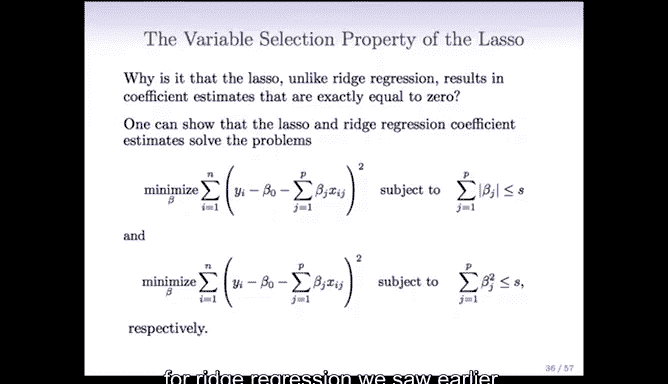

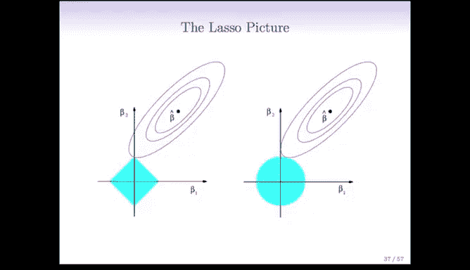

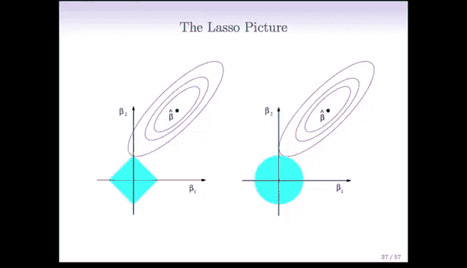

在许多实际应用中，变量选择至关重要。例如，一位医生想开发一种疾病检测方法，他可能从30,000个基因表达测量值开始。虽然在研究阶段可以使用所有变量，但最终用于临床的检测方法如果只涉及6到25个关键基因，将更具成本效益和可行性。Lasso回归能够高效地找出这类只包含少数特征的稀疏模型，因此具有巨大的实用价值。

## 为什么Lasso能产生稀疏解？

接下来，我们从几何角度解释为什么L1惩罚能产生稀疏解。

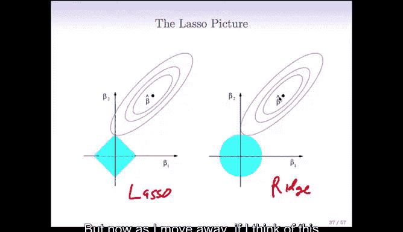

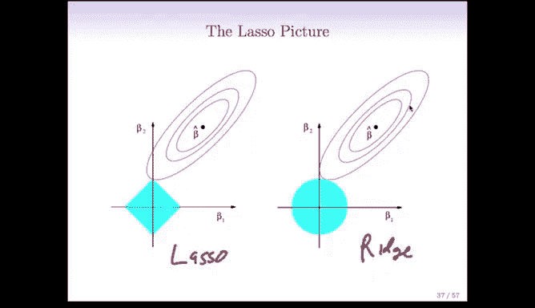

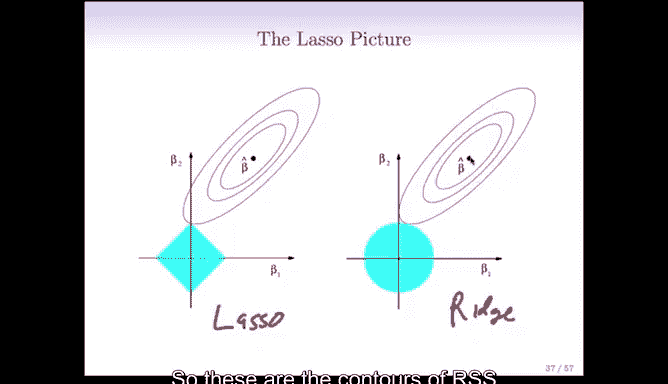

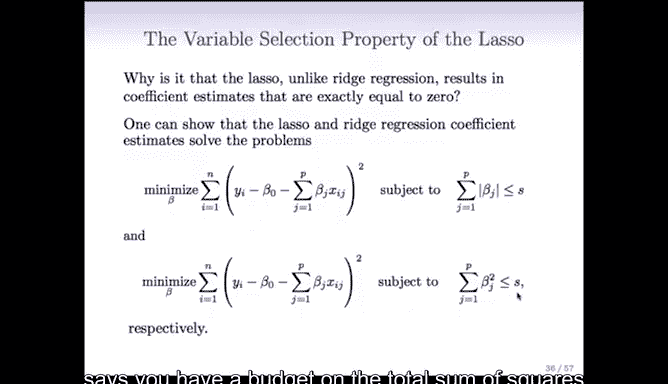

首先，Lasso问题可以等价地表述为以下约束优化问题：
最小化 `RSS`
约束条件为 `Σ|β_j| ≤ s`

这里的 `s` 是一个预算值，控制着系数绝对值的总和。可以这样理解：如果你有无限的预算（`s` 很大），你就可以自由地使用最小二乘估计。如果预算减少（`s` 变小），你就必须在预算内尽可能拟合数据，这会导致系数缩小。如果预算为零，所有系数必须为零。

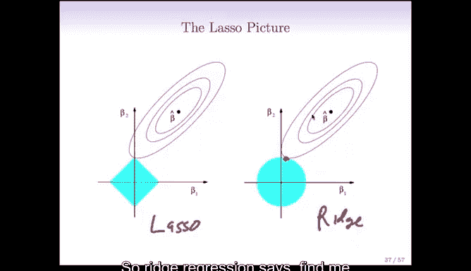

岭回归也有类似的等价形式，但其约束条件是系数的平方和 `Σβ_j² ≤ s`。

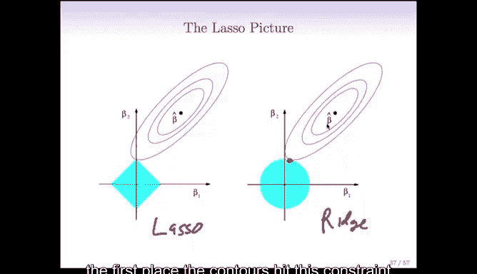

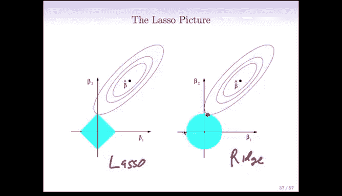

下面的图片清晰地展示了两者的区别。

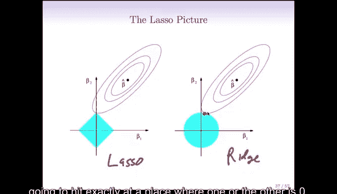

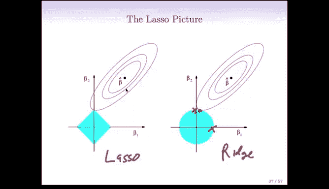

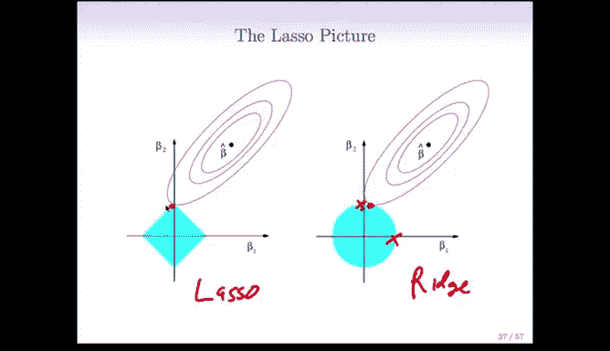

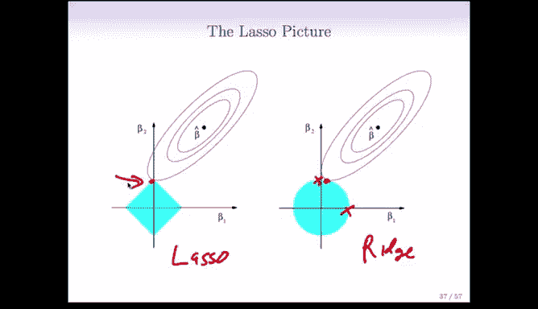

**右图是岭回归（L2约束）**：
*   等高线表示`RSS`的值，中心点 `β̂` 是最小二乘解。
*   约束区域 `Σβ_j² ≤ s` 是一个**圆形**。
*   岭回归的解是`RSS`等高线首次碰到这个圆形约束区域的点。由于圆形是光滑的，这个接触点几乎不可能恰好落在坐标轴上，因此系数通常不会精确为零。

**左图是Lasso回归（L1约束）**：
*   `RSS`等高线与最小二乘解 `β̂` 与右图相同。
*   约束区域 `Σ|β_j| ≤ s` 是一个**菱形**（在高维空间中是菱面体）。
*   菱形有**尖角**。Lasso回归的解是`RSS`等高线首次碰到这个菱形约束区域的点。由于菱形的尖角位于坐标轴上（例如，`β1=0` 或 `β2=0` 的轴），等高线有很大概率在尖角处接触约束区域。一旦接触点在尖角上，就会产生一个或多个系数恰好为零的解。

这就是Lasso回归能够产生稀疏解的几何原因。

## Lasso与岭回归的比较

最后，我们通过模拟实验来比较Lasso和岭回归在不同场景下的表现。

**情况一：真实模型是稠密的（所有45个变量都有非零系数）**
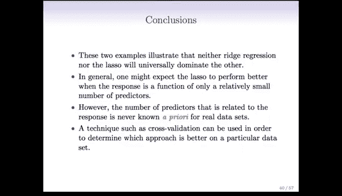
左图是Lasso的偏差、方差和均方误差随 `λ` 的变化。右图中，实线是Lasso，虚线是岭回归。两者的均方误差非常接近，岭回归可能略好一点。这并不奇怪，因为真实模型本身是稠密的，鼓励稀疏性的Lasso在此并无优势。

**情况二：真实模型是稀疏的（只有2个变量有非零系数）**
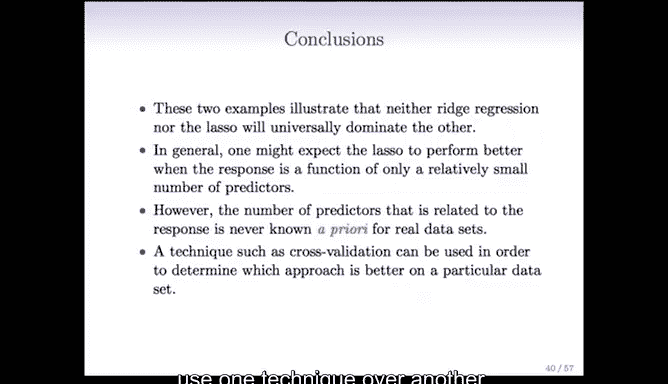
在这种情况下，Lasso的均方误差在较大的 `λ` 处达到最小，因为它正确地促使模型变得稀疏。从右图可以看出，Lasso（实线）的均方误差明显低于岭回归（虚线）。这是因为真实模型是稀疏的，而Lasso的估计方法与之匹配。

## 总结

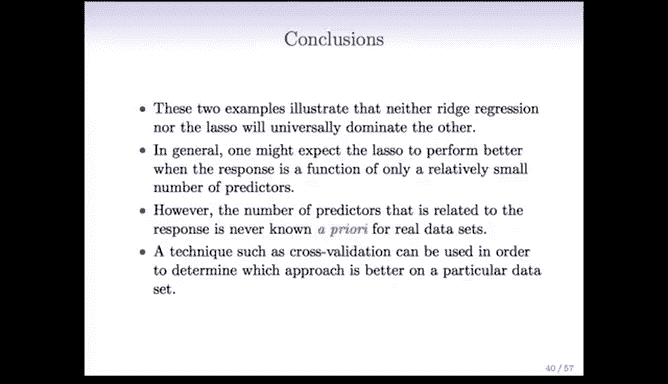

本节课中，我们一起学习了Lasso回归。

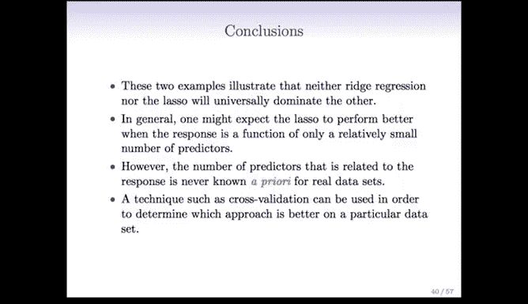

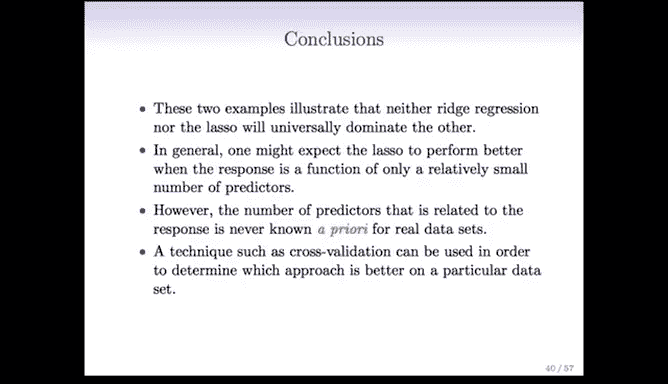

*   Lasso回归通过在目标函数中加入系数的**L1惩罚项**（绝对值之和），实现了对系数的收缩。
*   与岭回归的关键区别在于，L1惩罚的几何约束区域是**菱形**，其**尖角**特性使得Lasso能够将不重要的变量的系数**精确压缩为零**，从而同时完成**变量选择**和**系数收缩**。
*   Lasso回归产生的模型是**稀疏模型**，这在许多实际应用中（如生物信息学）非常有用，因为它能提供更简洁、可解释且成本更低的模型。
*   在模型选择上，没有绝对的好坏。如果真实情况是**稠密模型**，岭回归可能表现更好；如果真实情况是**稀疏模型**，则Lasso回归通常更有优势。在实践中，我们通常不知道真实模型的稀疏程度，因此一个合理的做法是**同时尝试两种方法，并通过交叉验证来比较和选择最佳模型**。

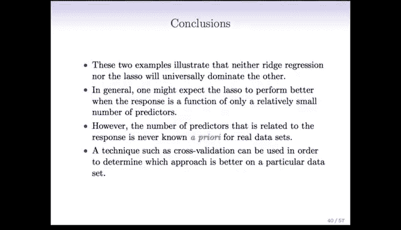

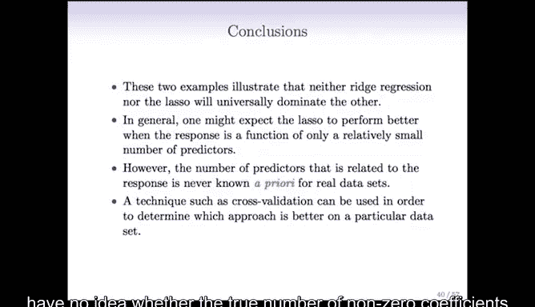

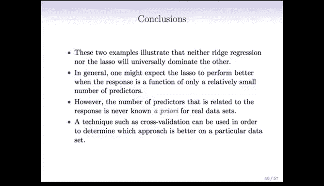

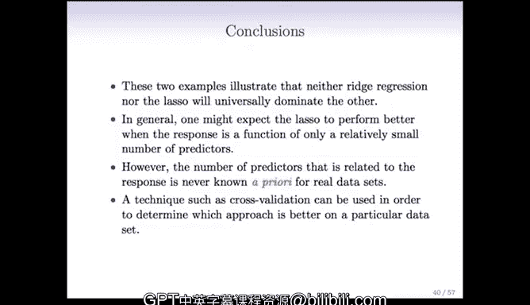

Lasso回归是一个强大而灵活的工具，它完美地展示了如何通过修改优化问题的形式，来引导模型获得我们期望的统计性质。