# Python 版 47：📊 岭回归与Lasso的调参选择

在本节课中，我们将学习如何为岭回归（Ridge Regression）和Lasso回归选择合适的调优参数（Tuning Parameter），特别是参数 λ（lambda）。我们将重点讨论为什么交叉验证（Cross-Validation）是完成此任务的最佳方法，并通过实例展示其应用过程。

上一节我们介绍了岭回归和Lasso的基本原理，本节中我们来看看如何为它们选择关键的调优参数 λ。

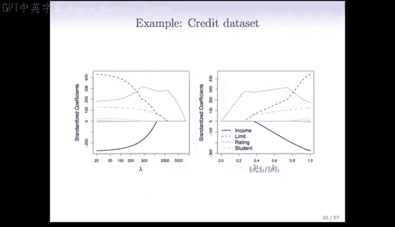

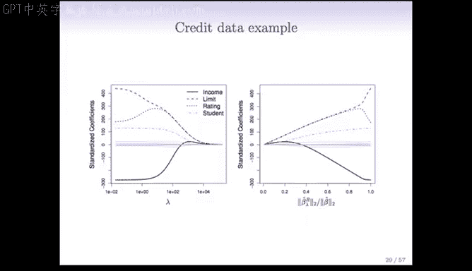

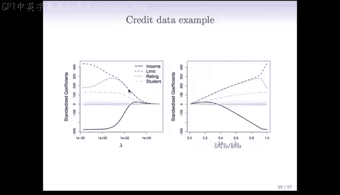

## 🎯 λ 参数的重要性

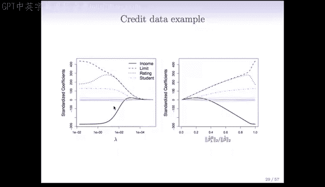

参数 λ 对模型解的影响范围极大。
*   当 **λ = 0** 时，模型退化为普通最小二乘法（OLS），没有任何正则化。
*   当 **λ → ∞** 时，所有系数估计值都被压缩至零。

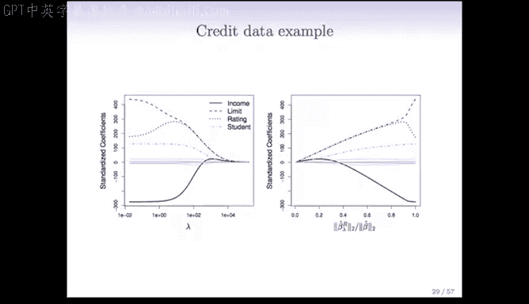

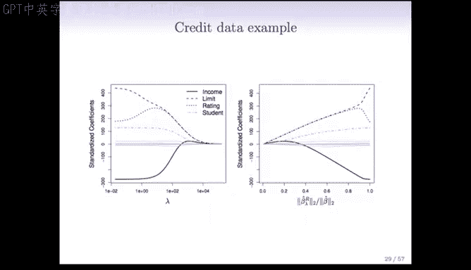

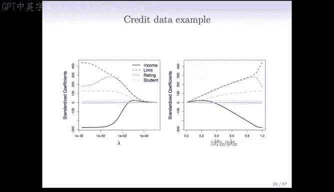

因此，选择合适的 λ 值至关重要。

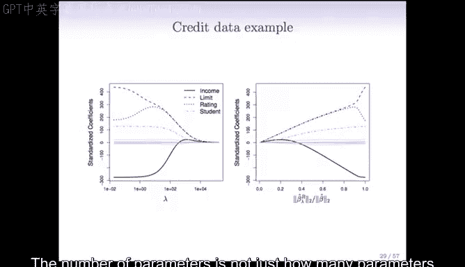

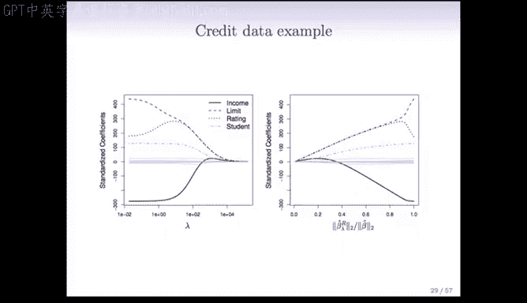

## 🔍 为何选择交叉验证？

以下是选择交叉验证方法的主要原因：

1.  **无需已知参数数量 `D`**：其他模型选择方法，如 **Cp**、**AIC** 和 **BIC**，都需要知道模型拟合的参数数量 `D`。然而，对于岭回归和Lasso，`D` 的定义并不明确。即使所有系数都不为零，由于收缩效应，模型的有效自由度也小于变量总数 `P`。因此，很难确定一个准确的 `D` 值。
2.  **直接评估预测性能**：交叉验证通过将数据划分为训练集和验证集，直接评估模型在未见数据上的预测误差，从而选择泛化能力最佳的 λ。

## 📈 交叉验证的实施步骤

交叉验证的实施流程与其他模型选择方法（如子集选择）概念上完全一致。

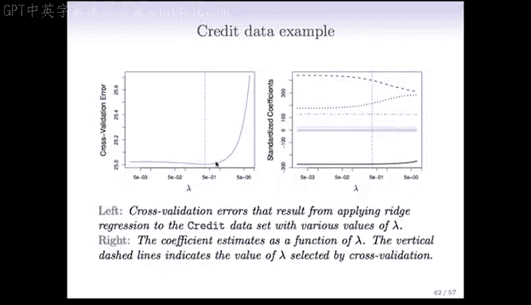

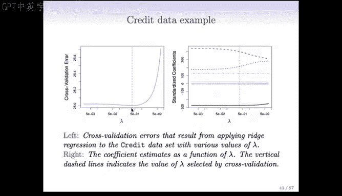

以下是其具体步骤：
1.  将数据随机划分为 K 个部分（例如 K=10）。
2.  对于给定的 λ 值，依次将第 k 部分作为验证集，其余 K-1 部分作为训练集，拟合模型。
3.  计算模型在验证集上的误差。
4.  对 k=1 到 K 重复步骤 2 和 3，并将 K 次验证误差平均，得到该 λ 值下的交叉验证误差。
5.  在一系列候选 λ 值上重复上述过程，绘制交叉验证误差随 λ 变化的曲线。
6.  选择使交叉验证误差最小的 λ 值作为最优参数。

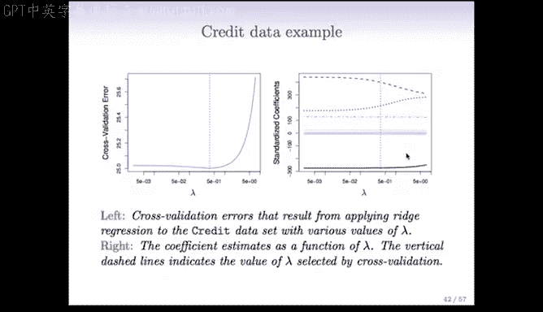

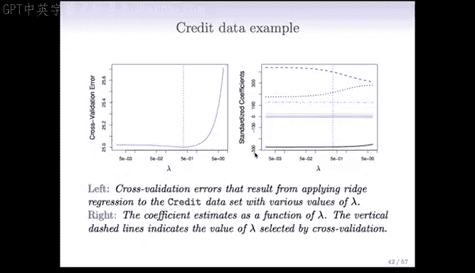

## 💡 实例分析

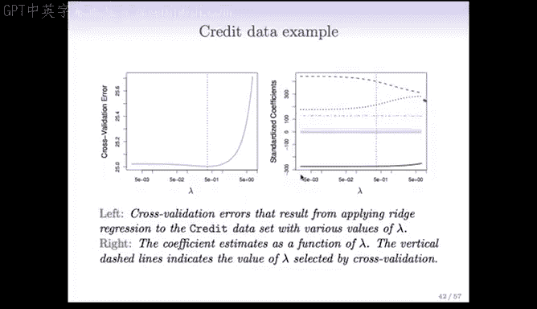

### 岭回归示例

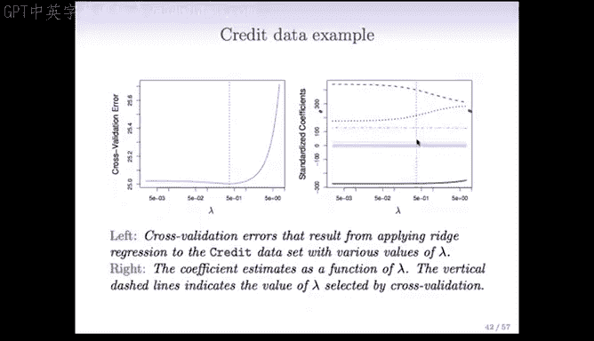

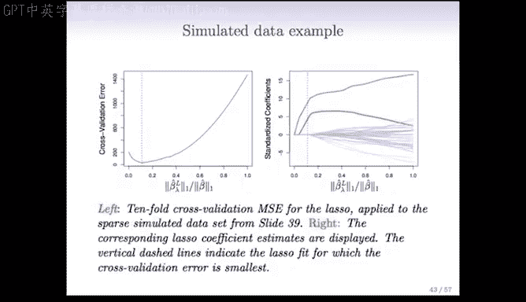

在模拟数据（n=50）上应用岭回归，通过交叉验证得到误差曲线。
*   曲线左侧（λ 小）对应接近最小二乘的模型。
*   曲线右侧（λ 大）对应系数被严重压缩的模型。
*   曲线最低点出现在 **λ ≈ 0.05** 附近，此处的模型预测误差最小。

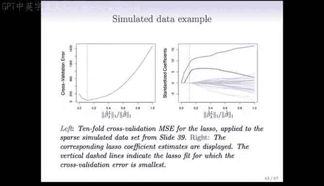

同时，可以绘制系数路径图，展示每个预测变量的标准化系数如何随 λ 变化。在最优 λ 处，部分系数被压缩至接近零。

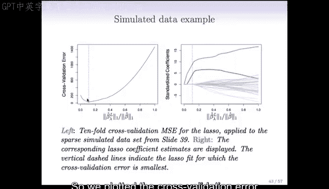

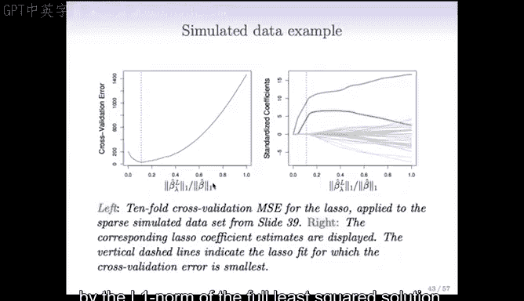

### Lasso 示例

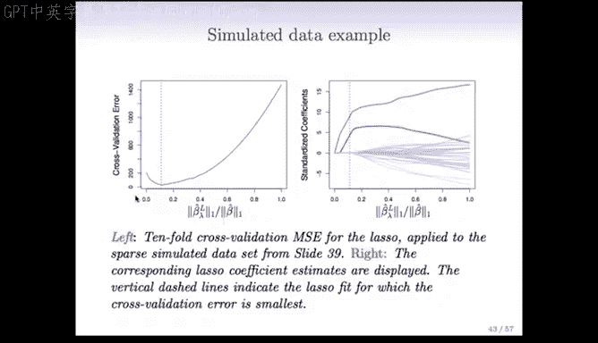

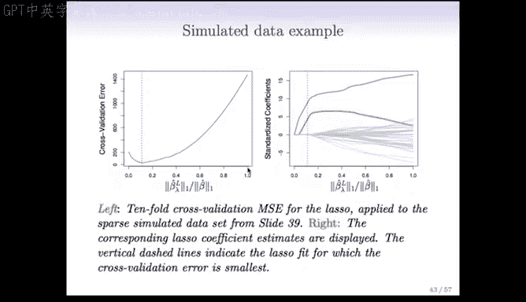

在同样的模拟数据上应用 Lasso 回归进行交叉验证。此处，横轴是 Lasso 解的 L1 范数与全最小二乘解的 L1 范数之比，其值在 0 到 1 之间。
*   比值为 1 对应最小二乘解。
*   比值为 0 对应所有系数为零的解。
*   交叉验证曲线呈 U 型，最小值出现在比值约为 **0.1** 处，这表明了较强的收缩。

在这个构造的例子中，真实模型只有两个非零系数。Lasso 在最优 λ 处恰好选择了两个非零特征（红色和绿色），而将其余所有系数精确地设为零，完美地识别了真实模型结构。

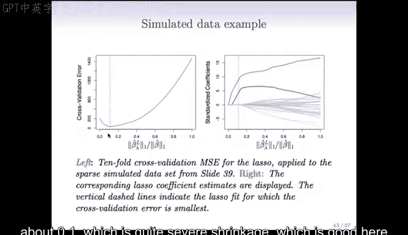

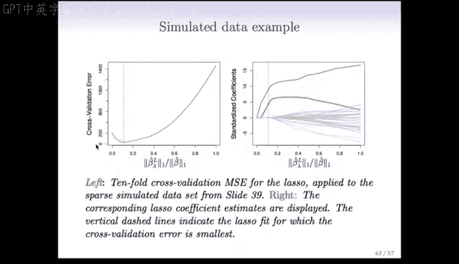

---

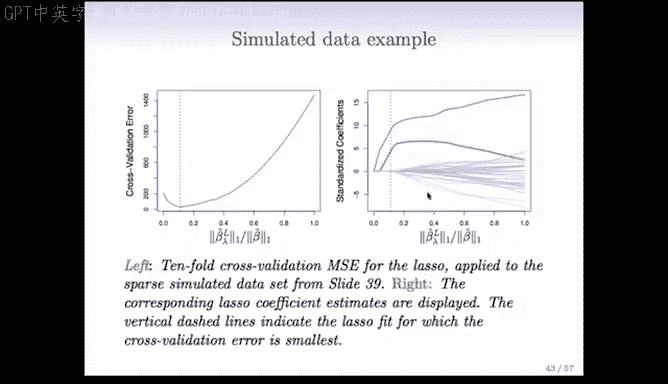

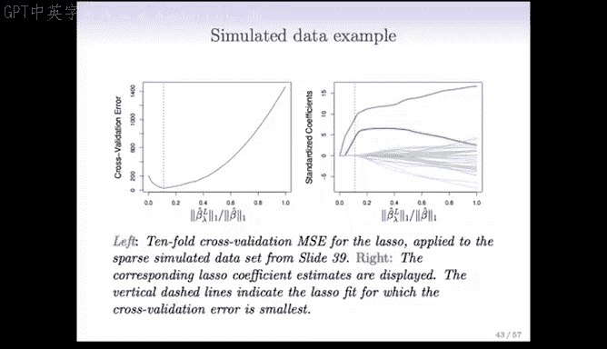

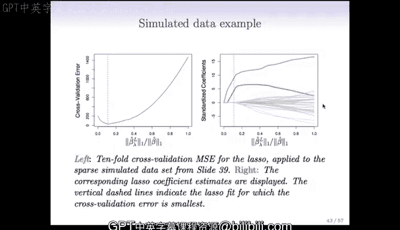

本节课中我们一起学习了为岭回归和Lasso选择调优参数 λ 的方法。我们明确了 λ 的重要性，解释了为何交叉验证是解决此问题的理想工具，因为它不依赖于难以定义的有效参数数量 `D`。最后，我们通过实例演示了交叉验证的实施过程及其效果，展示了如何通过数据驱动的方式找到最优的 λ，从而构建预测性能更佳、更简洁的模型。